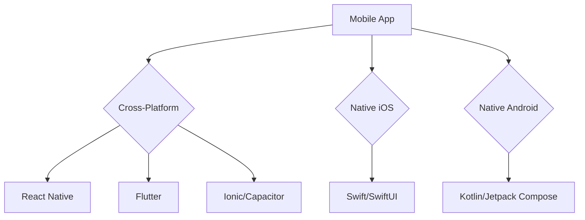
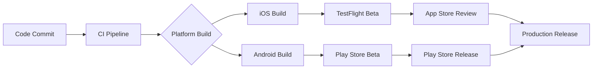

# MobileForge AI Architecture

## Overview

This document outlines the technical architecture and development approach for MobileForge AI, defining our mobile-first development philosophy, technology stack, and integration patterns within the Paperclip ecosystem.

## Core Principles

### Mobile-First Design
- **Progressive Enhancement**: Start with mobile constraints, enhance for larger screens
- **Performance Priority**: Optimize for battery life, network efficiency, and responsiveness
- **Accessibility First**: WCAG 2.1 AA compliance across all mobile applications
- **Offline Capability**: Core functionality works without network connectivity

### Platform Agnostic
- **Cross-Platform Priority**: Maximize code reuse across iOS, Android, and web
- **Native Performance**: Leverage platform-specific capabilities when beneficial
- **Consistent Experience**: Unified design language across all platforms
- **Future-Proof**: Architecture supports emerging mobile technologies

## Technology Architecture

### Development Frameworks

#### Primary Frameworks


#### Framework Selection Criteria
- **React Native**: JavaScript ecosystem, large community, web integration
- **Flutter**: Dart language, excellent performance, rich widget library
- **Native Development**: Maximum performance, platform integration, latest features

### Architecture Patterns

#### Mobile App Architecture
```
📱 Mobile App
├── 🏗️ Presentation Layer (UI/UX)
│   ├── Components (Atomic Design)
│   ├── Screens (Route-based)
│   └── Themes (Design System)
├── 🎯 Business Logic Layer
│   ├── State Management (Redux/MobX/BLoC)
│   ├── Domain Models
│   └── Business Rules
├── 🔌 Data Layer
│   ├── API Client (REST/GraphQL)
│   ├── Local Storage (SQLite/Realm)
│   └── Cache Management
└── 🛠️ Infrastructure Layer
    ├── Device Services
    ├── Network Management
    └── Security Framework
```

#### State Management Strategy
- **Local State**: Component-level state with hooks/context
- **Global State**: Redux Toolkit for complex app state
- **Server State**: React Query for API data management
- **Persistent State**: AsyncStorage/Realm for offline data

### API Architecture

#### Mobile-Optimized APIs
```typescript
// REST API Design for Mobile
interface MobileAPI {
  // Paginated responses for performance
  getData(params: { page: number; limit: number }): Promise<PaginatedResponse>

  // Compressed responses for bandwidth
  getCompressedData(): Promise<CompressedResponse>

  // Delta sync for efficient updates
  syncData(lastSync: Date): Promise<DeltaResponse>

  // Offline queue for reliability
  queueOfflineRequest(request: OfflineRequest): Promise<void>
}
```

#### GraphQL Integration
```graphql
# Mobile-optimized GraphQL schema
type Query {
  # Paginated queries with mobile-friendly limits
  feed(first: Int = 20, after: String): FeedConnection

  # Selective field loading for performance
  user(id: ID!): User
    @mobile_optimized(fields: ["id", "name", "avatar"])

  # Real-time subscriptions for live updates
  messageFeed: [Message!] @live
}
```

### Security Architecture

#### Mobile Security Framework
```
🔒 Security Layers
├── 🔐 Authentication
│   ├── Biometric (Fingerprint/Face ID)
│   ├── OAuth 2.0 / OpenID Connect
│   └── JWT with refresh tokens
├── 🛡️ Data Protection
│   ├── End-to-end encryption
│   ├── Secure local storage
│   └── Certificate pinning
├── 📊 Privacy Compliance
│   ├── GDPR/CCPA compliance
│   ├── Data minimization
│   └── User consent management
└── 🚨 Threat Detection
    ├── Jailbreak detection
    ├── Man-in-the-middle prevention
    └── Anomaly detection
```

#### Security Implementation
- **Certificate Pinning**: Prevent MITM attacks
- **Code Obfuscation**: Protect intellectual property
- **Runtime Protection**: Anti-debugging and anti-tampering
- **Secure Communication**: TLS 1.3 with perfect forward secrecy

### Performance Architecture

#### Performance Optimization Strategy
```
⚡ Performance Pyramid
    🚀 Critical Path (0-100ms)
        ├── Bundle splitting
        ├── Code splitting
        └── Lazy loading
    🎯 Important (100ms-1s)
        ├── Image optimization
        ├── Caching strategies
        └── Network optimization
    📈 Enhancement (1s+)
        ├── Progressive loading
        ├── Background processing
        └── Offline capabilities
```

#### Mobile Performance Metrics
- **Cold Start Time**: <2 seconds
- **Time to Interactive**: <3 seconds
- **Bundle Size**: <5MB initial, <1MB subsequent
- **Memory Usage**: <100MB average, <200MB peak
- **Battery Impact**: <5% per hour usage

### Testing Architecture

#### Testing Pyramid for Mobile
```
🧪 Testing Strategy
├── 🔬 Unit Tests (70%)
│   ├── Business logic
│   ├── Utility functions
│   └── Component logic
├── 🔗 Integration Tests (20%)
│   ├── API integration
│   ├── Component interaction
│   └── State management
└── 📱 E2E Tests (10%)
    ├── Critical user journeys
    ├── Device compatibility
    └── Performance validation
```

#### Mobile-Specific Testing
- **Device Testing**: Physical device farms (iOS/Android)
- **Emulator Testing**: Automated CI/CD pipelines
- **Visual Testing**: Screenshot comparison and UI validation
- **Performance Testing**: Battery, memory, and network profiling

### Deployment Architecture

#### Mobile Deployment Pipeline


#### Release Strategy
- **Beta Releases**: Internal testing and early access
- **Staged Rollouts**: Gradual release to percentage of users
- **Feature Flags**: Runtime feature toggles for A/B testing
- **Hotfixes**: Emergency patches without full app store review

## Integration Patterns

### Paperclip Ecosystem Integration

#### DevForge AI Integration
- **Development Tools**: Shared tooling and templates
- **Code Generation**: Automated mobile code generation
- **Quality Gates**: Automated code review and testing

#### InfraForge AI Integration
- **Cloud Infrastructure**: Mobile-optimized backend services
- **CDN Integration**: Global content delivery for mobile apps
- **Monitoring**: Real-time performance and error tracking

#### QualityForge AI Integration
- **Automated Testing**: Comprehensive test suite generation
- **Security Scanning**: Automated vulnerability detection
- **Performance Monitoring**: Continuous performance validation

#### KnowledgeForge AI Integration
- **Documentation**: Auto-generated API documentation
- **Knowledge Base**: Mobile development best practices
- **Training Materials**: Developer onboarding and skill development

### Third-Party Integrations

#### App Store Integration
```typescript
// App Store Connect API integration
class AppStoreManager {
  async submitForReview(app: AppSubmission): Promise<SubmissionResult>
  async checkReviewStatus(submissionId: string): Promise<ReviewStatus>
  async updateMetadata(appId: string, metadata: AppMetadata): Promise<void>
}
```

#### Analytics Integration
```typescript
// Mobile analytics framework
class AnalyticsManager {
  trackEvent(event: AnalyticsEvent): void
  trackScreen(screen: ScreenName): void
  trackPerformance(metric: PerformanceMetric): void
  trackError(error: Error): void
}
```

## Monitoring and Observability

### Mobile Monitoring Stack
```
📊 Monitoring Architecture
├── 📈 Performance Monitoring
│   ├── App startup time
│   ├── Network request latency
│   ├── Memory usage
│   └── Battery consumption
├── 🐛 Error Tracking
│   ├── Crash reporting
│   ├── Error boundaries
│   └── User feedback
├── 👥 User Analytics
│   ├── User journeys
│   ├── Feature adoption
│   └── Retention metrics
└── 🔍 Device Analytics
    ├── OS versions
    ├── Device models
    └── Network conditions
```

### Alerting Strategy
- **Critical Alerts**: App crashes, security incidents
- **Performance Alerts**: Performance degradation, memory leaks
- **Business Alerts**: Revenue impact, user engagement drops
- **Operational Alerts**: Build failures, deployment issues

## Future Architecture

### Emerging Technologies Integration

#### 5G Optimization
- **Edge Computing**: On-device AI processing
- **Real-time Features**: Live collaboration and streaming
- **High-Bandwidth Content**: 4K video and AR/VR experiences

#### AI/ML Integration
- **On-Device ML**: TensorFlow Lite, Core ML integration
- **Personalization**: User behavior prediction and adaptation
- **Smart Features**: Voice interfaces, gesture recognition

#### Cross-Device Continuity
- **Universal Apps**: Seamless experience across devices
- **Handoff**: Continue tasks across phone, tablet, desktop
- **Multi-Device Apps**: Coordinated experiences across device ecosystem

### Architecture Evolution

#### Modular Architecture
- **Micro-Apps**: Independently deployable app modules
- **Feature Modules**: Dynamic feature loading
- **Plugin System**: Third-party integrations without app updates

#### Server-Driven UI
- **Dynamic Interfaces**: Server-controlled UI components
- **A/B Testing**: Server-side experiment management
- **Personalization**: Dynamic content and feature adaptation

---

**Document Version**: 1.0
**Last Updated**: 2026-04-10
**Architecture Owner**: MobileForge AI Team
**Review Cycle**: Quarterly