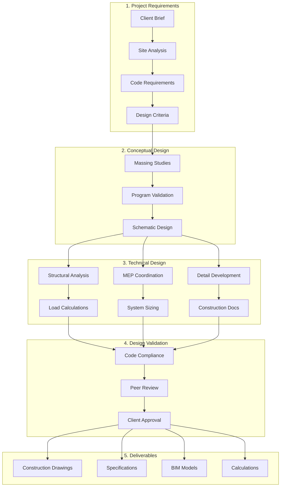
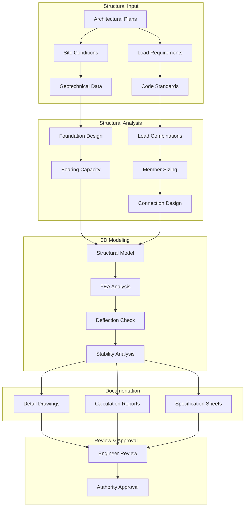
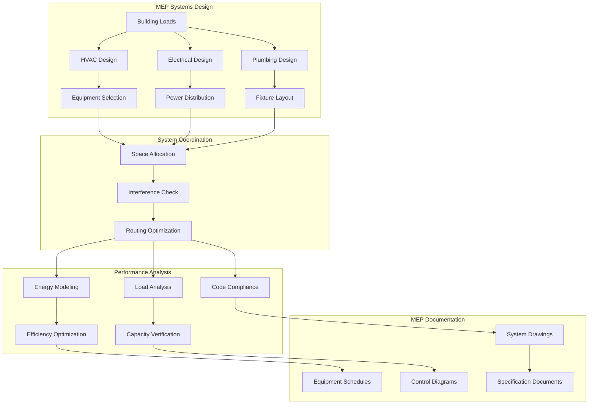

# Engineering Cross-Discipline Workflows Catalog

## Overview

This catalog documents the comprehensive AI-powered workflow automation ecosystem for engineering disciplines, featuring **5 universal workflow templates** with **80-95% reusability** across **23 disciplines**. The system combines intelligent agent orchestration with learning-enabled template selection for optimal engineering productivity.

**Reference**: [Paperclip Workflow Automation Ecosystem Implementation Plan](../plans/workflows/2026-04-20-paperclip-workflow-automation-ecosystem-implementation-plan.md)

## AI-Powered Workflow Automation System

### Universal Workflow Templates (80-95% Reusability)

#### 1. Specification Development Template (90-95% Reusability)
**Template ID**: AI-SPEC-DEV-001
**Key Components**:
- Document production and version control workflows
- Technical specification writing automation
- Drawing/diagram production frameworks
- Quality review and approval cycles
- Standards compliance verification
- Deliverable package assembly

**Engineering Discipline Adaptations**:
- **Architectural**: Building specs, material schedules, room finishes
- **Civil**: Site plans, grading plans, utility drawings
- **Electrical**: Single-line diagrams, lighting plans, panel schedules
- **Mechanical**: Equipment schedules, HVAC layouts, P&IDs
- **Chemical**: Process flow diagrams, P&IDs, material balances
- **Structural**: Structural drawings, load calculations, connection details

#### 2. Regulatory Compliance Template (85-90% Reusability)
**Template ID**: AI-REG-COMPLY-002
**Key Components**:
- Code research and applicability analysis
- Compliance verification and documentation
- Regulatory submission preparation
- Permit application and tracking
- Authority review coordination
- Compliance audit and verification

**Engineering Discipline Adaptations**:
- **Building**: Building codes, zoning, accessibility (ADA/AODA)
- **Civil**: Municipal codes, DOT standards, environmental regulations
- **Electrical**: NEC/IEC codes, utility requirements, arc flash standards
- **Mechanical**: ASME codes, ASHRAE standards, energy codes
- **Chemical**: Process safety (PSM), environmental permits, OSHA compliance
- **Structural**: Seismic codes, wind load standards, material codes

#### 3. Construction Administration Template (80-85% Reusability)
**Template ID**: AI-CONST-ADMIN-003
**Key Components**:
- Site inspection coordination and documentation
- Request for Information (RFI) response workflows
- Submittal review and approval processes
- Non-conformance tracking and resolution
- Progress monitoring and reporting
- Quality control verification

**Engineering Discipline Adaptations**:
- **Architectural**: Building finishes, envelope inspection, aesthetics
- **Civil**: Grading verification, utility inspection, compaction testing
- **Electrical**: Electrical testing, grounding verification, panel inspection
- **Mechanical**: Equipment installation, system testing, balancing verification
- **Chemical**: Pressure testing, material verification, weld inspection
- **Structural**: Concrete testing, reinforcement inspection, structural integrity

#### 4. Commissioning & Handover Template (75-80% Reusability)
**Template ID**: AI-COMMISSION-004
**Key Components**:
- Commissioning phases and checklists
- Testing protocol templates
- As-built documentation workflows
- O&M manual compilation processes
- Warranty tracking systems
- Final handover package assembly

#### 5. Safety & Risk Management Template (70-80% Reusability)
**Template ID**: AI-SAFETY-RISK-005
**Key Components**:
- Safety workflow frameworks
- Hazard analysis templates (HAZOP, LOPA, etc.)
- Incident investigation processes
- Safety documentation systems
- Compliance tracking and reporting
- Training coordination systems

### Third-Party Integration Framework

#### IntegrateForge AI Connectors (18+ Engineering Platforms)

The workflow templates integrate with **IntegrateForge AI** connectors for seamless third-party tool connectivity:

##### Design & BIM Integration (5 connectors)
- **Autodesk BIM 360**: Cloud-based construction management and BIM collaboration
- **Autodesk Navisworks**: 3D model review and clash detection
- **Autodesk Revit**: Building design and BIM authoring
- **Autodesk AutoCAD**: 2D/3D drafting and design
- **Autodesk Civil 3D**: Civil engineering design and documentation

##### Project Controls Integration (5 connectors)
- **Oracle Primavera P6**: Enterprise project portfolio management
- **Microsoft Project**: Project scheduling and resource management
- **Asta Powerproject**: Construction planning and progress tracking
- **CostX**: Estimating, cost planning, and tender analysis
- **Procore**: Construction management and field productivity

##### Document Management Integration (4 connectors)
- **Oracle Aconex**: Project controls and collaboration platform
- **Microsoft SharePoint**: Document management and team collaboration
- **Bentley ProjectWise**: Engineering document management
- **Trimble Connect**: Construction collaboration and BIM management

##### Analysis Tools Integration (5 connectors)
- **Bentley STAAD**: Structural analysis and design
- **Computers and Structures ETABS**: Building analysis and design
- **HEC-RAS**: River analysis and hydraulic modeling
- **EPA SWMM**: Stormwater and wastewater modeling
- **OpenCV Measurement**: Computer vision-based measurement and analysis

#### Integration Selection Algorithm

Templates automatically select appropriate connectors based on:

1. **Tool Availability Assessment**
   - Check licensed/available third-party tools in organization
   - Evaluate integration maturity and reliability
   - Assess data compatibility and format requirements

2. **Workflow Integration Points**
   - Identify data import/export requirements
   - Determine real-time synchronization needs
   - Evaluate automation trigger capabilities

3. **Performance Optimization**
   - Select connectors with best performance metrics
   - Prioritize tools with AI-enhanced workflows
   - Optimize for minimal data transformation overhead

### Agent Decision-Making Framework

#### Enhanced Template Selection Algorithm

The **Workflow Complexity Analyzer** (DevForge AI) now includes third-party integration assessment:

1. **Parse Workflow Metadata**
   - Extract stakeholders, deliverables, constraints, timeline
   - Calculate complexity score (0-100)
   - **NEW**: Identify required third-party tool integrations

2. **Integration Capability Assessment**
   - **NEW**: Check available IntegrateForge AI connectors
   - **NEW**: Evaluate tool licensing and access permissions
   - **NEW**: Assess data flow requirements and compatibility

3. **Pattern Recognition**
   - Match against 23 discipline workflow catalogs
   - Identify common patterns across disciplines
   - Calculate template fit scores
   - **NEW**: Include integration pattern matching

4. **Resource Assessment**
   - Check agent availability and skills
   - Evaluate timeline feasibility
   - Assess integration requirements
   - **NEW**: Include third-party tool performance metrics

5. **Template Ranking & Selection**
   - Rank templates by reusability score (>80% preferred)
   - Select highest-ranked template
   - Generate customization requirements (<20% modification)
   - **NEW**: Include integration-specific customizations

6. **Optimization Application**
   - Apply learning engine optimizations
   - Integrate user feedback patterns
   - Generate execution package
   - **NEW**: Include connector optimization recommendations

#### Template Selection Decision Tree

```
Input: Workflow metadata (stakeholders, timeline, deliverables, constraints)
├── High Complexity (>20 stakeholders, >6 months, >50 deliverables)
│   └── Use: Multi-Agent Orchestration Template
├── Medium Complexity (5-20 stakeholders, 1-6 months, 10-50 deliverables)
│   └── Use: Standard Workflow Template + customization
└── Low Complexity (<5 stakeholders, <1 month, <10 deliverables)
    └── Use: Simple Task Template
```

#### Customization Thresholds

- **<10% customization**: Use template as-is
- **10-20% customization**: Apply parameterization
- **20-30% customization**: Use template + custom components
- **>30% customization**: Create new template or manual process

## Traditional Engineering Workflow Categories

### 1. Core Design Workflows

| Workflow ID | Name | Discipline | Description |
|------------|------|------------|-------------|
| ENG-001 | CAD Model Creation | All | Create parametric 3D models |
| ENG-002 | Standards Compliance | All | Validate against engineering standards |
| ENG-003 | BIM Integration | All | Integrate with Building Information Modeling |
| ENG-004 | Simulation Analysis | All | Perform structural/thermal/fluid analysis |

### 2. Civil Engineering Workflows

| Workflow ID | Name | Description |
|------------|------|-------------|
| CIV-ENG-001 | Site Analysis | Topography, soil conditions, environmental factors |
| CIV-ENG-002 | Infrastructure Design | Roads, bridges, utilities, drainage |
| CIV-ENG-003 | Structural Analysis | Load calculations, foundation design |
| CIV-ENG-004 | Construction Documentation | Drawings, specifications, BOQ |
| CIV-ENG-005 | Project Coordination | Multi-discipline integration |

### 3. Structural Engineering Workflows

| Workflow ID | Name | Description |
|------------|------|-------------|
| STR-ENG-001 | Structural Modeling | 3D structural models, load analysis |
| STR-ENG-002 | Foundation Design | Pile foundations, raft foundations |
| STR-ENG-003 | Steel Design | Steel connections, detailing |
| STR-ENG-004 | Concrete Design | Reinforced concrete elements |
| STR-ENG-005 | Seismic Analysis | Earthquake-resistant design |

### 4. MEP Engineering Workflows

| Workflow ID | Name | Description |
|------------|------|-------------|
| MEP-ENG-001 | HVAC Systems | Heating, ventilation, air conditioning |
| MEP-ENG-002 | Electrical Systems | Power distribution, lighting, controls |
| MEP-ENG-003 | Plumbing Systems | Water supply, drainage, fire protection |
| MEP-ENG-004 | Fire Protection | Sprinkler systems, detection, evacuation |
| MEP-ENG-005 | Energy Analysis | Building energy modeling |

### 5. Architectural Engineering Workflows

| Workflow ID | Name | Description |
|------------|------|-------------|
| ARC-ENG-001 | Building Design | Space planning, architectural modeling |
| ARC-ENG-002 | Façade Design | Curtain walls, cladding systems |
| ARC-ENG-003 | Interior Design | Finishes, furniture, lighting |
| ARC-ENG-004 | Sustainability | Green building design, LEED certification |
| ARC-ENG-005 | Code Compliance | Building code analysis and compliance |

## Workflow Diagrams

### Core Design Engineering Flow



### Structural Engineering Flow



### MEP Engineering Flow



## Agent Pool Architecture

### 3000+ Engineering Design Agents

```
┌─────────────────────────────────────────────────────────────────────────────┐
│                   Engineering Design Agent Pools                             │
│                                                                              │
│  ┌─────────────────────────────────────────────────────────────────────┐   │
│  │ Civil Engineering Pool (400+ agents)                                 │   │
│  │  • Site Analysis • Infrastructure Design • Structural Analysis       │   │
│  │  • Construction Documentation • Project Coordination                 │   │
│  └─────────────────────────────────────────────────────────────────────┘   │
│                                                                              │
│  ┌─────────────────────────────────────────────────────────────────────┐   │
│  │ Structural Engineering Pool (500+ agents)                            │   │
│  │  • Structural Modeling • Foundation Design • Steel Design           │   │
│  │  • Concrete Design • Seismic Analysis • Load Analysis                │   │
│  └─────────────────────────────────────────────────────────────────────┘   │
│                                                                              │
│  ┌─────────────────────────────────────────────────────────────────────┐   │
│  │ MEP Engineering Pool (600+ agents)                                  │   │
│  │  • HVAC Systems • Electrical Systems • Plumbing Systems             │   │
│  │  • Fire Protection • Energy Analysis • System Coordination           │   │
│  └─────────────────────────────────────────────────────────────────────┘   │
│                                                                              │
│  ┌─────────────────────────────────────────────────────────────────────┐   │
│  │ Architectural Engineering Pool (300+ agents)                        │   │
│  │  • Building Design • Façade Design • Interior Design                │   │
│  │  • Sustainability • Code Compliance • BIM Integration               │   │
│  └─────────────────────────────────────────────────────────────────────┘   │
│                                                                              │
│  ┌─────────────────────────────────────────────────────────────────────┐   │
│  │ Design Coordination Pool (200+ agents)                              │   │
│  │  • CAD Standards • BIM Management • Clash Detection                │   │
│  │  • Quality Assurance • Documentation • Client Coordination          │   │
│  └─────────────────────────────────────────────────────────────────────┘   │
└─────────────────────────────────────────────────────────────────────────────┘
```

## Standards Mapping

### Engineering Design Standards

| Standard | Region | Discipline Coverage | Application |
|----------|--------|-------------------|-------------|
| SANS 10160 | South Africa | Structural | Loading and design standards |
| SANS 10400 | South Africa | Building | National building regulations |
| BS 8110 | UK | Concrete Design | Structural concrete design |
| BS 5950 | UK | Steel Design | Structural steelwork design |
| ASHRAE 90.1 | USA | MEP | Energy efficiency standards |
| NFPA 13 | International | Fire Protection | Sprinkler system design |
| Eurocode | Europe | All Disciplines | Unified European standards |
| IBC/IRC | USA | Building | International building codes |

### Engineering Units & Tolerances

| Quantity | Unit | Standard Tolerance | Application |
|----------|------|-------------------|-------------|
| Length | mm, m | ±1mm to ±5mm | Dimensions, clearances |
| Angle | degrees | ±0.5° to ±2° | Slopes, alignments |
| Force | kN, MN | ±2% to ±5% | Load calculations |
| Stress | MPa | ±5% to ±10% | Material design |
| Area | m² | ±1% to ±2% | Floor areas, sections |
| Volume | m³ | ±2% to ±5% | Concrete volumes |
| Temperature | °C | ±1°C to ±2°C | HVAC design |
| Pressure | kPa | ±5% to ±10% | System pressures |

## Related Documentation

- [Platform Structure](./DISCIPLINE-PLATFORM-STRUCTURE.md)
- [Engineering Standards](../standards/engineering-standards/)
- [CAD Integration Guide](../guides/cad-integration/)
- [BIM Implementation](../plans/bim-implementation/)

---

**Document Version**: 1.0
**Last Updated**: 2026-04-20
**Workflow Count**: 20+ core workflows
**Agent Pool**: 3000+ specialized agents
