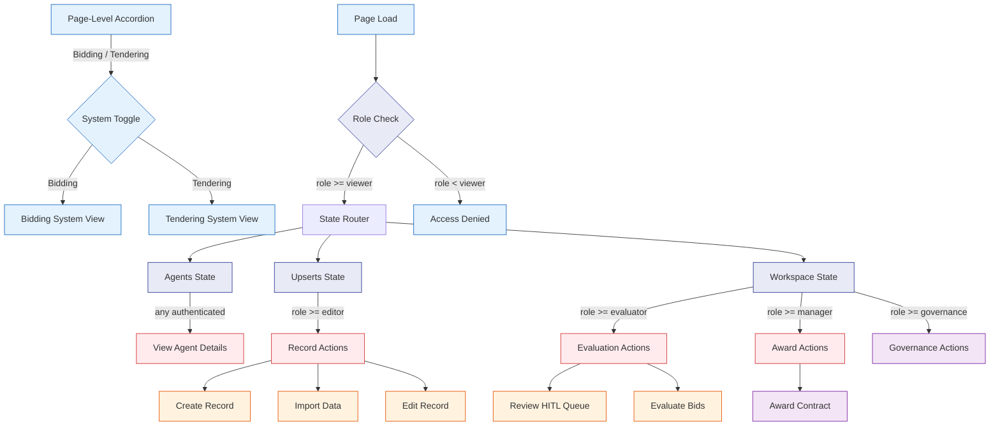
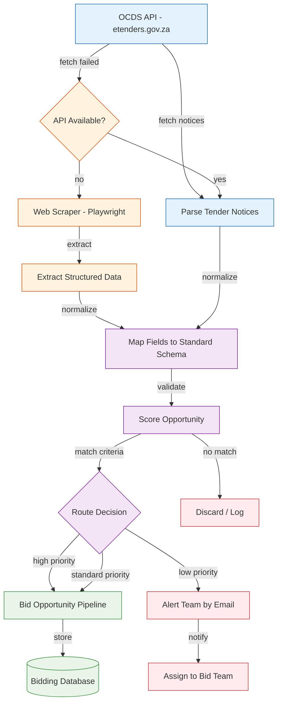
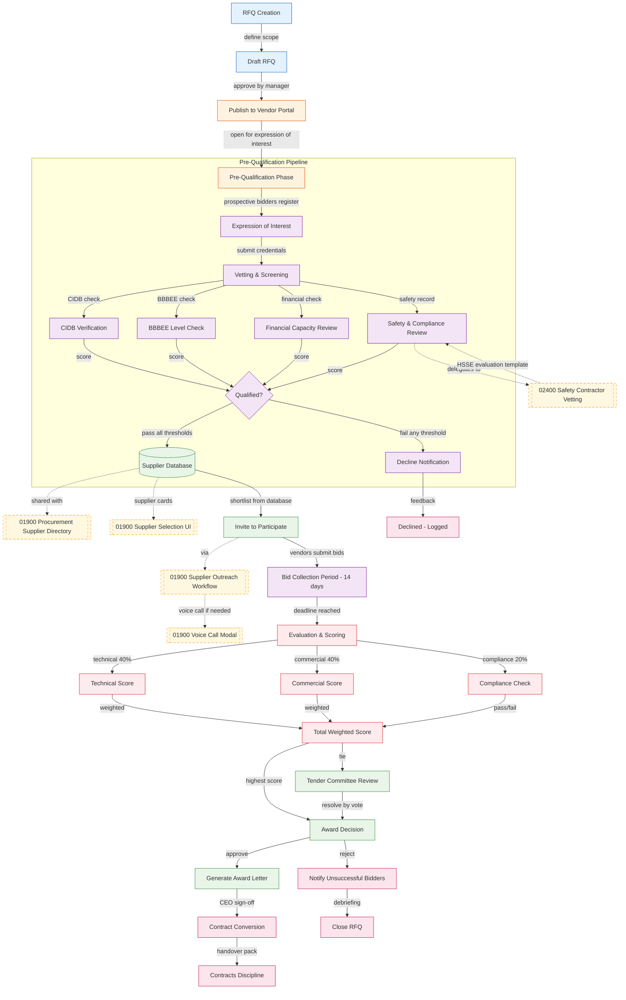
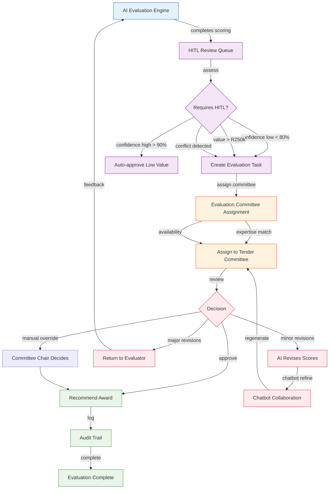
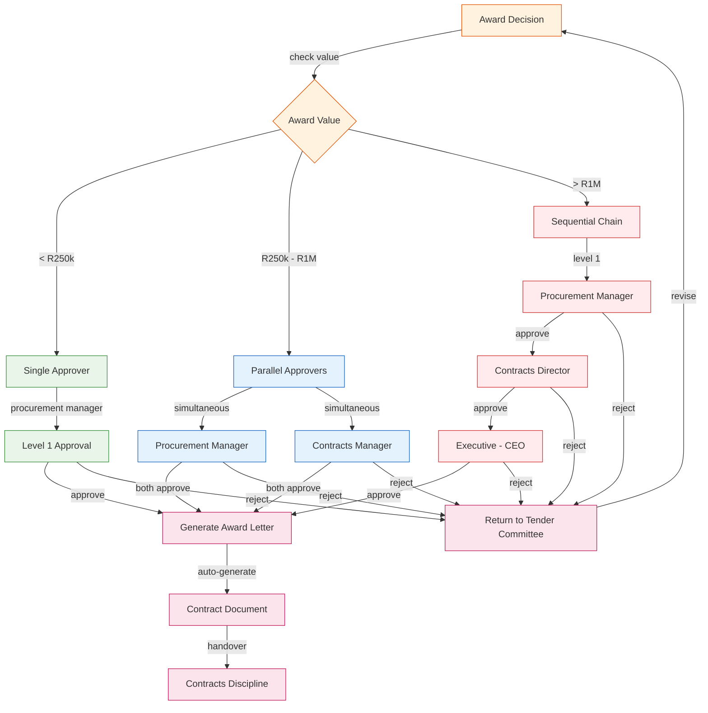
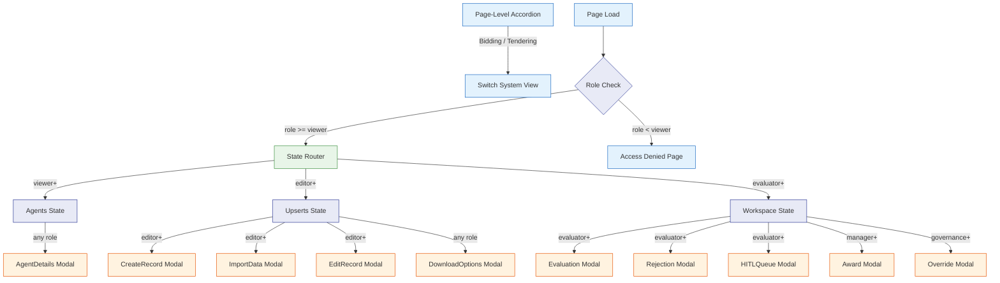

# Bidding & Tendering — UI/UX Specification

## Part A: UX Patterns (High-Level)

### Template Classification

**Classification**: Template B (Complex/Three-State)

**Rationale**:
- Dual-system platform with 3 distinct navigation states (Agents, Upserts, Workspace)
- Complex workflows: OCDS API ingestion, bid evaluation, RFQ lifecycle, award-to-contract
- Two complementary systems: **Bidding** (inbound) and **Tendering** (outbound)
- State-aware chatbot with different behaviors per state per system

### Color Scheme — Orange/Blue Dual-System Palette

```css
:root {
  /* Primary — Orange (Tendering) */
  --template-a-primary: #FF8C00;
  --template-a-secondary: #FFA500;
  --template-a-accent: #FF6B35;

  /* Bidding — Blue */
  --bidding-primary: #1565C0;
  --bidding-secondary: #1976D2;
  --bidding-accent: #0D47A1;

  /* Tendering — Orange */
  --tendering-primary: #FF8C00;
  --tendering-secondary: #FFA500;
  --tendering-accent: #E65100;

  /* Background Gradients */
  --template-a-bg-gradient: linear-gradient(135deg, #f8f9fa 0%, #e9ecef 100%);
  --bidding-header-gradient: linear-gradient(135deg, #0D47A1 0%, #1565C0 100%);
  --tendering-header-gradient: linear-gradient(135deg, #E65100 0%, #FF8C00 100%);

  /* Text Colors */
  --template-a-text-primary: #000000;
  --template-a-text-secondary: #6c757d;
  --template-a-text-white: #ffffff;

  /* Shadows */
  --template-a-shadow-sm: 0 2px 4px rgba(0, 0, 0, 0.05);
  --template-a-shadow-md: 0 4px 6px rgba(0, 0, 0, 0.1);
  --bidding-shadow-lg: 0 8px 24px rgba(21, 101, 192, 0.25);
  --tendering-shadow-lg: 0 8px 24px rgba(255, 140, 0, 0.25);
}
```

**Dual-System Mode Toggle**:
```css
.bidding-mode {
  --component-primary: var(--bidding-primary);
  --component-header-gradient: var(--bidding-header-gradient);
}
.tendering-mode {
  --component-primary: var(--tendering-primary);
  --component-header-gradient: var(--tendering-header-gradient);
}
```

### HITL Integration Pattern

AI generates bidding/tendering actions → HITL review queue → Human approves/rejects/modifies → Execute.

| System | AI Output | HITL Reviewer |
|--------|-----------|---------------|
| Bidding | Bid opportunity scores, bid preparation | Bid Manager |
| Tendering | Evaluation scores, award recommendation | Tender Committee |

---

## Part B: Three-State Button & Modal Rules

### State Definitions

| State | Bidding Purpose | Tendering Purpose |
|-------|-----------------|-------------------|
| **Agents** | Show bid agents, market intelligence agents | Show tender agents, evaluation agents |
| **Upserts** | Create/edit bid opportunities, import OCDS data | Create/edit RFQs, manage tenders |
| **Workspace** | HITL review queue, bid evaluation dashboard | Evaluation engine, award pipeline |

### Agents State Buttons

| Button | Visibility Gate | Action | Modal |
|--------|----------------|--------|-------|
| **View Details** | Always visible | Opens AgentDetails modal | `AgentDetails` — 98vw |

### Upserts State Buttons

| Button | Visibility Gate | Action | Modal |
|--------|----------------|--------|-------|
| **Create New** | `user.role >= 'editor'` | Opens CreateRecord modal | `CreateRecord` — 98vw |
| **Import Data** | `user.role >= 'editor'` | Opens ImportData modal | `ImportData` — 98vw |
| **Edit** | `user.role >= 'editor'` | Opens EditRecord modal | `EditRecord` — 98vw |
| **Download** | Always visible | Opens DownloadOptions modal | `DownloadOptions` — 98vw |

### Workspace State Buttons

| Button | Visibility Gate | Action | Modal |
|--------|----------------|--------|-------|
| **Evaluate** | `user.role >= 'evaluator'` | Opens Evaluation modal | `Evaluation` — 98vw |
| **Award** | `user.role >= 'manager'` | Opens Award modal | `Award` — 98vw |
| **Reject** | `user.role >= 'evaluator'` | Opens Rejection modal | `Rejection` — 98vw |
| **Override** | `user.role >= 'governance'` | Opens Override modal | `Override` — 98vw |
| **View Queue** | Always visible | Opens HITLQueue modal | `HITLQueue` — 98vw |

---

## Part C: Mermaid UI Flow Diagrams

### Diagram 1: Three-State Navigation Flow with Page-Level Access Rights (generated from `three-state-navigation` template v1.0)



### Diagram 2: Bidding Discovery Flow (generated from `bidding-discovery-flow` template v1.0)



### Diagram 3: RFQ Lifecycle Flow with Pre-Qualification Pipeline & Cross-Discipline Integration Points (generated from `tendering-rfq-flow` template v2.1 — showPrequal=true, showIntegrationPoints=true)



### Diagram 4: Bid Evaluation Flow (generated from `hitl-review` template v1.0)



### Diagram 5: Award-to-Contract Flow (generated from `approval-matrix` template v1.0)



### Diagram 6: Page State with Modal Integration & Role-Based Access Rights (generated from `page-state-flow` template v1.0)



---

## Part D: Implementation Standards

### CSS Architecture

```css
/* 1. Template B Standard */
@import "../../templates/template-b-standard.css";

/* 2. Bidding & Tendering Page-Specific Styles */
@import "bidding-tendering-page-style.css";
```

**CSS Class Convention**: `A-BTND-*` for all page-level elements

### Modal Inventory

| Modal | State | Purpose | Size |
|-------|-------|---------|------|
| AgentDetails | Agents | View agent details and metrics | 98vw |
| CreateRecord | Upserts | Create new bid/tender record | 98vw |
| ImportData | Upserts | Import OCDS data or vendor data | 98vw |
| EditRecord | Upserts | Edit existing record | 98vw |
| DownloadOptions | Upserts | Download tender documents | 98vw |
| Evaluation | Workspace | Evaluate bids with weighted scoring | 98vw |
| Award | Workspace | Award tender to vendor | 98vw |
| Rejection | Workspace | Reject with feedback | 98vw |
| Override | Workspace | Override AI recommendation | 98vw |
| HITLQueue | Workspace | View HITL review queue | 98vw |

### Chatbot Configuration

```json
{
  "chatType": "agent",
  "stateAware": true,
  "currentState": "agents|upserts|workspace",
  "systemAware": true,
  "currentSystem": "bidding|tendering",
  "zIndex": 1500,
  "modelEndpoint": "/api/chat/bidding-tendering"
}
```

| State | Chatbot Focus |
|-------|---------------|
| Agents | Answers questions about agent capabilities, system functions |
| Upserts | Assists with record creation, data import, document management |
| Workspace | Explains evaluation scores, suggests approvals, monitors deadlines |

---

## Part E: Screen Specifications

### Platform Adaptations

| Platform | Width | Layout Changes |
|----------|-------|----------------|
| Desktop | 1280px+ | Full three-state nav, dual-system toggle, scoring table |
| Tablet | 768px-1279px | Three-state nav collapses to dropdown, system toggle as segment |
| Mobile | <768px | Three-state nav as bottom tab bar, system toggle as radio buttons |

### Screen States

| State | Description |
|-------|-------------|
| Loading | Skeleton loader with orange/blue shimmer |
| Empty | "No opportunities yet" with Create Record CTA |
| Error | Error message with retry button |
| Populated | Full data view with all components |

---

## Part F: AI Model Backend

**Base Model**: Qwen 2.5 — fine-tuned on procurement domain data

**Domain Adapters**:
- **Bidding LoRA**: Tender opportunity scoring, market intelligence, bid preparation
- **Evaluation LoRA**: Bid evaluation scoring, weighted analysis, compliance checking

**Deployment**: HuggingFace model serving — Endpoint: `/api/chat/bidding-tendering`

---

## Part G: Agent Knowledge Ownership

| Company | Role | Action |
|---------|------|--------|
| **DomainForge AI** | Domain Validation | Validate bidding/tendering workflows |
| **QualityForge AI** | Testing | Execute test suite against spec |
| **DevForge AI** | Implementation | Build HTML/CSS/React pages |
| **KnowledgeForge AI** | Indexing | Index spec into institutional memory |
| **InfraForge AI** | Database | Database schema, RLS policies, API routes |
| **Loopy AI** | Portal Frontend | External vendor portal pages |

---

## Part H: Mermaid Template System Integration

### Template Inventory

| Diagram | Template | Version | Render Command |
|---------|----------|---------|----------------|
| 1. Three-State Navigation | `three-state-navigation` | v2.0 | `--template three-state-navigation --discipline BTND --showAccordion true` |
| 2. Bidding Discovery | `bidding-discovery-flow` | v1.0 | `--template bidding-discovery-flow --discipline BTND --showScraping true` |
| 3. RFQ Lifecycle | `tendering-rfq-flow` | v2.1 | `--template tendering-rfq-flow --discipline BTND --showEvaluation true --showPrequal true --showIntegrationPoints true` |
| 4. Bid Evaluation | `hitl-review` | v1.0 | `--template hitl-review --discipline BTND --confidenceThreshold 85` |
| 5. Award-to-Contract | `approval-matrix` | v1.0 | `--template approval-matrix --discipline BTND` |
| 6. Page State | `page-state-flow` | v2.0 | `--template page-state-flow --discipline BTND --showAccordion true` |

### Full Render Command

```bash
node docs-paperclip/scripts/render-mermaid.cjs --discipline BTND --output-dir disciplines-shared/bidding-and-tendering/diagrams/
```

---

## Version History

| Version | Date | Changes |
|---------|------|---------|
| 1.0 | 2026-04-29 | Initial UI/UX specification for Bidding & Tendering |

---

**Document Information**
- **Author**: DomainForge AI — Procurement Domain
- **Date**: 2026-04-29
- **Status**: Active