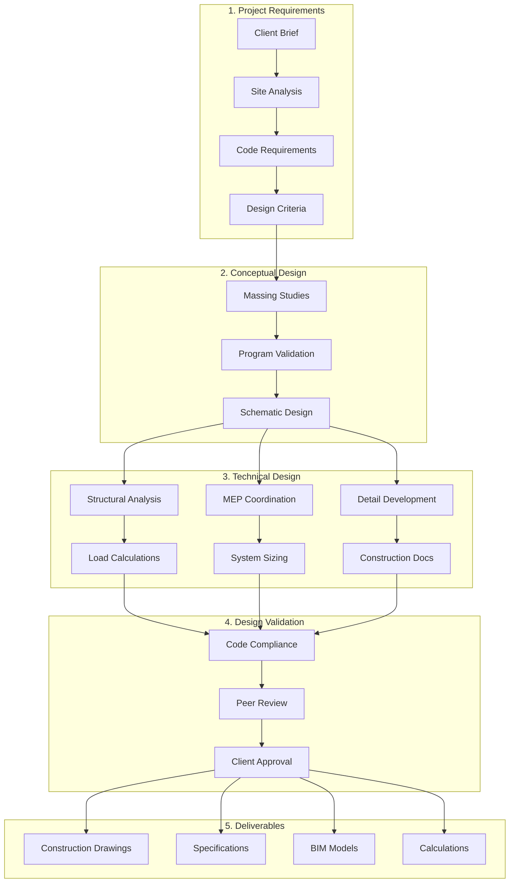
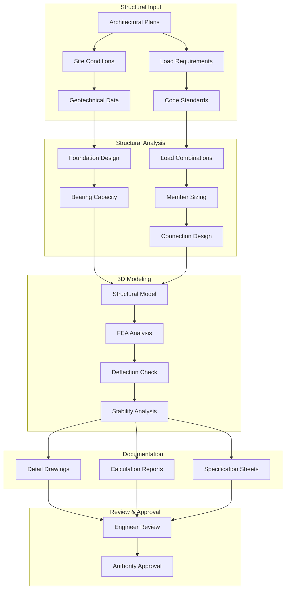
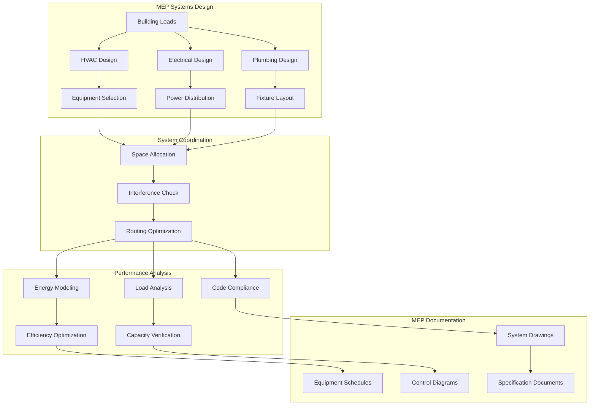

# Engineering Cross-Discipline Workflows Catalog

## Overview

This catalog documents all engineering workflows available through the DevForge AI platform, covering multi-discipline design engineering with comprehensive CAD integration and standards compliance.

## Workflow Categories

### 1. Core Design Workflows

| Workflow ID | Name | Discipline | Description |
|------------|------|------------|-------------|
| ENG-001 | CAD Model Creation | All | Create parametric 3D models |
| ENG-002 | Standards Compliance | All | Validate against engineering standards |
| ENG-003 | BIM Integration | All | Integrate with Building Information Modeling |
| ENG-004 | Simulation Analysis | All | Perform structural/thermal/fluid analysis |

### 2. Civil Engineering Workflows

| Workflow ID | Name | Description |
|------------|------|-------------|
| CIV-ENG-001 | Site Analysis | Topography, soil conditions, environmental factors |
| CIV-ENG-002 | Infrastructure Design | Roads, bridges, utilities, drainage |
| CIV-ENG-003 | Structural Analysis | Load calculations, foundation design |
| CIV-ENG-004 | Construction Documentation | Drawings, specifications, BOQ |
| CIV-ENG-005 | Project Coordination | Multi-discipline integration |

### 3. Structural Engineering Workflows

| Workflow ID | Name | Description |
|------------|------|-------------|
| STR-ENG-001 | Structural Modeling | 3D structural models, load analysis |
| STR-ENG-002 | Foundation Design | Pile foundations, raft foundations |
| STR-ENG-003 | Steel Design | Steel connections, detailing |
| STR-ENG-004 | Concrete Design | Reinforced concrete elements |
| STR-ENG-005 | Seismic Analysis | Earthquake-resistant design |

### 4. MEP Engineering Workflows

| Workflow ID | Name | Description |
|------------|------|-------------|
| MEP-ENG-001 | HVAC Systems | Heating, ventilation, air conditioning |
| MEP-ENG-002 | Electrical Systems | Power distribution, lighting, controls |
| MEP-ENG-003 | Plumbing Systems | Water supply, drainage, fire protection |
| MEP-ENG-004 | Fire Protection | Sprinkler systems, detection, evacuation |
| MEP-ENG-005 | Energy Analysis | Building energy modeling |

### 5. Architectural Engineering Workflows

| Workflow ID | Name | Description |
|------------|------|-------------|
| ARC-ENG-001 | Building Design | Space planning, architectural modeling |
| ARC-ENG-002 | Façade Design | Curtain walls, cladding systems |
| ARC-ENG-003 | Interior Design | Finishes, furniture, lighting |
| ARC-ENG-004 | Sustainability | Green building design, LEED certification |
| ARC-ENG-005 | Code Compliance | Building code analysis and compliance |

## Workflow Diagrams

### Core Design Engineering Flow



### Structural Engineering Flow



### MEP Engineering Flow



## Agent Pool Architecture

### 3000+ Engineering Design Agents

```
┌─────────────────────────────────────────────────────────────────────────────┐
│                   Engineering Design Agent Pools                             │
│                                                                              │
│  ┌─────────────────────────────────────────────────────────────────────┐   │
│  │ Civil Engineering Pool (400+ agents)                                 │   │
│  │  • Site Analysis • Infrastructure Design • Structural Analysis       │   │
│  │  • Construction Documentation • Project Coordination                 │   │
│  └─────────────────────────────────────────────────────────────────────┘   │
│                                                                              │
│  ┌─────────────────────────────────────────────────────────────────────┐   │
│  │ Structural Engineering Pool (500+ agents)                            │   │
│  │  • Structural Modeling • Foundation Design • Steel Design           │   │
│  │  • Concrete Design • Seismic Analysis • Load Analysis                │   │
│  └─────────────────────────────────────────────────────────────────────┘   │
│                                                                              │
│  ┌─────────────────────────────────────────────────────────────────────┐   │
│  │ MEP Engineering Pool (600+ agents)                                  │   │
│  │  • HVAC Systems • Electrical Systems • Plumbing Systems             │   │
│  │  • Fire Protection • Energy Analysis • System Coordination           │   │
│  └─────────────────────────────────────────────────────────────────────┘   │
│                                                                              │
│  ┌─────────────────────────────────────────────────────────────────────┐   │
│  │ Architectural Engineering Pool (300+ agents)                        │   │
│  │  • Building Design • Façade Design • Interior Design                │   │
│  │  • Sustainability • Code Compliance • BIM Integration               │   │
│  └─────────────────────────────────────────────────────────────────────┘   │
│                                                                              │
│  ┌─────────────────────────────────────────────────────────────────────┐   │
│  │ Design Coordination Pool (200+ agents)                              │   │
│  │  • CAD Standards • BIM Management • Clash Detection                │   │
│  │  • Quality Assurance • Documentation • Client Coordination          │   │
│  └─────────────────────────────────────────────────────────────────────┘   │
└─────────────────────────────────────────────────────────────────────────────┘
```

## Standards Mapping

### Engineering Design Standards

| Standard | Region | Discipline Coverage | Application |
|----------|--------|-------------------|-------------|
| SANS 10160 | South Africa | Structural | Loading and design standards |
| SANS 10400 | South Africa | Building | National building regulations |
| BS 8110 | UK | Concrete Design | Structural concrete design |
| BS 5950 | UK | Steel Design | Structural steelwork design |
| ASHRAE 90.1 | USA | MEP | Energy efficiency standards |
| NFPA 13 | International | Fire Protection | Sprinkler system design |
| Eurocode | Europe | All Disciplines | Unified European standards |
| IBC/IRC | USA | Building | International building codes |

### Engineering Units & Tolerances

| Quantity | Unit | Standard Tolerance | Application |
|----------|------|-------------------|-------------|
| Length | mm, m | ±1mm to ±5mm | Dimensions, clearances |
| Angle | degrees | ±0.5° to ±2° | Slopes, alignments |
| Force | kN, MN | ±2% to ±5% | Load calculations |
| Stress | MPa | ±5% to ±10% | Material design |
| Area | m² | ±1% to ±2% | Floor areas, sections |
| Volume | m³ | ±2% to ±5% | Concrete volumes |
| Temperature | °C | ±1°C to ±2°C | HVAC design |
| Pressure | kPa | ±5% to ±10% | System pressures |

## Related Documentation

- [Platform Structure](./DISCIPLINE-PLATFORM-STRUCTURE.md)
- [Engineering Standards](../standards/engineering-standards/)
- [CAD Integration Guide](../guides/cad-integration/)
- [BIM Implementation](../plans/bim-implementation/)

---

**Document Version**: 1.0
**Last Updated**: 2026-04-20
**Workflow Count**: 20+ core workflows
**Agent Pool**: 3000+ specialized agents
