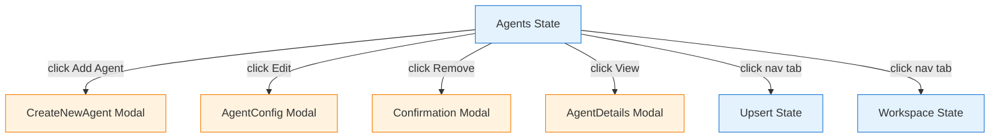
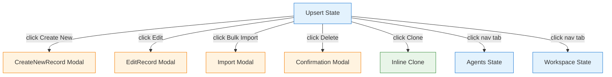
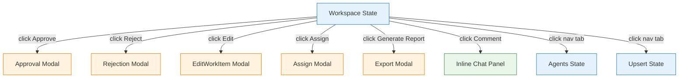
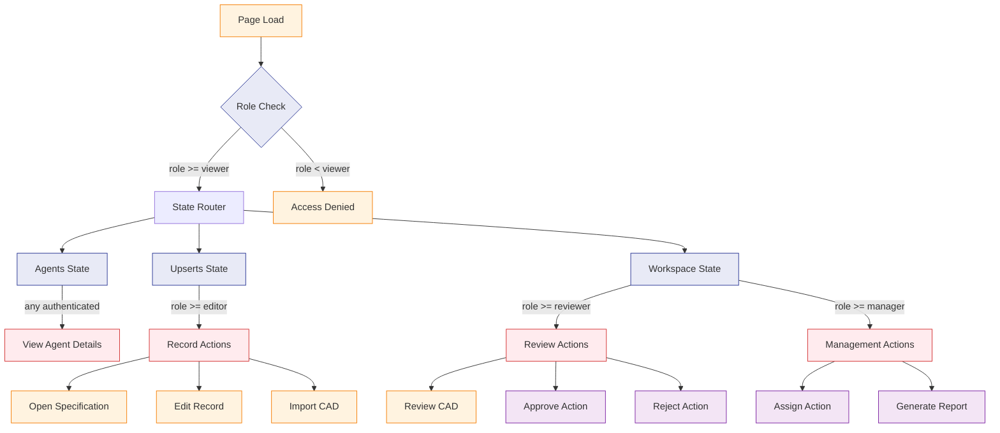
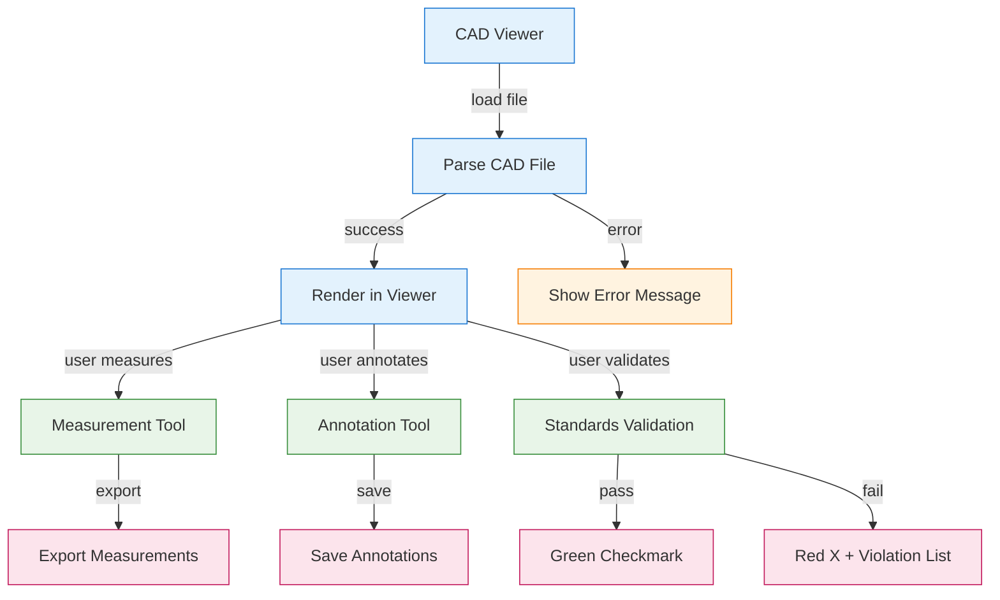
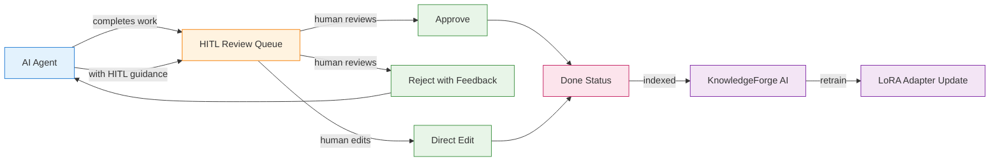

# Cross-Discipline Engineering Platform — UI/UX Specification

## Table of Contents

1. [Part A: UX Patterns (High-Level)](#part-a-ux-patterns-high-level)
2. [Part B: Three-State Button & Modal Rules](#part-b-three-state-button--modal-rules)
3. [Part C: Mermaid UI Flow Diagrams](#part-c-mermaid-ui-flow-diagrams)
4. [Part D: Implementation Standards](#part-d-implementation-standards)
5. [Part E: Screen Specifications (Detailed)](#part-e-screen-specifications-detailed)
6. [Part F: AI Model Backend](#part-f-ai-model-backend)
7. [Part G: Agent Knowledge Ownership](#part-g-agent-knowledge-ownership)
8. [Part H: Mermaid Template System Integration](#part-h-mermaid-template-system-integration)

---

## Part A: UX Patterns (High-Level)

### 1. Page Classification

**Template Type**: **Template B** (Complex / Three-State)

The Cross-Discipline Engineering Platform is classified as **Template B** because:

- **Multi-State Navigation**: Three distinct operational states — Agents, Upsert, Workspace
- **Multi-Purpose Functionality**: CAD viewing, specification editing, standards validation, document generation
- **Complex Workflows**: Engineering calculations, cross-discipline coordination, AI-assisted design
- **Higher z-index positioning** (1500) for the chatbot overlay
- **State-aware AI assistance** that adapts to the current operational context

**Applicable to all 10 engineering disciplines**:
- 00825 Architectural Engineering
- 00835 Chemical Engineering
- 00850 Civil Engineering
- 00855 Geotechnical Engineering
- 00860 Electrical Engineering
- 00870 Mechanical Engineering
- 00871 Process Engineering
- 00872 Structural Engineering
- 01000 Environmental Engineering
- 03000 Landscaping Engineering

### 2. Information Architecture

**Accordion Section**: Engineering (display_order: 825-3000)
**Accordion Subsection**: Per-discipline engineering pages
**Icons**: Discipline-specific engineering icons
**Routes**: `/engineering/{discipline-code}`

**AccordionProvider + AccordionComponent** is mandatory on every page per the `0950_ACCORDION_MANAGEMENT_AUDIT.md` standard.

### 3. Color Scheme

The platform uses the **Template A orange palette** as its foundation:

```css
:root {
  /* Primary Color Palette */
  --template-a-primary: #FF8C00;
  --template-a-secondary: #FFA500;
  --template-a-accent: #FF6B35;

  /* Background Gradients */
  --template-a-bg-gradient: linear-gradient(135deg, #f8f9fa 0%, #e9ecef 100%);
  --template-a-header-gradient: linear-gradient(135deg, #FF6B35 0%, #FF8C42 100%);

  /* Text Colors */
  --template-a-text-primary: #000000;
  --template-a-text-secondary: #6c757d;
  --template-a-text-white: #ffffff;

  /* Shadows and Borders */
  --template-a-shadow-sm: 0 2px 4px rgba(0, 0, 0, 0.05);
  --template-a-shadow-md: 0 4px 6px rgba(0, 0, 0, 0.1);
  --template-a-shadow-lg: 0 8px 24px rgba(255, 140, 0, 0.3);
}
```

**Discipline-specific accent colors** are applied via the `--template-a-accent` variable override in each discipline's page-specific CSS:

| Discipline | Code | Accent Color |
|-----------|------|-------------|
| Architectural | 00825 | `#FF8C00` (default orange) |
| Chemical | 00835 | `#00BFFF` (deep sky blue) |
| Civil | 00850 | `#32CD32` (lime green) |
| Geotechnical | 00855 | `#8B4513` (saddle brown) |
| Electrical | 00860 | `#FFD700` (gold) |
| Mechanical | 00870 | `#FF6B35` (burnt orange) |
| Process | 00871 | `#00CED1` (dark turquoise) |
| Structural | 00872 | `#4682B4` (steel blue) |
| Environmental | 01000 | `#228B22` (forest green) |
| Landscaping | 03000 | `#6B8E23` (olive drab) |

### 4. HITL Integration Pattern

The Human-in-the-Loop (HITL) model for engineering follows this pattern:

1. **AI Agent** performs initial work (CAD analysis, specification generation, calculation)
2. **Work enters HITL Review Queue** — visible in the Workspace state
3. **Human Engineer** reviews the AI output:
   - **Approve**: Work moves to "Done" status
   - **Reject with Feedback**: Work returns to the AI agent with guidance
   - **Edit**: Human directly modifies the output (bypasses AI re-processing)
4. **Feedback Loop**: Rejected work trains the discipline-specific LoRA adapter

---

## Part B: Three-State Button & Modal Rules

### 5. State: Agents

The **Agents state** shows the AI agents available for this engineering discipline.

**Buttons**:

| Button | Visibility Gate | Action | Modal |
|--------|----------------|--------|-------|
| **Add Agent** | `user.role === 'governance'` | Opens CreateNewAgent modal | `CreateNewAgent` — 98vw, gradient header, agent config form |
| **Edit** (per agent row) | `user.role >= 'editor'` | Opens AgentConfig modal | `AgentConfig` — 98vw, agent settings, model assignment, skill toggles |
| **Remove/Archive** (per agent row) | `user.role === 'governance'` | Opens Confirmation modal | `Confirmation` — "Are you sure you want to archive {agent_name}?" with Cancel/Confirm |
| **View Details** (per agent row) | Always visible | Opens AgentDetails modal | `AgentDetails` — 98vw, read-only agent info, recent activity, performance metrics |

**Modal Patterns** (per 0170 standard):
- Entry: `CreateNewAgent` — form-based, required fields validated with green border
- Management: `AgentConfig` — tabbed configuration panels
- Workflow: `Confirmation` — simple approve/deny

**Mermaid Flow** (generated from `agents-state-flow` template v1.0 — template has boolean parameters showDetails, showRemove):

<!-- This diagram is generated from the agents-state-flow template (v1.0) -->
<!-- To update: node docs-paperclip/scripts/render-mermaid.cjs --template agents-state-flow --discipline 00870 --showDetails true --showRemove true -->

### 6. State: Upsert

The **Upsert state** is where engineering records are created, edited, and imported.

**Buttons**:

| Button | Visibility Gate | Action | Modal |
|--------|----------------|--------|-------|
| **Create New** | `user.role >= 'editor'` | Opens CreateNewRecord modal | `CreateNewRecord` — 98vw, engineering form with CAD upload, specification editor, calculation engine |
| **Edit** (per record row) | `user.role >= 'editor'` | Opens EditRecord modal | `EditRecord` — 98vw, pre-populated form, version tracking |
| **Bulk Import** | `user.role >= 'editor'` | Opens Import modal | `Import` — 98vw, file upload with OCR support for scanned PDFs |
| **Delete** (per record row) | `user.role === 'governance'` | Opens Confirmation modal | `Confirmation` — "Delete record {id}?" with Cancel/Confirm |
| **Clone** (per record row) | `user.role >= 'editor'` | Clones record inline | No modal — inline clone with "(Copy)" suffix |

**Form Validation** (per 0750 standard):
- **Green border** (`2px solid #28a745`): Field is valid and populated
- **Gray border** (`2px solid #dee2e6`): Field is empty/required
- **Red border** (`2px solid #dc3545`): Field has validation error
- **Error text**: Red bold text below the field

**Modal Patterns**:
- Entry: `CreateNewRecord` — multi-section form with CAD upload, specification editor, calculation parameters
- Management: `EditRecord` — same form, pre-populated, with version history sidebar
- Workflow: `Import` — file upload with progress indicator, OCR toggle, validation results

**Mermaid Flow** (generated from `upsert-state-flow` template v1.0 — template has boolean parameter showBulkImport):

<!-- This diagram is generated from the upsert-state-flow template (v1.0) -->
<!-- To update: node docs-paperclip/scripts/render-mermaid.cjs --template upsert-state-flow --discipline 00870 --showBulkImport true -->

### 7. State: Workspace

The **Workspace state** is the operational dashboard for engineering work — reviewing AI outputs, managing approvals, and coordinating across disciplines.

**Buttons**:

| Button | Visibility Gate | Action | Modal |
|--------|----------------|--------|-------|
| **Approve** (per work item) | `user.role >= 'reviewer'` | Opens Approval modal | `Approval` — 98vw, confirm approval with optional comment |
| **Reject** (per work item) | `user.role >= 'reviewer'` | Opens Rejection modal | `Rejection` — 98vw, required feedback field, routes back to AI agent |
| **Edit** (per work item) | `user.role >= 'editor'` | Opens EditWorkItem modal | `EditWorkItem` — 98vw, direct human edit of AI output |
| **Assign** (per work item) | `user.role >= 'coordinator'` | Opens Assign modal | `Assign` — 98vw, user/agent selector dropdown |
| **Generate Report** | Always visible | Opens Export modal | `Export` — 98vw, format selection (PDF, CSV, XLSX), standards compliance report |
| **Comment/Discussion** | Always visible | Toggles chat panel | No modal — inline chat panel toggle |

**Mermaid Flow** (generated from `workspace-state-flow` template v1.0 — template has boolean parameters showAssign, showReport):

<!-- This diagram is generated from the workspace-state-flow template (v1.0) -->
<!-- To update: node docs-paperclip/scripts/render-mermaid.cjs --template workspace-state-flow --discipline 00870 --showAssign true --showReport true -->

### 8. Shared Rules Across States

**Button Visibility Gates**:
- `user.role === 'governance'`: Full access — all buttons visible
- `user.role >= 'coordinator'`: Management buttons visible (Assign, Review)
- `user.role >= 'editor'`: Edit/Create buttons visible
- `user.role === 'viewer'`: Read-only — no mutation buttons

**Data-State-Based Visibility**:
- **Loading state**: All action buttons disabled, spinner shown
- **Empty state**: "Create New" button prominent, "No records found" message
- **Error state**: Retry button, error message in red banner
- **Populated state**: All buttons active per role gates

**Modal Patterns** (per 0170 standard):
1. **Entry Modals**: Form-based, create new records/agents
2. **Management Modals**: Edit existing records, tabbed configuration
3. **Workflow Modals**: Approval, rejection, confirmation — simple action with optional feedback

**Validation** (per 0750 standard):
- All `<select>` dropdowns use inline styles with green/gray/red border states
- Required fields marked with `*`
- Validation errors shown as red bold text below the field
- Form submission blocked until all required fields are valid

---

## Part C: Mermaid UI Flow Diagrams

### 9. Page State Flow (generated from `three-state-navigation` template v2.0, with disabled accordion)

> **Parameters**: `discipline: "engineering-shared"`, `states: "Agents, Upserts, Workspace"`, `roles: "viewer, editor, reviewer, manager, admin"`, `showAccordion: false`
>
> The page-level accordion (Bidding/Tendering toggle) is disabled for the Engineering Platform as it uses a shared cross-discipline route structure. Role gates are mapped to Engineering roles:
> - `viewer` → Router access (+ View Agent Details)
> - `editor` → Record actions (Open Spec, Edit Record)
> - `reviewer` → Review actions (Review CAD, Approve/Reject)
> - `manager` → Management actions (Assign, Generate Report)
> - `admin` → Full access



### 10. CAD Viewer Flow

**Mermaid Flow** (generated from `cad-viewer-flow` template v1.0 — template has boolean parameters showValidation, showExport):

<!-- This diagram is generated from the cad-viewer-flow template (v1.0) -->
<!-- To update: node docs-paperclip/scripts/render-mermaid.cjs --template cad-viewer-flow --discipline 00870 --showValidation true --showExport true -->

### 11. HITL Workflow Flow

**Mermaid Flow** (generated from `hitl-workflow` template v1.0 — template has parameter confidenceThreshold, boolean parameter showKnowledgeLoop):

<!-- This diagram is generated from the hitl-workflow template (v1.0) -->
<!-- To update: node docs-paperclip/scripts/render-mermaid.cjs --template hitl-workflow --discipline 00870 --confidenceThreshold 85 --showKnowledgeLoop true -->

---

## Part D: Implementation Standards

### 12. CSS Architecture

**Import Chain**:
```css
/* 1. Template A Standard (master template) */
@import "../../templates/template-a-standard.css";

/* 2. Engineering Shared Components */
@import "../../shared/engineering/components/core.css";

/* 3. Page-Specific Engineering Styles */
@import "00870-mechanical-engineering-style.css";
```

**File Structure**:
```
client/src/common/css/
├── templates/
│   └── template-a-standard.css              # Master template
├── shared/
│   └── engineering/
│       ├── components/
│       │   ├── core.css                     # CADViewer, SpecEditor, StandardsValidator
│       │   ├── forms.css                    # EngineeringForm, StandardsSelector
│       │   └── modals.css                   # CADUpload, Validation, Specification, Export
│       └── variables.css                    # Engineering-specific CSS variables
└── pages/
    └── engineering/
        ├── 00825-architectural-engineering-style.css
        ├── 00835-chemical-engineering-style.css
        ├── 00850-civil-engineering-style.css
        ├── 00855-geotechnical-engineering-style.css
        ├── 00860-electrical-engineering-style.css
        ├── 00870-mechanical-engineering-style.css
        ├── 00871-process-engineering-style.css
        ├── 00872-structural-engineering-style.css
        ├── 01000-environmental-engineering-style.css
        └── 03000-landscaping-engineering-style.css
```

**Key Principles**:
- **No Background Images**: Clean gradient backgrounds only (per `0000_VISUAL_DESIGN_STANDARDS.md`)
- **98vw Modal Sizing**: Consistent modal experience across all states
- **Orange Color Scheme**: `#FF8C00`, `#FFA500`, `#FF6B35` palette throughout
- **Component Reuse**: Use Template A standard components when possible
- **Variable Consistency**: Always use `--template-a-*` variables for consistency

### 13. Component Inventory

**Shared Engineering Components** (from `shared-components.md`):

| Component | File | Purpose | CSS Class Prefix |
|-----------|------|---------|-----------------|
| CADViewer | `components/core/CADViewer.js` | Unified CAD/BIM file viewer | `.cad-viewer-*` |
| SpecificationEditor | `components/core/SpecificationEditor.js` | Technical specification editor | `.spec-editor-*` |
| StandardsValidator | `components/core/StandardsValidator.js` | Real-time standards validation | `.standards-validator-*` |
| DocumentGenerator | `components/core/DocumentGenerator.js` | Automated document generation | `.doc-generator-*` |
| WorkflowTracker | `components/core/WorkflowTracker.js` | Engineering workflow progress | `.workflow-tracker-*` |
| EngineeringForm | `components/forms/EngineeringForm.js` | Generic engineering data entry | `.eng-form-*` |
| StandardsSelector | `components/forms/StandardsSelector.js` | Standards dropdown | `.standards-selector-*` |
| TemplateSelector | `components/forms/TemplateSelector.js` | Template selection | `.template-selector-*` |
| CalculationEngine | `components/forms/CalculationEngine.js` | Engineering calculations | `.calc-engine-*` |
| CADUploadModal | `components/modals/CADUploadModal.js` | CAD/BIM file upload | `.cad-upload-modal-*` |
| ValidationModal | `components/modals/ValidationModal.js` | Standards validation results | `.validation-modal-*` |
| SpecificationModal | `components/modals/SpecificationModal.js` | Specification editing | `.spec-modal-*` |
| ExportModal | `components/modals/ExportModal.js` | Export options | `.export-modal-*` |

### 14. Dropdown Specifications

All dropdowns follow the `0750_DROPDOWN_MASTER_GUIDE.md` standard:

**Standards Selector Dropdown**:
```javascript
<select
  value={selectedStandard}
  onChange={(e) => setSelectedStandard(e.target.value)}
  style={{
    width: "100%",
    padding: "8px 12px",
    border: selectedStandard
      ? "2px solid #28a745"  // Green when valid
      : "2px solid #dee2e6",  // Gray when empty
    borderRadius: "4px",
    fontSize: "0.875rem",
    backgroundColor: "#ffffff",
    cursor: "pointer",
  }}
>
  <option value="">Select engineering standard...</option>
  {standards.map((s) => (
    <option key={s.code} value={s.code}>
      {s.name} ({s.version})
    </option>
  ))}
</select>
```

**Dropdown Inventory**:

| Dropdown | Component | Data Source | Discipline-Specific |
|----------|-----------|-------------|-------------------|
| Discipline Selector | `StandardsSelector` | `disciplineConfigs.js` | Yes — filters by discipline |
| Standards Selector | `StandardsSelector` | `standardsMappings.js` | Yes — discipline-specific standards |
| Template Selector | `TemplateSelector` | `templateDefinitions.js` | Yes — discipline-specific templates |
| CAD Format Selector | `CADUploadModal` | `cadIntegrations.js` | No — shared across disciplines |
| Export Format Selector | `ExportModal` | Static list | No — shared across disciplines |

### 15. Modal Specifications

All modals follow the `0170_MODAL_DOCUMENTATION_MASTER_GUIDE.md` standard:

**Modal Inventory**:

| Modal | State | Width | Header | Purpose |
|-------|-------|-------|--------|---------|
| CreateNewAgent | Agents | 98vw | Gradient (orange) | Create new AI agent |
| AgentConfig | Agents | 98vw | Gradient (orange) | Configure agent settings |
| AgentDetails | Agents | 98vw | Gradient (orange) | View agent details |
| Confirmation | All | 98vw | Gradient (orange) | Confirm destructive action |
| CreateNewRecord | Upsert | 98vw | Gradient (orange) | Create new engineering record |
| EditRecord | Upsert | 98vw | Gradient (orange) | Edit existing record |
| Import | Upsert | 98vw | Gradient (orange) | Bulk import with OCR |
| Approval | Workspace | 98vw | Gradient (orange) | Approve AI output |
| Rejection | Workspace | 98vw | Gradient (orange) | Reject with feedback |
| EditWorkItem | Workspace | 98vw | Gradient (orange) | Direct human edit |
| Assign | Workspace | 98vw | Gradient (orange) | Assign work item |
| Export | Workspace | 98vw | Gradient (orange) | Export options |
| CADUpload | All | 98vw | Gradient (orange) | Upload CAD/BIM file |
| Validation | All | 98vw | Gradient (orange) | Standards validation results |

**Modal Pattern**:
```html
<div class="modal" style="width: 98vw; max-width: 98vw;">
  <div class="modal-header" style="background: var(--template-a-header-gradient);">
    <h3>{Modal Title}</h3>
    <button class="modal-close">&times;</button>
  </div>
  <div class="modal-body">
    {Form/Content}
  </div>
  <div class="modal-footer">
    <button class="btn-secondary">Cancel</button>
    <button class="btn-primary">{Action}</button>
  </div>
</div>
```

### 16. Chatbot Configuration

**Template Type**: Template B (State-Aware)

**Configuration**:
```javascript
{
  chatType: "agent",
  stateAware: true,
  currentState: "agents|upserts|workspace",
  aiAgentIntegration: true,
  upsertWorkflowSupport: true,
  zIndex: 1500,  // Higher than Template A (1000)
  modelEndpoint: "/api/chat/engineering",
  disciplineAdapter: true,  // Routes to discipline-specific LoRA
}
```

**State-Aware Behavior**:
- **Agents State**: Chatbot answers questions about agent configuration, model assignments, skills
- **Upsert State**: Chatbot assists with record creation, specification writing, calculation guidance
- **Workspace State**: Chatbot provides HITL guidance, explains AI outputs, suggests approval/rejection

---

## Part E: Screen Specifications (Detailed)

### 17. Screen Inventory

| Screen | State | Loading | Empty | Error | Populated |
|--------|-------|---------|-------|-------|-----------|
| Agent List | Agents | Spinner + skeleton cards | "No agents configured" CTA | Red banner + retry | Agent cards with status badges |
| Agent Config | Agents | Spinner | N/A | Red banner + retry | Tabbed config panels |
| Record List | Upsert | Spinner + skeleton rows | "No records found" CTA | Red banner + retry | Table with pagination |
| Record Form | Upsert | Spinner | Empty form | Field-level errors | Pre-populated form |
| Import | Upsert | Progress bar | File drop zone | Error list | Success summary |
| HITL Queue | Workspace | Spinner + skeleton | "No items to review" | Red banner + retry | Queue with priority badges |
| CAD Viewer | All | Spinner + "Loading CAD..." | "No CAD file loaded" | "Failed to load CAD" | Rendered CAD with tools |
| Standards Validation | All | Spinner | "No standards to validate" | "Validation failed" | Pass/fail results |

### 18. Screen-by-Screen Wireframes

#### 18.1 Agent List Screen (Agents State)

```
┌──────────────────────────────────────────────────────────────┐
│  [Template A Header Gradient]                                │
│  Engineering Platform │ Mechanical Engineering │ [Chatbot]   │
├──────────────────────────────────────────────────────────────┤
│  [Tab Nav: Agents | Upsert | Workspace]                      │
│  ┌────────────────────────────────────────────────────────┐  │
│  │ Agents                          [+ Add Agent]          │  │
│  ├────────────────────────────────────────────────────────┤  │
│  │ ┌──────────┐ ┌──────────┐ ┌──────────┐                │  │
│  │ │ CAD      │ │ Spec     │ │ Calc     │                │  │
│  │ │ Analyst  │ │ Engineer │ │ Engine   │                │  │
│  │ │ ● Active │ │ ● Active │ │ ● Active │                │  │
│  │ │ [Edit]   │ │ [Edit]   │ │ [Edit]   │                │  │
│  │ │ [Remove] │ │ [Remove] │ │ [Remove] │                │  │
│  │ └──────────┘ └──────────┘ └──────────┘                │  │
│  └────────────────────────────────────────────────────────┘  │
├──────────────────────────────────────────────────────────────┤
│  [Bottom-Fixed Nav: Engineering Standards | CAD Viewer |     │
│   Reports | Settings]                                         │
└──────────────────────────────────────────────────────────────┘
```

**CSS Structure**:
```html
<div class="template-a-main-container">
  <header class="template-a-header">
    <h1>Engineering Platform</h1>
    <span class="discipline-badge">Mechanical Engineering</span>
  </header>
  <nav class="three-state-nav">
    <button class="state-tab active">Agents</button>
    <button class="state-tab">Upsert</button>
    <button class="state-tab">Workspace</button>
  </nav>
  <main class="agents-state">
    <div class="section-header">
      <h2>Agents</h2>
      <button class="btn-primary">+ Add Agent</button>
    </div>
    <div class="agent-grid">
      <div class="agent-card">
        <div class="agent-status active">● Active</div>
        <h3>CAD Analyst</h3>
        <p>CAD file processing and analysis</p>
        <div class="agent-actions">
          <button class="btn-secondary">Edit</button>
          <button class="btn-danger">Remove</button>
        </div>
      </div>
    </div>
  </main>
  <footer class="bottom-fixed-nav">
    <button>Engineering Standards</button>
    <button>CAD Viewer</button>
    <button>Reports</button>
    <button>Settings</button>
  </footer>
</div>
```

#### 18.2 Record List Screen (Upsert State)

```
┌──────────────────────────────────────────────────────────────┐
│  [Template A Header Gradient]                                │
├──────────────────────────────────────────────────────────────┤
│  [Tab Nav: Agents | Upsert | Workspace]                      │
│  ┌────────────────────────────────────────────────────────┐  │
│  │ Engineering Records          [+ Create] [Bulk Import]  │  │
│  ├────────────────────────────────────────────────────────┤  │
│  │ ┌─────┬──────────┬────────┬──────────┬──────────┐     │  │
│  │ │ ID  │ Name     │ Type   │ Status   │ Actions  │     │  │
│  │ ├─────┼──────────┼────────┼──────────┼──────────┤     │  │
│  │ │ 001 │ HVAC     │ Calc   │ ✅ Valid │ [Edit]   │     │  │
│  │ │     │ Load     │        │          │ [Clone]  │     │  │
│  │ │     │ Calc     │        │          │ [Delete] │     │  │
│  │ ├─────┼──────────┼────────┼──────────┼──────────┤     │  │
│  │ │ 002 │ Duct     │ Spec   │ ⏳ Pending│ [Edit]   │     │  │
│  │ │     │ Layout   │        │          │ [Clone]  │     │  │
│  │ │     │          │        │          │ [Delete] │     │  │
│  │ └─────┴──────────┴────────┴──────────┴──────────┘     │  │
│  │ [Page 1 of 5] [<] [1] [2] [3] [4] [5] [>]            │  │
│  └────────────────────────────────────────────────────────┘  │
├──────────────────────────────────────────────────────────────┤
│  [Bottom-Fixed Nav]                                          │
└──────────────────────────────────────────────────────────────┘
```

#### 18.3 HITL Queue Screen (Workspace State)

```
┌──────────────────────────────────────────────────────────────┐
│  [Template A Header Gradient]                                │
├──────────────────────────────────────────────────────────────┤
│  [Tab Nav: Agents | Upsert | Workspace]                      │
│  ┌────────────────────────────────────────────────────────┐  │
│  │ HITL Review Queue              [Generate Report]       │  │
│  ├────────────────────────────────────────────────────────┤  │
│  │ ┌──────────────────────────────────────────────────┐   │  │
│  │ │ Item: HVAC Load Calculation                      │   │  │
│  │ │ Agent: CAD Analyst                               │   │  │
│  │ │ Status: ⏳ Pending Review                         │   │  │
│  │ │ ┌────────────────────────────────────────────┐   │   │  │
│  │ │ │ AI Output: Load = 250 kW                    │   │   │  │
│  │ │ │ Standards: ASHRAE 90.1                      │   │   │  │
│  │ │ │ Confidence: 94%                             │   │   │  │
│  │ │ └────────────────────────────────────────────┘   │   │  │
│  │ │ [Approve] [Reject] [Edit] [Assign to...]         │   │  │
│  │ └──────────────────────────────────────────────────┘   │  │
│  │ ┌──────────────────────────────────────────────────┐   │  │
│  │ │ Item: Duct Layout Specification                  │   │  │
│  │ │ Agent: Spec Engineer                             │   │  │
│  │ │ Status: ⏳ Pending Review                         │   │  │
│  │ │ [Approve] [Reject] [Edit] [Assign to...]         │   │  │
│  │ └──────────────────────────────────────────────────┘   │  │
│  └────────────────────────────────────────────────────────┘  │
├──────────────────────────────────────────────────────────────┤
│  [Bottom-Fixed Nav]                                          │
└──────────────────────────────────────────────────────────────┘
```

### 19. Interactive Elements

**Form Validation Pattern** (per 0750 standard):
```javascript
// Green border = valid, Gray = empty/required, Red = error
style={{
  border: fieldValue
    ? fieldError
      ? "2px solid #dc3545"  // Red = error
      : "2px solid #28a745"  // Green = valid
    : "2px solid #dee2e6",   // Gray = empty/required
  borderRadius: "4px",
}}
```

**Action Button Pattern**:
```css
.btn-primary {
  background: var(--template-a-header-gradient);
  color: var(--template-a-text-white);
  border: none;
  padding: 8px 16px;
  border-radius: 4px;
  cursor: pointer;
}

.btn-secondary {
  background: #ffffff;
  color: var(--template-a-primary);
  border: 2px solid var(--template-a-primary);
  padding: 8px 16px;
  border-radius: 4px;
  cursor: pointer;
}

.btn-danger {
  background: #dc3545;
  color: #ffffff;
  border: none;
  padding: 8px 16px;
  border-radius: 4px;
  cursor: pointer;
}
```

### 20. Platform Adaptations

**Desktop (1280px+)**:
- Full three-state navigation visible
- CAD Viewer: 70% width, tools panel: 30% width
- Agent grid: 3-4 columns
- Record table: full width with horizontal scroll for many columns
- HITL Queue: side-by-side review (AI output left, human actions right)

**Tablet (768px - 1279px)**:
- Three-state nav collapses to dropdown selector
- CAD Viewer: full width, tools panel as slide-out
- Agent grid: 2 columns
- Record table: responsive, key columns only
- HITL Queue: stacked layout

**Mobile (< 768px)**:
- Three-state nav as bottom tab bar
- CAD Viewer: full width, tools as floating action button
- Agent grid: 1 column
- Record table: card-based layout instead of table
- HITL Queue: single column, full-width action buttons
- Touch targets: minimum 48dp (per Material Design guidelines)

---

## Part F: AI Model Backend

### 21. Model Infrastructure

**Base Model**: Qwen 2.5 (or similar open-weight model)
- See `0000_QWEN_FINETUNING_PROCEDURE.md` for fine-tuning procedure
- Fine-tuned on engineering domain data (specifications, calculations, standards)

**Discipline Adapter**: LoRA fine-tuned per engineering discipline
- See `0000_LORA_ADAPTER_INTEGRATION_PROCEDURE.md` for adapter integration
- Each discipline has its own LoRA adapter (10 total)
- Adapters are loaded at runtime based on the selected discipline

**Deployment**: HuggingFace model serving
- See `0000_HF_MODEL_INTEGRATION_PROCEDURE.md` for deployment procedure
- Model endpoint: `/api/chat/engineering/{discipline-code}`
- Fallback: Base Qwen model without discipline adapter

**Chatbot Binding**:
- The state-aware chatbot (per `1300_PAGES_CHATBOT_MASTER_GUIDE.md`) connects to this model
- State context is passed as system prompt prefix
- HITL feedback is captured for future LoRA retraining

**Model Configuration**:
```javascript
const modelConfig = {
  baseModel: "Qwen/Qwen2.5-7B-Instruct",
  adapter: {
    type: "LoRA",
    rank: 16,
    alpha: 32,
    targetModules: ["q_proj", "v_proj"],
  },
  deployment: {
    platform: "HuggingFace Inference Endpoints",
    instanceType: "g5.2xlarge",
    maxTokens: 4096,
    temperature: 0.3,  // Low temperature for engineering precision
  },
  fallback: {
    model: "Qwen/Qwen2.5-7B-Instruct",
    temperature: 0.5,
  },
};
```

---

## Part G: Agent Knowledge Ownership

### 22. KnowledgeForge AI Ingestion

This specification is indexed into institutional memory via:
- **`KNOWLEDGE-INDEX.json`**: Indexed under `gigabrain_tags: engineering, ui-ux, specification`
- **`docs-construct-ai/`**: Cross-referenced in the shared knowledge base
- **KnowledgeForge AI agents**: Can retrieve this spec when asked about engineering UI

### 23. PromptForge AI Coordination

The **Discipline Automation Agent** (`promptforge-ai-discipline-automation-agent`) uses its `ui-ux-design-coordination` skill to:
1. Route UI implementation tasks to DevForge AI
2. Route domain validation tasks to DomainForge AI
3. Route measurement component tasks to MeasureForge AI
4. Route quality assurance tasks to QualityForge AI

### 24. DomainForge AI Validation

DomainForge AI agents (Civil Engineer, Structural Engineer, etc.) consume this spec to:
1. **Validate discipline accuracy**: Confirm the right features, standards, and calculations are included
2. **Provide domain guidance**: e.g., "Mechanical Engineering needs HVAC load calculations, duct sizing, equipment selection"
3. **Write page implementation documentation**: Describe what each discipline page should contain

### 25. DevForge AI Implementation

DevForge AI agents (Interface, Devcore, Codesmith) consume this spec to:
1. **Build the HTML/CSS/React pages** following the wireframes and CSS architecture
2. **Implement the three-state navigation** with proper state management
3. **Wire up the modals** per the 0170 standard
4. **Connect the chatbot** to the AI model backend

### 26. MeasureForge AI Integration

MeasureForge AI agents consume the **measurement-specific shared components**:
- CADViewer measurement tools (extract quantities from DWG/DXF)
- StandardsValidator for measurement standards (SANS 1200, NRM2, SMM7)
- ExportModal for measurement reports

### 27. QualityForge AI Testing

QualityForge AI agents test the implemented pages against this spec:
1. **Visual regression**: Confirm CSS matches the spec
2. **Functional testing**: Confirm all buttons, modals, and state transitions work
3. **Accessibility testing**: Confirm touch targets (48dp), keyboard navigation, screen reader support
4. **Performance testing**: Confirm modal load times (< 2s), CAD viewer render times (< 5s)

---

## Part H: Mermaid Template System Integration

### 28. Template System Overview

All diagrams in this specification are generated from **parameterized mermaid diagram templates** as defined in the [Mermaid Diagram Template System Procedure](docs-paperclip/procedures/workflows/mermaid-diagram-template-system-procedure.md).

This ensures:
- **Single source of truth**: Template refinements automatically propagate to all consuming specs
- **Versioned diagrams**: Each diagram tracks its template version in the registry
- **Code generation**: DevForge AI can generate React components from the same templates
- **Conformance validation**: QualityForge AI validates code against template-defined flow

### 29. Template Inventory for Engineering Platform

| Template | Version | Parameters | Consumed By |
|----------|---------|------------|-------------|
| `page-state-flow` | 1.0 | discipline, states, modals | Part C §9 — Page State Flow |
| `agents-state-flow` | 1.0 | discipline, showDetails, showRemove | Part B §5 — Agents State |
| `upsert-state-flow` | 1.0 | discipline, showBulkImport | Part B §6 — Upsert State |
| `workspace-state-flow` | 1.0 | discipline, showAssign, showReport | Part B §7 — Workspace State |
| `cad-viewer-flow` | 1.0 | discipline, showValidation, showExport | Part C §10 — CAD Viewer Flow |
| `hitl-workflow` | 1.0 | discipline, confidenceThreshold, showKnowledgeLoop | Part C §11 — HITL Workflow Flow |

### 30. Render Commands

To re-render all engineering diagrams with current templates:

```bash
# Re-render all templates for the mechanical engineering discipline
node docs-paperclip/scripts/render-mermaid.cjs \
  --discipline 00870 \
  --output-dir docs-paperclip/disciplines-shared/engineering/diagrams/

# Re-render a specific template with custom parameters
node docs-paperclip/scripts/render-mermaid.cjs \
  --template hitl-workflow \
  --discipline 00870 \
  --confidenceThreshold 90 \
  --showKnowledgeLoop true
```

### 31. Template Refinement Coordination

When a template used by this spec is refined:

1. **PaperclipForge AI** updates the template YAML and bumps version in `registry.yaml`
2. **DomainForge AI** re-renders this spec with current template parameters
3. **DevForge AI** regenerates components from the updated templates
4. **QualityForge AI** validates shipped code against re-rendered diagrams
5. **KnowledgeForge AI** indexes the new template version for agent discovery

### 32. Success Metrics

| Metric | Target | Measurement |
|--------|--------|-------------|
| Template Coverage | 100% (6/6 diagrams) | All diagrams generated from templates |
| Version Compliance | 100% | All diagrams reference current registry version |
| Render Accuracy | 100% | All rendered diagrams parse without errors |
| Code Conformance | ≥95% | Implemented components match diagram flows |

---

## Version History

| Version | Date | Changes |
|---------|------|---------|
| 2.0 | 2026-04-29 | Migrated all 6 mermaid diagrams to parameterized templates; added Part H template system integration; added 7 related docs for template system |
| 1.0 | 2026-04-28 | Initial UI/UX specification for Cross-Discipline Engineering Platform |

---

**Document Information**
- **Author**: PaperclipForge AI — UI/UX Design Coordination
- **Date**: 2026-04-29
- **Status**: Active
- **Next Review**: 2026-05-29
- **Related Standards**: 20 documents referenced in frontmatter