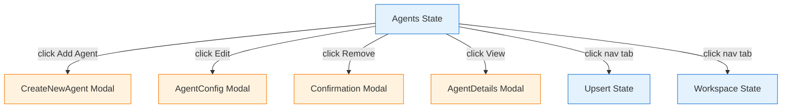

```mermaid
flowchart TD
  AGENTS[Agents State] -->|click Add Agent| MODAL1[CreateNewAgent Modal]
  AGENTS -->|click Edit| MODAL2[AgentConfig Modal]
  
  AGENTS -->|click Remove| MODAL3[Confirmation Modal]
  
  
  AGENTS -->|click View| MODAL4[AgentDetails Modal]
  
  AGENTS -->|click nav tab| UPSERT[Upsert State]
  AGENTS -->|click nav tab| WORKSPACE[Workspace State]

  classDef state fill:#e3f2fd,stroke:#1976d2
  classDef modal fill:#fff3e0,stroke:#f57c00

  class AGENTS,UPSERT,WORKSPACE state
  class MODAL1,MODAL2,MODAL3,MODAL4 modal
```
