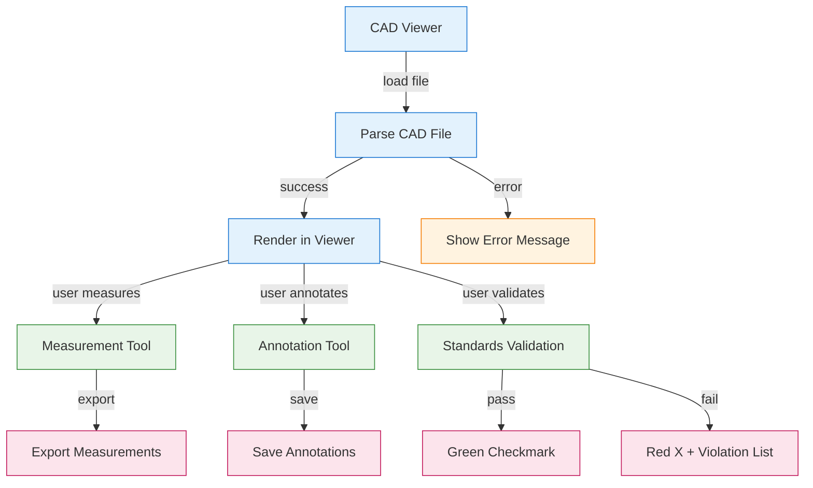

```mermaid
flowchart TD
  CAD[CAD Viewer] -->|load file| PARSE[Parse CAD File]
  PARSE -->|success| RENDER[Render in Viewer]
  PARSE -->|error| ERROR[Show Error Message]
  RENDER -->|user measures| MEASURE[Measurement Tool]
  RENDER -->|user annotates| ANNOTATE[Annotation Tool]
  
  RENDER -->|user validates| VALIDATE[Standards Validation]
  VALIDATE -->|pass| PASS[Green Checkmark]
  VALIDATE -->|fail| FAIL[Red X + Violation List]
  
  
  MEASURE -->|export| EXPORT[Export Measurements]
  
  ANNOTATE -->|save| SAVE[Save Annotations]

  classDef cad fill:#e3f2fd,stroke:#1976d2
  classDef parse fill:#fff3e0,stroke:#f57c00
  classDef tool fill:#e8f5e8,stroke:#388e3c
  classDef result fill:#fce4ec,stroke:#c2185b

  class CAD,PARSE,RENDER cad
  class ERROR parse
  class MEASURE,ANNOTATE,VALIDATE tool
  class PASS,FAIL,EXPORT,SAVE result
```
