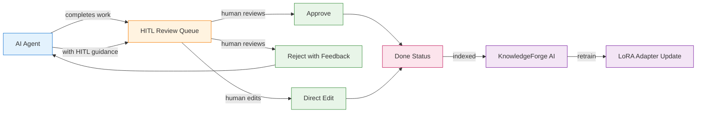

```mermaid
flowchart LR
  AGENT[AI Agent] -->|completes work| QUEUE[HITL Review Queue]
  QUEUE -->|human reviews| APPROVE[Approve]
  QUEUE -->|human reviews| REJECT[Reject with Feedback]
  QUEUE -->|human edits| EDIT[Direct Edit]
  APPROVE --> DONE[Done Status]
  REJECT --> AGENT
  EDIT --> DONE
  AGENT -->|with HITL guidance| QUEUE
  
  DONE -->|indexed| KNOWLEDGE[KnowledgeForge AI]
  KNOWLEDGE -->|retrain| LORA[LoRA Adapter Update]
  

  classDef agent fill:#e3f2fd,stroke:#1976d2
  classDef queue fill:#fff3e0,stroke:#f57c00
  classDef action fill:#e8f5e8,stroke:#388e3c
  classDef done fill:#fce4ec,stroke:#c2185b
  classDef knowledge fill:#f3e5f5,stroke:#7b1fa2

  class AGENT agent
  class QUEUE queue
  class APPROVE,REJECT,EDIT action
  class DONE done
  class KNOWLEDGE,LORA knowledge
```
