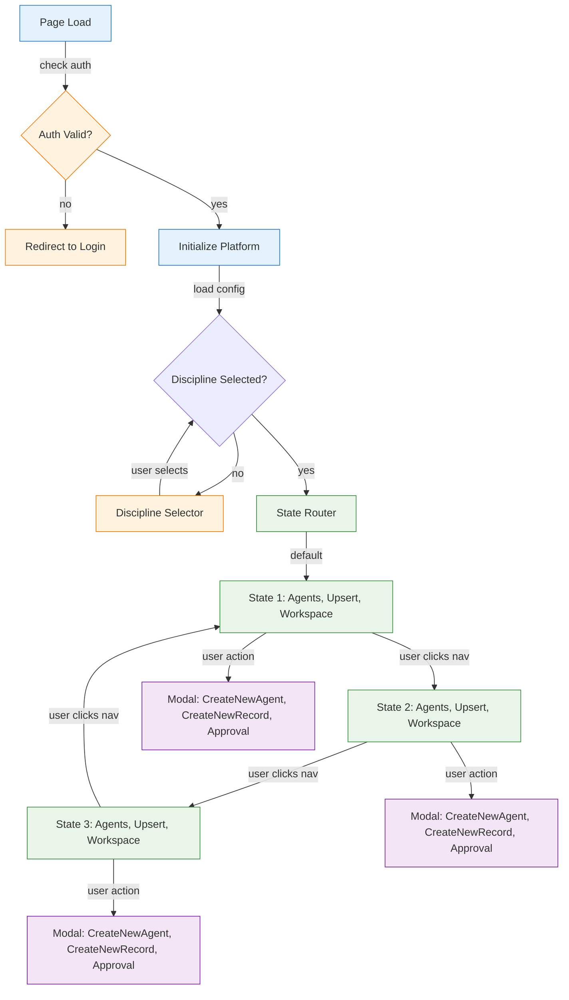

```mermaid
flowchart TD
  LOAD[Page Load] -->|check auth| AUTH{Auth Valid?}
  AUTH -->|no| LOGIN[Redirect to Login]
  AUTH -->|yes| INIT[Initialize Platform]
  INIT -->|load config| DISC{Discipline Selected?}
  DISC -->|no| SELECTOR[Discipline Selector]
  SELECTOR -->|user selects| DISC
  DISC -->|yes| STATE[State Router]
  STATE -->|default| S1[State 1: Agents, Upsert, Workspace]
  S1 -->|user clicks nav| S2[State 2: Agents, Upsert, Workspace]
  S2 -->|user clicks nav| S3[State 3: Agents, Upsert, Workspace]
  S3 -->|user clicks nav| S1
  S1 -->|user action| M1[Modal: CreateNewAgent, CreateNewRecord, Approval]
  S2 -->|user action| M2[Modal: CreateNewAgent, CreateNewRecord, Approval]
  S3 -->|user action| M3[Modal: CreateNewAgent, CreateNewRecord, Approval]

  classDef load fill:#e3f2fd,stroke:#1976d2
  classDef auth fill:#fff3e0,stroke:#f57c00
  classDef state fill:#e8f5e8,stroke:#388e3c
  classDef modal fill:#f3e5f5,stroke:#7b1fa2

  class LOAD,INIT load
  class AUTH,LOGIN,SELECTOR auth
  class STATE,S1,S2,S3 state
  class M1,M2,M3 modal
```
