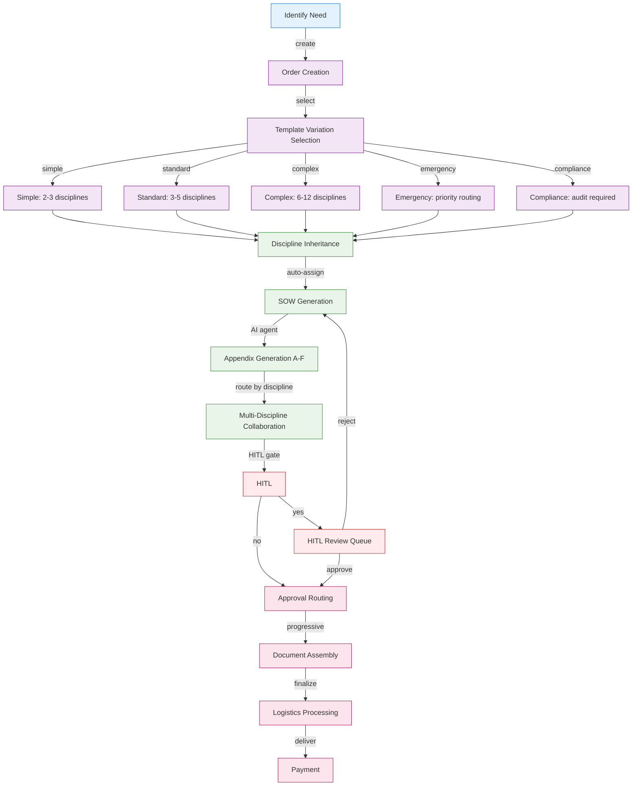

```mermaid
flowchart TD
  NEED[Identify Need] -->|create| ORDER[Order Creation]
  ORDER -->|select| TEMPLATE[Template Variation Selection]
  TEMPLATE -->|simple| SIMPLE[Simple: 2-3 disciplines]
  TEMPLATE -->|standard| STANDARD[Standard: 3-5 disciplines]
  TEMPLATE -->|complex| COMPLEX[Complex: 6-12 disciplines]
  TEMPLATE -->|emergency| EMERGENCY[Emergency: priority routing]
  TEMPLATE -->|compliance| COMPLIANCE[Compliance: audit required]
  SIMPLE --> DISCIPLINE[Discipline Inheritance]
  STANDARD --> DISCIPLINE
  COMPLEX --> DISCIPLINE
  EMERGENCY --> DISCIPLINE
  COMPLIANCE --> DISCIPLINE
  DISCIPLINE -->|auto-assign| SOW[SOW Generation]
  SOW -->|AI agent| APPENDIX[Appendix Generation A-F]
  APPENDIX -->|route by discipline| COLLAB[Multi-Discipline Collaboration]
  
  COLLAB -->|HITL gate| HITL
  HITL -->|yes| REVIEW[HITL Review Queue]
  HITL -->|no| APPROVAL[Approval Routing]
  REVIEW -->|approve| APPROVAL
  REVIEW -->|reject| SOW
  
  APPROVAL -->|progressive| ASSEMBLY[Document Assembly]
  ASSEMBLY -->|finalize| LOGISTICS[Logistics Processing]
  
  LOGISTICS -->|deliver| PAYMENT[Payment]
  

  classDef need fill:#e3f2fd,stroke:#1976d2
  classDef create fill:#f3e5f5,stroke:#7b1fa2
  classDef template fill:#fff3e0,stroke:#f57c00
  classDef work fill:#e8f5e8,stroke:#388e3c
  classDef review fill:#ffebee,stroke:#d32f2f
  classDef final fill:#fce4ec,stroke:#c2185b

  class NEED need
  class ORDER,TEMPLATE,SIMPLE,STANDARD,COMPLEX,EMERGENCY,COMPLIANCE create
  class DISCIPLINE,SOW,APPENDIX,COLLAB work
  class HITL,REVIEW review
  class APPROVAL,ASSEMBLY,LOGISTICS,PAYMENT final
```
