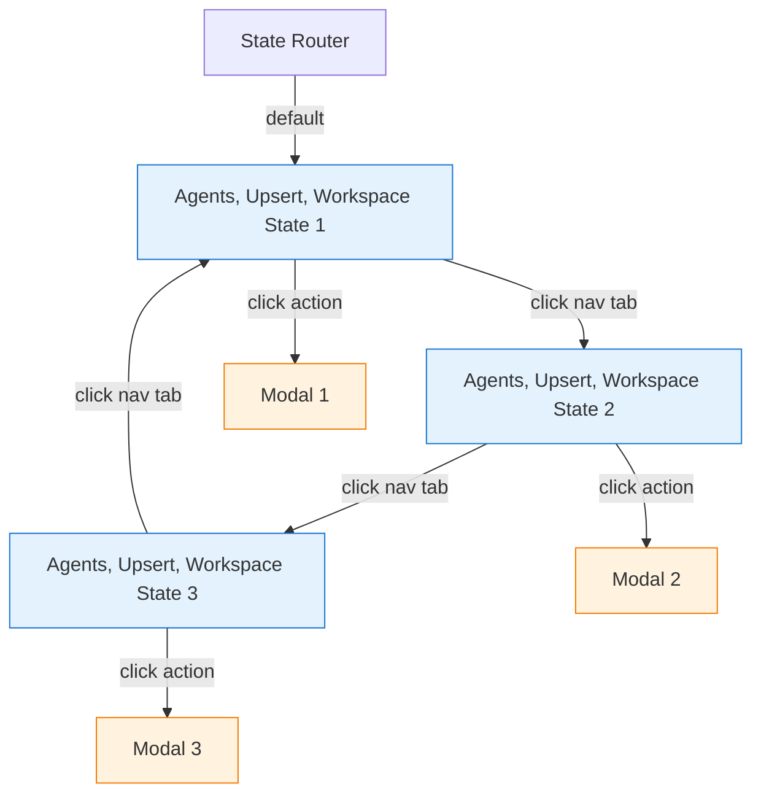

```mermaid
flowchart TD
  STATE[State Router] -->|default| S1[Agents, Upsert, Workspace State 1]
  S1 -->|click nav tab| S2[Agents, Upsert, Workspace State 2]
  S2 -->|click nav tab| S3[Agents, Upsert, Workspace State 3]
  S3 -->|click nav tab| S1
  S1 -->|click action| MODAL1[Modal 1]
  S2 -->|click action| MODAL2[Modal 2]
  S3 -->|click action| MODAL3[Modal 3]

  classDef state fill:#e3f2fd,stroke:#1976d2
  classDef modal fill:#fff3e0,stroke:#f57c00

  class S1,S2,S3 state
  class MODAL1,MODAL2,MODAL3 modal
```
