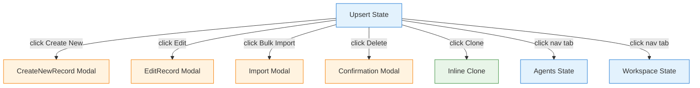

```mermaid
flowchart TD
  UPSERT[Upsert State] -->|click Create New| MODAL1[CreateNewRecord Modal]
  UPSERT -->|click Edit| MODAL2[EditRecord Modal]
  
  UPSERT -->|click Bulk Import| MODAL3[Import Modal]
  
  UPSERT -->|click Delete| MODAL4[Confirmation Modal]
  UPSERT -->|click Clone| INLINE[Inline Clone]
  UPSERT -->|click nav tab| AGENTS[Agents State]
  UPSERT -->|click nav tab| WORKSPACE[Workspace State]

  classDef state fill:#e3f2fd,stroke:#1976d2
  classDef modal fill:#fff3e0,stroke:#f57c00
  classDef inline fill:#e8f5e8,stroke:#388e3c

  class UPSERT,AGENTS,WORKSPACE state
  class MODAL1,MODAL2,MODAL3,MODAL4 modal
  class INLINE inline
```
