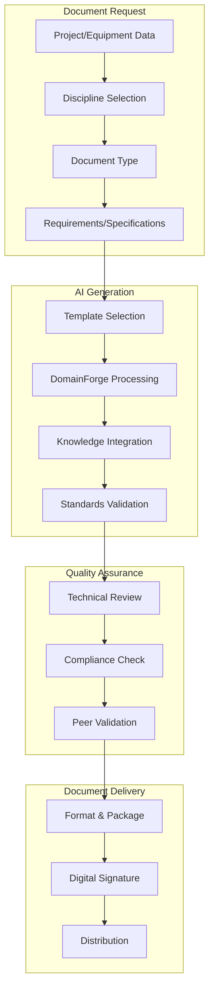

# Cross-Discipline Engineering Platform Implementation Plan

## Executive Summary

This plan outlines the transformation of discipline-specific engineering workflows into a unified, cross-discipline engineering platform that serves all engineering disciplines within the DevForge AI ecosystem. The platform will integrate with KnowledgeForge AI, LearningForge AI, DomainForge AI, and DevForge AI to provide comprehensive engineering design capabilities across civil, structural, MEP, and architectural engineering disciplines.

## Vision

Create a unified engineering platform that:
- **Standardizes** engineering workflows across all disciplines
- **Integrates** with multiple CAD/BIM systems through DevForge AI
- **Leverages** institutional knowledge from KnowledgeForge AI
- **Enables** continuous learning through LearningForge AI
- **Provides** domain expertise via DomainForge AI
- **Maintains** engineering integrity and audit trails

## Current State Analysis

### Existing Engineering Systems
- **DevForge AI**: Primary engineering development and CAD integration
- **Existing Engineering Pages**: Engineering discipline pages already created with accordion navigation
- **CAD Integration**: Limited to specific systems per discipline
- **Knowledge Management**: Fragmented institutional knowledge

### Accordion Integration Status
- **Template System**: Server-side accordion templates in `accordion-sections-routes.js`
- **3-Tier Fallback**: Server API → Client fallback → Emergency fallback
- **Existing Engineering Sections**: Accordion navigation already includes engineering discipline links
- **Missing**: Engineering platform integration with existing accordion structure

### Platform Architecture Requirements
- **Unified UI Framework**: Consistent interface across all engineering disciplines
- **Modular Component System**: Discipline-specific adaptations within shared framework
- **CAD/BIM Integration**: Multi-system support through DevForge AI agents
- **Knowledge Integration**: AI-powered engineering assistance and validation

## Implementation Phases

### Phase 1: Platform Architecture Foundation (Weeks 1-2)

#### 1.1 Shared Engineering Component Extraction
**Objective**: Extract engineering UI components into reusable shared modules

**Deliverables**:
- `client/src/shared/engineering/components/` - Shared engineering components
- `client/src/shared/engineering/services/` - Discipline-agnostic engineering services
- `client/src/shared/engineering/hooks/` - Shared engineering hooks
- `client/src/shared/engineering/utils/` - Engineering utilities

**Technical Details**:
```javascript
// Shared engineering component structure
client/src/shared/engineering/
├── components/
│   ├── CADModelViewer.js          // 3D model visualization interface
│   ├── EngineeringValidation.js    // Real-time engineering validation
│   ├── StandardsSelector.js        // Engineering standards selection
│   ├── AnalysisResults.js          // FEA/thermal/acoustic analysis display
│   └── EngineeringAuditTrail.js    // Engineering audit trail display
├── services/
│   ├── cadService.js               // CAD model operations
│   ├── analysisService.js          // Engineering analysis operations
│   ├── validationService.js        // Standards validation
│   └── auditService.js             // Audit trail management
├── hooks/
│   ├── useEngineeringModel.js      // Engineering model state management
│   ├── useAnalysis.js              // Analysis operations
│   └── useStandards.js             // Standards configuration
└── utils/
    ├── cadUtils.js                 // CAD operations utilities
    ├── analysisUtils.js            // Analysis calculation utilities
    └── standardsUtils.js           // Standards utilities
```

#### 1.2 Discipline Configuration System
**Objective**: Create configurable system for discipline-specific engineering adaptations

**Configuration Structure**:
```javascript
// Discipline configuration example
const disciplineConfigs = {
  '00850': { // Civil Engineering
    name: 'Civil Engineering',
    standards: ['SANS-10160', 'BS-8110', 'ACI-318'],
    analysisTypes: ['structural', 'geotechnical', 'hydraulic'],
    cadSystems: ['civil3d', 'microstation', 'autocad'],
    templates: ['foundation-design', 'retaining-wall'],
    validationRules: civilValidationRules
  },
  '00860': { // Electrical Engineering
    name: 'Electrical Engineering',
    standards: ['SANS-10142', 'IEC-60364', 'NECA-Standards'],
    analysisTypes: ['power-flow', 'short-circuit', 'harmonic'],
    cadSystems: ['autocad', 'revit', 'sketchup'],
    templates: ['power-distribution', 'lighting-layout'],
    validationRules: electricalValidationRules
  }
  // ... additional disciplines
};
```

#### 1.3 Database Schema Extension
**Objective**: Extend engineering database to support cross-discipline design data

**Schema Changes**:
```sql
-- Create new cross-discipline engineering tables
CREATE TABLE a_engineering_models (
  id UUID PRIMARY KEY DEFAULT gen_random_uuid(),
  discipline_code VARCHAR(10) NOT NULL,
  project_id UUID REFERENCES projects(id),
  model_name VARCHAR(255) NOT NULL,

  -- Model metadata
  model_type VARCHAR(50), -- 'structural', 'mep', 'architectural', etc.
  cad_system VARCHAR(50), -- 'autocad', 'revit', 'solidworks', etc.
  file_path TEXT,
  version INTEGER DEFAULT 1,

  -- Engineering data
  geometry_data JSONB, -- 3D model geometry
  material_properties JSONB,
  load_conditions JSONB,
  analysis_results JSONB,

  -- Standards and validation
  standards_version VARCHAR(20),
  validation_status VARCHAR(20) DEFAULT 'pending',
  compliance_errors JSONB,

  -- Audit and tracking
  created_by UUID REFERENCES users(id),
  created_at TIMESTAMP WITH TIME ZONE DEFAULT NOW(),
  updated_by UUID REFERENCES users(id),
  updated_at TIMESTAMP WITH TIME ZONE DEFAULT NOW(),

  -- Cross-discipline references
  related_models UUID[],
  discipline_dependencies JSONB
);

-- Create analysis results table
CREATE TABLE a_engineering_analysis (
  id UUID PRIMARY KEY DEFAULT gen_random_uuid(),
  model_id UUID REFERENCES a_engineering_models(id) ON DELETE CASCADE,

  -- Analysis metadata
  analysis_type VARCHAR(50) NOT NULL, -- 'fea', 'thermal', 'fluid', etc.
  analysis_engine VARCHAR(50), -- 'ansys', 'abaqus', 'custom', etc.
  status VARCHAR(20) DEFAULT 'pending',

  -- Analysis parameters
  input_parameters JSONB,
  boundary_conditions JSONB,

  -- Results
  results_data JSONB,
  result_summary TEXT,
  convergence_status VARCHAR(20),

  -- Performance metrics
  computation_time INTERVAL,
  memory_usage BIGINT,
  accuracy_metrics JSONB,

  -- Metadata
  created_at TIMESTAMP WITH TIME ZONE DEFAULT NOW(),
  completed_at TIMESTAMP WITH TIME ZONE
);

-- Performance indexes
CREATE INDEX idx_engineering_discipline ON a_engineering_models(discipline_code);
CREATE INDEX idx_engineering_project ON a_engineering_models(project_id);
CREATE INDEX idx_engineering_type ON a_engineering_models(model_type);
CREATE INDEX idx_engineering_cad ON a_engineering_models(cad_system);
CREATE INDEX idx_analysis_model ON a_engineering_analysis(model_id);
CREATE INDEX idx_analysis_type ON a_engineering_analysis(analysis_type);
CREATE INDEX idx_analysis_status ON a_engineering_analysis(status);
```

### Phase 2: Knowledge Integration (Weeks 3-4)

#### 2.1 KnowledgeForge AI Integration
**Objective**: Leverage institutional memory for engineering standards and best practices

**Integration Points**:
- **Standards Indexing**: Automatic indexing of engineering standards and codes
- **Design Validation**: Automated compliance checking against institutional knowledge
- **Failure Learning**: Learning from design errors and corrections
- **Workflow Guardians**: Automated monitoring of engineering processes

#### 2.2 LearningForge AI Integration
**Objective**: Enable continuous improvement through AI-powered learning

**Integration Points**:
- **Design Performance Analytics**: Track design accuracy and efficiency
- **Adaptive Standards**: Learn and adapt design standards based on usage patterns
- **User Behavior Learning**: Optimize CAD interfaces based on user interactions
- **Predictive Design**: Anticipate and prevent design errors

#### 2.3 DomainForge AI Integration
**Objective**: Provide domain expertise for complex engineering designs

**Integration Points**:
- **Technical Documentation**: Generate engineering design documentation
- **Algorithm Development**: Create engineering calculation and analysis algorithms
- **Interface Design**: Create discipline-specific engineering interfaces
- **System Architecture**: Design optimal engineering workflows

### Phase 3: Multi-CAD/BIM System Integration (Weeks 5-8)

#### 3.1 DevForge AI CAD Ecosystem
**Objective**: Comprehensive CAD/BIM system integration supporting multiple platforms

**Supported CAD/BIM Systems**:
- **AutoCAD** - 2D drafting and legacy support
- **Revit** - BIM modeling and parametric design
- **Civil 3D** - Civil engineering specialization
- **Plant 3D** - Process piping and equipment
- **Inventor** - Mechanical design and simulation
- **Fusion 360** - Cloud-based design collaboration
- **Navisworks** - Model coordination and clash detection

**Integration Architecture**:
```javascript
// Unified CAD/BIM integration framework
class CADEngineeringIntegration {
  constructor() {
    this.cadSystems = {
      'autocad': autocadEngine,
      'revit': revitEngine,
      'civil3d': civil3dEngine,
      'plant3d': plant3dEngine,
      'inventor': inventorEngine,
      'fusion360': fusion360Engine,
      'navisworks': navisworksEngine
    };
  }

  async processEngineeringModel(file, cadSystem, discipline) {
    const cadEngine = this.cadSystems[cadSystem.toLowerCase()];
    if (!cadEngine) {
      throw new Error(`Unsupported CAD system: ${cadSystem}`);
    }

    const processedData = await cadEngine.processModel(file, {
      discipline: discipline,
      extractGeometry: true,
      includeMetadata: true,
      performAnalysis: true,
      returnFormat: 'engineering-data'
    });

    return this.normalizeCADEngineeringResponse(processedData, cadSystem);
  }

  async runAnalysis(modelId, analysisType, parameters) {
    const model = await this.getModel(modelId);
    const cadEngine = this.cadSystems[model.cadSystem.toLowerCase()];

    const analysisResults = await cadEngine.runAnalysis(model, analysisType, parameters);
    return this.processAnalysisResults(analysisResults, analysisType);
  }

  async validateDesign(modelId, discipline, standards) {
    const model = await this.getModel(modelId);
    const cadEngine = this.cadSystems[model.cadSystem.toLowerCase()];

    const validationResults = await cadEngine.validateAgainstStandards(model, discipline, standards);
    return this.processValidationResults(validationResults, standards);
  }
}
```

#### 3.2 Discipline-Specific CAD Agents
**Objective**: Specialized agents for each CAD system's engineering capabilities

**Agent Capabilities Matrix**:

| CAD/BIM System | Primary Discipline | Key Engineering Features | File Types |
|----------------|-------------------|--------------------------|------------|
| **AutoCAD** | All | 2D/3D drafting, legacy support | DWG, DXF |
| **Revit** | Architecture/Structure | BIM modeling, parametric families | RVT, RFA |
| **Civil 3D** | Civil | Corridors, surfaces, pipe networks | DWG (specialized) |
| **Plant 3D** | MEP/Process | Piping design, equipment modeling | DWG (specialized) |
| **Inventor** | Mechanical | Stress analysis, motion simulation | IPT, IAM |
| **Fusion 360** | Mechanical | Cloud collaboration, generative design | F3D |
| **Navisworks** | Coordination | Clash detection, 4D simulation | NWD, NWF |

### Phase 4: Accordion Integration (Weeks 7-8)

#### 4.1 Accordion Template Updates
**Objective**: Integrate engineering platform with existing discipline accordions and pages

**Existing Pages Integration**:
- **Scope of Work Pages**: Existing discipline-specific scope of work documentation
- **Technical Specifications Pages**: Existing technical specification templates and standards

**Template Structure**:
```javascript
// Updated accordion template with engineering sections
const ENGINEERING_SECTIONS = [
  {
    id: 'accordion-button-00850-engineering',
    title: 'Civil Engineering',
    links: [
      { title: 'Civil Engineering Platform', url: '/engineering?discipline=00850' },
      { title: 'Scope of Work - Civil', url: '/disciplines/00850/scope-of-work' },
      { title: 'Technical Specifications - Civil', url: '/disciplines/00850/technical-specifications' },
      { title: 'Structural Analysis', url: '/engineering/structural' },
      { title: 'Infrastructure Design', url: '/engineering/infrastructure' }
    ]
  },
  {
    id: 'accordion-button-00860-engineering',
    title: 'Electrical Engineering',
    links: [
      { title: 'Electrical Engineering Platform', url: '/engineering?discipline=00860' },
      { title: 'Scope of Work - Electrical', url: '/disciplines/00860/scope-of-work' },
      { title: 'Technical Specifications - Electrical', url: '/disciplines/00860/technical-specifications' },
      { title: 'Power Systems', url: '/engineering/power' },
      { title: 'Control Systems', url: '/engineering/controls' }
    ]
  },
  {
    id: 'accordion-button-00870-engineering',
    title: 'Mechanical Engineering',
    links: [
      { title: 'Mechanical Engineering Platform', url: '/engineering?discipline=00870' },
      { title: 'Scope of Work - Mechanical', url: '/disciplines/00870/scope-of-work' },
      { title: 'Technical Specifications - Mechanical', url: '/disciplines/00870/technical-specifications' },
      { title: 'HVAC Systems', url: '/engineering/hvac' },
      { title: 'Plumbing Systems', url: '/engineering/plumbing' }
    ]
  },
  {
    id: 'accordion-button-00872-engineering',
    title: 'Structural Engineering',
    links: [
      { title: 'Structural Engineering Platform', url: '/engineering?discipline=00872' },
      { title: 'Scope of Work - Structural', url: '/disciplines/00872/scope-of-work' },
      { title: 'Technical Specifications - Structural', url: '/disciplines/00872/technical-specifications' },
      { title: 'Steel Design', url: '/engineering/steel' },
      { title: 'Concrete Design', url: '/engineering/concrete' }
    ]
  },
  {
    id: 'accordion-button-00825-engineering',
    title: 'Architectural Engineering',
    links: [
      { title: 'Architectural Engineering Platform', url: '/engineering?discipline=00825' },
      { title: 'Scope of Work - Architectural', url: '/disciplines/00825/scope-of-work' },
      { title: 'Technical Specifications - Architectural', url: '/disciplines/00825/technical-specifications' },
      { title: 'Building Design', url: '/engineering/architectural' },
      { title: 'Space Planning', url: '/engineering/spaces' }
    ]
  },
  {
    id: 'accordion-button-00835-engineering',
    title: 'Chemical Engineering',
    links: [
      { title: 'Chemical Engineering Platform', url: '/engineering?discipline=00835' },
      { title: 'Scope of Work - Chemical', url: '/disciplines/00835/scope-of-work' },
      { title: 'Technical Specifications - Chemical', url: '/disciplines/00835/technical-specifications' },
      { title: 'Process Design', url: '/engineering/chemical' },
      { title: 'Safety Systems', url: '/engineering/safety' }
    ]
  },
  {
    id: 'accordion-button-00855-engineering',
    title: 'Geotechnical Engineering',
    links: [
      { title: 'Geotechnical Engineering Platform', url: '/engineering?discipline=00855' },
      { title: 'Scope of Work - Geotechnical', url: '/disciplines/00855/scope-of-work' },
      { title: 'Technical Specifications - Geotechnical', url: '/disciplines/00855/technical-specifications' },
      { title: 'Soil Analysis', url: '/engineering/geotechnical' },
      { title: 'Foundation Design', url: '/engineering/foundations' }
    ]
  },
  {
    id: 'accordion-button-00871-engineering',
    title: 'Process Engineering',
    links: [
      { title: 'Process Engineering Platform', url: '/engineering?discipline=00871' },
      { title: 'Scope of Work - Process', url: '/disciplines/00871/scope-of-work' },
      { title: 'Technical Specifications - Process', url: '/disciplines/00871/technical-specifications' },
      { title: 'Process Flow', url: '/engineering/process' },
      { title: 'Equipment Sizing', url: '/engineering/sizing' }
    ]
  },
  {
    id: 'accordion-button-01000-engineering',
    title: 'Environmental Engineering',
    links: [
      { title: 'Environmental Engineering Platform', url: '/engineering?discipline=01000' },
      { title: 'Scope of Work - Environmental', url: '/disciplines/01000/scope-of-work' },
      { title: 'Technical Specifications - Environmental', url: '/disciplines/01000/technical-specifications' },
      { title: 'Impact Assessment', url: '/engineering/environmental' },
      { title: 'Compliance Monitoring', url: '/engineering/compliance' }
    ]
  },
  {
    id: 'accordion-button-03000-engineering',
    title: 'Landscaping Engineering',
    links: [
      { title: 'Landscaping Engineering Platform', url: '/engineering?discipline=03000' },
      { title: 'Scope of Work - Landscaping', url: '/disciplines/03000/scope-of-work' },
      { title: 'Technical Specifications - Landscaping', url: '/disciplines/03000/technical-specifications' },
      { title: 'Landscape Design', url: '/engineering/landscaping' },
      { title: 'Irrigation Systems', url: '/engineering/irrigation' }
    ]
  }
];
```

#### 4.2 Shared Routing System
**Objective**: Create unified routing for engineering platform across disciplines

**Implementation**:
```javascript
// Shared engineering routing
<Route path="/engineering" element={<EngineeringPlatform />}>
  <Route index element={<DisciplineSelection />} />
  <Route path=":discipline" element={<EngineeringInterface />} />
  <Route path=":discipline/:engineeringType" element={<SpecializedEngineering />} />
  <Route path="analysis/:analysisId" element={<AnalysisResults />} />
</Route>
```

### Phase 5: Discipline-Specific Engineering Adaptations (Weeks 9-12)

#### 5.1 Civil Engineering (00850)
**Specializations**:
- Structural analysis and design
- Geotechnical engineering
- Transportation infrastructure
- Water resources engineering
- Construction engineering

**Document Generation**:
- Geotechnical investigation reports
- Foundation design specifications
- Structural calculations packages
- Construction method statements
- Material specifications and data sheets

#### 5.2 Structural Engineering (00872)
**Specializations**:
- Steel structure design and analysis
- Concrete structure design
- Foundation engineering
- Seismic design
- Wind load analysis

**Document Generation**:
- Structural design reports
- Steel connection details and schedules
- Concrete mix designs and specifications
- Foundation design calculations
- Seismic and wind load analysis reports

#### 5.3 Mechanical Engineering (00870)
**Specializations**:
- HVAC system design
- Plumbing and fire protection
- Energy systems
- Building automation
- Equipment selection and specification

**Document Generation**:
- HVAC system specifications and schedules
- Plumbing and drainage layouts
- Equipment data sheets and specifications
- Energy modeling reports
- Commissioning and testing procedures

#### 5.4 Electrical Engineering (00860)
**Specializations**:
- Power distribution systems
- Lighting design
- Grounding and lightning protection
- Renewable energy systems
- Electrical safety and compliance

**Document Generation**:
- Electrical load calculations
- Cable schedules and specifications
- Lighting design reports
- Earthing system designs
- Electrical safety certificates

#### 5.5 Engineering Document Generation System
**Objective**: AI-powered generation of engineering-specific documents

**Document Types**:
- **Technical Specifications**: Equipment, materials, systems specifications
- **Design Reports**: Analysis results, design calculations, compliance reports
- **Data Sheets**: Equipment performance data, material properties, system capacities
- **Project Documentation**: Method statements, quality plans, risk assessments
- **Compliance Documents**: Certificates, test reports, validation documents

**AI-Powered Generation**:
```javascript
// Engineering document generation system
class EngineeringDocumentGenerator {
  constructor() {
    this.documentTemplates = {
      'civil': civilDocumentTemplates,
      'structural': structuralDocumentTemplates,
      'mechanical': mechanicalDocumentTemplates,
      'electrical': electricalDocumentTemplates
    };
  }

  async generateSpecification(discipline, equipmentType, requirements) {
    const template = this.documentTemplates[discipline][equipmentType];
    const aiGenerated = await domainForge.generateSpecification(template, requirements);
    return this.formatSpecification(aiGenerated, discipline);
  }

  async generateDesignReport(analysisResults, discipline, projectData) {
    const reportTemplate = this.getReportTemplate(discipline, analysisResults.type);
    const aiReport = await domainForge.generateReport(reportTemplate, {
      analysisResults,
      projectData,
      standards: this.getApplicableStandards(discipline)
    });
    return this.finalizeReport(aiReport, discipline);
  }

  async generateDataSheet(equipment, discipline, specifications) {
    const dataSheetTemplate = this.getDataSheetTemplate(discipline, equipment.type);
    const aiDataSheet = await knowledgeForge.generateDataSheet(dataSheetTemplate, {
      equipment,
      specifications,
      complianceData: await this.getComplianceData(discipline, equipment)
    });
    return this.validateDataSheet(aiDataSheet);
  }

  async generateProjectDocuments(projectId, discipline, documentTypes) {
    const projectData = await this.getProjectData(projectId);
    const documents = {};

    for (const docType of documentTypes) {
      documents[docType] = await this.generateDocument(docType, discipline, projectData);
    }

    return this.packageDocuments(documents, projectId);
  }
}
```

**Document Generation Workflow**:


### Phase 6: Testing and Validation (Weeks 13-14)

#### 6.1 Integration Testing
**Objective**: Comprehensive testing of cross-discipline engineering workflows

**Test Scenarios**:
- CAD model upload and processing across all disciplines
- Engineering analysis execution
- Standards validation for each discipline
- Multi-CAD system synchronization
- AI agent integrations

#### 6.2 Performance Testing
**Objective**: Ensure platform performance meets engineering requirements

**Performance Targets**:
- Model upload: < 60 seconds for 100MB CAD files
- Analysis execution: < 30 seconds for FEA on 10,000 elements
- CAD sync: < 15 seconds for bidirectional updates
- UI responsiveness: < 200ms for all interactions

## Knowledge Base Development

### Knowledge Compilation Structure

```
docs-paperclip/disciplines-shared/engineering/knowledge/
├── platform-architecture/
│   ├── shared-components.md
│   ├── discipline-configurations.md
│   └── cad-integration-patterns.md
├── discipline-adaptations/
│   ├── 00850-civil-engineering.md
│   ├── 00860-electrical-engineering.md
│   ├── 00870-mechanical-engineering.md
│   └── 00872-structural-engineering.md
├── ai-integrations/
│   ├── knowledgeforge-ai-integration.md
│   ├── learningforge-ai-integration.md
│   ├── domainforge-ai-integration.md
│   └── devforge-ai-integration.md
├── standards-and-compliance/
│   ├── engineering-standards-overview.md
│   ├── discipline-specific-standards.md
│   └── compliance-validation.md
└── implementation-guides/
    ├── cad-system-integration.md
    ├── analysis-workflows.md
    └── testing-procedures.md
```

## Risk Mitigation

### Technical Risks
1. **Performance Degradation**: Large CAD models causing system slowdowns
   - **Mitigation**: Implement progressive loading and model optimization

2. **Standards Conflicts**: Different disciplines having conflicting engineering standards
   - **Mitigation**: Clear standards precedence rules and validation logic

3. **CAD Compatibility**: Version conflicts between CAD system versions
   - **Mitigation**: Version detection and compatibility matrices

### Integration Risks
1. **AI Agent Coordination**: Multiple AI agents working on same engineering models
   - **Mitigation**: Clear ownership and coordination protocols

2. **Data Consistency**: Maintaining consistency across discipline-specific adaptations
   - **Mitigation**: Shared data models with discipline-specific extensions

## Success Metrics

### Technical Metrics
- **Platform Availability**: 99.9% uptime across all disciplines
- **Model Processing**: < 60 seconds for 100MB CAD files
- **Analysis Accuracy**: > 99% validation accuracy
- **CAD Sync**: < 15 seconds bidirectional synchronization

### User Experience Metrics
- **Design Completion**: > 95% engineering tasks completed successfully
- **User Satisfaction**: > 4.5/5 user satisfaction rating
- **Training Time**: < 4 hours for users to become proficient
- **Error Rate**: < 0.5% design errors

### Business Value Metrics
- **Productivity Increase**: 50% improvement in engineering task completion time
- **Standards Compliance**: 100% adherence to industry standards
- **Cross-Discipline Collaboration**: 70% increase in cross-discipline design sharing
- **Audit Trail Coverage**: 100% of designs with complete audit trails

## Implementation Timeline

| Phase | Duration | Key Deliverables | Dependencies |
|-------|----------|------------------|--------------|
| Platform Architecture | Weeks 1-2 | Shared components, discipline configs | Existing CAD integrations |
| Knowledge Integration | Weeks 3-4 | AI agent integrations | Knowledge companies |
| Multi-CAD Integration | Weeks 5-8 | 7 CAD/BIM system integrations | DevForge AI |
| Accordion Integration | Weeks 9-10 | Accordion updates | Platform architecture |
| Discipline Adaptations | Weeks 11-14 | Discipline-specific features | All previous phases |
| Testing & Validation | Weeks 15-16 | UAT and performance testing | All features complete |

## Resource Requirements

### Development Team
- **Lead Architect**: 1 (Platform architecture and integration)
- **Frontend Developers**: 2 (UI components and discipline adaptations)
- **Backend Developers**: 2 (API development and database extensions)
- **AI Integration Specialists**: 1 (Knowledge/Learning/DomainForge AI integration)
- **CAD Integration Specialists**: 2 (Multi-CAD/BIM system integration - DevForge AI)
- **QA/Test Engineers**: 1 (Cross-discipline testing and validation)

### AI Agent Resources
- **KnowledgeForge AI**: Institutional memory and design validation
- **LearningForge AI**: Continuous learning and design optimization
- **DomainForge AI**: Technical documentation and engineering algorithms
- **DevForge AI**: Multi-CAD/BIM system integration

## Conclusion

This implementation plan transforms discipline-specific engineering workflows into a comprehensive, cross-discipline engineering platform that leverages the full capabilities of the Paperclip AI ecosystem. By integrating with KnowledgeForge AI, LearningForge AI, DomainForge AI, and DevForge AI, the platform will provide unprecedented engineering design capabilities across all engineering disciplines while maintaining standards compliance and auditability.

---

**Document Information**
- **Version**: 1.0
- **Date**: 2026-04-20
- **Author**: Cross-Discipline Engineering Platform Team
- **Reviewers**: DevForge AI, KnowledgeForge AI, LearningForge AI, DomainForge AI
- **Approval**: Paperclip Architecture Review Board