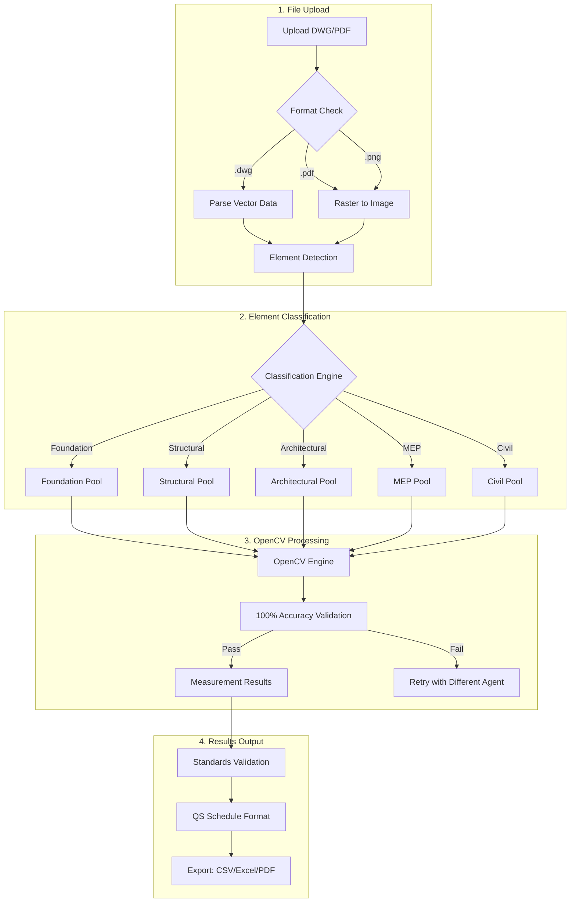
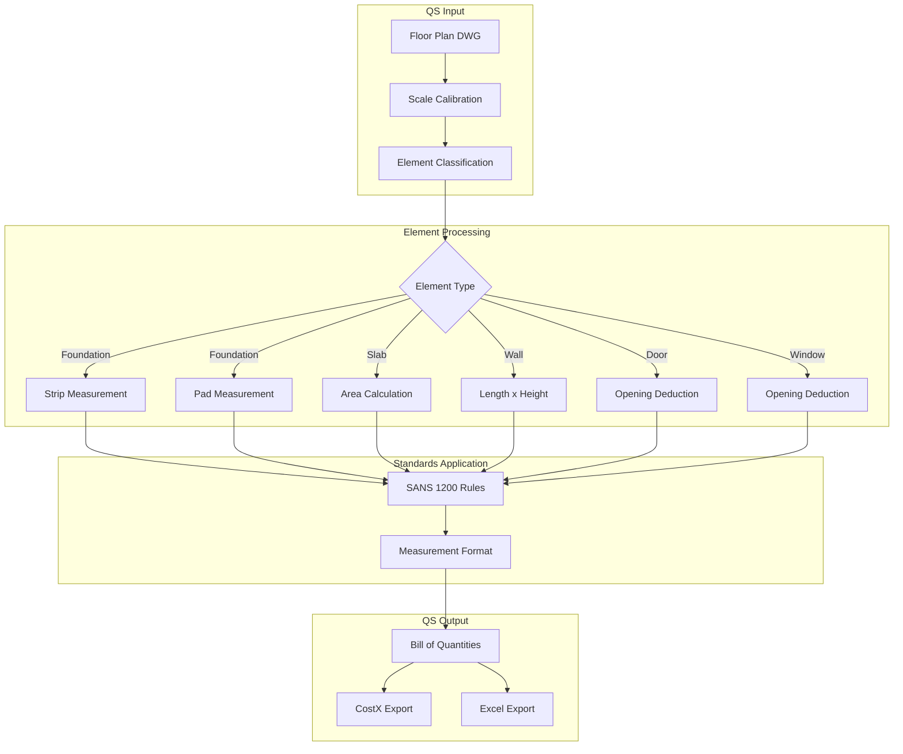
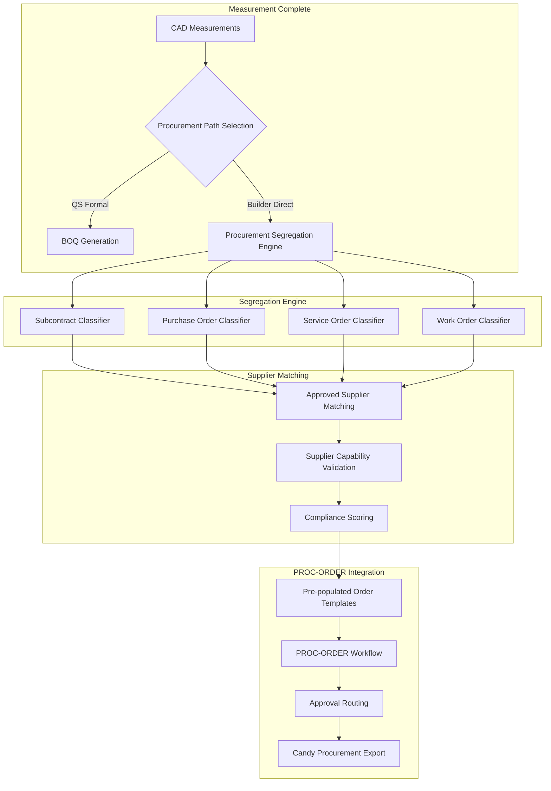
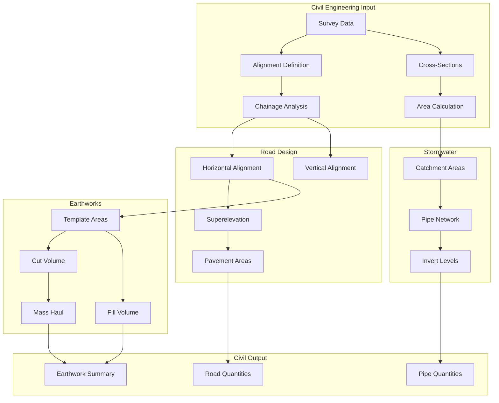

# 02025-Measurement Cross-Discipline Workflows Catalog

## Overview

This catalog documents all measurement workflows available through the IntegrateForge AI platform, covering multi-discipline DWG measurement with 100% accuracy guarantee. The platform now includes comprehensive builder procurement segregation capabilities for direct material procurement and integration with the PROC-ORDER workflow system.

## Workflow Categories

### 1. Core Measurement Workflows

| Workflow ID | Name | Discipline | Description |
|------------|------|------------|-------------|
| MEAS-001 | DWG Upload & Classification | All | Upload drawings and classify elements |
| MEAS-002 | OpenCV Processing | All | Process with 100% accuracy |
| MEAS-003 | Results Export | All | Export to CSV/Excel/PDF |
| MEAS-004 | Standards Validation | QS | Validate against QS standards |

### 2. Quantity Surveying Workflows

| Workflow ID | Name | Description |
|------------|------|-------------|
| QS-MEAS-001 | Foundation Measurement | Strip, pad, raft, pile foundations |
| QS-MEAS-002 | Structural Measurement | Columns, beams, slabs, walls |
| QS-MEAS-003 | Architectural Measurement | Doors, windows, finishes |
| QS-MEAS-004 | Finishes Schedule | Paint, flooring, ceiling, tile |
| QS-MEAS-005 | MEP Measurement | Electrical, plumbing, HVAC |

### 2.1 Builder Procurement Segregation Workflows

| Workflow ID | Name | Description |
|------------|------|-------------|
| BUILDER-MEAS-001 | Subcontract Classification | Segregate specialized trade work (electrical, plumbing, HVAC) |
| BUILDER-MEAS-002 | Purchase Order Generation | Materials and equipment procurement classification |
| BUILDER-MEAS-003 | Service Order Generation | Testing, maintenance, and inspection services |
| BUILDER-MEAS-004 | Work Order Generation | Internal labor and construction task management |
| BUILDER-MEAS-005 | Supplier Capability Matching | Match requirements against approved supplier lists |
| BUILDER-MEAS-006 | Candy Integration | Direct export to Candy procurement system |
| BUILDER-MEAS-007 | Budget Variance Monitoring | Real-time budget tracking and alerts |
| BUILDER-MEAS-008 | Procurement Approval Routing | Integration with PROC-ORDER approval workflows |

### 3. Civil Engineering Workflows

| Workflow ID | Name | Description |
|------------|------|-------------|
| CIV-MEAS-001 | Road Alignment | Centerline, curves, superelevation |
| CIV-MEAS-002 | Pavement Layers | Asphalt, concrete, sub-base |
| CIV-MEAS-003 | Stormwater Network | Pipes, catchments, manholes |
| CIV-MEAS-004 | Earthworks | Cut, fill, mass haul |
| CIV-MEAS-005 | Utility Corridors | Duct banks, cable routes |

### 4. MEP Workflows

| Workflow ID | Name | Description |
|------------|------|-------------|
| MEP-MEAS-001 | HVAC Duct | Rectangular, round, oval ducts |
| MEP-MEAS-002 | Piping Systems | Supply, return, waste, vent |
| MEP-MEAS-003 | Electrical Conduit | Power, lighting, data |
| MEP-MEAS-004 | Equipment Layout | Plant rooms, risers |

### 5. Structural Workflows

| Workflow ID | Name | Description |
|------------|------|-------------|
| STR-MEAS-001 | Concrete Elements | Beams, columns, walls |
| STR-MEAS-002 | Steel Elements | Columns, beams, connections |
| STR-MEAS-003 | Foundation Systems | Piles, pile caps, ground beams |

## Dual-Path Procurement Architecture

### Traditional Formal Path (QS)

```
CAD Drawings -> QS Measurement -> ASAQS Standards -> BOQ Generation -> Tender Documentation -> Procurement Orders
     |               |                 |                  |                    |                    |
 Standards      Quantity Survey    Compliance        Contract             01900 PROC-ORDER      Candy
 Validation     Professional       Checking         Tender               Workflows            Integration
```

### New Builder Direct Path

```
CAD Drawings -> Builder Measurement -> Direct Extraction -> Procurement Segregation -> Order Generation -> Material Delivery -> Construction
     |               |                      |                     |                     |                   |                    |
 MeasureForge    Quantity Extraction    Candy Integration    Subcontract/PO/SO/WO       PROC-ORDER          Site Delivery        Installation
 AI Platform     & Cost Estimation      & Budget Control    Classification             Integration         & Quality Control     & Progress
```

## Workflow Diagrams

### Core Measurement Flow



### QS Measurement Flow



### Builder Procurement Segregation Flow



### Civil Measurement Flow



## Builder Procurement Segregation Workflows

### BUILDER-MEAS-001: Subcontract Classification

**Purpose**: Segregate specialized trade work for subcontractor procurement

**Classification Categories**:
- Electrical subcontracts (power distribution, lighting, backup systems)
- Plumbing subcontracts (water supply, drainage, fire suppression)
- HVAC subcontracts (ventilation, air conditioning, refrigeration)
- Fire protection subcontracts (sprinklers, alarms, suppression)
- Structural steel subcontracts (fabrication, erection, connections)

**Integration Points**:
- Approved subcontractor database
- Trade licensing verification
- Insurance and bonding validation
- Safety certification tracking

### BUILDER-MEAS-002: Purchase Order Generation

**Purpose**: Materials and equipment procurement classification

**Material Categories**:
- Structural materials (concrete, steel, masonry)
- Architectural finishes (flooring, ceiling, partition systems)
- MEP equipment (transformers, pumps, air handling units)
- Civil materials (aggregate, asphalt, piping)
- Specialty products (acoustic panels, special glazing)

**Integration Points**:
- Candy procurement system
- Supplier catalog integration
- Bulk pricing optimization
- Delivery scheduling coordination

### BUILDER-MEAS-003: Service Order Generation

**Purpose**: Testing, maintenance, and inspection services procurement

**Service Categories**:
- Testing services (concrete, soil, electrical, structural)
- Inspection services (building, fire, electrical, plumbing)
- Commissioning services (MEP systems, building envelope)
- Maintenance services (HVAC, electrical, plumbing)
- Consulting services (engineering, architecture, project management)

**Integration Points**:
- Service provider database
- Certification and licensing tracking
- Insurance verification
- Performance history analysis

### BUILDER-MEAS-004: Work Order Generation

**Purpose**: Internal labor and construction task management

**Work Order Categories**:
- Site preparation (demolition, excavation, grading)
- Concrete works (foundations, slabs, structures)
- Structural steel (erection, connection, fireproofing)
- Architectural finishes (painting, flooring, ceilings)
- General labor (site cleanup, material handling, helpers)

**Integration Points**:
- Internal labor tracking
- Productivity monitoring
- Equipment allocation
- Time and materials tracking

### BUILDER-MEAS-005: Supplier Capability Matching

**Purpose**: Match procurement requirements against approved supplier lists

**Matching Criteria**:
- Supplier specializations and trade categories
- Geographic coverage and delivery capability
- Quality certifications (ISO 9001, B-BBEE level)
- Financial stability and insurance coverage
- Performance history and references

**Compliance Scoring Algorithm**:
```
Compliance Score = 
  (ISO 9001 Certified ? 0.3 : 0) +
  (B-BBEE Level 1 ? 0.3 : B-BBEE Level 2 ? 0.25 : B-BBEE Level 3 ? 0.2 : B-BBEE Level 4 ? 0.15 : 0) +
  (Financial Stability A ? 0.2 : Financial Stability B ? 0.15 : 0)
```

**Integration Points**:
- PROC-ORDER supplier filtering (PROC-034)
- VFS supplier database integration
- Compliance verification automation

### BUILDER-MEAS-006: Candy Integration

**Purpose**: Direct export to Candy procurement system

**Integration Features**:
- Material classification mapping to Candy categories
- Quantity and specification export
- Supplier assignment and pricing
- Order tracking and delivery coordination
- Invoice matching and payment processing

**Data Flow**:
```
MeasureForge AI -> Material Schedules -> Candy API -> Purchase Orders -> Supplier -> Site Delivery
```

### BUILDER-MEAS-007: Budget Variance Monitoring

**Purpose**: Real-time budget tracking and alerts

**Monitoring Features**:
- Budget vs. actual expenditure tracking
- Variance threshold alerts (configurable)
- Trend analysis and forecasting
- Cost optimization recommendations
- Multi-project budget aggregation

**Alert Thresholds**:
- Warning: >80% of budget allocated
- Critical: >95% of budget allocated
- Exceeded: >100% of budget allocated

### BUILDER-MEAS-008: Procurement Approval Routing

**Purpose**: Integration with PROC-ORDER approval workflows

**Approval Matrix Integration**:
- Organization-specific approval routing
- Order value threshold determination
- Multi-level approval chains
- Parallel approval support
- Escalation rules for delays

**Integration Points**:
- 01300 Approval Matrix API (PROC-037)
- PROC-ORDER workflow orchestration
- Email notification triggers
- Approval status tracking

## Agent Pool Architecture

### 2000+ Measurement Agents

```
+-------------------------------------------------------------------------------+
|                    Measurement Agent Pools                                     |
|                                                                               |
|  +---------------------------------------------------------------------+     |
|  | Foundation Pool (200+ agents)                                       |     |
|  |  - Strip Footing - Pad Footing - Raft Foundation                   |     |
|  |  - Pile Foundation - Pile Cap - Grade Beam                         |     |
|  +---------------------------------------------------------------------+     |
|                                                                               |
|  +---------------------------------------------------------------------+     |
|  | Structural Pool (300+ agents)                                       |     |
|  |  - Column - Beam - Slab - Wall - Core                              |     |
|  |  - Transfer Slab - Bracing - Connection                            |     |
|  +---------------------------------------------------------------------+     |
|                                                                               |
|  +---------------------------------------------------------------------+     |
|  | Architectural Pool (400+ agents)                                    |     |
|  |  - Door - Window - Curtain Wall - Partition                        |     |
|  |  - Ceiling - Flooring - Staircase - Railing                        |     |
|  +---------------------------------------------------------------------+     |
|                                                                               |
|  +---------------------------------------------------------------------+     |
|  | MEP Pool (500+ agents)                                              |     |
|  |  - HVAC Duct - Pipe - Conduit - Cable Tray                         |     |
|  |  - Equipment - Sprinkler - Fire Alarm - Data                       |     |
|  +---------------------------------------------------------------------+     |
|                                                                               |
|  +---------------------------------------------------------------------+     |
|  | Civil Pool (600+ agents)                                            |     |
|  |  - Road Alignment - Pavement - Stormwater - Earthworks             |     |
|  |  - Bridge - Tunnel - Retaining Wall - Utility                      |     |
|  +---------------------------------------------------------------------+     |
|                                                                               |
|  +---------------------------------------------------------------------+     |
|  | Builder Procurement Pool (35-40 agents)                             |     |
|  |  - Procurement Classifier Agent                                     |     |
|  |  - Subcontract Procurement Agent                                    |     |
|  |  - Materials Procurement Agent                                      |     |
|  |  - Service Procurement Agent                                        |     |
|  |  - Work Order Procurement Agent                                     |     |
|  |  - Supplier Matching Agent                                          |     |
|  |  - Candy Integration Agent                                          |     |
|  |  - Budget Monitoring Agent                                          |     |
|  |  - Approval Routing Agent                                           |     |
|  +---------------------------------------------------------------------+     |
+-------------------------------------------------------------------------------+
```

### Builder Procurement Agent Details

| Agent | Purpose | Input | Output |
|-------|---------|-------|--------|
| Procurement Classifier | Analyzes measurements and routes to appropriate procurement categories | CAD measurements, material classifications | Procurement type assignment (subcontract/PO/SO/WO) |
| Subcontract Agent | Handles specialized trade subcontracts | Trade requirements, specifications | Subcontract RFQ, supplier shortlist |
| Materials Agent | Manages purchase orders for materials | Material schedules, quantities | Purchase orders, delivery schedules |
| Service Agent | Coordinates testing and inspection services | Service requirements, timelines | Service orders, provider assignments |
| Work Order Agent | Manages internal labor and tasks | Task definitions, labor requirements | Work orders, resource allocation |
| Supplier Matching Agent | Matches requirements to approved suppliers | Requirements, capability criteria | Supplier matches, compliance scores |
| Candy Integration Agent | Direct export to Candy system | Material data, specifications | Candy orders, tracking numbers |
| Budget Monitoring Agent | Tracks budget and variances | Expenditure data, budgets | Alerts, variance reports |
| Approval Routing Agent | Manages PROC-ORDER approvals | Order data, approval matrix | Approval requests, status updates |

## Standards Mapping

### Quantity Surveying Standards

| Standard | Region | Element Coverage | Measurement Rules |
|----------|--------|-----------------|------------------|
| SANS 1200 | South Africa | Building | Prefixed works, method of measurement |
| CESMM4 | UK | Civil Engineering | Work sections, defined terms |
| NRM | UK | Building | Detailed, intermediate, elementary |
| FIDIC | International | All | Red Book, Yellow Book, Pink Book |
| UniFormat | USA | Building | Assembly-based |
| MasterFormat | USA | Building | CSI 6-digit codes |

### Procurement Standards

| Standard | Region | Application | Requirements |
|----------|--------|-------------|--------------|
| CIDB | South Africa | Construction procurement | Grading requirements, contractor registration |
| B-BBEE | South Africa | Supplier evaluation | Level certification, scorecard compliance |
| ISO 9001 | International | Quality management | Certified supplier verification |
| FIDIC | International | Contract procurement | Red Book, Yellow Book, Silver Book |
| NEC4 | UK | Construction contracts | Engineering and Construction Contract |

### Measurement Units

| Quantity | Unit | Standard |
|----------|------|----------|
| Length | m, km, mm | All |
| Area | m2, km2, ha | All |
| Volume | m3, km3 | All |
| Mass | kg, t | Structural, MEP |
| Count | nr, sum | All |
| Time | h, day, week | Temporary works |

## PROC-ORDER Integration Reference

### Gap Analysis Status (as of 2026-04-16)

| Category | Implementation | Status |
|----------|---------------|--------|
| Procurement Order Creation | 5-phase workflow | Implemented |
| Supplier Filtering | Hierarchical filtering | PROC-034 (In Progress) |
| Approval Matrix | Multi-level routing | PROC-037 (In Progress) |
| CDC/DDI Collection | Guinea compliance | PROC-036 (Planned) |
| Template Defaults | Complexity-based | PROC-035 (Planned) |
| VFS Backend | Supplier cards, compliance | PROC-038 (Planned) |
| Prompt Management | AI workflow prompts | PROC-039 (Planned) |
| Multi-Jurisdiction | CIDB, SARS, EU compliance | PROC-040 (Planned) |

### Integration Points

1. **Supplier Hierarchical Filter** (PROC-034)
   - Measurement system feeds material requirements
   - Procurement segregation routes to appropriate supplier categories
   - Compliance scoring integrated with builder-approved suppliers

2. **Approval Matrix Integration** (PROC-037)
   - Builder direct procurement uses simplified approval paths
   - Budget thresholds trigger appropriate approval levels
   - Integration with existing 01300 approval workflows

3. **Template-Based Defaults** (PROC-035)
   - Procurement type determines template selection
   - Builder templates vs. formal procurement templates
   - Complexity-based workflow assignment

## Related Documentation

- [Platform Structure](./DISCIPLINE-PLATFORM-STRUCTURE.md)
- [UI/UX Specification](../disciplines/02025-quantity-surveying/plans/ui-ux/)
- [OpenCV Architecture](../plans/system design/2026-04-20-opencv-measurement-architecture.md)
- [Builder Direct Procurement Integration](../companies/measureforge-ai/business/2026-04-22-builder-direct-procurement-integration.md)
- [PROC-ORDER Project](../disciplines/01900-procurement/projects/PROC-ORDER/project.md)
- [Workflow Gap Analysis](../disciplines/01900-procurement/projects/PROC-ORDER/01900_WORKFLOW_GAP_ANALYSIS.md)

---

**Document Version**: 1.1
**Last Updated**: 2026-04-24
**Workflow Count**: 30+ core workflows (including 8 new builder procurement workflows)
**Agent Pool**: 2000+ measurement agents + 35-40 builder procurement agents
**Accuracy Target**: 100% for all measurement and procurement classification workflows