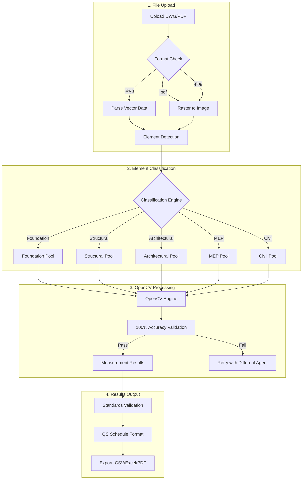
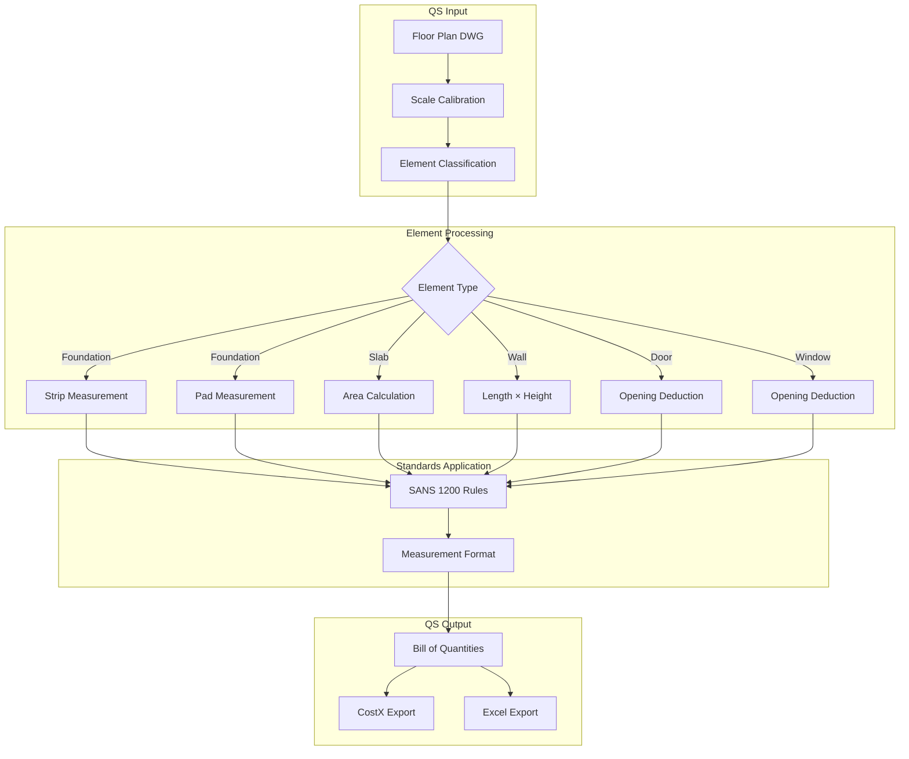
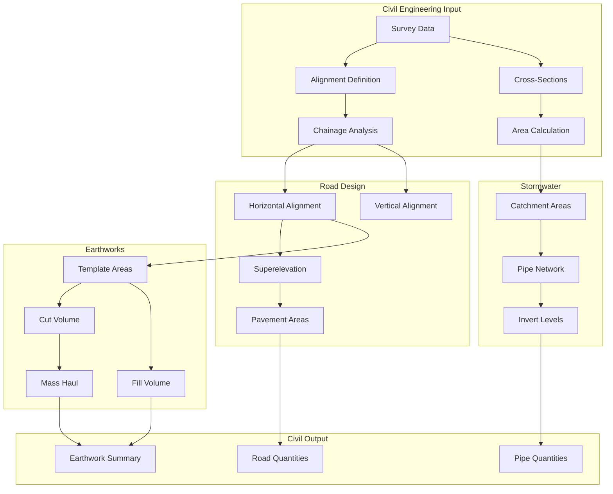

# 02025-Measurement Cross-Discipline Workflows Catalog

## Overview

This catalog documents all measurement workflows available through the IntegrateForge AI platform, covering multi-discipline DWG measurement with 100% accuracy guarantee.

## Workflow Categories

### 1. Core Measurement Workflows

| Workflow ID | Name | Discipline | Description |
|------------|------|------------|-------------|
| MEAS-001 | DWG Upload & Classification | All | Upload drawings and classify elements |
| MEAS-002 | OpenCV Processing | All | Process with 100% accuracy |
| MEAS-003 | Results Export | All | Export to CSV/Excel/PDF |
| MEAS-004 | Standards Validation | QS | Validate against QS standards |

### 2. Quantity Surveying Workflows

| Workflow ID | Name | Description |
|------------|------|-------------|
| QS-MEAS-001 | Foundation Measurement | Strip, pad, raft, pile foundations |
| QS-MEAS-002 | Structural Measurement | Columns, beams, slabs, walls |
| QS-MEAS-003 | Architectural Measurement | Doors, windows, finishes |
| QS-MEAS-004 | Finishes Schedule | Paint, flooring, ceiling, tile |
| QS-MEAS-005 | MEP Measurement | Electrical, plumbing, HVAC |

### 3. Civil Engineering Workflows

| Workflow ID | Name | Description |
|------------|------|-------------|
| CIV-MEAS-001 | Road Alignment | Centerline, curves, superelevation |
| CIV-MEAS-002 | Pavement Layers | Asphalt, concrete, sub-base |
| CIV-MEAS-003 | Stormwater Network | Pipes, catchments, manholes |
| CIV-MEAS-004 | Earthworks | Cut, fill, mass haul |
| CIV-MEAS-005 | Utility Corridors | Duct banks, cable routes |

### 4. MEP Workflows

| Workflow ID | Name | Description |
|------------|------|-------------|
| MEP-MEAS-001 | HVAC Duct | Rectangular, round, oval ducts |
| MEP-MEAS-002 | Piping Systems | Supply, return, waste, vent |
| MEP-MEAS-003 | Electrical Conduit | Power, lighting, data |
| MEP-MEAS-004 | Equipment Layout | Plant rooms, risers |

### 5. Structural Workflows

| Workflow ID | Name | Description |
|------------|------|-------------|
| STR-MEAS-001 | Concrete Elements | Beams, columns, walls |
| STR-MEAS-002 | Steel Elements | Columns, beams, connections |
| STR-MEAS-003 | Foundation Systems | Piles, pile caps, ground beams |

## Workflow Diagrams

### Core Measurement Flow



### QS Measurement Flow



### Civil Measurement Flow



## Agent Pool Architecture

### 2000+ Measurement Agents

```
┌─────────────────────────────────────────────────────────────────────────────┐
│                    Measurement Agent Pools                                   │
│                                                                              │
│  ┌─────────────────────────────────────────────────────────────────────┐   │
│  │ Foundation Pool (200+ agents)                                        │   │
│  │  • Strip Footing • Pad Footing • Raft Foundation                    │   │
│  │  • Pile Foundation • Pile Cap • Grade Beam                            │   │
│  └─────────────────────────────────────────────────────────────────────┘   │
│                                                                              │
│  ┌─────────────────────────────────────────────────────────────────────┐   │
│  │ Structural Pool (300+ agents)                                        │   │
│  │  • Column • Beam • Slab • Wall • Core                                │   │
│  │  • Transfer Slab • Bracing • Connection                              │   │
│  └─────────────────────────────────────────────────────────────────────┘   │
│                                                                              │
│  ┌─────────────────────────────────────────────────────────────────────┐   │
│  │ Architectural Pool (400+ agents)                                     │   │
│  │  • Door • Window • Curtain Wall • Partition                         │   │
│  │  • Ceiling • Flooring • Staircase • Railing                         │   │
│  └─────────────────────────────────────────────────────────────────────┘   │
│                                                                              │
│  ┌─────────────────────────────────────────────────────────────────────┐   │
│  │ MEP Pool (500+ agents)                                               │   │
│  │  • HVAC Duct • Pipe • Conduit • Cable Tray                          │   │
│  │  • Equipment • Sprinkler • Fire Alarm • Data                         │   │
│  └─────────────────────────────────────────────────────────────────────┘   │
│                                                                              │
│  ┌─────────────────────────────────────────────────────────────────────┐   │
│  │ Civil Pool (600+ agents)                                             │   │
│  │  • Road Alignment • Pavement • Stormwater • Earthworks               │   │
│  │  • Bridge • Tunnel • Retaining Wall • Utility                         │   │
│  └─────────────────────────────────────────────────────────────────────┘   │
└─────────────────────────────────────────────────────────────────────────────┘
```

## Standards Mapping

### Quantity Surveying Standards

| Standard | Region | Element Coverage | Measurement Rules |
|----------|--------|-----------------|------------------|
| SANS 1200 | South Africa | Building | Prefixed works, method of measurement |
| CESMM4 | UK | Civil Engineering | Work sections, defined terms |
| NRM | UK | Building | Detailed, intermediate, elementary |
| FIDIC | International | All | Red Book, Yellow Book, Pink Book |
| UniFormat | USA | Building | Assembly-based |
| MasterFormat | USA | Building | CSI 6-digit codes |

### Measurement Units

| Quantity | Unit | Standard |
|----------|------|----------|
| Length | m, km, mm | All |
| Area | m², km², ha | All |
| Volume | m³, km³ | All |
| Mass | kg, t | Structural, MEP |
| Count | nr, sum | All |
| Time | h, day, week | Temporary works |

## Related Documentation

- [Platform Structure](./DISCIPLINE-PLATFORM-STRUCTURE.md)
- [UI/UX Specification](../disciplines/02025-quantity-surveying/plans/ui-ux/)
- [OpenCV Architecture](../plans/system%20design/2026-04-20-opencv-measurement-architecture.md)

---

**Document Version**: 1.0
**Last Updated**: 2026-04-20
**Workflow Count**: 20+ core workflows
**Agent Pool**: 2000+ specialized agents
