# Cross-Discipline Measurement Platform — UI/UX Specification

## Table of Contents

1. [Part A: UX Patterns (High-Level)](#part-a-ux-patterns-high-level)
2. [Part B: Three-State Button & Modal Rules](#part-b-three-state-button--modal-rules)
3. [Part C: Mermaid UI Flow Diagrams](#part-c-mermaid-ui-flow-diagrams)
4. [Part D: Implementation Standards](#part-d-implementation-standards)
5. [Part E: Screen Specifications (Detailed)](#part-e-screen-specifications-detailed)
6. [Part F: Shared Measurement Components](#part-f-shared-measurement-components)
7. [Part G: Mobile Measurement (On-Site)](#part-g-mobile-measurement-on-site)
8. [Part H: AI Model Backend](#part-h-ai-model-backend)
9. [Part I: Agent Knowledge Ownership](#part-i-agent-knowledge-ownership)
10. [Part J: Future Extension Architecture](#part-j-future-extension-architecture)
    - [J.1 DWG Maturity Model (IFD / IFT / IFC)](#j1-dwg-maturity-model-ifd--ift--ifc)
    - [J.2 Primary Discipline Gating](#j2-primary-discipline-gating)
    - [J.3 Inter-Discipline Transmittals — `/#/transmittals`](#j3-inter-discipline-transmittals--transmittals)
    - [J.4 Clash Detection — `/#/clash-detection`](#j4-clash-detection--clash-detection)
    - [J.5 CAD Verification & Bluebeam-Style Tooling](#j5-cad-verification--bluebeam-style-tooling)
    - [J.6 BOQ Verification Workflow](#j6-boq-verification-workflow)
    - [J.7 Extensibility Principles](#j7-extensibility-principles)

---

## Part A: UX Patterns (High-Level)

### 1. Page Classification

**Template Type**: **Template B** (Complex / Three-State)

The Cross-Discipline Measurement Platform is classified as **Template B** because:

- **Multi-State Navigation**: Three distinct operational states — Agents, Upsert, Workspace
- **Multi-Purpose Functionality**: CAD measurement extraction, BOQ generation, standards compliance, tender management, mobile measurement
- **Complex Workflows**: Quantity surveying takeoff, measurement validation, cost analysis, tender compilation
- **Higher z-index positioning** (1500) for the chatbot overlay
- **State-aware AI assistance** that adapts to measurement context
- **Mobile integration**: On-site measurement capture as a parallel track

**Primary User Roles**:

- **Quantity Surveyors**: CAD takeoff, BOQ generation, standards compliance
- **Builders**: Material conversion, supplier integration, site inventory
- **Procurement Teams**: Tender portal management, RFQ generation
- **Contract Administrators**: Payment certification, variation valuation

### 2. Information Architecture

**Accordion Section**: Measurement (display_order: 2025)
**Accordion Subsection**: Per-function measurement pages
**Icons**: Ruler/scale icon for measurement
**Routes**: `/measurement/{function-category}`, `/#/drawing-measurements`, `/#/technical-drawings`

### `/#/technical-drawings` — DWG Management System

**Purpose**: A centralized drawing management system for storing, versioning, reviewing, and distributing technical drawings (DWG, DXF, PDF, IFC, RVT) across all engineering disciplines. This is the **document management layer** — it handles the file lifecycle, not the measurement extraction.

**Key Functions**:

- **Drawing Repository**: Upload, store, organize, and retrieve technical drawings by project, discipline, and revision
- **Version Control**: Track drawing revisions with automatic version numbering, revision clouds, and change history
- **Review & Markup**: Redline/markup tools for collaborative review — engineers can annotate drawings with comments, revision flags, and approval stamps
- **Distribution Control**: Controlled distribution with transmittal records — who received which revision and when
- **Search & Filter**: Search by drawing number, title, discipline, project, status (issued for construction, issued for review, as-built)
- **Status Workflow**: Drawing status lifecycle — Draft → Under Review → Approved → Issued for Construction → As-Built → Superseded
- **Bulk Operations**: Batch upload, batch revision updates, batch status transitions
- **Integration**: Links to discipline pages — when an engineer opens a drawing from their discipline page, it opens here in the context of that drawing's metadata

**Not For**: Measurement extraction or quantity takeoff — those happen in `/#/drawing-measurements` using the drawings stored here.

**User Roles**:

- **Document Controllers**: Upload, distribute, manage drawing registers
- **Engineers**: View, review, markup drawings
- **Project Managers**: Approve drawing distributions, track transmittals

**Mermaid Flow**:

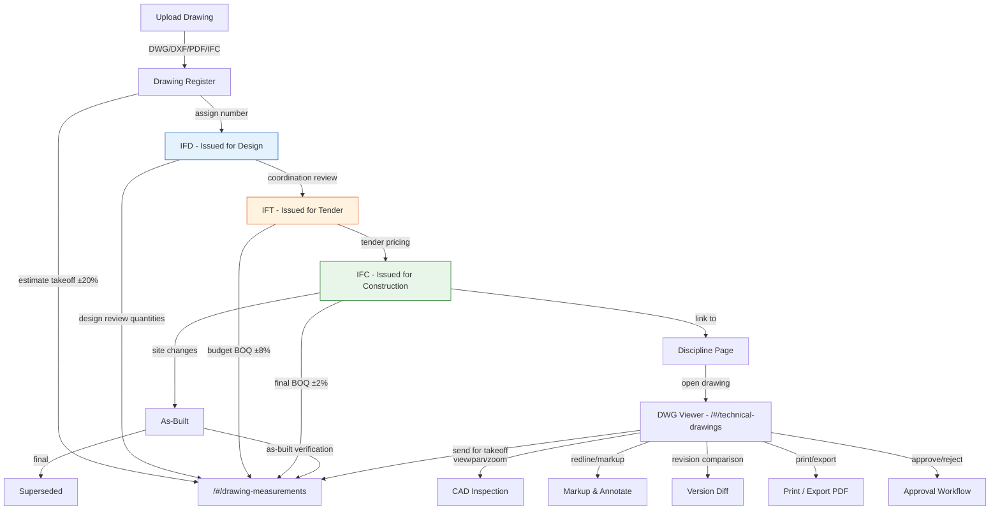

### `/#/drawing-measurements` — CAD Measurement & Quantity Takeoff

**Purpose**: The measurement extraction and quantity takeoff engine — this is where CAD files are analyzed, quantities are extracted, and measurements flow into BOQ generation. This is the **measurement computation layer** that consumes drawings from the DWG management system.

**Key Functions**:

- **CAD File Import**: Import drawings from `/#/technical-drawings` or upload directly (DWG, DXF, PDF, IFC)
- **AI-Assisted Takeoff**: Automatic detection of areas, lengths, volumes, and counts using AI vision models
- **Scale Calibration**: Set drawing scale, calibrate measurements, handle viewport scaling
- **Manual Takeoff Tools**: Polyline area measurement, linear measurement, count tool, hatch area detection
- **Measurement Validation**: Cross-check AI measurements against manual takeoffs, flag discrepancies
- **Standards Compliance**: Validate measurements against SANS 1200, NRM2, SMM7, CESMM4
- **BOQ Integration**: Approved measurements flow directly into BOQ generation (via BOQComposer)
- **Multi-Discipline Support**: Each discipline has its own measurement templates and rules (electrical cable lengths, civil earthworks volumes, structural rebar quantities)
- **Audit Trail**: Every measurement action logged — who measured what, when, and any adjustments made

**Not For**: Drawing management or version control — those happen in `/#/technical-drawings`.

**User Roles**:

- **Quantity Surveyors**: Primary users — perform takeoffs, validate measurements, generate BOQs
- **Engineers**: Review discipline-specific measurements, approve/reject AI outputs
- **Estimators**: Use measurements for cost estimation and tender preparation

**Mermaid Flow**:

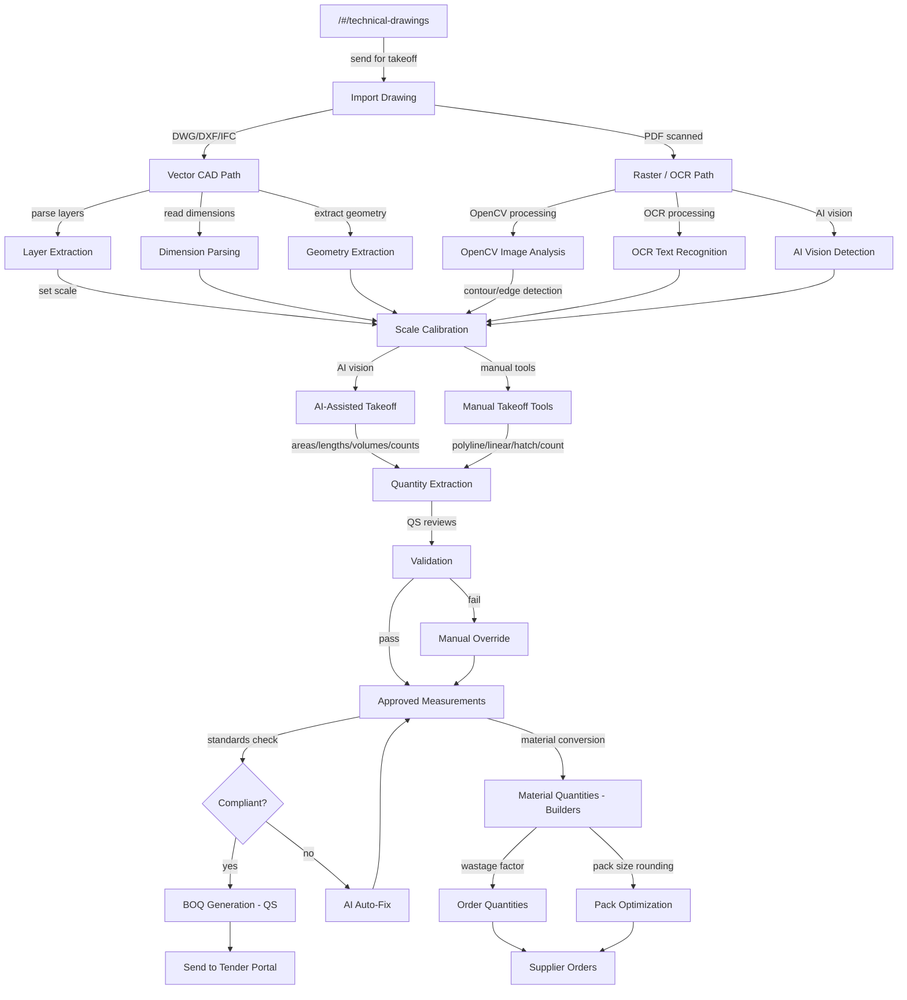

**Integration Flow Between Routes**:

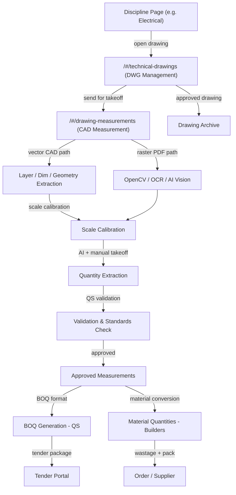

**AccordionProvider + AccordionComponent** is mandatory on every page per the `0950_ACCORDION_MANAGEMENT_AUDIT.md` standard.

### 3. Color Scheme

The platform uses the **Template A orange palette** as its foundation, with a **measurement-specific teal accent**:

```css
:root {
  /* Primary Color Palette */
  --template-a-primary: #ff8c00;
  --template-a-secondary: #ffa500;
  --template-a-accent: #ff6b35;

  /* Measurement-Specific Palette */
  --measurement-primary: #00897b; /* Teal — measurement core */
  --measurement-secondary: #26a69a; /* Light teal — measurement actions */
  --measurement-accent: #00695c; /* Dark teal — measurement highlights */
  --measurement-valid: #43a047; /* Green — measurement passed */
  --measurement-warning: #ffb300; /* Amber — measurement warning */
  --measurement-error: #e53935; /* Red — measurement failed */

  /* Background Gradients */
  --template-a-bg-gradient: linear-gradient(135deg, #f8f9fa 0%, #e9ecef 100%);
  --template-a-header-gradient: linear-gradient(
    135deg,
    #00897b 0%,
    #26a69a 100%
  );

  /* Text Colors */
  --template-a-text-primary: #000000;
  --template-a-text-secondary: #6c757d;
  --template-a-text-white: #ffffff;

  /* Shadows and Borders */
  --template-a-shadow-sm: 0 2px 4px rgba(0, 0, 0, 0.05);
  --template-a-shadow-md: 0 4px 6px rgba(0, 0, 0, 0.1);
  --template-a-shadow-lg: 0 8px 24px rgba(0, 137, 123, 0.3);
}
```

**Why Teal?**: Measurement is a cross-discipline function (not a single engineering discipline). The teal palette differentiates it from the engineering orange while remaining professional and accessible. Teal evokes precision, measurement instruments, and technical accuracy.

### 4. HITL Integration Pattern

The Human-in-the-Loop (HITL) model for measurement follows this pattern:

1. **AI Agent** performs initial measurement extraction from CAD/DWG/DXF
2. **Work enters HITL Review Queue** — visible in the Workspace state
3. **Quantity Surveyor** reviews the AI measurements:
   - **Approve**: Measurements accepted, flow to BOQ generation
   - **Reject with Feedback**: Measurements returned to AI with correction notes
   - **Adjust**: Human directly adjusts measurement values
   - **Override**: Human marks an area as "measured manually" (bypassing AI)
4. **Standards Compliance Check**: All measurements validated against SANS 1200 / NRM2 / SMM7
5. **Audit Trail**: Every measurement decision recorded with before/after values

---

## Part B: Three-State Button & Modal Rules

### 5. State: Agents

The **Agents state** is a **display-only** view showing the AI agents available for measurement operations. Agent creation, configuration, and removal are handled by board operators through the Paperclip control plane — not from within this page.

**Details Modal**:

| Button                           | Visibility Gate | Action                   | Modal                                                                                            |
| -------------------------------- | --------------- | ------------------------ | ------------------------------------------------------------------------------------------------ |
| **View Details** (per agent row) | Always visible  | Opens AgentDetails modal | `AgentDetails` — 98vw, read-only agent info, capabilities, recent measurements, accuracy metrics |

**Measurement Agent Types**:
| Agent | Role | CAD Formats | Skills |
|-------|------|-------------|--------|
| StandardsStella | Measurement Compliance | N/A (validator) | SANS 1200, NRM2, SMM7 checking |
| BOQBenjamin | BOQ Compilation | N/A (formatter) | BOQ formatting, trade packages |
| AuditArthur | Audit Trail | N/A (tracker) | Version history, audit logging |
| MaterialMax | Material Catalog | N/A (matcher) | Material matching, supplier lookup |
| PacksizePete | Order Optimization | N/A (calculator) | Pack size rounding, wastage calc |

### 6. State: Upsert

The **Upsert state** is where measurement records are created, edited, and imported. This is the core operational state for quantity surveyors.

**Buttons**:

| Button                       | Visibility Gate              | Action                        | Modal                                                                                    |
| ---------------------------- | ---------------------------- | ----------------------------- | ---------------------------------------------------------------------------------------- |
| **New Measurement**          | `user.role >= 'editor'`      | Opens CreateMeasurement modal | `CreateMeasurement` — 98vw, CAD file upload, measurement parameters, discipline selector |
| **Import CAD**               | `user.role >= 'editor'`      | Opens CADImport modal         | `CADImport` — 98vw, file upload (DWG/DXF/PDF/IFC), format detection, preview             |
| **Bulk Import BOQ**          | `user.role >= 'editor'`      | Opens BOQImport modal         | `BOQImport` — 98vw, CSV/Excel upload, column mapping, validation preview                 |
| **Edit** (per measurement)   | `user.role >= 'editor'`      | Opens EditMeasurement modal   | `EditMeasurement` — 98vw, measurement form, takeoff view, revision history               |
| **Delete**                   | `user.role === 'governance'` | Opens Confirmation modal      | `Confirmation` — "Delete measurement {id}? All associated BOQ items will be orphaned."   |
| **Export** (per measurement) | Always visible               | Opens ExportOptions modal     | `ExportOptions` — Format selector (PDF, CSV, XLSX, DWFX), standards compliance report    |
| **Run Standards Check**      | `user.role >= 'editor'`      | Opens StandardsCheck modal    | `StandardsCheck` — 98vw, SANS 1200 / NRM2 / SMM7 validation results, violation list      |

**Form Validation** (per 0750 standard):

- **Green border** (`2px solid #43A047`): Field is valid — uses measurement green
- **Gray border** (`2px solid #dee2e6`): Field is empty/required
- **Red border** (`2px solid #E53935`): Field has validation error — uses measurement red
- **Error text**: Red bold text below the field

**Modal Patterns** (per 0170 standard):

- Entry: `CreateMeasurement` — multi-section: CAD upload, discipline selection, measurement type
- Management: `EditMeasurement` — same form + takeoff overlay + revision history sidebar
- Workflow: `StandardsCheck` — pass/fail results, violation details, auto-fix suggestions

**Mermaid Flow**:

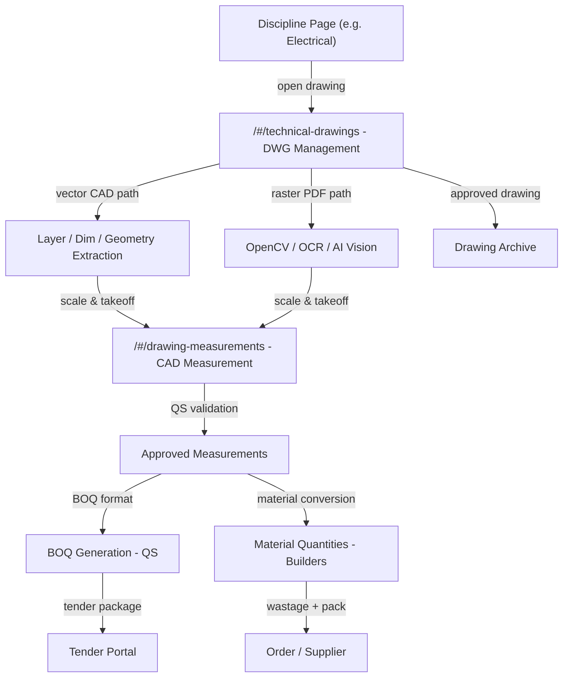

### 7. State: Workspace

The **Workspace state** is the operational dashboard — reviewing AI measurement outputs, managing approvals, coordinating tender workflows.

**Buttons**:

| Button                   | Visibility Gate              | Action                     | Modal                                                                                                 |
| ------------------------ | ---------------------------- | -------------------------- | ----------------------------------------------------------------------------------------------------- |
| **Approve Measurements** | `user.role >= 'reviewer'`    | Opens Approval modal       | `Approval` — 98vw, teal gradient, approve with optional note, triggers BOQ generation                 |
| **Reject Measurements**  | `user.role >= 'reviewer'`    | Opens Rejection modal      | `Rejection` — 98vw, required correction notes, measurement returned to AI agent                       |
| **Adjust Value**         | `user.role >= 'editor'`      | Opens AdjustValue modal    | `AdjustValue` — 98vw, direct quantity override, reason required, audit logged                         |
| **Generate BOQ**         | `user.role >= 'editor'`      | Opens GenerateBOQ modal    | `GenerateBOQ` — 98vw, BOQ template selector, trade package mapping, format options                    |
| **Send to Tender**       | `user.role >= 'coordinator'` | Opens SendToTender modal   | `SendToTender` — 98vw, tender type selector, supplier list, submission deadline                       |
| **Assign Reviewer**      | `user.role >= 'coordinator'` | Opens AssignReviewer modal | `AssignReviewer` — 98vw, user/agent selector, review scope                                            |
| **Generate Report**      | Always visible               | Opens Export modal         | `Export` — 98vw, report type (measurement summary, compliance report, audit trail), format (PDF, CSV) |

**HITL Workflow**:

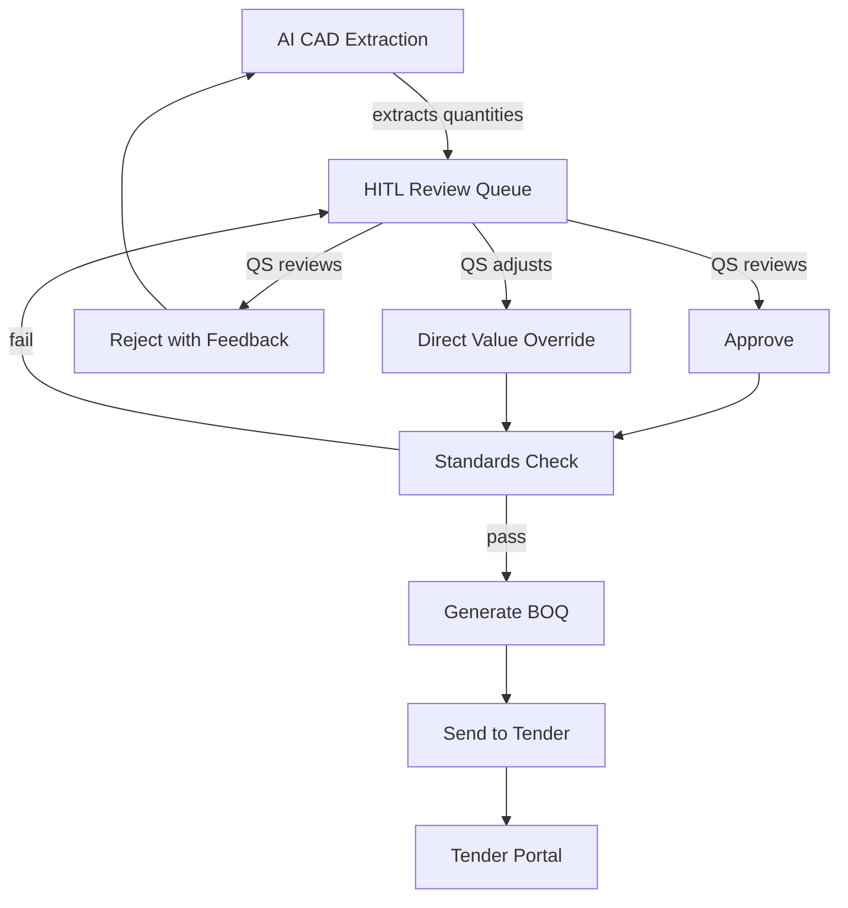

---

## Part C: Mermaid UI Flow Diagrams

> **⚠️ SOURCE OF TRUTH**: The mermaid diagrams in this section are the **authoritative specification** for all measurement platform flows. Text descriptions in Parts A, B, and E reference these diagrams and must not contradict them. If a discrepancy exists between a text description and a diagram, the diagram takes precedence. When implementing or modifying the platform, start here.

### 8. Page State Flow

Auth is handled by the platform before the page is entered. The user navigates to the measurement platform via a bespoke URL from the accordion (e.g., `/#/drawing-measurements` or `/#/technical-drawings`). The page loads directly into one of the three states.

**Architecture**: The page has **three navigation tabs** at the top level — Agents, Upsert, Workspace. Within each tab, **action buttons** trigger modals or open sub-views. This is _not_ a flat list of peer nodes.

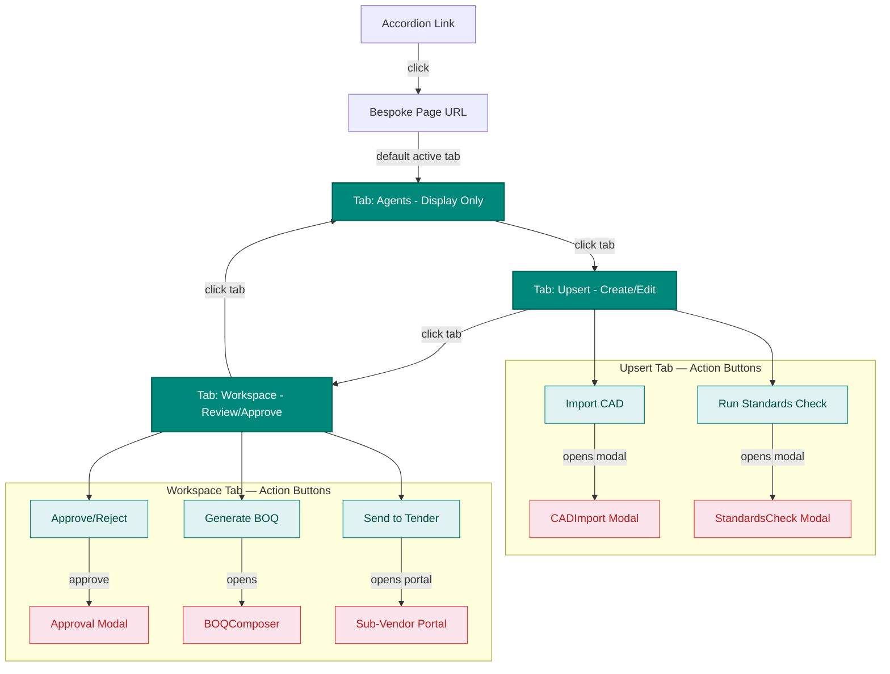

### 9. CAD Measurement Extraction Flow

This is the **canonical measurement pipeline** — the authoritative diagram for how CAD files flow through the system. All route descriptions in Parts A, B, and E reference this flow.


### 10. BOQ Generation Flow

This is the **canonical BOQ pipeline** — receiving approved measurements from the CAD Measurement Extraction Flow (section 9) and producing both QS BOQs and builder material quantities.

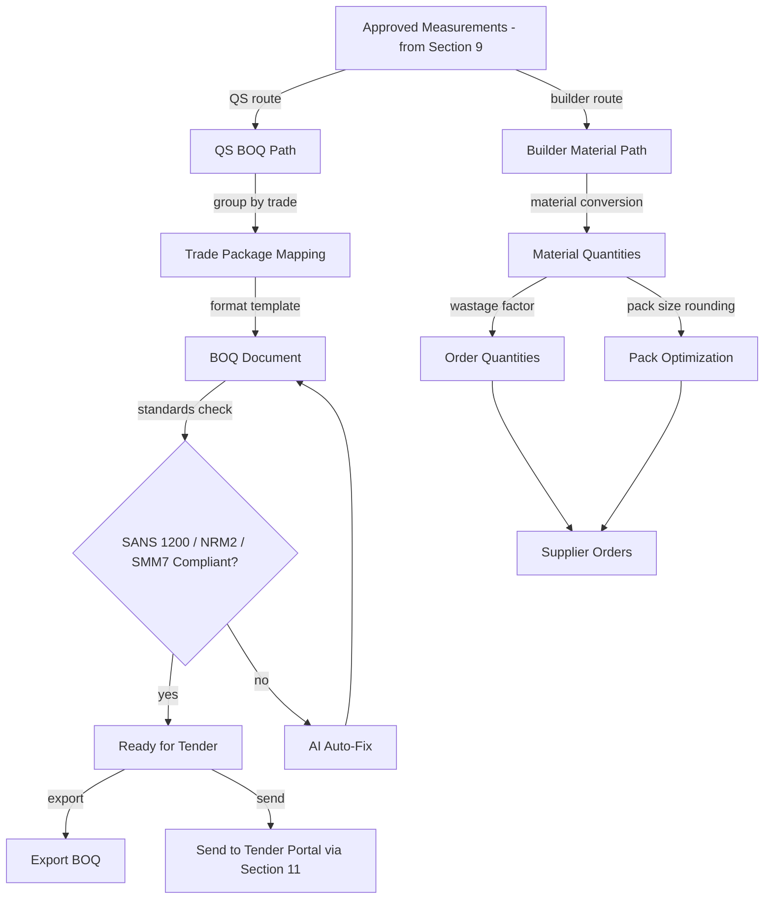

### 11. Tender Portal Flow

This is the **canonical tender pipeline** — receiving BOQs from the BOQ Generation Flow (section 10) and managing the full procurement lifecycle through to delivery.

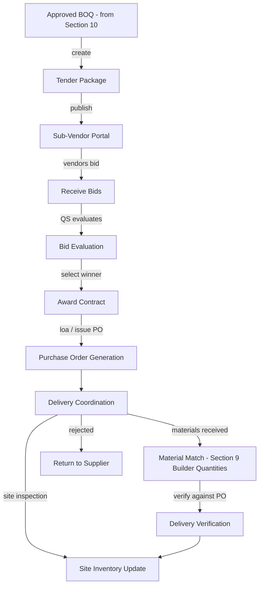

---

## Part D: Implementation Standards

### 12. CSS Architecture

**Import Chain**:

```css
/* 1. Template A Standard (master template) */
@import "../../templates/template-a-standard.css";

/* 2. Measurement Shared Components */
@import "../../shared/measurement/components/core.css";

/* 3. Page-Specific Measurement Styles */
@import "02025-measurement-page-style.css";
```

**File Structure**:

```
client/src/common/css/
├── templates/
│   └── template-a-standard.css              # Master template
├── shared/
│   └── measurement/
│       ├── components/
│       │   ├── core.css                     # CADViewer, MeasurementGrid, StandardsValidator
│       │   ├── forms.css                    # MeasurementForm, BOQForm
│       │   ├── modals.css                   # CADImport, Validation, Export, TenderSend
│       │   └── mobile.css                   # Mobile measurement adaptations
│       └── variables.css                    # Measurement-specific CSS variables (teal palette)
└── pages/
    └── measurement/
        └── 02025-measurement-page-style.css
```

**Key Principles**:

- **No Background Images**: Clean gradient backgrounds only (per `0000_VISUAL_DESIGN_STANDARDS.md`)
- **98vw Modal Sizing**: Consistent modal experience across all states
- **Teal Color Scheme**: `#00897B`, `#26A69A`, `#00695C` palette for measurement
- **Card-based Layout**: All measurement displays are card-based
- **Component Reuse**: Use Template A standard components when possible

### 13. Component Inventory

**Shared Measurement Components**:

| Component            | File                                    | Purpose                       | CSS Class Prefix       |
| -------------------- | --------------------------------------- | ----------------------------- | ---------------------- |
| CADMeasurementViewer | `components/core/CADViewer.js`          | DWG/DXF measurement takeoff   | `.meas-viewer-*`       |
| MeasurementGrid      | `components/core/MeasurementGrid.js`    | Tabular measurement display   | `.meas-grid-*`         |
| StandardsValidator   | `components/core/StandardsValidator.js` | SANS 1200 / NRM2 / SMM7 check | `.meas-standards-*`    |
| BOQComposer          | `components/core/BOQComposer.js`        | BOQ generation and formatting | `.meas-boq-*`          |
| AuditTrail           | `components/core/AuditTrail.js`         | Measurement version history   | `.meas-audit-*`        |
| MaterialMatcher      | `components/core/MaterialMatcher.js`    | Catalog matching and wastage  | `.meas-material-*`     |
| MeasurementForm      | `components/forms/MeasurementForm.js`   | Quantity entry form           | `.meas-form-*`         |
| TradeSelector        | `components/forms/TradeSelector.js`     | Trade package mapping         | `.meas-trade-*`        |
| StandardsSelector    | `components/forms/StandardsSelector.js` | Measurement standard selector | `.meas-standard-sel-*` |
| CADImportModal       | `components/modals/CADImportModal.js`   | CAD file import with OCR      | `.meas-cad-import-*`   |
| ValidationModal      | `components/modals/ValidationModal.js`  | Standards validation results  | `.meas-validation-*`   |
| ExportModal          | `components/modals/ExportModal.js`      | BOQ and report export         | `.meas-export-*`       |
| TenderSendModal      | `components/modals/TenderSendModal.js`  | Send to tender portal         | `.meas-tender-*`       |

### 14. Dropdown Specifications

All dropdowns follow the `0750_DROPDOWN_MASTER_GUIDE.md` standard:

**Measurement Standard Selector Dropdown**:

```javascript
<select
  value={selectedStandard}
  onChange={(e) => setSelectedStandard(e.target.value)}
  style={{
    width: "100%",
    padding: "8px 12px",
    border: selectedStandard
      ? "2px solid #43A047" // Measurement green when valid
      : "2px solid #dee2e6", // Gray when empty
    borderRadius: "4px",
    fontSize: "0.875rem",
    backgroundColor: "#ffffff",
    cursor: "pointer",
  }}
>
  <option value="">Select measurement standard...</option>
  <option value="sans1200">SANS 1200 (South Africa)</option>
  <option value="nrm2">NRM2 (UK)</option>
  <option value="smm7">SMM7 (UK)</option>
  <option value="cesmm4">CESMM4 (Civil Engineering)</option>
  <option value="nrm1">NRM1 (Cost Planning)</option>
</select>
```

**Dropdown Inventory**:

| Dropdown             | Component           | Data Source              | Scope                        |
| -------------------- | ------------------- | ------------------------ | ---------------------------- |
| Measurement Standard | `StandardsSelector` | `standardsMappings.js`   | Shared — multi-standard      |
| Trade Package        | `TradeSelector`     | `templateDefinitions.js` | Shared — configurable        |
| CAD Format           | `CADImportModal`    | `cadIntegrations.js`     | Shared — multi-format        |
| BOQ Template         | `BOQComposer`       | `templateDefinitions.js` | Shared — configurable        |
| Discipline           | `MeasurementForm`   | `disciplineConfigs.js`   | Shared — multi-discipline    |
| Material Category    | `MaterialMatcher`   | `materialCatalog.js`     | Shared — supplier-integrated |

### 15. Modal Specifications

All modals follow the `0170_MODAL_DOCUMENTATION_MASTER_GUIDE.md` standard:

**Modal Inventory**:

| Modal             | State     | Width | Header        | Purpose                               |
| ----------------- | --------- | ----- | ------------- | ------------------------------------- |
| AgentDetails      | Agents    | 98vw  | Teal gradient | View agent details (read-only)        |
| CreateMeasurement | Upsert    | 98vw  | Teal gradient | Create new measurement record         |
| CADImport         | Upsert    | 98vw  | Teal gradient | Import CAD file with OCR              |
| BOQImport         | Upsert    | 98vw  | Teal gradient | Bulk import BOQ from CSV/Excel        |
| EditMeasurement   | Upsert    | 98vw  | Teal gradient | Edit measurement with takeoff overlay |
| StandardsCheck    | Upsert    | 98vw  | Teal gradient | SANS 1200 / NRM2 / SMM7 validation    |
| ExportOptions     | Upsert    | 98vw  | Teal gradient | Export measurement data               |
| Approval          | Workspace | 98vw  | Teal gradient | Approve AI measurements               |
| Rejection         | Workspace | 98vw  | Teal gradient | Reject with correction notes          |
| AdjustValue       | Workspace | 98vw  | Teal gradient | Direct quantity override              |
| GenerateBOQ       | Workspace | 98vw  | Teal gradient | BOQ compilation                       |
| SendToTender      | Workspace | 98vw  | Teal gradient | Send to tender portal                 |
| AssignReviewer    | Workspace | 98vw  | Teal gradient | Assign QS reviewer                    |

**Modal Pattern**:

```html
<div class="modal" style="width: 98vw; max-width: 98vw;">
  <div
    class="modal-header"
    style="background: linear-gradient(135deg, #00897B 0%, #26A69A 100%);"
  >
    <h3>{Modal Title}</h3>
    <button class="modal-close">&times;</button>
  </div>
  <div class="modal-body">{Form/Content}</div>
  <div class="modal-footer">
    <button class="btn-secondary">Cancel</button>
    <button class="btn-primary meas-btn">{Action}</button>
  </div>
</div>
```

### 16. Chatbot Configuration

**Template Type**: Template B (State-Aware)

**Configuration**:

```javascript
{
  chatType: "agent",
  stateAware: true,
  currentState: "agents|upserts|workspace",
  aiAgentIntegration: true,
  upsertWorkflowSupport: true,
  mobileSyncSupport: true,
  zIndex: 1500,
  modelEndpoint: "/api/chat/measurement",
  measurementStandard: "sans1200",  // Default standard, user can switch
}
```

**State-Aware Behavior**:

- **Agents State**: Chatbot answers questions about measurement agent capabilities, model assignments
- **Upsert State**: Chatbot assists with CAD import, measurement validation, standards selection
- **Workspace State**: Chatbot explains AI measurement outputs, suggests approvals/rejections, helps with BOQ formatting

---

## Part E: Screen Specifications (Detailed)

### 17. Screen Inventory

| Screen               | State     | Loading                    | Empty                       | Error                         | Populated                              |
| -------------------- | --------- | -------------------------- | --------------------------- | ----------------------------- | -------------------------------------- |
| Agent List           | Agents    | Spinner + skeleton cards   | "No measurement agents" CTA | Red banner + retry            | Agent cards with accuracy badges       |
| CAD Takeoff          | Upsert    | Spinner + "Loading CAD..." | "Import a CAD file" CTA     | "Failed to parse CAD" details | Rendered CAD with measurement overlays |
| Measurement Grid     | Upsert    | Spinner + skeleton rows    | "No measurements" CTA       | Red banner + retry            | Table with quantities, units, status   |
| Standards Validation | Upsert    | Spinner                    | "No standards selected"     | "Validation engine failed"    | Pass/fail with line-item results       |
| HITL Queue           | Workspace | Spinner + skeleton         | "No measurements to review" | Red banner + retry            | Queue with measurement preview         |
| BOQ Composer         | Workspace | Spinner                    | "No approved measurements"  | "BOQ generation failed"       | BOQ preview with trade packages        |
| Tender Portal        | Workspace | Spinner                    | "No active tenders"         | "Portal connection failed"    | Tender list with bid status            |
| Audit Trail          | All       | Spinner                    | "No audit entries"          | "Failed to load audit"        | Timestamped change history             |

### 18. Screen-by-Screen Wireframes

#### 18.1 Measurement Takeoff Screen (Upsert State)

```
┌──────────────────────────────────────────────────────────────┐
│  [Teal Header Gradient]                                       │
│  Measurement Platform │ CAD Takeoff │ [Chatbot]               │
├──────────────────────────────────────────────────────────────┤
│  [Tab Nav: Agents | Upsert | Workspace]                       │
│  ┌─────────────────────────────────────────────────────────┐  │
│  │ CAD Takeoff           [Import CAD] [Run Standards Check] │  │
│  ├─────────────────────────────────────────────────────────┤  │
│  │ ┌──────────────────────┐ ┌────────────────────────┐     │  │
│  │ │   [CAD Viewer]       │ │ Measurement Panel      │     │  │
│  │ │                      │ │ ┌────────────────────┐ │     │  │
│  │ │   DWG rendering      │ │ │ Area: 245.3 m2    │ │     │  │
│  │ │   with measurement   │ │ │ Length: 12.4 m    │ │     │  │
│  │ │   overlays shown     │ │ │ Width: 19.8 m     │ │     │  │
│  │ │   as colored         │ │ │ Volume: 490.6 m3  │ │     │  │
│  │ │   highlights         │ │ │ Standard: SANS1200 │ │     │  │
│  │ │                      │ │ │ Status: Pending   │ │     │  │
│  │ │                      │ │ └────────────────────┘ │     │  │
│  │ │                      │ │ [Approve] [Adjust]     │     │  │
│  │ └──────────────────────┘ └────────────────────────┘     │  │
│  └─────────────────────────────────────────────────────────┘  │
├───────────────────────────────────────────────────────────────┤
│  [Bottom-Fixed Nav: Measurements | Standards | BOQ | Audit]   │
└───────────────────────────────────────────────────────────────┘
```

#### 18.2 BOQ Composer Screen (Workspace State)

```
┌──────────────────────────────────────────────────────────────┐
│  [Teal Header Gradient]                                       │
├──────────────────────────────────────────────────────────────┤
│  [Tab Nav: Agents | Upsert | Workspace]                       │
│  ┌─────────────────────────────────────────────────────────┐  │
│  │ BOQ Composer          [Generate BOQ] [Send to Tender]   │  │
│  ├─────────────────────────────────────────────────────────┤  │
│  │ ┌─────────┬──────────┬──────────┬────────┬─────────┐   │  │
│  │ │ Item   │ Desc     │ Qty      │ Unit   │ Rate    │   │  │
│  │ ├─────────┼──────────┼──────────┼────────┼─────────┤   │  │
│  │ │ 001    │ Excavate │ 245.30   │ m3     │ R 85.00 │   │  │
│  │ │ 002    │ Concrete │ 490.60   │ m3     │ R 1,200 │   │  │
│  │ │ 003    │ Rebar    │ 12,450   │ kg     │ R 15.50 │   │  │
│  │ │ 004    │ Formwork │ 1,890    │ m2     │ R 180.00│   │  │
│  │ ├─────────┼──────────┼──────────┼────────┼─────────┤   │  │
│  │ │         │ Total    │          │        │R 845,000│   │  │
│  │ └─────────┴──────────┴──────────┴────────┴─────────┘   │  │
│  └─────────────────────────────────────────────────────────┘  │
├───────────────────────────────────────────────────────────────┤
│  [Bottom-Fixed Nav]                                            │
└───────────────────────────────────────────────────────────────┘
```

#### 18.3 Tender Portal Screen (Workspace State)

```
┌──────────────────────────────────────────────────────────────┐
│  [Teal Header Gradient]                                       │
├──────────────────────────────────────────────────────────────┤
│  [Tab Nav: Agents | Upsert | Workspace]                       │
│  ┌─────────────────────────────────────────────────────────┐  │
│  │ Tender Portal           [Create Tender] [Refresh Bids]  │  │
│  ├─────────────────────────────────────────────────────────┤  │
│  │ ┌────────────────────────────────────────────────────┐  │  │
│  │ │ Tender: Substructure Package #004                  │  │  │
│  │ │ Status: ● Open         Closing: 2026-05-15        │  │  │
│  │ │ Bids: 4                 Lowest: R 845,000          │  │  │
│  │ │ ┌─────────┬───────────┬──────────┬────────────┐   │  │  │
│  │ │ │ Vendor │ Bid Amt   │ Score    │ Actions    │   │  │  │
│  │ │ ├─────────┼───────────┼──────────┼────────────┤   │  │  │
│  │ │ │ ABC    │ R 845,000 │ 92/100  │ [Evaluate] │   │  │  │
│  │ │ │ XYZ    │ R 920,000 │ 88/100  │ [Evaluate] │   │  │  │
│  │ │ │ DEF    │ R 789,000 │ 85/100  │ [Evaluate] │   │  │  │
│  │ │ │ GHI    │ R 1.1M    │ 75/100  │ [Evaluate] │   │  │  │
│  │ │ └─────────┴───────────┴──────────┴────────────┘   │  │  │
│  │ │ [Award to ABC] [Reject All]                        │  │  │
│  │ └────────────────────────────────────────────────────┘  │  │
│  └─────────────────────────────────────────────────────────┘  │
├───────────────────────────────────────────────────────────────┤
│  [Bottom-Fixed Nav]                                            │
└───────────────────────────────────────────────────────────────┘
```

### 19. Interactive Elements

**Measurement Form Validation** (per 0750 standard):

```javascript
// Measurement-specific green/red colors
style={{
  border: fieldValue
    ? fieldError
      ? "2px solid #E53935"  // Measurement red = error
      : "2px solid #43A047"  // Measurement green = valid
    : "2px solid #dee2e6",   // Gray = empty/required
  borderRadius: "4px",
}}
```

**Measurement-Specific Button Styles**:

```css
.meas-btn-primary {
  background: linear-gradient(135deg, #00897b 0%, #26a69a 100%);
  color: #ffffff;
  border: none;
  padding: 8px 16px;
  border-radius: 4px;
  cursor: pointer;
}

.meas-btn-secondary {
  background: #ffffff;
  color: #00897b;
  border: 2px solid #00897b;
  padding: 8px 16px;
  border-radius: 4px;
  cursor: pointer;
}

.meas-btn-danger {
  background: #e53935;
  color: #ffffff;
  border: none;
  padding: 8px 16px;
  border-radius: 4px;
  cursor: pointer;
}
```

### 20. Platform Adaptations

**Desktop (1280px+)**:

- Full three-state navigation visible
- CAD Takeoff: 60% viewer, 40% measurement panel (side-by-side)
- Measurement Grid: full width with horizontal scroll
- BOQ Composer: full width with trade package sidebar
- Tender Portal: bid table with evaluation panel

**Tablet (768px - 1279px)**:

- Three-state nav collapses to dropdown
- CAD Takeoff: full width, measurement panel as slide-out drawer
- Measurement Grid: responsive, key columns only
- BOQ Composer: stacked layout
- Tender Portal: bid list with expandable details

**Mobile (< 768px)**:

- Three-state nav as bottom tab bar
- CAD Takeoff: full width, measurement tools as floating action button
- Measurement Grid: card-based layout
- BOQ Composer: single column
- Tender Portal: swipeable bid cards
- Touch targets: minimum 48dp

---

## Part F: Shared Measurement Components

### 21. CADMeasurementViewer

**Cross-Discipline Shared Component**: Used by engineering disciplines and measurement agents.

**Purpose**: Extract quantities from CAD/BIM files with AI-assisted measurement recognition.

**Features**:

- Multi-format support (DWG, DXF, PDF, RVT, IFC)
- AI-assisted area/length/volume detection
- Manual override and adjustment
- Annotation and markup tools
- Standards compliance overlay

**Used By**:

- MeasureForge AI (primary — QS measurement extraction)
- DomainForge AI Engineering agents (secondary — discipline-specific measurement review)
- KnowledgeForge AI (validation — measurement accuracy tracking)

**Integration Points**:

- MeasureForge StandardsStella → validates extracted quantities against SANS 1200 / NRM2 / SMM7
- MeasureForge AuditArthur → logs every measurement change
- DomainForge discipline engineers → review discipline-specific measurements

### 22. StandardsValidator (Measurement)

**Cross-Discipline Shared Component**: Used by measurement agents and engineering disciplines.

**Supported Standards**:
| Standard | Region | Discipline | Validation Type |
|----------|--------|-----------|----------------|
| SANS 1200 | South Africa | Civil, Structural | Measurement rules |
| NRM2 | UK | All | Measurement rules |
| SMM7 | UK | Building | Work classification |
| CESMM4 | UK | Civil Engineering | Method of measurement |
| NRM1 | UK | Cost Planning | Cost estimation rules |

**Integration**:

- Checked automatically when measurements are submitted for approval
- Results displayed in Validation modal with pass/fail per line item
- Auto-fix suggestions for common violations

### 23. BOQComposer

**Cross-Discipline Shared Component**: Converts approved measurements into formatted BOQ documents.

**Format Support**:

- **Standard BOQ**: SANS 1200 / NRM2 / SMM7 compliant formatting
- **Trade Package**: Grouped by subcontract trade
- **Material BOQ**: Converted to material order quantities with wastage
- **Cost BOQ**: With applied rates from Rate Recorder

**Integration**:

- Receives approved measurements from HITL queue
- Applies measurement standards formatting
- Maps to trade packages
- Sends to Tender Portal for subcontractor bids

---

## Part G: Mobile Measurement (On-Site)

### 24. Mobile Measurement Interface

**Platform**: Progressive Web App (PWA) — works on-site offline, syncs when connected.

**Key Screens**:

1. **On-Site Capture**:
   - Camera integration for site photos
   - AR-assisted measurement (LiDAR on iOS)
   - Manual entry for tape measurements
   - GPS tagging for location tracking

2. **Measurement Sync**:
   - Offline queue for site measurements
   - Auto-sync when connection restored
   - Conflict resolution for duplicate measurements

3. **Site Inventory**:
   - Delivery verification with photo proof
   - Stock level updates
   - Wastage capture

**Mobile-Specific UI Patterns**:

- **Full-width cards** instead of tables
- **Swipe gestures** for approve/reject
- **Camera button** prominently placed for photo capture
- **Voice input** for hands-free measurement notes
- **Brightness adaptation** for outdoor site use

**Mermaid Flow**:

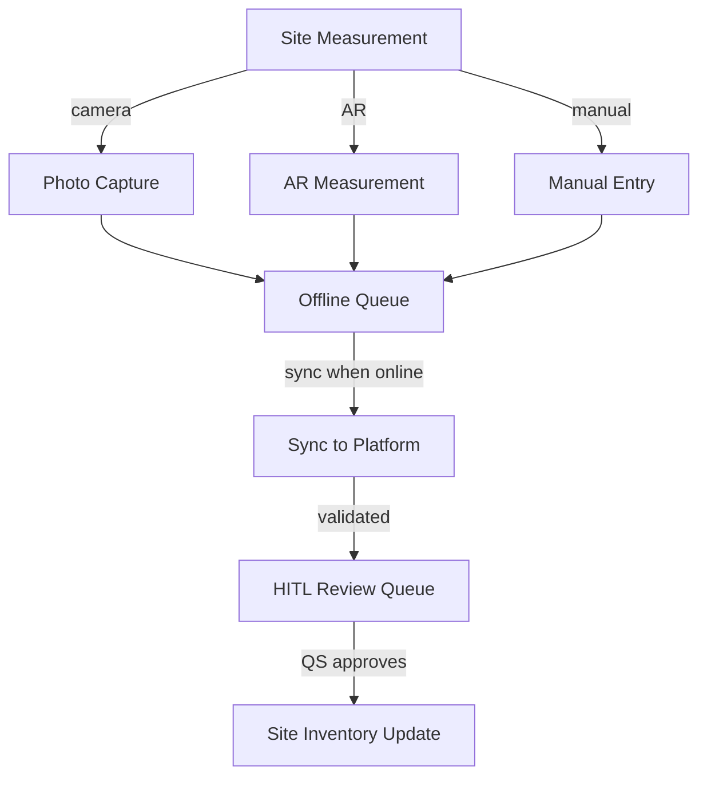

---

## Part H: AI Model Backend

### 25. Model Infrastructure

**Base Model**: Qwen 2.5 (or similar open-weight model)

- See `0000_QWEN_FINETUNING_PROCEDURE.md` for fine-tuning procedure
- Fine-tuned on measurement domain data (CAD extraction patterns, quantity surveying rules, standards documents)

**Domain Adapter**: LoRA fine-tuned per measurement function

- See `0000_LORA_ADAPTER_INTEGRATION_PROCEDURE.md` for adapter integration
- **CAD Extraction LoRA**: Trained on DWG/DXF dimension recognition
- **Standards Compliance LoRA**: Trained on SANS 1200 / NRM2 / SMM7 rule sets
- **BOQ Formatting LoRA**: Trained on trade package templates and cost formats
- Adapters are loaded at runtime based on the current task

**Deployment**: HuggingFace model serving

- See `0000_HF_MODEL_INTEGRATION_PROCEDURE.md` for deployment procedure
- Model endpoint: `/api/chat/measurement/{function}`
- Fallback: Base Qwen model without adapter

**Model Configuration**:

```javascript
const modelConfig = {
  baseModel: "Qwen/Qwen2.5-7B-Instruct",
  adapters: {
    cadExtraction: {
      type: "LoRA",
      rank: 16,
      alpha: 32,
      targetModules: ["q_proj", "v_proj"],
    },
    standardsChecker: {
      type: "LoRA",
      rank: 8,
      alpha: 16,
      targetModules: ["q_proj", "v_proj"],
    },
    boqFormatting: {
      type: "LoRA",
      rank: 8,
      alpha: 16,
      targetModules: ["q_proj", "v_proj"],
    },
  },
  deployment: {
    platform: "HuggingFace Inference Endpoints",
    instanceType: "g5.2xlarge",
    maxTokens: 4096,
    temperature: 0.2, // Low temperature for measurement precision
  },
  fallback: {
    model: "Qwen/Qwen2.5-7B-Instruct",
    temperature: 0.4,
  },
};
```

---

## Part I: Agent Knowledge Ownership

### 26. KnowledgeForge AI Ingestion

This specification is indexed into institutional memory via:

- **`KNOWLEDGE-INDEX.json`**: Indexed under `gigabrain_tags: measurement, ui-ux, specification`
- **`docs-construct-ai/`**: Cross-referenced in the shared knowledge base
- **KnowledgeForge AI agents**: Can retrieve this spec when asked about measurement UI
- **Measure Mentor KnowledgeForge**: Consumes this spec for measurement best practices
- **Rate Recorder KnowledgeForge**: Consumes rate-related UI patterns

### 27. PromptForge AI Coordination

The **Discipline Automation Agent** (`promptforge-ai-discipline-automation-agent`) uses its `ui-ux-design-coordination` skill to:

1. Route measurement UI implementation tasks to DevForge AI
2. Route measurement domain validation tasks to MeasureForge AI
3. Route measurement QA tasks to QualityForge AI
4. Route tender portal tasks to DomainForge AI (procurement domain) + Loopy AI (external UI)

### 28. MeasureForge AI Ownership

MeasureForge AI agents are the **primary consumers** of this specification:

| Agent                                    | Team                    | How They Consume This Spec                        |
| ---------------------------------------- | ----------------------- | ------------------------------------------------- |
| Measurement Director                     | Executive               | Overall platform oversight and approval           |
| Measurement Validation Specialist        | Core Measurement        | Implements StandardsValidator component           |
| Measurement Standards Specialist         | Core Measurement        | Configures SANS 1200 / NRM2 / SMM7 rules          |
| Engineering UI Specialist                | Core Measurement        | Implements CADMeasurementViewer                   |
| Advanced Engineering Analysis Specialist | Core Measurement        | Implements CalculationEngine for measurement math |
| Cross-Discipline Coordination Specialist | Core Measurement        | Handles multi-discipline measurement integration  |
| Document Intelligence Specialist         | Document & Data         | Implements CADImport with OCR                     |
| Data Processing Specialist               | Document & Data         | Implements BOQImport and data transformation      |
| Integration Orchestration Specialist     | Document & Data         | Implements TenderSend and supplier integration    |
| StandardsStella                          | Quantity Surveying      | Validates measurements against standards          |
| BOQBenjamin                              | Quantity Surveying      | Formats BOQ from approved measurements            |
| AuditArthur                              | Quantity Surveying      | Logs all measurement changes                      |
| MaterialMax                              | Procurement & Logistics | Matches measurements to material catalog items    |
| PacksizePete                             | Procurement & Logistics | Optimizes order quantities with pack sizes        |

### 29. DevForge AI Implementation

DevForge AI agents consume this spec to:

1. **Build the HTML/CSS/React pages** following the wireframes and CSS architecture
2. **Implement the three-state navigation** with measurement-specific state management
3. **Wire up the modals** per the 0170 standard
4. **Connect the chatbot** to the measurement AI model backend
5. **Implement the mobile PWA** for on-site measurement capture

### 30. QualityForge AI Testing

QualityForge AI agents test the implemented pages against this spec:

1. **CAD Extraction Accuracy**: Confirm AI-extracted measurements match manual validation
2. **Standards Compliance**: Confirm SANS 1200 / NRM2 / SMM7 validation engine works correctly
3. **BOQ Formatting**: Confirm BOQ output matches discipline-specific formatting rules
4. **Mobile Sync**: Confirm offline measurement queue syncs correctly when online
5. **Accessibility**: Confirm touch targets (48dp), keyboard navigation, screen reader support
6. **Performance**: Confirm modal load times (< 2s), CAD viewer render times (< 5s)

---

## Part J: Future Extension Architecture

This section defines the **growth path** for the measurement platform — capabilities that are architecturally anticipated but not yet built. Each subsection documents a reserved route, component slot, or data model that future issues can implement without architectural rework.

### J.1 DWG Maturity Model (IFD / IFT / IFC)

**Current state**: The drawing status workflow is a linear lifecycle (Draft → Under Review → IFC → As-Built). This matches simple projects but lacks the three-phase maturity model used in complex construction.

**Future extension**: Replace the linear status with the **IFD → IFT → IFC** progression:

| Phase                                            | Purpose                                                                                | Stage                                              | Measurement Accuracy     |
| ------------------------------------------------ | -------------------------------------------------------------------------------------- | -------------------------------------------------- | ------------------------ |
| **IFD** (Issued for Design)                      | Inter-discipline coordination — early design iterations, clash resolution, feasibility | Draft → Design Review → Approved for Coordination  | ±15-25% (estimate class) |
| **IFT** (Issued for Tender/Construction Pricing) | Tender pricing, procurement, subcontractor bids                                        | Released for Tender → Tender Addenda → Award-Ready | ±5-10% (budget class)    |
| **IFC** (Issued for Construction)                | Contract blueprint — site execution, as-built recording                                | Approved for Construction → Site-Issued → As-Built | ±1-3% (final class)      |

**Reserved model fields**:

- `dwg_set.maturity_stage: "ifd" | "ift" | "ifc"` — the current phase of the drawing set
- `dwg_set.primary_discipline_id` — see J.2
- `dwg_set.transmittal_ids[]` — see J.3
- `dwg_set.clash_reports[]` — see J.4

**How measurement integrates per stage**:

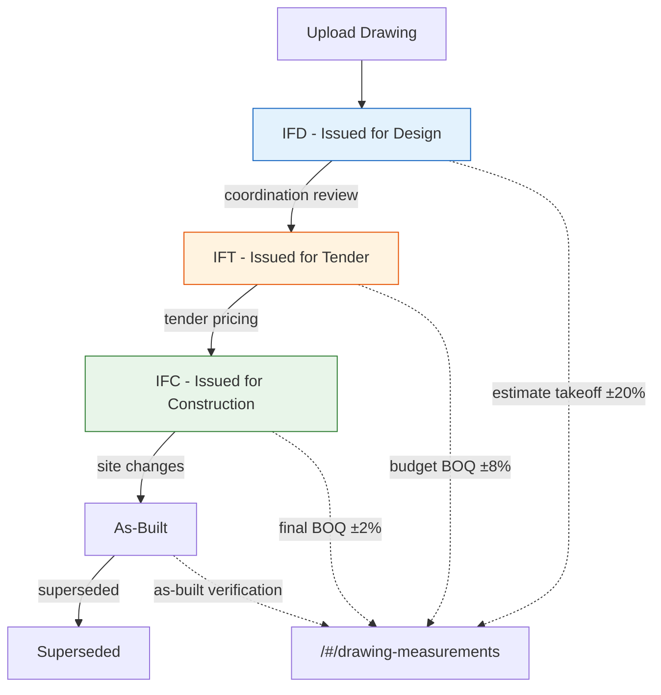

**Implementation status**: 🟡 Referenced but not bundled — a future issue should add `maturity_stage` to the drawing schema and update the DWG Management status workflow.

### J.2 Primary Discipline Gating

**Concept**: Every drawing set has a **primary discipline** that gates the review cycle — typically architecture for buildings, civil for infrastructure, electrical for substations, mechanical for plant. The primary discipline issues drawings first, sets the circulation order and timeline, and "crosses off" non-relevant departments before inter-discipline handover.

**Future route**: `/#/transmittals` (see J.3) — the primary discipline is stored as `dwg_set.primary_discipline_id` on each drawing set, and this field drives the review queue ordering in the transmittal system.

**Reserved data model**:

- `project.disciplines[]` — ordered list of all disciplines on the project
- `dwg_set.primary_discipline_id` — which discipline leads this set
- `dwg_set.review_cycle.order[]` — ordered list of reviewer disciplines (primary first, sequential/parallel flag)
- `dwg_set.review_cycle.deadline` — enforcement deadline for each review step

**How it would work**:

1. Project Engineer defines the discipline order and timeline for each drawing set
2. Document Control distributes copies via the transmittal system
3. Each reviewer in sequence: annotates, signs off, returns
4. Lead engineers (Project, Discipline) consolidate feedback before releasing to next discipline
5. Primary discipline can "cross off" irrelevant departments to accelerate the cycle

**Implementation status**: 🟡 Not yet implemented. Future issue should add the data model and integrate with the drawing status workflow when `maturity_stage` reaches IFC review.

### J.3 Inter-Discipline Transmittals — `/#/transmittals`

**Reserved route**: `/#/transmittals` — the inter-discipline drawing handover and review coordination system.

**Purpose**: A centralized transmittal registry that tracks which drawings were issued to which discipline, when, in what revision state, and with what review outcome. This is the **coordination backbone** between primary and inter-related disciplines.

**Key Functions (future implementation)**:

- **Transmittal Creation**: Issue a drawing set from one discipline to others — automatically records sender, receiver, revision, issue purpose (for review, for information, for approval)
- **Review Queue**: Ordered queue of reviewers per the primary discipline's cycle — sequential or parallel routing
- **Sign-off Tracking**: Per-reviewer sign-off status (pending, reviewed with comments, approved, rejected)
- **Discrepancy Log**: Track comments flagged during review — with resolution status (open, in progress, resolved)
- **Escalation**: Automatic notifications when review deadlines are missed
- **Version Comparison**: Side-by-side diff between transmitted revisions to show what changed

**Integration with DWG management**:

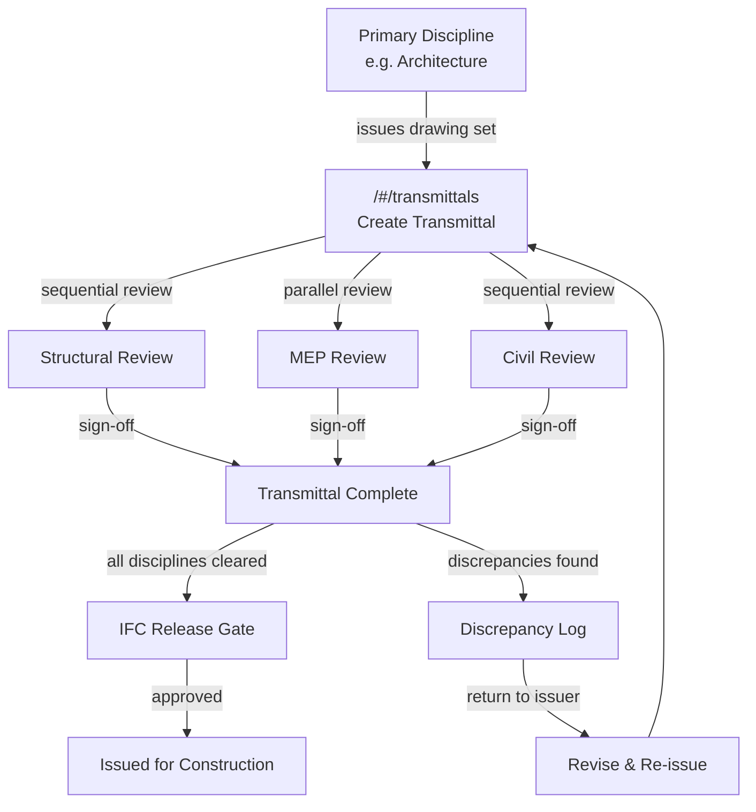

**Implementation status**: 🟡 Route reserved but not built. Future issue should implement the transmittal creation, review queue, and sign-off tracking. This is the highest priority extension after core `/#/technical-drawings` and `/#/drawing-measurements` are stable.

### J.4 Clash Detection — `/#/clash-detection`

**Reserved route**: `/#/clash-detection` — a BIM-driven interference and overlay comparison tool.

**Purpose**: Systematically detect and resolve physical conflicts between discipline-specific DWGs before they reach IFC stage. This is called out as a primary pitfall in inter-discipline coordination: column-wall misalignment, slab-edge discrepancies, MEP penetration conflicts, and floor elevation mismatches.

**Key Functions (future implementation)**:

- **Overlay Comparison**: Overlay two or more discipline DWGs (e.g., architectural plans over structural grids) with transparency control
- **Hard Clash Detection**: Physical overlaps — beam intersecting wall, column occupying room space, duct through beam
- **Soft Clash Detection**: Clearance violations — insufficient maintenance access, inadequate fire separation, clearance below minimums
- **Interference Simulation**: Simulate motion/sequencing to detect temporal clashes (crane swing path, delivery access)
- **Automated CAD Checks**: Batch validation against standards — layer compliance, geometry cleanup (AUDIT, OVERKILL), dimensional accuracy
- **Clash Report**: Exportable report with X/Y/Z coordinates, clash type, severity, and assigned resolution owner

**How clash detection feeds the review cycle**:

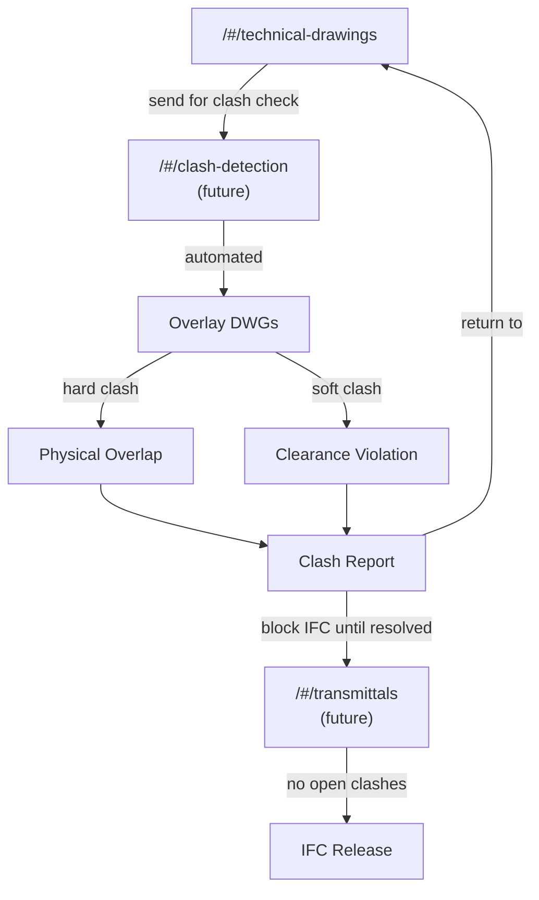

**CAD audit checklist (future automation)**:

- Layer naming and standards compliance
- Geometry validation (no stray lines, unclosed polylines, zero-length segments)
- Cross-sheet consistency (plan matches section matches elevation)
- Dimensional accuracy (tolerance checks against reference drawings)
- Tag and annotation verification

**Implementation status**: 🔴 Not yet reserved — future issue should register `/#/clash-detection` as a route and build the overlay comparison engine. This depends on transmittals (J.3) being in place for the IFC release gate.

### J.5 CAD Verification & Bluebeam-Style Tooling

**Future enhancement to** `/#/drawing-measurements`: Add professional CAD verification tooling inspired by Bluebeam Revu for mark-up, overlay, and double-check takeoffs.

**Envisioned capabilities**:

- **PDF/DWFX Markup Overlay**: Import DWG-exported PDFs, overlay markups (clouds, highlights, discipline-specific symbols) without modifying source drawings
- **Scale Calibration**: Auto-detect and verify drawing scale; calibrate viewport scales for correct measurement
- **Double-Takeoff Comparison**: Two QS operators independently take off the same drawing; system compares quantities and flags discrepancies >2% threshold
- **Batch Processing**: Apply measurement templates across an entire drawing set — e.g., auto-extract wall lengths from all floor plans in one operation
- **Dynamic Links**: When source DWG revisions occur, linked measurements flag for review rather than silently becoming stale
- **Export to Excel/BOQ**: Verified quantities export directly to BOQComposer with full audit trail of who measured what

**Plugin slot in existing CADMeasurementViewer**:

```javascript
// Reserved interface for Bluebeam-style verification module
// Future: VerificationModule plugs in here without modifying core
const verificationSlot = {
  hooks: ["onImport", "onScaleCalibrate", "onTakeoff", "onValidation"],
  priority: 10, // Lower priority than core measurement
  dependencies: ["StandardsValidator", "AuditTrail"],
  uiInsertionPoint: "takeoff-panel.tools.verification",
};
```

**Implementation status**: 🟡 Slot reserved in component architecture. Future issue should implement the markup overlay and double-takeoff comparison as a verification plugin.

### J.6 BOQ Verification Workflow

**Future enhancement to** BOQComposer: A structured pre-publish verification gate that prevents unvalidated BOQs from reaching the tender portal.

**Verification checklist**:

- [ ] Confirm all source drawings are latest IFC revision across all disciplines
- [ ] Cross-reference dimensions across views (plans vs sections vs elevations for walls, slabs, openings)
- [ ] Apply measurement standards (NRM2/CESMM4/SANS 1200) — verify waste/lap allowances included
- [ ] Run independent double-takeoff comparison — second QS re-measures 20-30% of quantities
- [ ] Cross-discipline consistency check: structural rebar quantities match architectural wall takeoffs, MEP penetrations don't double-count removed material
- [ ] Log verification variances in review docs; unresolved discrepancies block BOQ publication

**Verification gate mermaid**:

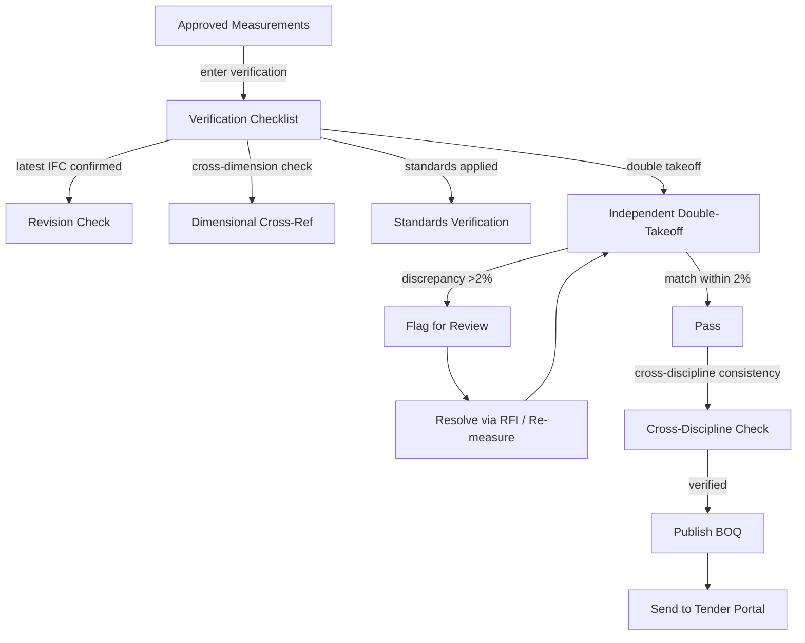

**Implementation status**: 🟡 Verification checklist referenced in BOQComposer workflow. Future issue should implement the gate with mandatory checklist completion before tender send.

### J.7 Extensibility Principles

The platform is designed to grow in sophistication without breaking what exists. These principles govern all future extensions:

| Principle                     | Explanation                                                                                                                                                                                                                                  |
| ----------------------------- | -------------------------------------------------------------------------------------------------------------------------------------------------------------------------------------------------------------------------------------------- |
| **Reserved before built**     | Routes (`/#/transmittals`, `/#/clash-detection`) are documented before any code exists — prevents naming conflicts and preserves the URL namespace                                                                                           |
| **Plugin slots, not forks**   | New capabilities are added as plugins (verification, transmittals, clash detection) that hook into existing component lifecycle — core measurement logic stays stable                                                                        |
| **Data model anticipation**   | Entity schemas (dwg_set.maturity_stage, primary_discipline_id, transmittal_ids) are defined in this spec before the database migration — ensures forward-compatible tables                                                                   |
| **Stage-gated maturity**      | IFD → IFT → IFC is a natural progression. Each phase adds more precision to measurement, more rigor to coordination, and more gates to quality. Future issues should align with this maturity model rather than inventing parallel workflows |
| **Cross-discipline first**    | Every extension must consider how it serves the primary discipline → inter-related discipline handover. A feature that only works within one discipline is incomplete                                                                        |
| **CAD checks as QA backbone** | Automated CAD checks (layer compliance, geometry validation, clash detection) are the quality gate for all measurement. Future verification tooling should integrate with, not bypass, these checks                                          |

---

## Version History

| Version | Date       | Changes                                                               |
| ------- | ---------- | --------------------------------------------------------------------- |
| 1.0     | 2026-04-28 | Initial UI/UX specification for Cross-Discipline Measurement Platform |

---

**Document Information**

- **Author**: MeasureForge AI — UI/UX Design Coordination
- **Date**: 2026-04-28
- **Status**: Active
- **Next Review**: 2026-05-28
- **Related Standards**: All 15 documents referenced in frontmatter
