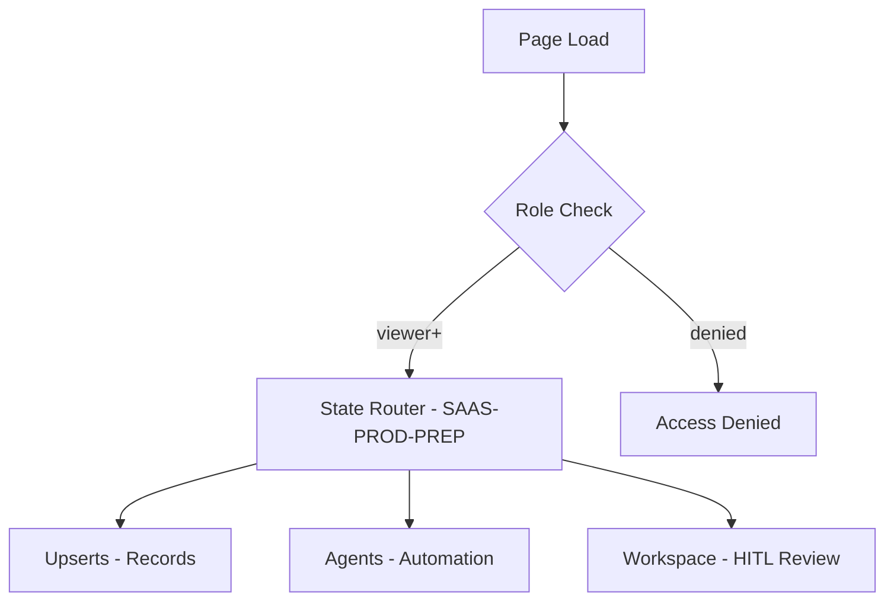

# SAAS-PROD-PREP — saas-operations UI/UX Specification

## Override: saas-operations Pattern

### 1. Override Summary

| Aspect | Value |
|--------|-------|
| **Project** | SAAS-PROD-PREP |
| **Discipline** | saas-operations |
| **Extends** | [saas-operations](UI-UX-SPECIFICATION.md) |
| **Spec Type** | Override — lean spec referencing parent pattern |
| **Issue Count** |        5 |
| **Color** | #00838F / #26C6DA |

### 2. Scope

This project implements domain-specific workflow automation within the saas-operations domain.
All UX patterns, three-state button rules, mermaid flow diagrams, implementation standards,
screen specifications, AI model backend, and agent knowledge ownership rules follow the
saas-operations discipline-level UI-UX-SPECIFICATION.md, with the following project-specific overrides.

### 3. Workflow Overrides

### 4. Entity / Data Sources

| Entity | Source | Description |
|--------|--------|-------------|
| Records | API | Domain records managed via Upserts |
| Agents | API | Automation agents for SAAS-PROD-PREP |
| Reviews | API | HITL review queue |

### 5. Role Gates

| Role | Gate | Access |
|------|------|--------|
| Viewer | `viewer` | View only |
| Editor | `editor` | Create / Edit / Import |
| Reviewer | `reviewer` | Approve / Reject |
| Governance | `governance` | Delete / Config |

### 6. Associated Issues

  - `_A_QA`
  - `of`
  - `SAAS-000-agent-capability-assessment`
  - `_A_QA`
  - `of`
  - `SAAS-001-procedure-development`
  - `_A_QA`
  - `of`
  - `SAAS-002-supabase-operations-framework`
  - `_A_QA`
  - `of`
  - `SAAS-003-api-key-management-system`
  - `_A_QA`
  - `of`
  - `SAAS-004-quality-assurance-validation`

### 7. Testing Checklist

- [ ] Upserts: Create, Edit, Delete workflows functional
- [ ] Agents: Agent status and configuration visible
- [ ] Workspace: HITL review queue operational
- [ ] Role gates: viewer, editor, reviewer, governance enforced
- [ ] Chatbot: stateAware chatbot integrated (z-index 1500)

---

**Version**: 1.0 | **Date**: 2026-04-29
