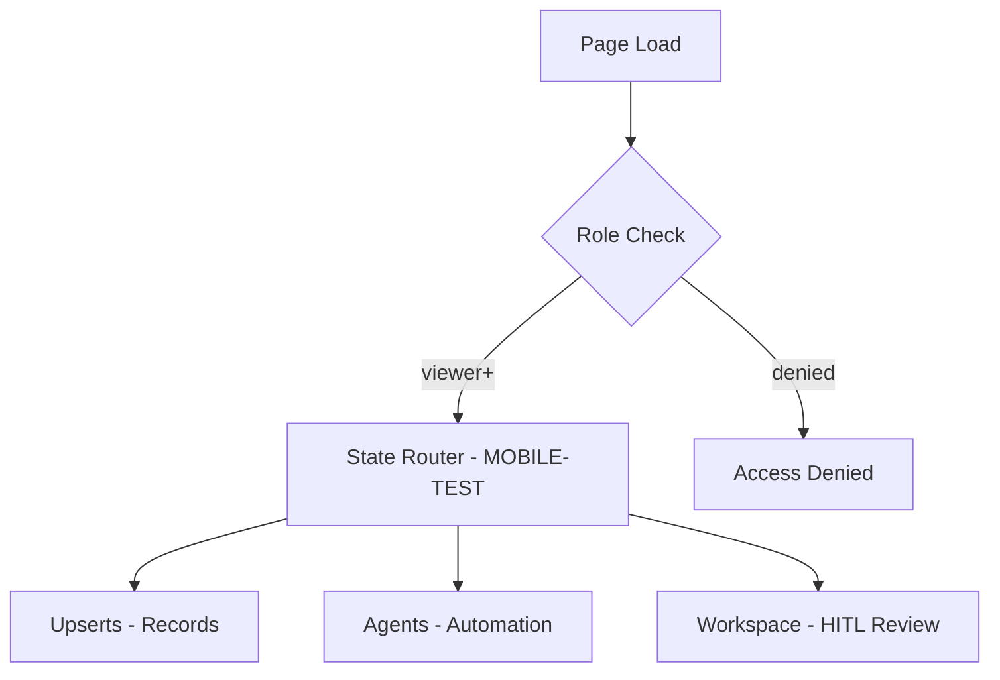

# MOBILE-TEST — testing UI/UX Specification

## Override: testing Pattern

### 1. Override Summary

| Aspect | Value |
|--------|-------|
| **Project** | MOBILE-TEST |
| **Discipline** | testing |
| **Extends** | [testing](UI-UX-SPECIFICATION.md) |
| **Spec Type** | Override — lean spec referencing parent pattern |
| **Issue Count** |        7 |
| **Color** | #E65100 / #FF9800 |

### 2. Scope

This project implements domain-specific workflow automation within the testing domain.
All UX patterns, three-state button rules, mermaid flow diagrams, implementation standards,
screen specifications, AI model backend, and agent knowledge ownership rules follow the
testing discipline-level UI-UX-SPECIFICATION.md, with the following project-specific overrides.

### 3. Workflow Overrides

### 4. Entity / Data Sources

| Entity | Source | Description |
|--------|--------|-------------|
| Records | API | Domain records managed via Upserts |
| Agents | API | Automation agents for MOBILE-TEST |
| Reviews | API | HITL review queue |

### 5. Role Gates

| Role | Gate | Access |
|------|------|--------|
| Viewer | `viewer` | View only |
| Editor | `editor` | Create / Edit / Import |
| Reviewer | `reviewer` | Approve / Reject |
| Governance | `governance` | Delete / Config |

### 6. Associated Issues

  - `_A_QA`
  - `of`
  - `ISSUE-GENERATION-STATUS`
  - `_A_QA`
  - `of`
  - `MOBILE-001-ios-testing`
  - `_A_QA`
  - `of`
  - `MOBILE-002-android-testing`
  - `_A_QA`
  - `of`
  - `MOBILE-003-cross-platform-testing`
  - `_A_QA`
  - `of`
  - `MOBILE-004-performance-testing`
  - `_A_QA`
  - `of`
  - `MOBILE-005-security-testing`
  - `_A_QA`
  - `of`
  - `MOBILE-006-ui-ux-testing`

### 7. Testing Checklist

- [ ] Upserts: Create, Edit, Delete workflows functional
- [ ] Agents: Agent status and configuration visible
- [ ] Workspace: HITL review queue operational
- [ ] Role gates: viewer, editor, reviewer, governance enforced
- [ ] Chatbot: stateAware chatbot integrated (z-index 1500)

---

**Version**: 1.0 | **Date**: 2026-04-29
