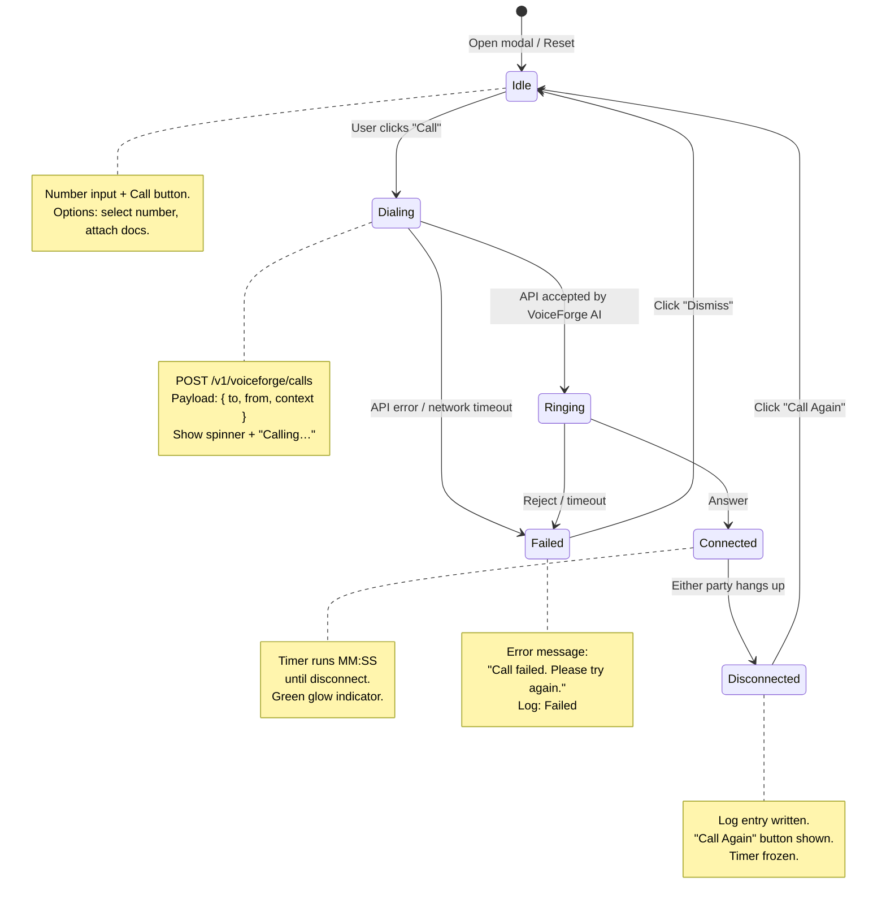

# VOICE-COMM — Core Voice Communication UI/UX Specification

## 1. Purpose

This document defines the **shared core** of the Voice Communication system — reusable across any discipline that needs to place calls (Procurement → vendors, Logistics → carriers, Safety → emergency contacts, etc.). Discipline-specific projects override only their unique sections.

### 1.1 Contract

Implementations **MUST**:
- Use the shared modal container (`VoiceCall`, 98vw, z-index 1600)
- Implement the full state machine (Idle → Dialing → Ringing → Connected → Disconnected)
- Support the multi-number selection pattern
- Support the document attachment pattern
- Integrate with VoiceForge AI
- Log all calls to the shared audit log

Implementations **MAY** override:
- Phone number sources (which table/API provides numbers)
- Document types and document sources
- Trigger workflow (what launches the call)
- Role visibility gate (who can call)
- Discipline-specific UI labels and inline documentation sources

### 1.2 Document Structure

| Section | Content |
|---------|---------|
| Part A | Template Classification — Template A (Simple/Modal-Focused) |
| Part B | Shared Color Scheme — Call status colours, modal states |
| Part C | Shared Modal Specification — Container, state machine, number selection, document attachment |
| Part D | Shared Mermaid State Diagram — Complete call state machine |
| Part E | Shared Screen States — Loading, Active, Empty, Error |
| Part F | Integration Contract — VoiceForge AI, audit logging, discipline overrides |

---

## Part A: Template Classification

| Field | Value |
|-------|-------|
| Template | A (Simple/Modal-Focused) |
| Rationale | The voice call system is a single-function overlay launched from within any discipline's workspace. It does not require its own page; all interaction occurs inside a modal dialog. |
| CSS Prefix | `A-voice-core-*` |

**Template A characteristics:**
- Single modal entry point — no standalone page navigation.
- Lightweight state machine managed entirely client-side.
- No persistent URL routing — modal is mounted/unmounted by parent workspace.
- All styles namespaced under `A-voice-core-*`.

---

## Part B: Shared Color Scheme

### Call Status Semantic Colours

| Status | Colour | Hex Code | CSS Effect | Overridable |
|--------|--------|----------|------------|-------------|
| Dialing | Orange | `#FF9800` | Pulsing animation (opacity 0.6 → 1.0) | No |
| Connected | Green | `#4CAF50` | Soft glow box-shadow + steady fill | No |
| Ringing | Blue | `#2196F3` | Rotating ring border animation | No |
| Disconnected | Grey | `#9E9E9E` | Dimmed opacity 0.45, no animation | No |
| End Call | Red | `#E53935` | White handset icon | No |

### Discipline Accent Colours

Discipline overrides may define a header accent that appears alongside the shared status colours:

| Consumer | Discipline | Accent | Hex Code |
|----------|------------|--------|----------|
| Default | — | Teal | `#00897B` |
| Procurement | 01900 | Teal | `#00897B` |
| Logistics | 01700 | Blue | `#1565C0` |
| Safety | 02400 | Orange | `#E65100` |
| Contracts | 00400 | Indigo | `#283593` |
| Contracts Pre-Award | 00425 | Deep Purple | `#4527A0` |
| Contracts Post-Award | 00435 | Purple | `#7B1FA2` |
| Quantity Surveying | 02025 | Cyan | `#00838F` |
| Engineering (shared) | All eng. | Green | `#2E7D32` |

### Usage Rules

1. Status indicator dot uses the Call Status Semantic Colour matching current call phase.
2. The modal border-left accent strip (4px) shows the Discipline Accent Colour.
3. Text labels for status rendered in the corresponding semantic colour at full opacity.
4. End Call button is always `#E53935` (red) with white `✕` icon.

---

## Part C: Shared Modal Specification

### C.1 Modal Container

| Property | Value | Overridable |
|----------|-------|-------------|
| Component Name | `VoiceCall` | No |
| Width | `98vw` | No |
| Max Width | `1200px` | Yes |
| z-index | `1600` | No |
| Trigger | Discipline-specific workflow | Yes |
| Backdrop | `rgba(0,0,0,0.55)` | Yes |
| Close while connected | Blocked (Escape, backdrop click) | No |

### C.2 Modal Header

All implementations MUST render:
- **Discipline identifier badge** — overridable (e.g., "Procurement", "Logistics", "Safety")
- **Contact name** — provided by parent always
- **Context label** — overridable (e.g., "Outreach Call", "Dispatch Call", "Emergency Call")
- **Close button** — disabled during Connected state

### C.3 Call Button Visibility Gate

The discipline project defines the gate:

```
user.role >= {discipline_specific_role}
```

The gate is configured by each discipline override. Default (no override): `user.role >= 'editor'`.

### C.4 Call States

| State | Description | Duration Limit | Side Effects |
|-------|-------------|----------------|--------------|
| Idle | No call in progress. Number input + Call button visible. | — | — |
| Dialing | Outbound request sent to VoiceForge API. Spinner replaces Call button. | 5s timeout | `POST /v1/voiceforge/calls` |
| Ringing | Supplier's phone ringing, awaiting answer. | 30s timeout | Websocket `call.ringing` |
| Connected | Call answered. Duration timer running (MM:SS). | — | Websocket `call.answered` |
| Disconnected | Call ended (either party hung up). Timer frozen. | — | `POST /v1/voiceforge/calls/{id}/end` |
| Failed | API error, network timeout, or rejected. | — | Error message banner |

### C.5 Shared Components

#### C.5.1 Phone Number Display
- Editable text input with automatic masking and country code prefix dropdown.
- Pre-populated with primary phone number from discipline-specific source.
- Validation: must match selected country code pattern.

#### C.5.2 Call Duration Timer
- Format: `MM:SS` (monospace `'Courier New', monospace`, `1.25rem`).
- Starts from `00:00` on Connected.
- Freezes on Disconnected.

#### C.5.3 Status Indicator
- `16px × 16px` circle filled with current semantic colour.
- Text label to the right (e.g., "Connected").
- Animations per Part B.

#### C.5.4 End Call Button
- Red (`#E53935`) circular button with white handset icon.
- Visible only during Dialing, Ringing, Connected.
- Disabled during Idle and Disconnected.

#### C.5.5 Call History Log
- Scrollable list (`max-height: 240px`).
- Each entry: ISO timestamp + duration + outcome (Connected, No Answer, Failed, Busy).
- Most recent call at top.
- Empty state when no calls logged.

### C.6 Number Selection — Multi-Number Handling (Shared)

#### C.6.1 Data Model

```typescript
interface PhoneNumberOption {
  value: string;           // E.164 format
  label: string;           // Display formatted
  source: 'primary_contact' | 'mobile' | 'site_office' | 'contact_person' | 'other';
  sourceLabel: string;     // Human-readable (e.g., "📞 Primary Contact")
  entityContactId?: string;
  isPrimary: boolean;
}
```

#### C.6.2 Selection UX

1. **Load numbers**: Source depends on discipline override. The discipline project provides a `getPhoneNumbers(entityId)` function.
2. **Auto-select**: The number marked `isPrimary: true` is pre-selected.
3. **Dropdown**: All available numbers rendered as `(sourceLabel) (formatted value)`.
4. **Source indicators**:
   - `📞 Primary Contact` — office line
   - `📱 Mobile Contact` — mobile / WhatsApp
   - `🏢 Site Office` — site office line
   - `👤 Contact Person` — individual contact direct line
5. **Manual override**: User can type any number directly into the input.
6. **No-number fallback**: If no numbers exist, Call button is disabled. Warning: *"No phone number on file. Add a number to place a call."* + inline "Add Number" button.

#### C.6.3 API Payload

```json
{
  "to": "{{selectedPhoneNumber.value}}",
  "from": "{{platformOutboundId}}",
  "context": {
    "entityId": "{{entityId}}",
    "workflowId": "{{triggerWorkflowId}}",
    "userId": "{{currentUserId}}",
    "discipline": "{{disciplineCode}}",
    "documents": []
  }
}
```

### C.7 Document Attachment for Call Context (Shared)

#### C.7.1 Data Model

```typescript
interface CallDocumentAttachment {
  id: string;
  label: string;            // Short context label (e.g., "RFQ reference")
  type: 'pdf' | 'docx' | 'xlsx' | 'image';
  url: string;
  pageCount?: number;
  sizeBytes: number;
  source: 'workspace' | 'workflow' | 'profile' | 'upload';
}
```

#### C.7.2 Limits

| Limit | Value |
|-------|-------|
| Max files per call | 3 |
| Max file size | 10MB |
| Supported types | PDF, .docx, .xlsx, .jpg, .png |

#### C.7.3 Context Panel

- Collapsible "Context for this call" section at the top of the modal, above the phone input.
- Attached documents list with name, page count, remove button (+ remove all).
- "Add Document" button opens a discipline-specific document picker.

#### C.7.4 Document Sources (Overridable)

The discipline project provides a `getCallDocumentSources()` function that returns documents relevant to that discipline. See each consumer's spec for the actual sources.

#### C.7.5 Purpose Labels

Each attached document can have a short context label:
- "RFQ reference"
- "BOQ clarification"
- "Site instructions"
- "Schedule change"
- "Compliance query"

Labels are overridable per discipline.

#### C.7.6 API Payload with Documents

```json
{
  "to": "...",
  "context": {
    "documents": [
      { "id": "doc-123", "label": "RFQ reference", "url": "/api/documents/doc-123", "type": "pdf" }
    ]
  }
}
```

#### C.7.7 VoiceForge AI Behaviour

Attached documents are processed by VoiceForge AI's context engine before call connection. The AI assistant can reference documents during the call (e.g., "Referencing the RFQ you uploaded, I'd like to clarify section 3.2...").

#### C.7.8 Persistence

Documents persist in the call log entry so future callers see what context was used.

---

## Part D: Shared Mermaid State Diagram



### State Transition Table

| From | Event | To | Side Effects |
|------|-------|----|--------------|
| Idle | Click "Call" | Dialing | Disable input, show spinner, POST VoiceForge |
| Dialing | API 200 | Ringing | Show "Ringing…", start ring timeout |
| Dialing | API error / timeout | Failed | Show error toast, enable dismiss |
| Ringing | WebSocket `call.answered` | Connected | Start timer, green status, enable End Call |
| Ringing | WebSocket `call.rejected` | Failed | "No answer" message, log as No Answer |
| Connected | Click "End Call" | Disconnected | Stop timer, POST end |
| Connected | Remote hang-up | Disconnected | Stop timer, log |
| Disconnected | Click "Call Again" | Dialing | Reset, re-initialise |
| Failed | Click "Dismiss" | Idle | Clear error, enable input |

---

## Part E: Shared Screen States

| State | Trigger | Visual | User Action |
|-------|---------|--------|-------------|
| Loading | Dialing / Ringing | 48px teal spinner + "Connecting…" / "Ringing…" | Wait or End Call |
| Active | Connected | Timer (MM:SS), green dot, End Call button, call history | Speak, click End Call |
| Empty | No call history | Grey phone icon + "No previous calls" | Click Call |
| Error | API fail / reject | Red banner + err msg + Dismiss + Retry | Dismiss and retry |

---

## Part F: Integration Contract

### F.1 VoiceForge AI

| Integration | Detail |
|-------------|--------|
| Endpoint | `POST /v1/voiceforge/calls` |
| Payload | See C.6.3 / C.7.6 |
| WebSocket | `call.answered`, `call.rejected`, `call.failed`, `call.completed` |
| Auth | Bearer token scoped to `voice:call` |
| Timeout | Ringing: 30s |
| Error 4xx | Failed state with user-facing message |
| Error 5xx | Failed state + "Service temporarily unavailable" |

### F.2 Discipline Override Specification

Each consumer project MUST document these overrides:

| Override | Type | Description |
|----------|------|-------------|
| `entityId` source | Function | How to get the target entity (supplier, carrier, contact) ID |
| `getPhoneNumbers()` | Function | Source of phone numbers (table, API) |
| `getCallDocumentSources()` | Function | Source of documents for context |
| `triggerWorkflow` | String | Which workflow launches the call |
| `roleGate` | Expression | Minimum role to place a call |
| `disciplineCode` | String | Code for audit logging (e.g., "01900", "01700") |
| `accentColour` | Hex | Discipline accent for modal header |
| `contextLabels` | String[] | Available document purpose labels |

### F.3 Audit Log

All calls MUST be logged with:
- Discipline code
- Entity ID and name
- Phone number dialed
- Timestamp (start, end)
- Duration
- Outcome (Connected, No Answer, Failed, Busy)
- Attached document IDs
- User who placed the call
- Workflow ID that triggered the call

---

## Version History

| Version | Date | Changes |
|---------|------|---------|
| 1.0 | 2026-04-29 | Initial shared core specification |

---

**Document Information**
- **Author**: Cross-Discipline Voice Communication System
- **Date**: 2026-04-29
- **Status**: Active