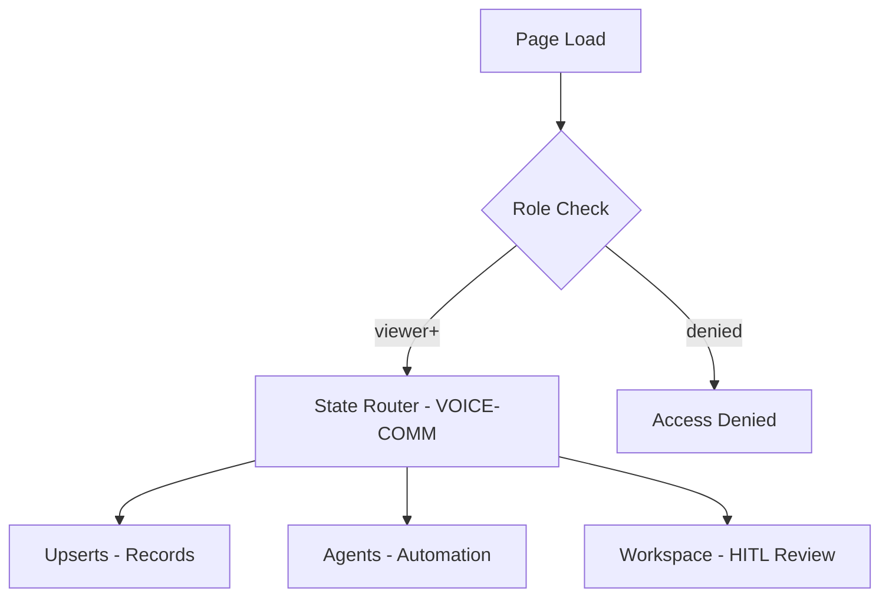

# VOICE-COMM — voice-communication UI/UX Specification

## Override: voice-communication Pattern

### 1. Override Summary

| Aspect | Value |
|--------|-------|
| **Project** | VOICE-COMM |
| **Discipline** | voice-communication |
| **Extends** | [voice-communication](UI-UX-SPECIFICATION.md) |
| **Spec Type** | Override — lean spec referencing parent pattern |
| **Issue Count** |        7 |
| **Color** | #4A148C / #AB47BC |

### 2. Scope

This project implements domain-specific workflow automation within the voice-communication domain.
All UX patterns, three-state button rules, mermaid flow diagrams, implementation standards,
screen specifications, AI model backend, and agent knowledge ownership rules follow the
voice-communication discipline-level UI-UX-SPECIFICATION.md, with the following project-specific overrides.

### 3. Workflow Overrides

### 4. Entity / Data Sources

| Entity | Source | Description |
|--------|--------|-------------|
| Records | API | Domain records managed via Upserts |
| Agents | API | Automation agents for VOICE-COMM |
| Reviews | API | HITL review queue |

### 5. Role Gates

| Role | Gate | Access |
|------|------|--------|
| Viewer | `viewer` | View only |
| Editor | `editor` | Create / Edit / Import |
| Reviewer | `reviewer` | Approve / Reject |
| Governance | `governance` | Delete / Config |

### 6. Associated Issues

  - `_A_QA`
  - `of`
  - `ISSUE-GENERATION-STATUS`
  - `_A_QA`
  - `of`
  - `VOICE-COMM-001-core-voice-call-interface`
  - `_A_QA`
  - `of`
  - `VOICE-COMM-002-hitl-approval-workflow`
  - `_A_QA`
  - `of`
  - `VOICE-COMM-003-document-attachment-system`
  - `_A_QA`
  - `of`
  - `VOICE-COMM-004-audit-logging-system`
  - `_A_QA`
  - `of`
  - `VOICE-COMM-101-mobile-voice-call-screen`
  - `_A_QA`
  - `of`
  - `VOICE-COMM-102-mobile-document-attachment`

### 7. Testing Checklist

- [ ] Upserts: Create, Edit, Delete workflows functional
- [ ] Agents: Agent status and configuration visible
- [ ] Workspace: HITL review queue operational
- [ ] Role gates: viewer, editor, reviewer, governance enforced
- [ ] Chatbot: stateAware chatbot integrated (z-index 1500)

---

**Version**: 1.0 | **Date**: 2026-04-29
