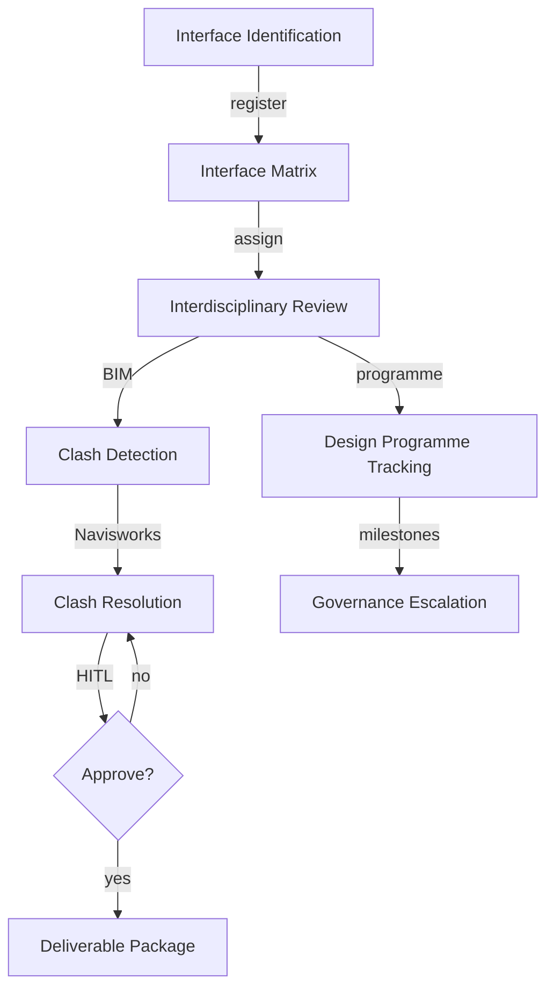
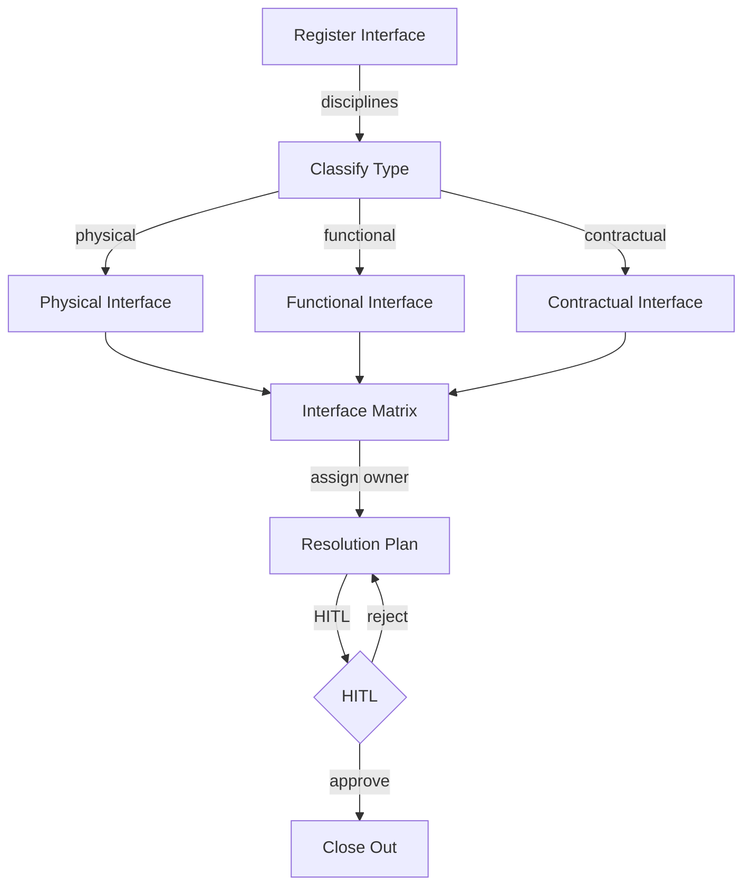

# DESIGN-WORKFLOW — Design Coordination Workflow UI/UX Specification

## Table of Contents

1. [Part A: UX Patterns](#part-a-ux-patterns)
2. [Part B: Three-State Button & Modal Rules](#part-b-three-state-button--modal-rules)
3. [Part C: Mermaid UI Flow Diagrams](#part-c-mermaid-ui-flow-diagrams)
4. [Part D: Implementation Standards](#part-d-implementation-standards)
5. [Part E: Screen Specifications](#part-e-screen-specifications)
6. [Part F: AI Model Backend](#part-f-ai-model-backend)
7. [Part G: Agent Knowledge Ownership](#part-g-agent-knowledge-ownership)

---

## Part A: UX Patterns

### Page Classification

**Template Type**: **Template B** (Complex / Three-State)

**Why Template B**:
- Multi-State Navigation: Agents, Upserts, Workspace
- Multi-Purpose Functionality: Interface management, interdisciplinary review, design programme, architectural integration, engineering integration matrix, clash detection, team communication, governance escalation
- Complex Workflows: Design coordination lifecycle from interface identification through BIM clash resolution
- CSS Class Convention: `A-DES-*` prefix

### Information Architecture

**Accordion Section**: Design (display_order: 800)
**Route**: `/design-workflow`

### Color Scheme — Pink

```css
:root {
  --template-a-primary: #FF69B4;
  --template-a-secondary: #FFB6C1;
  --template-a-accent: #DB7093;
  --template-a-bg-gradient: linear-gradient(135deg, #fce4ec 0%, #f8bbd0 100%);
  --template-a-header-gradient: linear-gradient(135deg, #DB7093 0%, #FFB6C1 100%);
  --template-a-text-white: #ffffff;
  --template-a-shadow-lg: 0 8px 24px rgba(255, 105, 180, 0.3);
}
```

### HITL Integration

1. AI Agent performs design coordination actions (clash detection, interface matrix updates, review routing)
2. Work enters HITL Review Queue
3. Design Coordinator reviews: Approve / Reject with Feedback / Manual Override

---

## Part B: Three-State Button & Modal Rules

| State | Button | Gate | Modal |
|-------|--------|------|-------|
| Agents | View Details | Always | AgentDetails (98vw) |
| Upserts | Create New | editor | CreateRecord |
| Upserts | Import | editor | Import (BIM/IFC) |
| Upserts | Edit | editor | EditRecord |
| Upserts | Delete | governance | Confirmation |
| Workspace | Approve | reviewer | Approval |
| Workspace | Reject | reviewer | Rejection |
| Workspace | Generate Report | Always | Export |

---

## Part C: Mermaid UI Flow Diagrams

### Design Coordination Lifecycle



### Interface Management Flow



---

## Part D: Implementation Standards

**CSS Import**: `@import "../../templates/template-a-standard.css";`
**Class Prefix**: `A-DES-*`

**Chatbot**: `{ chatType: "agent", stateAware: true, zIndex: 1500, modelEndpoint: "/api/chat/design-workflow" }`

---

## Part E: Screen Specifications

```
┌──────────────────────────────────────────────┐
│ [Pink Header] DESIGN-WORKFLOW [Chatbot]       │
├──────────────────────────────────────────────┤
│ Agents | Upserts | Workspace                  │
│ ┌──────────┐ ┌──────────┐ ┌──────────┐       │
│ │ Design   │ │ BIM      │ │ Interface│       │
│ │ Coord.   │ │ Manager  │ │ Analyst  │       │
│ │ ● Active │ │ ● Active │ │ ● Active │       │
│ └──────────┘ └──────────┘ └──────────┘       │
└──────────────────────────────────────────────┘
```

---

## Part F: AI Model Backend

**Base Model**: Qwen 2.5 | **LoRA**: BIM coordination, clash detection, interface management
**Endpoint**: `/api/chat/design-workflow`

---

## Part G: Agent Knowledge Ownership

| Company | Role |
|---------|------|
| DomainForge AI | Domain Validation |
| QualityForge AI | Testing |
| DevForge AI | Implementation |

---

**Version**: 1.0 | **Date**: 2026-04-29 | **Status**: Active
