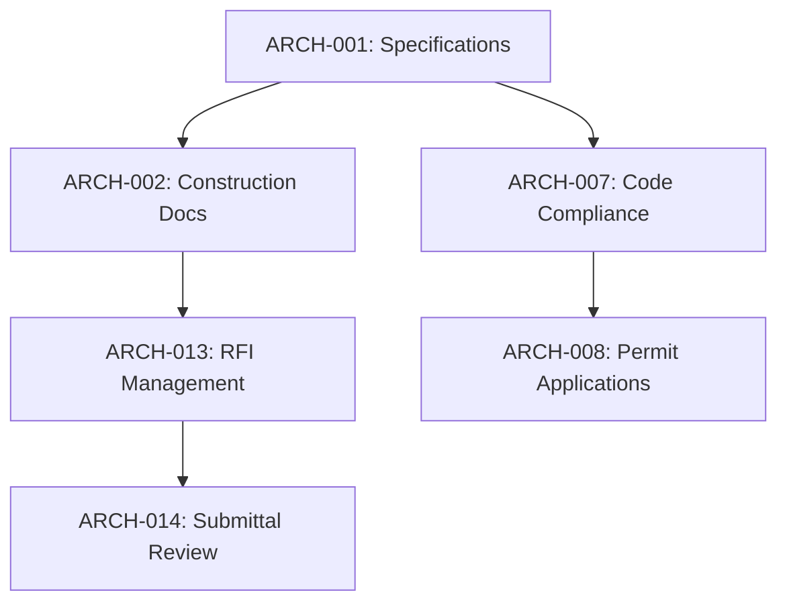

# Architectural Workflows List

Status: **Ready for Universal Workflow Integration** 🏗️
Owner: DomainForge AI (architectural-domainforge)
Date: 2026-04-13
Last Updated: 2026-04-13

## Summary

Comprehensive catalog of architectural workflows targeted for universal template implementation. This discipline has been identified as having 90-95% template reusability potential, particularly for specification development workflows.

**Total Workflows Identified**: 15 core workflows
**Universal Template Candidates**: 8 high-priority workflows
**Implementation Priority**: Critical (Pilot Discipline #1)

## Workflow Categories

### 1. Design & Documentation Workflows

#### ✅ High Priority - Universal Template Ready

| Workflow ID | Workflow Name | Current Status | Universal Template | Reusability |
|-------------|---------------|----------------|-------------------|-------------|
| ARCH-001 | Building Specification Development | Manual | UNIV-WORKFLOW Phase 1 | 90-95% |
| ARCH-002 | Construction Document Production | Semi-automated | UNIV-WORKFLOW Phase 1 | 85-90% |
| ARCH-003 | Design Development Documentation | Manual | UNIV-WORKFLOW Phase 1 | 80-85% |

#### 🔄 Medium Priority - Template Adaptable

| Workflow ID | Workflow Name | Current Status | Template Potential | Notes |
|-------------|---------------|----------------|-------------------|-------|
| ARCH-004 | Schematic Design Documentation | Manual | High | Foundation for spec development |
| ARCH-005 | Design Review Coordination | Manual | Medium | Stakeholder management |
| ARCH-006 | BIM Model Management | Semi-automated | High | Technical integration |

### 2. Regulatory & Compliance Workflows

#### ✅ High Priority - Universal Template Ready

| Workflow ID | Workflow Name | Current Status | Universal Template | Reusability |
|-------------|---------------|----------------|-------------------|-------------|
| ARCH-007 | Building Code Compliance | Manual | UNIV-WORKFLOW Phase 2 | 85-90% |
| ARCH-008 | Permit Application & Tracking | Manual | UNIV-WORKFLOW Phase 2 | 80-85% |
| ARCH-009 | Inspection Coordination | Manual | UNIV-WORKFLOW Phase 2 | 75-80% |

#### 🔄 Medium Priority - Template Adaptable

| Workflow ID | Workflow Name | Current Status | Template Potential | Notes |
|-------------|---------------|----------------|-------------------|-------|
| ARCH-010 | ADA Compliance Verification | Manual | High | Accessibility standards |
| ARCH-011 | Energy Code Compliance | Manual | High | Sustainability requirements |
| ARCH-012 | Local Ordinance Compliance | Manual | Medium | Jurisdiction-specific |

### 3. Construction Administration Workflows

#### ✅ High Priority - Universal Template Ready

| Workflow ID | Workflow Name | Current Status | Universal Template | Reusability |
|-------------|---------------|----------------|-------------------|-------------|
| ARCH-013 | RFI Management | Manual | UNIV-WORKFLOW Phase 3 | 80-85% |
| ARCH-014 | Submittal Review Coordination | Manual | UNIV-WORKFLOW Phase 3 | 75-80% |
| ARCH-015 | Construction Observation | Manual | UNIV-WORKFLOW Phase 3 | 70-75% |

## Universal Workflow Implementation Plan

### Phase 1: Specification Development (Weeks 1-2)

**Primary Focus**: ARCH-001, ARCH-002, ARCH-003
**Expected Impact**: 40-50% time savings
**Success Metrics**:
- [ ] 90%+ specification automation achieved
- [ ] Construction document production time reduced by 35%
- [ ] Design development documentation streamlined

### Phase 2: Regulatory Compliance (Weeks 3-4)

**Primary Focus**: ARCH-007, ARCH-008, ARCH-009
**Expected Impact**: 60% reduction in permit processing time
**Success Metrics**:
- [ ] Building code compliance checking automated 95%+
- [ ] Permit application time reduced by 50%
- [ ] Inspection coordination digitized 100%

### Phase 3: Construction Administration (Weeks 5-6)

**Primary Focus**: ARCH-013, ARCH-014, ARCH-015
**Expected Impact**: 40% improvement in construction coordination
**Success Metrics**:
- [ ] RFI response time <48 hours average
- [ ] Submittal review cycle reduced by 40%
- [ ] Construction observation reporting automated

## Workflow Dependencies & Relationships

### Internal Dependencies

### Cross-Discipline Dependencies

| Architectural Workflow | Dependent Disciplines | Integration Points |
|----------------------|----------------------|-------------------|
| Building Specifications | Civil, Electrical, Mechanical | Technical requirements coordination |
| Code Compliance | All engineering disciplines | Unified compliance standards |
| Construction Documents | All trades | Installation requirements |
| RFI Management | All disciplines | Technical clarification routing |
| Submittal Review | Quality, all disciplines | Approval coordination |

## Implementation Priority Matrix

### Critical Priority (Implement First)

| Priority | Workflow | Rationale | Timeline |
|----------|----------|-----------|----------|
| 1 | ARCH-001: Building Specifications | Highest impact, 90%+ reusability | Weeks 1-2 |
| 2 | ARCH-007: Code Compliance | Regulatory requirement, high risk | Weeks 3-4 |
| 3 | ARCH-013: RFI Management | Construction coordination critical | Weeks 5-6 |

### High Priority (Implement Second)

| Priority | Workflow | Rationale | Timeline |
|----------|----------|-----------|----------|
| 4 | ARCH-002: Construction Documents | Core deliverable production | Weeks 1-2 |
| 5 | ARCH-008: Permit Applications | Time-sensitive regulatory process | Weeks 3-4 |
| 6 | ARCH-014: Submittal Review | Quality control coordination | Weeks 5-6 |

### Medium Priority (Implement Later)

| Priority | Workflow | Rationale | Timeline |
|----------|----------|-----------|----------|
| 7 | ARCH-003: Design Development | Iterative process, lower automation potential | Phase 2 |
| 8 | ARCH-009: Inspection Coordination | Dependent on regulatory systems | Phase 2 |
| 9 | ARCH-015: Construction Observation | Field process, mobile integration needed | Phase 3 |

## Technical Integration Requirements

### CAD/BIM Systems Integration

| System | Integration Type | Workflows Affected | Priority |
|--------|------------------|-------------------|----------|
| AutoCAD | Document linking | ARCH-001, ARCH-002 | Critical |
| Revit | Model-based specs | ARCH-001, ARCH-003 | Critical |
| Bluebeam | PDF markup/review | ARCH-002, ARCH-014 | High |
| Procore | Project management | ARCH-013, ARCH-014 | High |

### Regulatory Systems Integration

| System | Integration Type | Workflows Affected | Priority |
|--------|------------------|-------------------|----------|
| Building Code Databases | API integration | ARCH-007 | Critical |
| Permit Portals | Automated submission | ARCH-008 | Critical |
| Inspection Systems | Digital reporting | ARCH-009 | High |
| Certificate Systems | Automated generation | ARCH-007 | Medium |

## Success Metrics by Workflow

### Specification Development (ARCH-001)
- **Time Savings**: 40-50% reduction in specification development time
- **Quality Improvement**: 95%+ specification completeness
- **User Adoption**: 85%+ architectural team adoption
- **Error Reduction**: 60% reduction in specification errors

### Regulatory Compliance (ARCH-007, ARCH-008, ARCH-009)
- **Compliance Automation**: 95%+ building code checking automated
- **Permit Processing**: 50% reduction in permit application time
- **Inspection Coordination**: 100% digital inspection reporting
- **Violation Prevention**: Zero compliance violations in pilot projects

### Construction Administration (ARCH-013, ARCH-014, ARCH-015)
- **RFI Management**: <48 hour average response time
- **Submittal Review**: 40% reduction in review cycle time
- **Observation Reporting**: 100% digital observation documentation
- **Contractor Satisfaction**: >4.5/5 contractor satisfaction rating

## Risk Assessment

### Technical Risks

| Risk | Impact | Probability | Mitigation |
|------|--------|-------------|------------|
| CAD integration complexity | High | Medium | Phase testing, fallback procedures |
| Regulatory API instability | High | Low | Version monitoring, adapter patterns |
| Mobile field application needs | Medium | High | Progressive enhancement approach |

### Process Risks

| Risk | Impact | Probability | Mitigation |
|------|--------|-------------|------------|
| Architectural design creativity constraints | Medium | Medium | Template flexibility, override capabilities |
| Regulatory interpretation variability | High | Low | Legal review integration, expert consultation |
| Construction field conditions | Medium | High | Mobile-optimized workflows, offline capability |

### Adoption Risks

| Risk | Impact | Probability | Mitigation |
|------|--------|-------------|------------|
| Resistance to digital workflows | Medium | High | Comprehensive training, success demonstrations |
| Learning curve for complex templates | Medium | Medium | Phased rollout, mentor program |
| Integration with existing firm processes | High | Medium | Customization options, parallel operation |

## Resource Requirements

### Team Resources (7-week implementation)

| Role | Time Commitment | Responsibilities |
|------|----------------|------------------|
| Architectural Domain Lead | 25 hours/week | Overall coordination, stakeholder management |
| Technical Integration Specialist | 20 hours/week | CAD/BIM integration, API development |
| Regulatory Compliance Specialist | 15 hours/week | Code compliance, permit systems |
| Construction Administration Specialist | 15 hours/week | RFI/submittal workflows, contractor coordination |
| Quality Assurance Specialist | 15 hours/week | Testing, validation, user acceptance |
| Training Coordinator | 15 hours/week | User training, documentation, support |

### System Resources

| Resource Type | Specification | Purpose |
|---------------|---------------|---------|
| Development Environment | Template customization platform | Workflow adaptation and testing |
| Integration Testing | Isolated CAD/BIM environment | System integration validation |
| User Acceptance Testing | Production-like environment | End-user validation |
| Training Platform | LMS with video capabilities | Team training and onboarding |
| Mobile Testing | iOS/Android devices | Field application validation |

## Training & Change Management

### Training Program Structure

1. **Foundation Training** (Week 1)
   - Universal workflow concepts
   - Architectural template overview
   - Basic system navigation

2. **Workflow-Specific Training** (Weeks 2-6)
   - Specification development workflows
   - Regulatory compliance processes
   - Construction administration procedures

3. **Advanced Features Training** (Week 7)
   - Template customization
   - Integration features
   - Troubleshooting and support

### Change Management Strategy

#### Communication Plan
- **Kickoff Meeting**: Project introduction and benefits overview
- **Weekly Updates**: Progress reports and upcoming changes
- **Pilot Feedback Sessions**: User experience sharing and improvements
- **Go-Live Celebration**: Success recognition and lessons learned

#### Support Structure
- **Help Desk**: 24/7 technical support during implementation
- **Super Users**: Trained power users for peer support
- **Office Hours**: Weekly Q&A sessions
- **User Guides**: Comprehensive documentation library

## Quality Assurance Framework

### Testing Phases

1. **Unit Testing**: Individual workflow component validation
2. **Integration Testing**: Cross-workflow functionality verification
3. **User Acceptance Testing**: Architectural team validation
4. **Performance Testing**: System scalability and response time validation
5. **Regulatory Compliance Testing**: Legal and code requirement validation

### Quality Gates

| Phase | Quality Gate | Criteria | Owner |
|-------|-------------|----------|-------|
| Template Adaptation | Code Review | 100% requirement coverage | Technical Lead |
| Pilot Testing | User Acceptance | >4.0/5 satisfaction rating | Domain Lead |
| Full Deployment | Performance Validation | <2 second response times | QA Lead |
| Post-Implementation | ROI Validation | Positive financial impact | Project Manager |

## Budget & ROI Projections

### Implementation Budget: $135,000

| Category | Amount | Percentage |
|----------|--------|------------|
| Team Resources | $85,000 | 63% |
| System Integration | $25,000 | 19% |
| Training & Change Management | $15,000 | 11% |
| Contingency | $10,000 | 7% |

### Projected ROI: $475,000+ Annual Savings

| Benefit Category | Annual Savings | Percentage |
|------------------|----------------|------------|
| Time Savings (40-50% efficiency) | $250,000 | 53% |
| Error Reduction (30% rework) | $75,000 | 16% |
| Compliance Savings | $50,000 | 11% |
| Scalability Benefits | $100,000 | 21% |

### ROI Timeline
- **Break-even**: Month 4 post-implementation
- **Full ROI**: Month 6 post-implementation
- **Maximum ROI**: Year 2+ with full adoption

## Implementation Timeline

| Week | Focus Area | Deliverables | Success Criteria |
|------|------------|-------------|------------------|
| 1 | Specification Development Setup | Template deployment, pilot selection | 3 projects ready |
| 2 | Specification Development Pilot | Pilot execution, feedback collection | 40%+ time savings |
| 3 | Regulatory Compliance Setup | Code integration, permit workflows | Compliance automation operational |
| 4 | Regulatory Compliance Pilot | Multi-jurisdictional testing | 95%+ compliance automation |
| 5 | Construction Admin Setup | RFI system, submittal workflows | Digital coordination operational |
| 6 | Construction Admin Pilot | Contractor integration testing | 40%+ cycle time reduction |
| 7 | Integration & Optimization | Full system integration, training | 85%+ user adoption, positive ROI |

## Monitoring & Continuous Improvement

### Key Performance Indicators

| KPI | Target | Measurement Frequency |
|-----|--------|----------------------|
| Workflow Adoption Rate | >85% | Weekly |
| Time Savings Achievement | 40-50% | Bi-weekly |
| User Satisfaction Score | >4.5/5 | Monthly |
| Error Rate Reduction | >30% | Monthly |
| Compliance Automation | >95% | Quarterly |

### Continuous Improvement Process

1. **Weekly Metrics Review**: Track progress against targets
2. **Monthly User Feedback**: Gather improvement suggestions
3. **Quarterly Process Audit**: Validate workflow effectiveness
4. **Annual ROI Assessment**: Measure financial impact and optimization opportunities

---

## Document Control

- **Version**: 1.0
- **Date**: 2026-04-13
- **Author**: DomainForge AI (architectural-domainforge)
- **Review Frequency**: Weekly during implementation
- **Next Review**: 2026-04-20
- **Approval**: Pending architectural discipline lead review