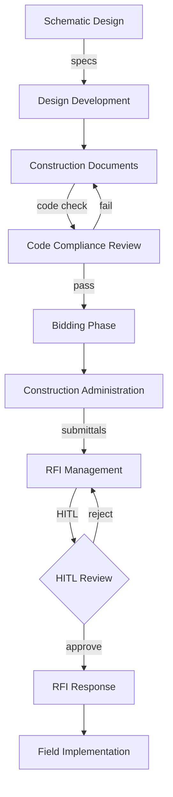
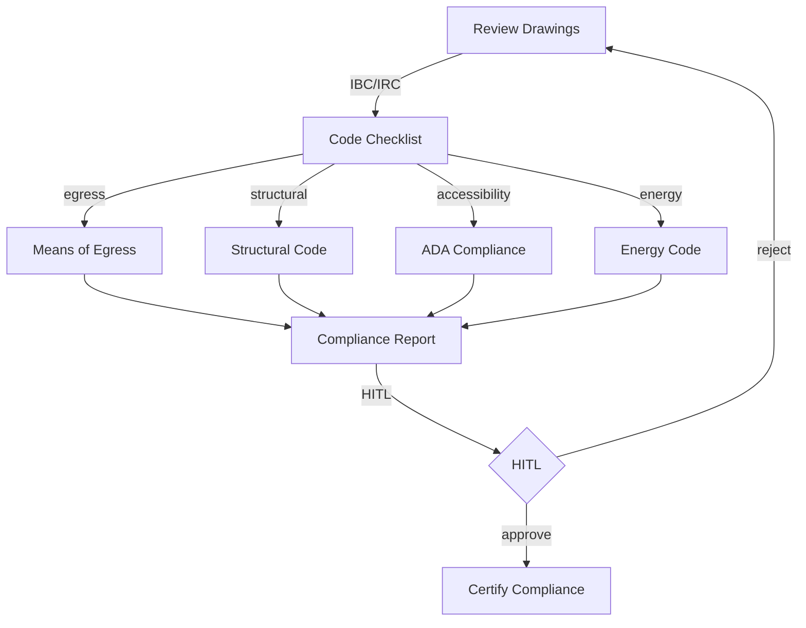

# ARCHITECTURAL-WORKFLOW — Architectural Workflow UI/UX Specification

## Table of Contents

1. [Part A: UX Patterns](#part-a-ux-patterns)
2. [Part B: Three-State Button & Modal Rules](#part-b-three-state-button--modal-rules)
3. [Part C: Mermaid UI Flow Diagrams](#part-c-mermaid-ui-flow-diagrams)
4. [Part D: Implementation Standards](#part-d-implementation-standards)
5. [Part E: Screen Specifications](#part-e-screen-specifications)
6. [Part F: AI Model Backend](#part-f-ai-model-backend)
7. [Part G: Agent Knowledge Ownership](#part-g-agent-knowledge-ownership)

---

## Part A: UX Patterns

### Page Classification

**Template Type**: **Template B** (Complex / Three-State)

**Why Template B**:
- Multi-State Navigation: Agents, Upserts, Workspace
- Multi-Purpose Functionality: Building specifications, code compliance, RFI/submittal management
- Complex Workflows: Architectural documentation from schematic design through construction admin
- CSS Class Convention: `A-ARCH-*` prefix

### Information Architecture

**Accordion Section**: Architectural (display_order: 825)
**Route**: `/architectural-workflow`

### Color Scheme — Steel Blue

```css
:root {
  --template-a-primary: #4682B4;
  --template-a-secondary: #5B9BD5;
  --template-a-accent: #2C5F8A;
  --template-a-bg-gradient: linear-gradient(135deg, #e8f0fe 0%, #d0e1f9 100%);
  --template-a-header-gradient: linear-gradient(135deg, #2C5F8A 0%, #5B9BD5 100%);
  --template-a-text-white: #ffffff;
  --template-a-shadow-lg: 0 8px 24px rgba(70, 130, 180, 0.3);
}
```

### HITL Integration

1. AI Agent performs specification drafting, code review, RFI response drafting
2. Work enters HITL Review Queue
3. Architect reviews: Approve / Reject with Feedback / Manual Override

---

## Part B: Three-State Button & Modal Rules

| State | Button | Gate | Modal |
|-------|--------|------|-------|
| Agents | View Details | Always | AgentDetails (98vw) |
| Upserts | Create New | editor | CreateRecord |
| Upserts | Import | editor | Import (CSV/DWG) |
| Upserts | Edit | editor | EditRecord |
| Upserts | Delete | governance | Confirmation |
| Workspace | Approve | reviewer | Approval |
| Workspace | Reject | reviewer | Rejection |
| Workspace | Generate Report | Always | Export |

---

## Part C: Mermaid UI Flow Diagrams

### Architectural Workflow Lifecycle



### Code Compliance Flow



---

## Part D: Implementation Standards

**CSS Import**: `@import "../../templates/template-a-standard.css";`
**Class Prefix**: `A-ARCH-*`

**Chatbot**: `{ chatType: "agent", stateAware: true, zIndex: 1500, modelEndpoint: "/api/chat/arch" }`

---

## Part E: Screen Specifications

```
┌──────────────────────────────────────────────┐
│ [Steel Blue Header] ARCHITECTURAL-WORKFLOW    │
├──────────────────────────────────────────────┤
│ Agents | Upserts | Workspace                  │
│ ┌──────────┐ ┌──────────┐ ┌──────────┐       │
│ │ Spec     │ │ Code     │ │ RFI      │       │
│ │ Writer   │ │ Reviewer │ │ Manager  │       │
│ │ ● Active │ │ ● Active │ │ ● Active │       │
│ └──────────┘ └──────────┘ └──────────┘       │
└──────────────────────────────────────────────┘
```

---

## Part F: AI Model Backend

**Base Model**: Qwen 2.5
**LoRA Adapter**: Building codes (IBC/IRC), specification writing, RFI response
**Endpoint**: `/api/chat/arch`

---

## Part G: Agent Knowledge Ownership

| Company | Role |
|---------|------|
| DomainForge AI | Domain Validation |
| QualityForge AI | Testing |
| DevForge AI | Implementation |

---

**Version**: 1.0 | **Date**: 2026-04-29 | **Status**: Active
