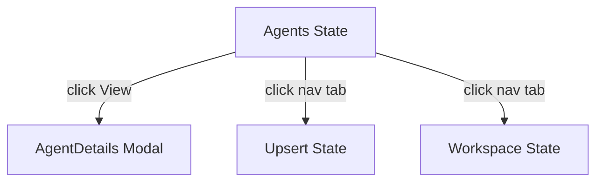
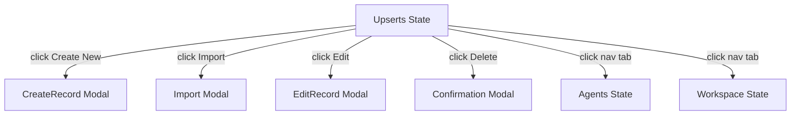
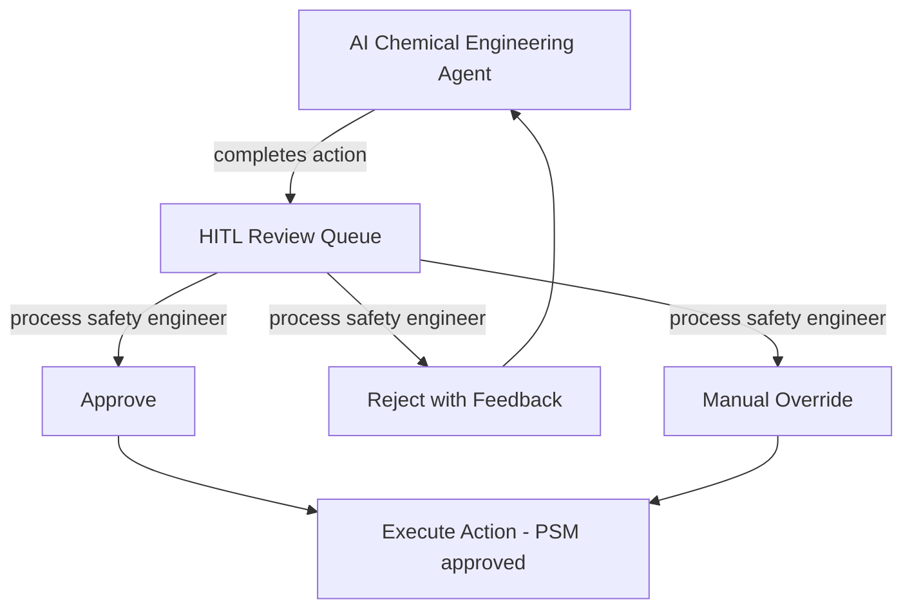
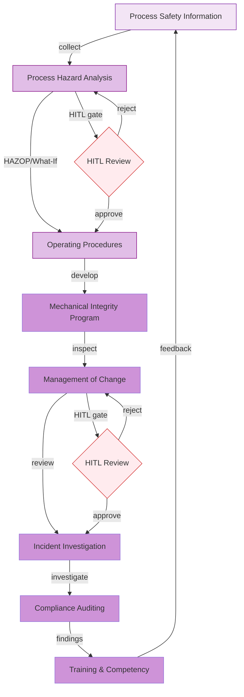
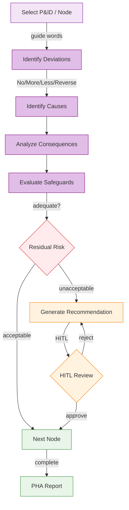
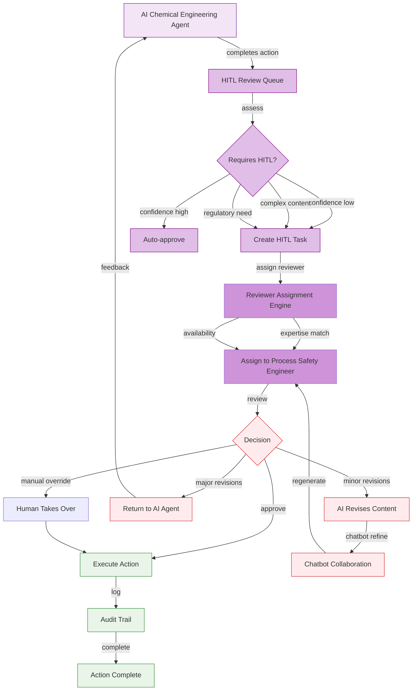
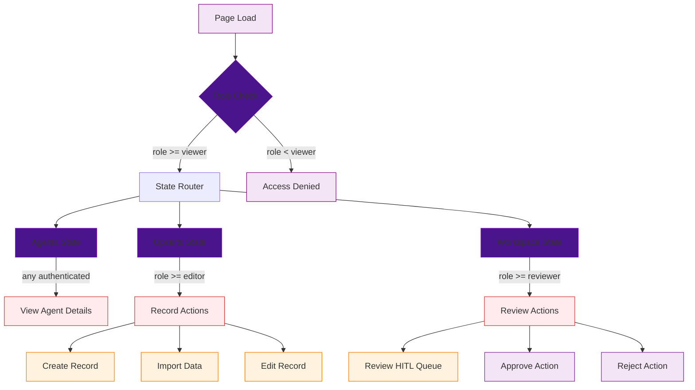

# CHEMICAL-WORKFLOW — Chemical Engineering Workflow UI/UX Specification

## Table of Contents

1. [Part A: UX Patterns (High-Level)](#part-a-ux-patterns-high-level)
2. [Part B: Three-State Button & Modal Rules](#part-b-three-state-button--modal-rules)
3. [Part C: Mermaid UI Flow Diagrams](#part-c-mermaid-ui-flow-diagrams)
4. [Part D: Implementation Standards](#part-d-implementation-standards)
5. [Part E: Screen Specifications (Detailed)](#part-e-screen-specifications-detailed)
6. [Part F: AI Model Backend](#part-f-ai-model-backend)
7. [Part G: Agent Knowledge Ownership](#part-g-agent-knowledge-ownership)

---

## Part A: UX Patterns (High-Level)

### 1. Page Classification

**Template Type**: **Template B** (Complex / Three-State)

The CHEMICAL-WORKFLOW page implements three-state navigation (Agents, Upserts, Workspace) for managing chemical engineering workflows, with a primary focus on process safety management (PSM) per OSHA 1910.119.

**Why Template B**:
- **Multi-State Navigation**: Three distinct operational states — Agents, Upserts, Workspace
- **Multi-Purpose Functionality**: Process hazard analysis, mechanical integrity, operating procedures, management of change
- **Complex Workflows**: Complete PSM lifecycle from hazard identification through compliance auditing
- **Higher z-index positioning** (1500) for the chatbot overlay
- **CSS Class Convention**: `A-CHEM-*` prefix for all page-level elements

### 2. Information Architecture

**Accordion Section**: Chemical Engineering (display_order: 835)
**Accordion Subsection**: 00835 Chemical Engineering — Workflows
**Icon**: Flask / chemical engineering icon
**Route**: `/chemical-workflow`

**AccordionProvider + AccordionComponent** is mandatory per the `0950_ACCORDION_MANAGEMENT_AUDIT.md` standard.

### 3. Color Scheme

**Purple Chemical Engineering Palette**:

```css
:root {
  --template-a-primary: #800080;
  --template-a-secondary: #9370DB;
  --template-a-accent: #6A0DAD;
  --template-a-bg-gradient: linear-gradient(135deg, #f3e5f5 0%, #e1bee7 100%);
  --template-a-header-gradient: linear-gradient(135deg, #6A0DAD 0%, #9370DB 100%);
  --template-a-text-primary: #000000;
  --template-a-text-secondary: #6c757d;
  --template-a-text-white: #ffffff;
  --template-a-shadow-sm: 0 2px 4px rgba(0, 0, 0, 0.05);
  --template-a-shadow-md: 0 4px 6px rgba(0, 0, 0, 0.1);
  --template-a-shadow-lg: 0 8px 24px rgba(128, 0, 128, 0.3);
}
```

**Background**: Gradient background using the purple palette above. No background image — standard gradient approach per `0000_VISUAL_DESIGN_STANDARDS.md`.

### 4. HITL Integration Pattern

1. **AI Agent** performs chemical engineering PSM actions (PHA facilitation, mechanical integrity analysis, MOC review)
2. **Work enters HITL Review Queue** — visible in the Workspace state
3. **Process Safety Engineer** reviews:
   - **Approve**: Action proceeds (e.g., PHA recommendation is accepted)
   - **Reject with Feedback**: Returns to AI agent with correction notes
   - **Manual Override**: Human takes over the action directly
4. **Audit Trail**: All PSM decisions logged with timestamps and approver identity

---

## Part B: Three-State Button & Modal Rules

### 5. State: Agents

The **Agents state** shows chemical engineering AI agents for PSM, process design, and equipment analysis.

**Buttons** (all buttons are pre-configured by the dev team — users cannot add, edit, or delete buttons):

| Button | Visibility Gate | Action | Modal |
|--------|----------------|--------|-------|
| **View Details** | Always visible | Opens AgentDetails modal | `AgentDetails` — 98vw, chemical agent metrics |

**Mermaid Flow**:


### 6. State: Upserts

The **Upserts state** is where chemical engineering PSM records — PHA studies, mechanical integrity inspections, operating procedures — are created, edited, and imported.

**Buttons** (all buttons are pre-configured by the dev team — users cannot add, edit, or delete buttons):

| Button | Visibility Gate | Action | Modal |
|--------|----------------|--------|-------|
| **Create New** | `user.role >= 'editor'` | Opens CreateRecord modal | `CreateRecord` — 98vw, PSM record form |
| **Import** | `user.role >= 'editor'` | Opens Import modal | `Import` — 98vw, CSV/PHA data upload |
| **Edit** (per record) | `user.role >= 'editor'` | Opens EditRecord modal | `EditRecord` — 98vw, pre-populated form, change tracking |
| **Delete** | `user.role === 'governance'` | Opens Confirmation modal | `Confirmation` — "Delete record?" with impact warning |
| **Clone** | `user.role >= 'editor'` | Inline clone | No modal |

**Mermaid Flow**:


### 7. State: Workspace

The **Workspace state** is the PSM operations dashboard.

**Buttons** (all buttons are pre-configured by the dev team — users cannot add, edit, or delete buttons):

| Button | Visibility Gate | Action | Modal |
|--------|----------------|--------|-------|
| **Approve** | `user.role >= 'reviewer'` | Opens Approval modal | `Approval` — 98vw, confirm with optional note |
| **Reject** | `user.role >= 'reviewer'` | Opens Rejection modal | `Rejection` — 98vw, required feedback |
| **Assign** | `user.role >= 'coordinator'` | Opens Assign modal | `Assign` — 98vw, user/agent selector |
| **Generate Report** | Always visible | Opens Export modal | `Export` — 98vw, format selector |
| **Comment/Discussion** | Always visible | Toggles chat panel | Inline toggle |

**HITL Workflow**:


---

## Part C: Mermaid UI Flow Diagrams

### 8. Process Safety Management Lifecycle

The full PSM lifecycle from process information through compliance auditing, incorporating AI agent orchestration and HITL review gates.



### 9. HAZOP Analysis Flow



### 10. HITL Review Workflow



### 11. Page State Flow with Modal Integration



---

## Part D: Implementation Standards

### 12. CSS Architecture

**Import Chain**:
```css
/* 1. Template A Standard */
@import "../../templates/template-a-standard.css";

/* 2. Page-Specific Chemical Workflow Styles */
@import "00835-chemical-workflow-page-style.css";
```

**File**: `client/src/common/css/pages/00835-chemical-workflow/00835-chemical-workflow-page-style.css`

**CSS Class Convention**: `A-CHEM-*` for all page-level elements.

**State Button Pattern**:
```html
<nav class="bottom-fixed-nav">
  <button class="A-CHEM-state-btn active">Agents</button>
  <button class="A-CHEM-state-btn">Upserts</button>
  <button class="A-CHEM-state-btn">Workspace</button>
</nav>
```

**Key Principles**:
- Gradient background (no background image)
- 98vw Modal Sizing
- Purple color scheme throughout (primary: #800080, secondary: #9370DB)
- `A-CHEM-*` class prefix

### 13. Component Inventory

| Component | File | Purpose | CSS Class Prefix |
|-----------|------|---------|-----------------|
| StateButtons | Page template | Three-state navigation | `.A-CHEM-state-btn` |
| NavContainer | Page template | Bottom-fixed nav | `.A-CHEM-nav-container` |
| LoginForm | Auth | Authentication | `.A-CHEM-login` |
| LogoutButton | Auth | Session termination | `.A-CHEM-logout` |
| PHARecordTable | Data grid | PHA study records | `.A-CHEM-pha-table` |
| MIRecordList | Data grid | Mechanical integrity records | `.A-CHEM-mi-list` |
| OPCreateForm | Form | Operating procedure creation | `.A-CHEM-op-form` |
| ConfirmationModal | Modal | Destructive actions | `.A-CHEM-confirmation-modal` |
| ApprovalModal | Modal | Approve workflow | `.A-CHEM-approval-modal` |

### 14. Modal Specifications

All modals follow 98vw width with purple gradient headers.

**Modal Inventory**:
| Modal | State | Purpose |
|-------|-------|---------|
| CreateNewAgent | Agents | Create chemical engineering agent |
| AgentConfig | Agents | Configure agent settings |
| CreateRecord | Upserts | New PSM record |
| Import | Upserts | Bulk import CSV/PHA data |
| EditRecord | Upserts | Edit existing record |
| Approval | Workspace | Approve AI action |
| Rejection | Workspace | Reject with feedback |
| Export | Workspace | Export report |

### 15. Chatbot Configuration

**Template Type**: Template B (State-Aware)

```javascript
{
  chatType: "agent",
  stateAware: true,
  currentState: "agents|upserts|workspace",
  zIndex: 1500,
  modelEndpoint: "/api/chat/chemical",
}
```

**State-Aware Behavior**:
- **Agents**: Chatbot answers questions about chemical engineering agent capabilities
- **Upserts**: Chatbot assists with PHA facilitation, procedure drafting
- **Workspace**: Chatbot explains AI PSM recommendations, suggests approvals

---

## Part E: Screen Specifications (Detailed)

### 16. Screen Inventory

| Screen | State | Loading | Empty | Error | Populated |
|--------|-------|---------|-------|-------|-----------|
| Agent List | Agents | Spinner + skeleton | "No agents" CTA | Red banner + retry | Agent cards |
| Record List | Upserts | Spinner + skeleton | "No records" CTA | Red banner + retry | Table with pagination |
| Record Form | Upserts | Spinner | Empty form | Field errors | Pre-populated form |
| HITL Queue | Workspace | Spinner + skeleton | "No items to review" | Red banner + retry | Queue with priority |

### 17. Wireframe: Agents State

```
┌──────────────────────────────────────────────────────────────┐
│  [Purple Header Gradient]                                      │
│  CHEMICAL-WORKFLOW │ [Chatbot]                                  │
├──────────────────────────────────────────────────────────────┤
│  [Tab Nav: Agents | Upserts | Workspace]                      │
│  ┌────────────────────────────────────────────────────────┐  │
│  │ Chemical Engineering Agents           [+ Add Agent]    │  │
│  ├────────────────────────────────────────────────────────┤  │
│  │ ┌──────────┐ ┌──────────┐                              │  │
│  │ │ PSM      │ │ Process  │                              │  │
│  │ │ Engineer │ │ Analyst  │                              │  │
│  │ │ ● Active │ │ ● Active │                              │  │
│  │ │ [Edit]   │ │ [Edit]   │                              │  │
│  │ └──────────┘ └──────────┘                              │  │
│  └────────────────────────────────────────────────────────┘  │
├──────────────────────────────────────────────────────────────┤
│  [Bottom-Fixed Nav]                                           │
└──────────────────────────────────────────────────────────────┘
```

### 18. Platform Adaptations

**Desktop (1280px+)**:
- Full three-state navigation visible
- Bottom-fixed nav container centered with `transform: translateX(-50%)`
- Agent grid: 3 columns

**Tablet (768px - 1279px)**:
- Three-state nav collapses to dropdown
- Agent grid: 2 columns

**Mobile (< 768px)**:
- Three-state nav as bottom tab bar
- Agent grid: 1 column
- Touch targets: minimum 48dp

---

## Part F: AI Model Backend

### 19. Model Infrastructure

**Base Model**: Qwen 2.5 (or similar)
- Fine-tuned on chemical engineering domain data (OSHA PSM, HAZOP methodologies, chemical process data)

**Domain Adapter**: LoRA fine-tuned per PSM function
- **PSM LoRA**: HAZOP facilitation, risk assessment, MOC review

**Deployment**: HuggingFace model serving
- Endpoint: `/api/chat/chemical`
- Fallback: Base Qwen model

### 20. API Endpoints

| Endpoint | Method | Purpose | State |
|----------|--------|---------|-------|
| `/api/agents/chemical` | GET | List chemical engineering agents | Agents |
| `/api/agents/chemical/:id` | GET | Agent details | Agents |
| `/api/records/chemical` | GET | List PSM records | Upserts |
| `/api/records/chemical` | POST | Create record | Upserts |
| `/api/records/chemical/:id` | PUT | Update record | Upserts |
| `/api/hitl/chemical` | GET | List HITL queue | Workspace |
| `/api/hitl/chemical/:id/approve` | POST | Approve action | Workspace |
| `/api/hitl/chemical/:id/reject` | POST | Reject action | Workspace |

---

## Part G: Agent Knowledge Ownership

### 21. Agent Ownership

| Company | Role | Action |
|---------|------|--------|
| **DomainForge AI** | Domain Validation | Validate chemical engineering workflows |
| **QualityForge AI** | Testing | Execute test suite against this spec |
| **DevForge AI** | Implementation | Build HTML/CSS/React pages per wireframes |
| **KnowledgeForge AI** | Indexing | Index spec into institutional memory |
| **PromptForge AI** | Task Routing | Route chemical UI tasks to DevForge |

### 22. QualityForge AI Testing

1. **Foundation**: Auth, nav container, state buttons, logout, gradient background
2. **Modal Integration**: All 8+ modals open/close correctly
3. **State Transitions**: Agents ↔ Upserts ↔ Workspace flow correctly
4. **Form Validation**: Green/gray/red borders per 0750 standard
5. **PSM Record Types**: PHA, MI, MOC, OP all selectable

---

## Version History

| Version | Date | Changes |
|---------|------|---------|
| 1.0 | 2026-04-29 | Initial UI/UX specification for CHEMICAL-WORKFLOW — Template B |

---

**Document Information**
- **Author**: DomainForge AI — Chemical Engineering Domain
- **Date**: 2026-04-29
- **Status**: Active
