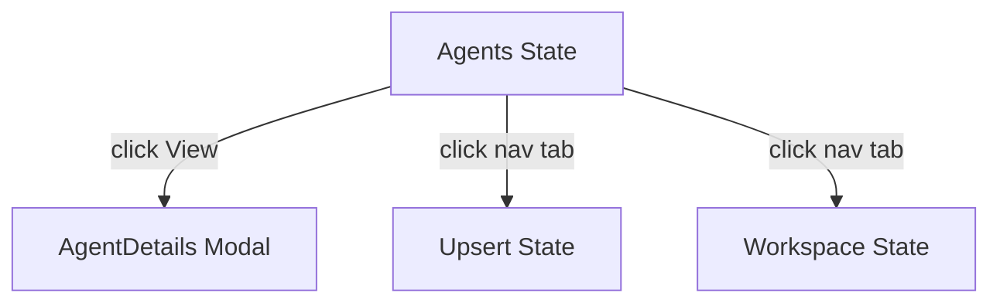
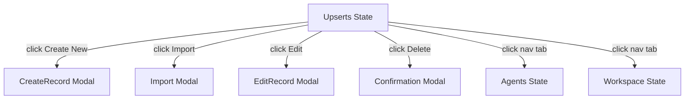
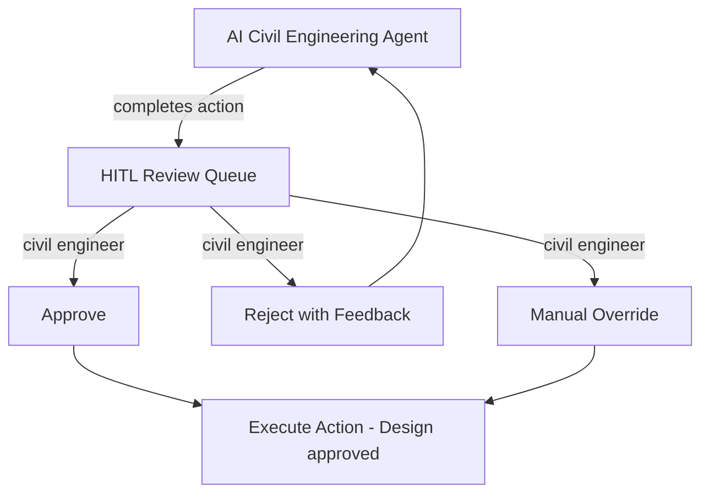
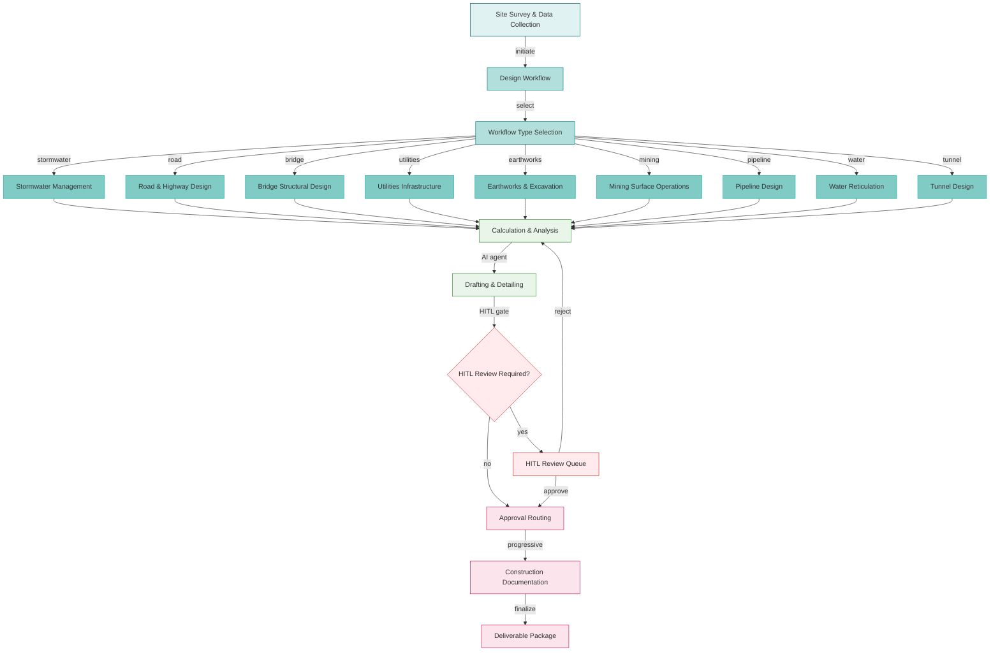
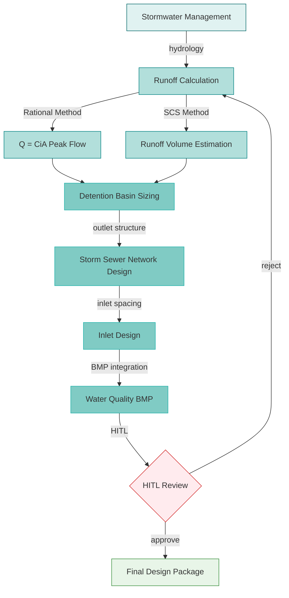
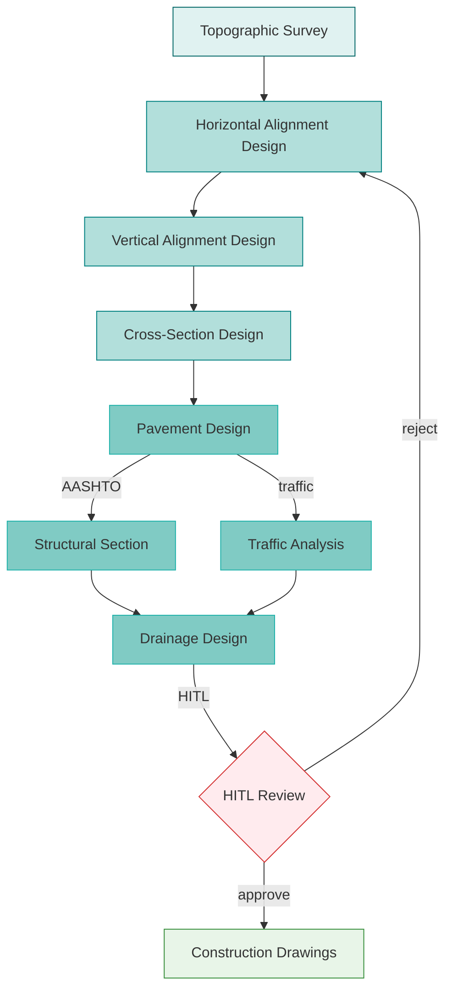
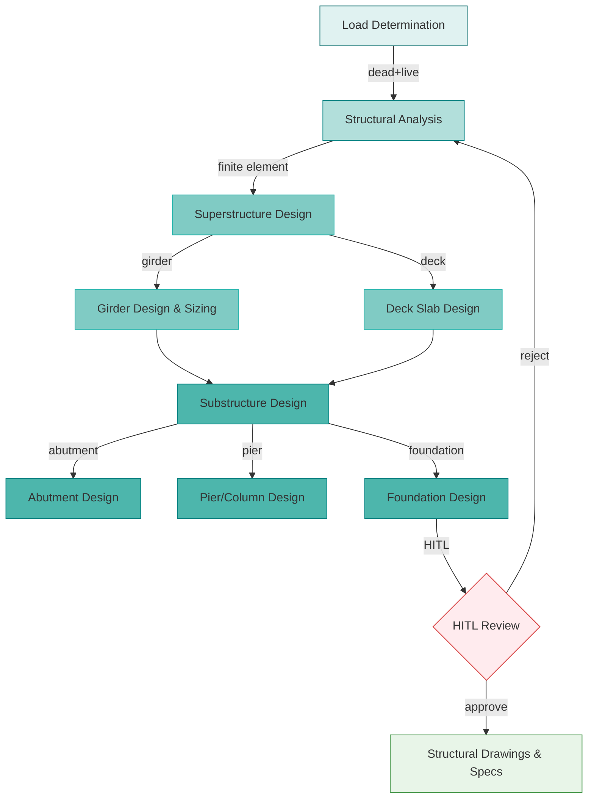
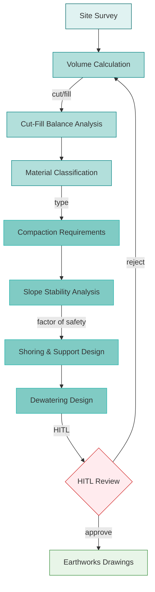
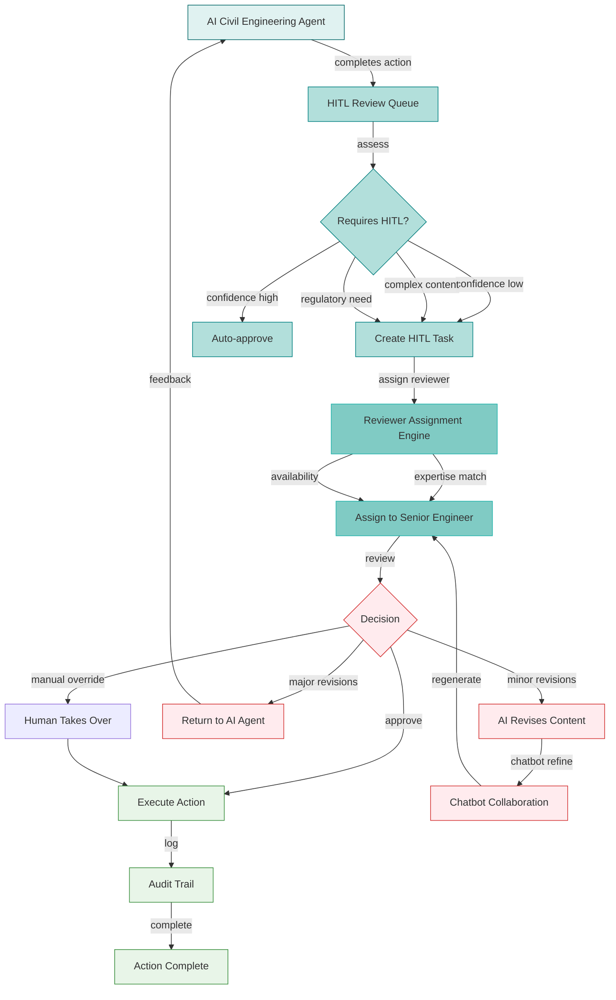

# CIVIL-WORKFLOW — Civil Engineering Workflow UI/UX Specification

## Table of Contents

1. [Part A: UX Patterns (High-Level)](#part-a-ux-patterns-high-level)
2. [Part B: Three-State Button & Modal Rules](#part-b-three-state-button--modal-rules)
3. [Part C: Mermaid UI Flow Diagrams](#part-c-mermaid-ui-flow-diagrams)
4. [Part D: Implementation Standards](#part-d-implementation-standards)
5. [Part E: Screen Specifications (Detailed)](#part-e-screen-specifications-detailed)
6. [Part F: AI Model Backend](#part-f-ai-model-backend)
7. [Part G: Agent Knowledge Ownership](#part-g-agent-knowledge-ownership)

---

## Part A: UX Patterns (High-Level)

### 1. Page Classification

**Template Type**: **Template B** (Complex / Three-State)

The CIVIL-WORKFLOW page implements three-state navigation (Agents, Upserts, Workspace) for managing civil engineering workflows across multiple sub-disciplines.

**Why Template B**:
- **Multi-State Navigation**: Three distinct operational states — Agents, Upserts, Workspace
- **Multi-Purpose Functionality**: Stormwater management, road/highway design, bridge structural, utilities, earthworks, mining, pipelines, water reticulation, tunnels
- **Complex Workflows**: Civil engineering design lifecycle from survey through construction
- **Higher z-index positioning** (1500) for the chatbot overlay
- **CSS Class Convention**: `A-CIVIL-*` prefix for all page-level elements

### 2. Information Architecture

**Accordion Section**: Civil Engineering (display_order: 850)
**Accordion Subsection**: 00850 Civil Engineering — Workflows
**Icon**: Compass / civil engineering icon
**Route**: `/civil-workflow`

**AccordionProvider + AccordionComponent** is mandatory per the `0950_ACCORDION_MANAGEMENT_AUDIT.md` standard.

### 3. Color Scheme

**Teal Civil Engineering Palette**:

```css
:root {
  --template-a-primary: #008080;
  --template-a-secondary: #20B2AA;
  --template-a-accent: #006666;
  --template-a-bg-gradient: linear-gradient(135deg, #e0f2f1 0%, #b2dfdb 100%);
  --template-a-header-gradient: linear-gradient(135deg, #006666 0%, #20B2AA 100%);
  --template-a-text-primary: #000000;
  --template-a-text-secondary: #6c757d;
  --template-a-text-white: #ffffff;
  --template-a-shadow-sm: 0 2px 4px rgba(0, 0, 0, 0.05);
  --template-a-shadow-md: 0 4px 6px rgba(0, 0, 0, 0.1);
  --template-a-shadow-lg: 0 8px 24px rgba(0, 128, 128, 0.3);
}
```

**Background**: Gradient background using the teal palette above. No background image — standard gradient approach per `0000_VISUAL_DESIGN_STANDARDS.md`.

### 4. HITL Integration Pattern

1. **AI Agent** performs civil engineering design actions (stormwater calculations, road alignment optimization, bridge load analysis, earthworks volume estimation)
2. **Work enters HITL Review Queue** — visible in the Workspace state
3. **Civil Engineer** reviews:
   - **Approve**: Action proceeds (e.g., drainage design is accepted, road alignment is approved)
   - **Reject with Feedback**: Returns to AI agent with correction notes
   - **Manual Override**: Human takes over the action directly
4. **Audit Trail**: All civil engineering decisions logged with timestamps and approver identity

---

## Part B: Three-State Button & Modal Rules

### 5. State: Agents

The **Agents state** shows civil engineering AI agents for stormwater analysis, road design, bridge structural analysis, earthworks, and other civil sub-disciplines.

**Buttons** (all buttons are pre-configured by the dev team — users cannot add, edit, or delete buttons):

| Button | Visibility Gate | Action | Modal |
|--------|----------------|--------|-------|
| **View Details** | Always visible | Opens AgentDetails modal | `AgentDetails` — 98vw, civil agent metrics |

**Mermaid Flow**:


### 6. State: Upserts

The **Upserts state** is where civil engineering records — stormwater designs, road alignments, bridge calculations, earthwork volumes — are created, edited, and imported.

**Buttons** (all buttons are pre-configured by the dev team — users cannot add, edit, or delete buttons):

| Button | Visibility Gate | Action | Modal |
|--------|----------------|--------|-------|
| **Create New** | `user.role >= 'editor'` | Opens CreateRecord modal | `CreateRecord` — 98vw, civil engineering form with workflow type selector |
| **Import** | `user.role >= 'editor'` | Opens Import modal | `Import` — 98vw, CSV/DWG/DXF upload, field mapping |
| **Edit** (per record) | `user.role >= 'editor'` | Opens EditRecord modal | `EditRecord` — 98vw, pre-populated form, change tracking |
| **Delete** | `user.role === 'governance'` | Opens Confirmation modal | `Confirmation` — "Delete record?" with impact warning |
| **Clone** | `user.role >= 'editor'` | Inline clone | No modal |

**Mermaid Flow**:


### 7. State: Workspace

The **Workspace state** is the civil engineering operations dashboard.

**Buttons** (all buttons are pre-configured by the dev team — users cannot add, edit, or delete buttons):

| Button | Visibility Gate | Action | Modal |
|--------|----------------|--------|-------|
| **Approve** | `user.role >= 'reviewer'` | Opens Approval modal | `Approval` — 98vw, confirm with optional note |
| **Reject** | `user.role >= 'reviewer'` | Opens Rejection modal | `Rejection` — 98vw, required feedback |
| **Assign** | `user.role >= 'coordinator'` | Opens Assign modal | `Assign` — 98vw, user/agent selector |
| **Generate Report** | Always visible | Opens Export modal | `Export` — 98vw, format selector |
| **Comment/Discussion** | Always visible | Toggles chat panel | Inline toggle |

**HITL Workflow**:


---

## Part C: Mermaid UI Flow Diagrams

### 8. Civil Engineering Workflow Lifecycle

The full civil engineering project lifecycle from site survey through construction, incorporating workflow type selection, AI agent orchestration, HITL review gates, and multi-discipline collaboration.



### 9. Stormwater Management Flow



### 10. Road & Highway Design Flow



### 11. Bridge Structural Design Flow



### 12. Earthworks & Excavation Flow



### 13. HITL Review Workflow



### 14. Page State Flow with Modal Integration

> **Parameters**: `discipline: "00850"`, `states: "Agents, Upserts, Workspace"`, `roles: "viewer, editor, reviewer, manager, admin"`, `showAccordion: false`

```mermaid
flowchart TD
    classDef page fill:#e0f2f1,stroke:#008080
    classDef state fill:#004d40,stroke:#006666
    classDef gate fill:#ffebee,stroke:#d32f2f
    classDef action fill:#fff3e0,stroke:#f57c00
    classDef modal fill:#f3e5f5,stroke:#7b1fa2

    Load[Page Load] --> Rights{Role Check}
    Rights -->|role >= viewer| Router[State Router]
    Rights -->|role < viewer| Denied[Access Denied]

    Router --> Agents[Agents State]
    Router --> Upserts[Upserts State]
    Router --> Workspace[Workspace State]

    Agents -->|any authenticated| ViewAgent[View Agent Details]

    Upserts -->|role >= editor| RecordActions[Record Actions]
    RecordActions --> CreateRecord[Create Record]
    RecordActions --> ImportData[Import Data]
    RecordActions --> EditRecord[Edit Record]

    Workspace -->|role >= reviewer| ReviewActions[Review Actions]
    ReviewActions --> ReviewQueue[Review HITL Queue]
    ReviewActions --> ApproveAction[Approve Action]
    ReviewActions --> RejectAction[Reject Action]

    class Load,Denied page
    class Rights,Agents,Upserts,Workspace state
    class ViewAgent,RecordActions,ReviewActions gate
    class CreateRecord,ImportData,EditRecord,ReviewQueue action
    class ApproveAction,RejectAction modal
```



---

## Part D: Implementation Standards

### 15. CSS Architecture

**Import Chain**:
```css
/* 1. Template A Standard */
@import "../../templates/template-a-standard.css";

/* 2. Page-Specific Civil Workflow Styles */
@import "00850-civil-workflow-page-style.css";
```

**File**: `client/src/common/css/pages/00850-civil-workflow/00850-civil-workflow-page-style.css`

**CSS Class Convention**: `A-CIVIL-*` for all page-level elements.

**State Button Pattern**:
```html
<nav class="bottom-fixed-nav">
  <button class="A-CIVIL-state-btn active">Agents</button>
  <button class="A-CIVIL-state-btn">Upserts</button>
  <button class="A-CIVIL-state-btn">Workspace</button>
</nav>
```

**Key Principles**:
- Gradient background (no background image)
- 98vw Modal Sizing
- Teal color scheme throughout (primary: #008080, secondary: #20B2AA)
- `A-CIVIL-*` class prefix

### 16. Component Inventory

| Component | File | Purpose | CSS Class Prefix |
|-----------|------|---------|-----------------|
| StateButtons | Page template | Three-state navigation | `.A-CIVIL-state-btn` |
| NavContainer | Page template | Bottom-fixed nav | `.A-CIVIL-nav-container` |
| LoginForm | Auth | Authentication | `.A-CIVIL-login` |
| LogoutButton | Auth | Session termination | `.A-CIVIL-logout` |
| WorkflowTypeSelector | Form | Civil workflow type selection | `.A-CIVIL-workflow-selector` |
| StormwaterTable | Data grid | Stormwater designs | `.A-CIVIL-stormwater-table` |
| RoadAlignmentList | Data grid | Road designs | `.A-CIVIL-road-list` |
| BridgeCalcForm | Form | Bridge calculations | `.A-CIVIL-bridge-form` |
| EarthworksVolume | Data grid | Earthwork volumes | `.A-CIVIL-earthworks-table` |
| ConfirmationModal | Modal | Destructive actions | `.A-CIVIL-confirmation-modal` |
| ApprovalModal | Modal | Approve workflow | `.A-CIVIL-approval-modal` |

### 17. Dropdown Specifications

**Workflow Type Selector**:
```javascript
<select
  value={selectedWorkflow}
  onChange={(e) => setSelectedWorkflow(e.target.value)}
  style={{
    width: "100%",
    padding: "8px 12px",
    border: selectedWorkflow
      ? "2px solid #28a745"
      : "2px solid #dee2e6",
    borderRadius: "4px",
    fontSize: "0.875rem",
    backgroundColor: "#ffffff",
    cursor: "pointer",
  }}
>
  <option value="">Select workflow type...</option>
  <option value="stormwater">Stormwater Management</option>
  <option value="road">Road & Highway Design</option>
  <option value="bridge">Bridge Structural Design</option>
  <option value="utilities">Utilities Infrastructure</option>
  <option value="earthworks">Earthworks & Excavation</option>
  <option value="mining">Mining Surface Operations</option>
  <option value="pipeline">Pipeline Design</option>
  <option value="water">Water Reticulation</option>
  <option value="tunnel">Tunnel Design</option>
</select>
```

### 18. Modal Specifications

All modals follow 98vw width with teal gradient headers.

**Modal Inventory**:
| Modal | State | Purpose |
|-------|-------|---------|
| CreateNewAgent | Agents | Create civil engineering agent |
| AgentConfig | Agents | Configure agent settings |
| CreateRecord | Upserts | New civil engineering record |
| Import | Upserts | Bulk import CSV/DWG/DXF |
| EditRecord | Upserts | Edit existing record |
| Approval | Workspace | Approve AI action |
| Rejection | Workspace | Reject with feedback |
| Export | Workspace | Export report |

### 19. Chatbot Configuration

**Template Type**: Template B (State-Aware)

```javascript
{
  chatType: "agent",
  stateAware: true,
  currentState: "agents|upserts|workspace",
  zIndex: 1500,
  modelEndpoint: "/api/chat/civil",
}
```

**State-Aware Behavior**:
- **Agents**: Chatbot answers questions about civil engineering agent capabilities
- **Upserts**: Chatbot assists with record creation, workflow selection, calculation assistance
- **Workspace**: Chatbot explains AI civil engineering recommendations, suggests approvals

---

## Part E: Screen Specifications (Detailed)

### 20. Screen Inventory

| Screen | State | Loading | Empty | Error | Populated |
|--------|-------|---------|-------|-------|-----------|
| Agent List | Agents | Spinner + skeleton | "No agents" CTA | Red banner + retry | Agent cards |
| Record List | Upserts | Spinner + skeleton | "No records" CTA | Red banner + retry | Table with pagination |
| Record Form | Upserts | Spinner | Empty form | Field errors | Pre-populated form |
| HITL Queue | Workspace | Spinner + skeleton | "No items to review" | Red banner + retry | Queue with priority |

### 21. Wireframe: Agents State

```
┌──────────────────────────────────────────────────────────────┐
│  [Teal Header Gradient]                                        │
│  CIVIL-WORKFLOW │ [Chatbot]                                    │
├──────────────────────────────────────────────────────────────┤
│  [Tab Nav: Agents | Upserts | Workspace]                      │
│  ┌────────────────────────────────────────────────────────┐  │
│  │ Civil Engineering Agents             [+ Add Agent]     │  │
│  ├────────────────────────────────────────────────────────┤  │
│  │ ┌──────────┐ ┌──────────┐ ┌──────────┐                │  │
│  │ │ Storm    │ │ Road     │ │ Bridge   │                │  │
│  │ │ Engineer │ │ Designer │ │ Analyst  │                │  │
│  │ │ ● Active │ │ ● Active │ │ ● Active │                │  │
│  │ │ [Edit]   │ │ [Edit]   │ │ [Edit]   │                │  │
│  │ └──────────┘ └──────────┘ └──────────┘                │  │
│  │ ┌──────────┐ ┌──────────┐ ┌──────────┐                │  │
│  │ │ Earth-   │ │ Mining   │ │ Pipeline │                │  │
│  │ │ works    │ │ Ops      │ │ Designer │                │  │
│  │ │ ● Active │ │ ● Active │ │ ● Active │                │  │
│  │ │ [Edit]   │ │ [Edit]   │ │ [Edit]   │                │  │
│  │ └──────────┘ └──────────┘ └──────────┘                │  │
│  └────────────────────────────────────────────────────────┘  │
├──────────────────────────────────────────────────────────────┤
│  [Bottom-Fixed Nav]                                           │
└──────────────────────────────────────────────────────────────┘
```

### 22. Platform Adaptations

**Desktop (1280px+)**:
- Full three-state navigation visible
- Bottom-fixed nav container centered with `transform: translateX(-50%)`
- Agent grid: 3 columns

**Tablet (768px - 1279px)**:
- Three-state nav collapses to dropdown
- Agent grid: 2 columns

**Mobile (< 768px)**:
- Three-state nav as bottom tab bar
- Agent grid: 1 column
- Touch targets: minimum 48dp

---

## Part F: AI Model Backend

### 23. Model Infrastructure

**Base Model**: Qwen 2.5 (or similar)
- Fine-tuned on civil engineering domain data (AASHTO standards, stormwater methods, structural analysis, geotechnical data)

**Domain Adapter**: LoRA fine-tuned per civil sub-discipline
- **Stormwater LoRA**: Rational Method, SCS Curve Number, detention sizing
- **Road LoRA**: AASHTO pavement design, alignment optimization
- **Bridge LoRA**: AASHTO LRFD, girder design
- **Earthworks LoRA**: Cut-fill analysis, slope stability

**Deployment**: HuggingFace model serving
- Endpoint: `/api/chat/civil`
- Fallback: Base Qwen model

### 24. API Endpoints

| Endpoint | Method | Purpose | State |
|----------|--------|---------|-------|
| `/api/agents/civil` | GET | List civil engineering agents | Agents |
| `/api/agents/civil/:id` | GET | Agent details | Agents |
| `/api/records/civil` | GET | List civil engineering records | Upserts |
| `/api/records/civil` | POST | Create record | Upserts |
| `/api/records/civil/:id` | PUT | Update record | Upserts |
| `/api/records/civil/:id` | DELETE | Delete record | Upserts |
| `/api/records/civil/import` | POST | Import records | Upserts |
| `/api/hitl/civil` | GET | List HITL queue | Workspace |
| `/api/hitl/civil/:id/approve` | POST | Approve action | Workspace |
| `/api/hitl/civil/:id/reject` | POST | Reject action | Workspace |

---

## Part G: Agent Knowledge Ownership

### 25. Agent Ownership

| Company | Role | Action |
|---------|------|--------|
| **DomainForge AI** | Domain Validation | Validate civil engineering workflows are correct |
| **QualityForge AI** | Testing | Execute test suite against this spec |
| **DevForge AI** | Implementation | Build HTML/CSS/React pages per wireframes |
| **KnowledgeForge AI** | Indexing | Index spec into institutional memory |
| **PromptForge AI** | Task Routing | Route civil UI tasks to DevForge |

### 26. QualityForge AI Testing

1. **Foundation**: Auth, nav container, state buttons, logout, gradient background
2. **Modal Integration**: All 8+ modals open/close correctly
3. **State Transitions**: Agents ↔ Upserts ↔ Workspace flow correctly
4. **Form Validation**: Green/gray/red borders per 0750 standard
5. **Workflow Selection**: All 9 workflow types selectable

---

## Version History

| Version | Date | Changes |
|---------|------|---------|
| 1.0 | 2026-04-29 | Initial UI/UX specification for CIVIL-WORKFLOW — Template B |

---

**Document Information**
- **Author**: DomainForge AI — Civil Engineering Domain
- **Date**: 2026-04-29
- **Status**: Active
