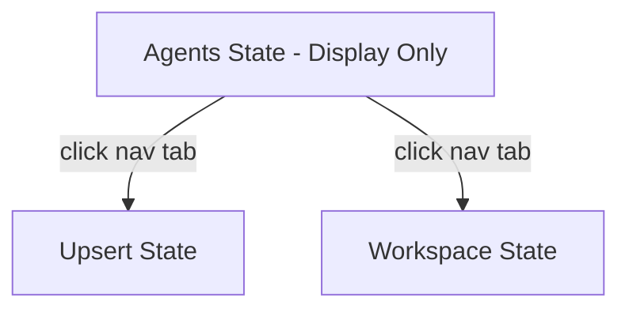
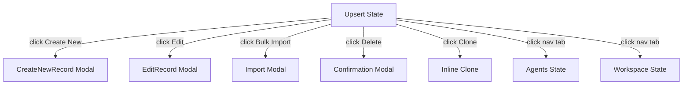
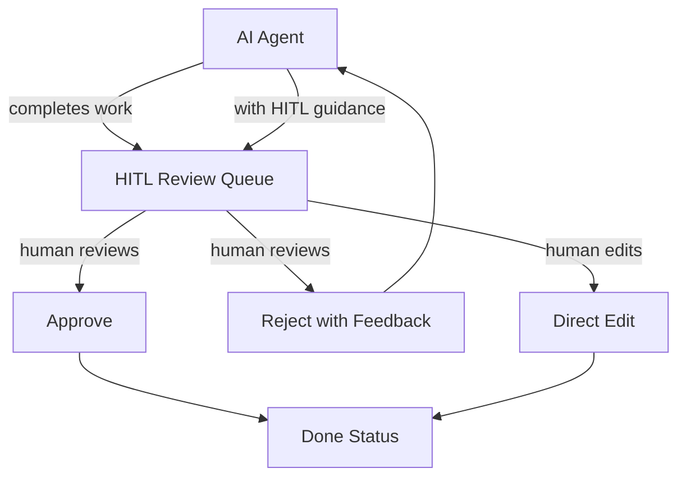
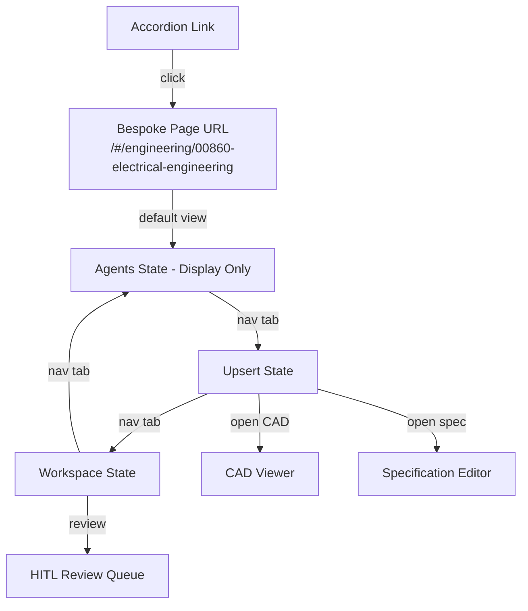
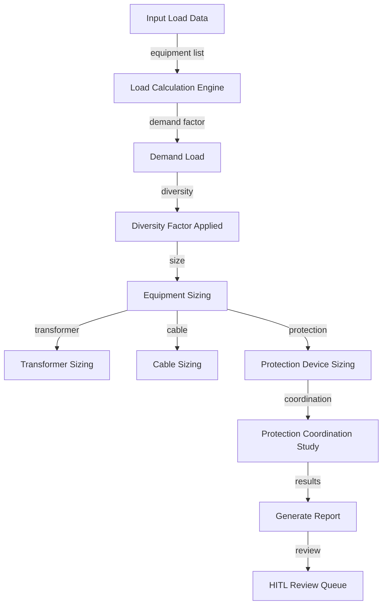
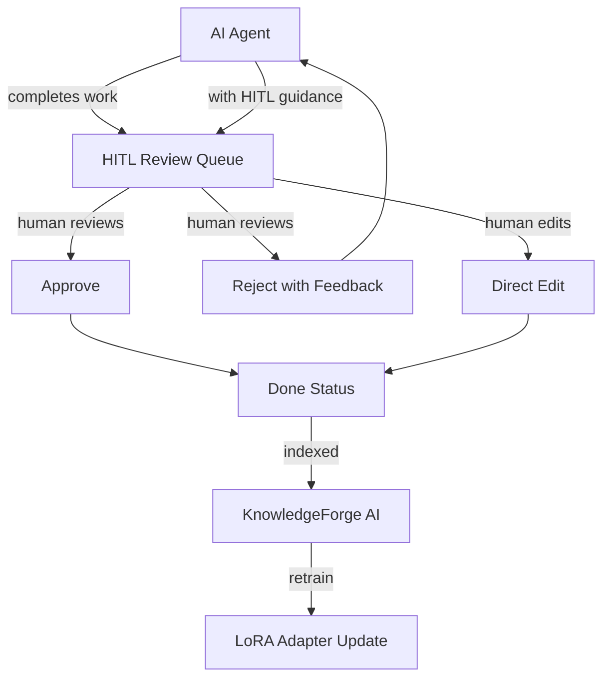

# 00860 Electrical Engineering — UI/UX Specification

## Table of Contents

1. [Part A: UX Patterns (High-Level)](#part-a-ux-patterns-high-level)
2. [Part B: Three-State Button & Modal Rules](#part-b-three-state-button--modal-rules)
3. [Part C: Mermaid UI Flow Diagrams](#part-c-mermaid-ui-flow-diagrams)
4. [Part D: Implementation Standards](#part-d-implementation-standards)
5. [Part E: Screen Specifications (Detailed)](#part-e-screen-specifications-detailed)
6. [Part F: AI Model Backend](#part-f-ai-model-backend)
7. [Part G: Agent Knowledge Ownership](#part-g-agent-knowledge-ownership)

---

## Part A: UX Patterns (High-Level)

### 1. Page Classification

**Template Type**: **Template B** (Complex / Three-State)

The 00860 Electrical Engineering page is classified as **Template B** because:

- **Multi-State Navigation**: Three distinct operational states — Agents, Upsert, Workspace
- **Multi-Purpose Functionality**: Power distribution design, electrical system calculations, load analysis, protection coordination, cable sizing
- **Complex Workflows**: Electrical load calculations, protection device coordination, cable routing, switchgear specification
- **Higher z-index positioning** (1500) for the chatbot overlay
- **State-aware AI assistance** that adapts to the current electrical engineering context

**Primary User Roles**:
- **Electrical Engineers**: Power system design, load calculations, protection coordination
- **Electrical Designers**: Cable routing, panel schedules, lighting design
- **Project Managers**: Workflow oversight, HITL approvals, resource allocation
- **Commissioning Engineers**: Testing procedures, inspection checklists

### 2. Information Architecture

**Accordion Section**: Engineering (display_order: 860)
**Accordion Subsection**: 00860 Electrical Engineering
**Icon**: Lightning bolt / electrical icon
**Routes**: `/engineering/00860-electrical-engineering`

CAD and technical drawings are handled via the shared measurement system at `/#/technical-drawings` — the electrical page links to this route when a user opens a CAD file, rather than embedding its own viewer.

**AccordionProvider + AccordionComponent** is mandatory on every page per the `0950_ACCORDION_MANAGEMENT_AUDIT.md` standard.

### 3. Color Scheme

The platform uses the **Template A orange palette** as its foundation, with an **electrical-specific gold accent**:

```css
:root {
  /* Primary Color Palette */
  --template-a-primary: #FF8C00;
  --template-a-secondary: #FFA500;
  --template-a-accent: #FF6B35;

  /* Electrical-Specific Palette */
  --electrical-primary: #FFD700;     /* Gold — electrical energy */
  --electrical-secondary: #FFC107;   /* Amber — electrical warnings */
  --electrical-accent: #FFA000;      /* Dark gold — electrical highlights */
  --electrical-valid: #43A047;       /* Green — measurement passed */
  --electrical-warning: #FFB300;     /* Amber — caution */
  --electrical-error: #E53935;       /* Red — fault/error */

  /* Background Gradients */
  --template-a-bg-gradient: linear-gradient(135deg, #f8f9fa 0%, #e9ecef 100%);
  --template-a-header-gradient: linear-gradient(135deg, #FFD700 0%, #FFC107 100%);

  /* Text Colors */
  --template-a-text-primary: #000000;
  --template-a-text-secondary: #6c757d;
  --template-a-text-white: #ffffff;

  /* Shadows and Borders */
  --template-a-shadow-sm: 0 2px 4px rgba(0, 0, 0, 0.05);
  --template-a-shadow-md: 0 4px 6px rgba(0, 0, 0, 0.1);
  --template-a-shadow-lg: 0 8px 24px rgba(255, 215, 0, 0.3);
}
```

**Why Gold?**: Gold represents electrical energy, power systems, and is the internationally recognized color for electrical identification (IEC 60446, SANS 10142). It differentiates electrical engineering from other disciplines while maintaining professional visibility.

### 4. HITL Integration Pattern

The Human-in-the-Loop (HITL) model for electrical engineering follows this pattern:

1. **AI Agent** performs initial work (load calculations, cable sizing, protection coordination)
2. **Work enters HITL Review Queue** — visible in the Workspace state
3. **Electrical Engineer** reviews the AI output:
   - **Approve**: Work moves to "Done" status
   - **Reject with Feedback**: Work returns to the AI agent with guidance
   - **Edit**: Human directly modifies the output (bypasses AI re-processing)
4. **Feedback Loop**: Rejected work trains the discipline-specific LoRA adapter

---

## Part B: Three-State Button & Modal Rules

### 5. State: Agents

The **Agents state** is a **display-only** view showing the AI agents available for electrical engineering. Agent creation, configuration, and removal are handled by board operators through the Paperclip control plane — not from within this discipline page.

**Details Modal**:

| Button | Visibility Gate | Action | Modal |
|--------|----------------|--------|-------|
| **View Details** (per agent row) | Always visible | Opens AgentDetails modal | `AgentDetails` — 98vw, read-only agent info, recent activity, performance metrics |

**Electrical Agent Types**:
| Agent | Role | Skills |
|-------|------|--------|
| Power Distribution Designer | Load calculations, switchgear sizing | Load flow analysis, cable sizing, protection coordination |
| Protection Engineer | Relay coordination, fault analysis | Protection device settings, arc flash analysis |
| Lighting Designer | Interior/exterior lighting design | Lux calculations, lighting layout, emergency lighting |
| Cable Sizing Specialist | Cable routing and sizing | Voltage drop, current capacity, cable tray fill |
| Earthing Designer | Grounding system design | Earth grid design, step/touch potential, soil resistivity |

**Mermaid Flow**:


### 6. State: Upsert

The **Upsert state** is where electrical engineering records are created, edited, and imported.

**Buttons**:

| Button | Visibility Gate | Action | Modal |
|--------|----------------|--------|-------|
| **Create New** | `user.role >= 'editor'` | Opens CreateNewRecord modal | `CreateNewRecord` — 98vw, electrical engineering form with CAD upload, specification editor, calculation engine |
| **Edit** (per record row) | `user.role >= 'editor'` | Opens EditRecord modal | `EditRecord` — 98vw, pre-populated form, version tracking |
| **Bulk Import** | `user.role >= 'editor'` | Opens Import modal | `Import` — 98vw, file upload with OCR support for scanned PDFs |
| **Delete** (per record row) | `user.role === 'governance'` | Opens Confirmation modal | `Confirmation` — "Delete record {id}?" with Cancel/Confirm |
| **Clone** (per record row) | `user.role >= 'editor'` | Clones record inline | No modal — inline clone with "(Copy)" suffix |

**Form Validation** (per 0750 standard):
- **Green border** (`2px solid #28a745`): Field is valid and populated
- **Gray border** (`2px solid #dee2e6`): Field is empty/required
- **Red border** (`2px solid #dc3545`): Field has validation error
- **Error text**: Red bold text below the field

**Modal Patterns**:
- Entry: `CreateNewRecord` — multi-section form with CAD upload, specification editor, calculation parameters
- Management: `EditRecord` — same form, pre-populated, with version history sidebar
- Workflow: `Import` — file upload with progress indicator, OCR toggle, validation results

**Mermaid Flow**:


### 7. State: Workspace

The **Workspace state** is the operational dashboard for electrical engineering work — reviewing AI outputs, managing approvals, and coordinating across disciplines.

**Buttons**:

| Button | Visibility Gate | Action | Modal |
|--------|----------------|--------|-------|
| **Approve** (per work item) | `user.role >= 'reviewer'` | Opens Approval modal | `Approval` — 98vw, confirm approval with optional comment |
| **Reject** (per work item) | `user.role >= 'reviewer'` | Opens Rejection modal | `Rejection` — 98vw, required feedback field, routes back to AI agent |
| **Edit** (per work item) | `user.role >= 'editor'` | Opens EditWorkItem modal | `EditWorkItem` — 98vw, direct human edit of AI output |
| **Assign** (per work item) | `user.role >= 'coordinator'` | Opens Assign modal | `Assign` — 98vw, user/agent selector dropdown |
| **Generate Report** | Always visible | Opens Export modal | `Export` — 98vw, format selection (PDF, CSV, XLSX), standards compliance report |
| **Comment/Discussion** | Always visible | Toggles chat panel | No modal — inline chat panel toggle |

**HITL Workflow**:


### 8. Shared Rules Across States

**Button Visibility Gates**:
- `user.role === 'governance'`: Full access — all buttons visible
- `user.role >= 'coordinator'`: Management buttons visible (Assign, Review)
- `user.role >= 'editor'`: Edit/Create buttons visible
- `user.role === 'viewer'`: Read-only — no mutation buttons

**Data-State-Based Visibility**:
- **Loading state**: All action buttons disabled, spinner shown
- **Empty state**: "Create New" button prominent, "No records found" message
- **Error state**: Retry button, error message in red banner
- **Populated state**: All buttons active per role gates

**Modal Patterns** (per 0170 standard):
1. **Entry Modals**: Form-based, create new records (Upsert state)
2. **Management Modals**: Edit existing records (Upsert state)
3. **Workflow Modals**: Approval, rejection, confirmation (Workspace state)

**Validation** (per 0750 standard):
- All `<select>` dropdowns use inline styles with green/gray/red border states
- Required fields marked with `*`
- Validation errors shown as red bold text below the field
- Form submission blocked until all required fields are valid

---

## Part C: Mermaid UI Flow Diagrams

### 9. Page State Flow

Auth is handled by the platform before the page is entered. The user navigates to this discipline page via a bespoke URL from the accordion (e.g., `/#/engineering/00860-electrical-engineering`). The page loads directly into one of the three states.



### 10. Electrical Load Calculation Flow



### 11. HITL Workflow Flow



---

## Part D: Implementation Standards

### 12. CSS Architecture

**Import Chain**:
```css
/* 1. Template A Standard (master template) */
@import "../../templates/template-a-standard.css";

/* 2. Electrical Engineering Shared Components */
@import "../../shared/engineering/components/core.css";

/* 3. Page-Specific Electrical Engineering Styles */
@import "00860-electrical-engineering-style.css";
```

**File Structure**:
```
client/src/common/css/
├── templates/
│   └── template-a-standard.css              # Master template
├── shared/
│   └── engineering/
│       ├── components/
│       │   ├── core.css                     # CADViewer, SpecEditor, StandardsValidator
│       │   ├── forms.css                    # EngineeringForm, StandardsSelector
│       │   └── modals.css                   # CADUpload, Validation, Specification, Export
│       └── variables.css                    # Engineering-specific CSS variables
└── pages/
    └── engineering/
        └── 00860-electrical-engineering-style.css
```

**Key Principles**:
- **No Background Images**: Clean gradient backgrounds only (per `0000_VISUAL_DESIGN_STANDARDS.md`)
- **98vw Modal Sizing**: Consistent modal experience across all states
- **Gold Color Scheme**: `#FFD700`, `#FFC107`, `#FFA000` palette for electrical
- **Component Reuse**: Use Template A standard components when possible
- **Variable Consistency**: Always use `--template-a-*` variables for consistency

### 13. Component Inventory

**Shared Engineering Components**:

| Component | File | Purpose | CSS Class Prefix |
|-----------|------|---------|-----------------|
| CADViewer | `components/core/CADViewer.js` | Unified CAD/BIM file viewer | `.cad-viewer-*` |
| SpecificationEditor | `components/core/SpecificationEditor.js` | Technical specification editor | `.spec-editor-*` |
| StandardsValidator | `components/core/StandardsValidator.js` | Real-time standards validation | `.standards-validator-*` |
| DocumentGenerator | `components/core/DocumentGenerator.js` | Automated document generation | `.doc-generator-*` |
| WorkflowTracker | `components/core/WorkflowTracker.js` | Engineering workflow progress | `.workflow-tracker-*` |
| EngineeringForm | `components/forms/EngineeringForm.js` | Generic engineering data entry | `.eng-form-*` |
| StandardsSelector | `components/forms/StandardsSelector.js` | Standards dropdown | `.standards-selector-*` |
| TemplateSelector | `components/forms/TemplateSelector.js` | Template selection | `.template-selector-*` |
| CalculationEngine | `components/forms/CalculationEngine.js` | Engineering calculations | `.calc-engine-*` |
| CADUploadModal | `components/modals/CADUploadModal.js` | CAD/BIM file upload | `.cad-upload-modal-*` |
| ValidationModal | `components/modals/ValidationModal.js` | Standards validation results | `.validation-modal-*` |
| SpecificationModal | `components/modals/SpecificationModal.js` | Specification editing | `.spec-modal-*` |
| ExportModal | `components/modals/ExportModal.js` | Export options | `.export-modal-*` |

### 14. Dropdown Specifications

All dropdowns follow the `0750_DROPDOWN_MASTER_GUIDE.md` standard:

**Standards Selector Dropdown**:
```javascript
<select
  value={selectedStandard}
  onChange={(e) => setSelectedStandard(e.target.value)}
  style={{
    width: "100%",
    padding: "8px 12px",
    border: selectedStandard
      ? "2px solid #28a745"  // Green when valid
      : "2px solid #dee2e6",  // Gray when empty
    borderRadius: "4px",
    fontSize: "0.875rem",
    backgroundColor: "#ffffff",
    cursor: "pointer",
  }}
>
  <option value="">Select electrical standard...</option>
  {standards.map((s) => (
    <option key={s.code} value={s.code}>
      {s.name} ({s.version})
    </option>
  ))}
</select>
```

**Dropdown Inventory**:

| Dropdown | Component | Data Source | Discipline-Specific |
|----------|-----------|-------------|-------------------|
| Electrical Standard | `StandardsSelector` | `standardsMappings.js` | Yes — SANS 10142, IEC 60364, IEEE |
| Cable Type | `EngineeringForm` | `cableCatalog.js` | Yes — electrical-specific |
| Protection Device | `EngineeringForm` | `protectionCatalog.js` | Yes — electrical-specific |
| CAD Format | `CADUploadModal` | `cadIntegrations.js` | No — shared across disciplines |
| Export Format | `ExportModal` | Static list | No — shared across disciplines |

### 15. Modal Specifications

All modals follow the `0170_MODAL_DOCUMENTATION_MASTER_GUIDE.md` standard:

**Modal Inventory**:

| Modal | State | Width | Header | Purpose |
|-------|-------|-------|--------|---------|
| AgentDetails | Agents | 98vw | Gold gradient | View agent details (read-only) |
| Confirmation | All | 98vw | Gold gradient | Confirm destructive action |
| CreateNewRecord | Upsert | 98vw | Gold gradient | Create new electrical record |
| EditRecord | Upsert | 98vw | Gold gradient | Edit existing record |
| Import | Upsert | 98vw | Gold gradient | Bulk import with OCR |
| Approval | Workspace | 98vw | Gold gradient | Approve AI output |
| Rejection | Workspace | 98vw | Gold gradient | Reject with feedback |
| EditWorkItem | Workspace | 98vw | Gold gradient | Direct human edit |
| Assign | Workspace | 98vw | Gold gradient | Assign work item |
| Export | Workspace | 98vw | Gold gradient | Export options |
| CADUpload | All | 98vw | Gold gradient | Upload CAD/BIM file |
| Validation | All | 98vw | Gold gradient | Standards validation results |

**Modal Pattern**:
```html
<div class="modal" style="width: 98vw; max-width: 98vw;">
  <div class="modal-header" style="background: linear-gradient(135deg, #FFD700 0%, #FFC107 100%);">
    <h3>{Modal Title}</h3>
    <button class="modal-close">&times;</button>
  </div>
  <div class="modal-body">
    {Form/Content}
  </div>
  <div class="modal-footer">
    <button class="btn-secondary">Cancel</button>
    <button class="btn-primary">{Action}</button>
  </div>
</div>
```

### 16. Chatbot Configuration

**Template Type**: Template B (State-Aware)

**Configuration**:
```javascript
{
  chatType: "agent",
  stateAware: true,
  currentState: "agents|upserts|workspace",
  aiAgentIntegration: true,
  upsertWorkflowSupport: true,
  zIndex: 1500,
  modelEndpoint: "/api/chat/electrical-engineering",
  disciplineAdapter: true,
}
```

**State-Aware Behavior**:
- **Agents State**: Chatbot answers questions about electrical agent configuration, model assignments, skills
- **Upsert State**: Chatbot assists with record creation, specification writing, calculation guidance
- **Workspace State**: Chatbot provides HITL guidance, explains AI outputs, suggests approval/rejection

---

## Part E: Screen Specifications (Detailed)

### 17. Screen Inventory

| Screen | State | Loading | Empty | Error | Populated |
|--------|-------|---------|-------|-------|-----------|
| Agent List | Agents | Spinner + skeleton cards | "No agents configured" CTA | Red banner + retry | Agent cards with status badges |
| Record List | Upsert | Spinner + skeleton rows | "No records found" CTA | Red banner + retry | Table with pagination |
| Record Form | Upsert | Spinner | Empty form | Field-level errors | Pre-populated form |
| Import | Upsert | Progress bar | File drop zone | Error list | Success summary |
| HITL Queue | Workspace | Spinner + skeleton | "No items to review" | Red banner + retry | Queue with priority badges |
| CAD Viewer | All | Spinner + "Loading CAD..." | "No CAD file loaded" | "Failed to load CAD" | Rendered CAD with tools |
| Standards Validation | All | Spinner | "No standards to validate" | "Validation failed" | Pass/fail results |

### 18. Screen-by-Screen Wireframes

#### 18.1 Agent List Screen (Agents State)

```
┌──────────────────────────────────────────────────────────────┐
│  [Gold Header Gradient]                                       │
│  Electrical Engineering │ Power Distribution │ [Chatbot]       │
├──────────────────────────────────────────────────────────────┤
│  [Tab Nav: Agents | Upsert | Workspace]                       │
│  ┌────────────────────────────────────────────────────────┐  │
│  │ Agents                          [View Details]          │  │
│  ├────────────────────────────────────────────────────────┤  │
│  │ ┌──────────┐ ┌──────────┐ ┌──────────┐                │  │
│  │ │ Power    │ │ Cable   │ │ Protection│                │  │
│  │ │ Designer │ │ Specialist│ │ Engineer │                │  │
│  │ │ ● Active │ │ ● Active │ │ ● Active │                │  │
│  │ │ [View]   │ │ [View]   │ │ [View]   │                │  │
│  │ └──────────┘ └──────────┘ └──────────┘                │  │
│  └────────────────────────────────────────────────────────┘  │
├──────────────────────────────────────────────────────────────┤
│  [Bottom-Fixed Nav: Electrical Standards | CAD Viewer |       │
│   Load Calculations | Reports | Settings]                     │
└──────────────────────────────────────────────────────────────┘
```

**CSS Structure**:
```html
<div class="template-a-main-container">
  <header class="template-a-header">
    <h1>Electrical Engineering</h1>
    <span class="discipline-badge">00860 Electrical Engineering</span>
  </header>
  <nav class="three-state-nav">
    <button class="state-tab active">Agents</button>
    <button class="state-tab">Upsert</button>
    <button class="state-tab">Workspace</button>
  </nav>
  <main class="agents-state">
    <div class="section-header">
      <h2>Agents</h2>
      <span class="display-only-badge">Read-Only</span>
    </div>
    <div class="agent-grid">
      <div class="agent-card">
        <div class="agent-status active">● Active</div>
        <h3>Power Distribution Designer</h3>
        <p>Load calculations, switchgear sizing, cable routing</p>
        <button class="btn-secondary">View Details</button>
      </div>
    </div>
  </main>
  <footer class="bottom-fixed-nav">
    <button>Electrical Standards</button>
    <button>CAD Viewer</button>
    <button>Load Calculations</button>
    <button>Reports</button>
    <button>Settings</button>
  </footer>
</div>
```

#### 18.2 Record List Screen (Upsert State)

```
┌──────────────────────────────────────────────────────────────┐
│  [Gold Header Gradient]                                       │
├──────────────────────────────────────────────────────────────┤
│  [Tab Nav: Agents | Upsert | Workspace]                       │
│  ┌────────────────────────────────────────────────────────┐  │
│  │ Electrical Records            [+ Create] [Bulk Import] │  │
│  ├────────────────────────────────────────────────────────┤  │
│  │ ┌─────┬──────────┬────────┬──────────┬──────────┐     │  │
│  │ │ ID  │ Name     │ Type   │ Status   │ Actions  │     │  │
│  │ ├─────┼──────────┼────────┼──────────┼──────────┤     │  │
│  │ │ 001 │ Load     │ Calc   │ ✅ Valid │ [Edit]   │     │  │
│  │ │     │ Schedule │        │          │ [Clone]  │     │  │
│  │ │     │          │        │          │ [Delete] │     │  │
│  │ ├─────┼──────────┼────────┼──────────┼──────────┤     │  │
│  │ │ 002 │ Cable    │ Spec   │ ⏳ Pending│ [Edit]   │     │  │
│  │ │     │ Schedule │        │          │ [Clone]  │     │  │
│  │ │     │          │        │          │ [Delete] │     │  │
│  │ └─────┴──────────┴────────┴──────────┴──────────┘     │  │
│  │ [Page 1 of 5] [<] [1] [2] [3] [4] [5] [>]            │  │
│  └────────────────────────────────────────────────────────┘  │
├──────────────────────────────────────────────────────────────┤
│  [Bottom-Fixed Nav]                                           │
└──────────────────────────────────────────────────────────────┘
```

#### 18.3 HITL Queue Screen (Workspace State)

```
┌──────────────────────────────────────────────────────────────┐
│  [Gold Header Gradient]                                       │
├──────────────────────────────────────────────────────────────┤
│  [Tab Nav: Agents | Upsert | Workspace]                       │
│  ┌────────────────────────────────────────────────────────┐  │
│  │ HITL Review Queue              [Generate Report]       │  │
│  ├────────────────────────────────────────────────────────┤  │
│  │ ┌──────────────────────────────────────────────────┐   │  │
│  │ │ Item: Load Schedule Calculation                  │   │  │
│  │ │ Agent: Power Distribution Designer               │   │  │
│  │ │ Status: ⏳ Pending Review                         │   │  │
│  │ │ ┌────────────────────────────────────────────┐   │   │  │
│  │ │ │ AI Output: Total Load = 450 kVA            │   │   │  │
│  │ │ │ Standards: SANS 10142-1                    │   │   │  │
│  │ │ │ Confidence: 92%                            │   │   │  │
│  │ │ └────────────────────────────────────────────┘   │   │  │
│  │ │ [Approve] [Reject] [Edit] [Assign to...]         │   │  │
│  │ └──────────────────────────────────────────────────┘   │  │
│  │ ┌──────────────────────────────────────────────────┐   │  │
│  │ │ Item: Cable Schedule Specification               │   │  │
│  │ │ Agent: Cable Sizing Specialist                   │   │  │
│  │ │ Status: ⏳ Pending Review                         │   │  │
│  │ │ [Approve] [Reject] [Edit] [Assign to...]         │   │  │
│  │ └──────────────────────────────────────────────────┘   │  │
│  └────────────────────────────────────────────────────────┘  │
├──────────────────────────────────────────────────────────────┤
│  [Bottom-Fixed Nav]                                           │
└──────────────────────────────────────────────────────────────┘
```

### 19. Interactive Elements

**Form Validation Pattern** (per 0750 standard):
```javascript
style={{
  border: fieldValue
    ? fieldError
      ? "2px solid #dc3545"  // Red = error
      : "2px solid #28a745"  // Green = valid
    : "2px solid #dee2e6",   // Gray = empty/required
  borderRadius: "4px",
}}
```

**Action Button Pattern**:
```css
.btn-primary {
  background: linear-gradient(135deg, #FFD700 0%, #FFC107 100%);
  color: #000000;
  border: none;
  padding: 8px 16px;
  border-radius: 4px;
  cursor: pointer;
}

.btn-secondary {
  background: #ffffff;
  color: #FFD700;
  border: 2px solid #FFD700;
  padding: 8px 16px;
  border-radius: 4px;
  cursor: pointer;
}

.btn-danger {
  background: #E53935;
  color: #ffffff;
  border: none;
  padding: 8px 16px;
  border-radius: 4px;
  cursor: pointer;
}
```

### 20. Platform Adaptations

**Desktop (1280px+)**:
- Full three-state navigation visible
- CAD Viewer: 70% width, tools panel: 30% width
- Agent grid: 3-4 columns
- Record table: full width with horizontal scroll for many columns
- HITL Queue: side-by-side review (AI output left, human actions right)

**Tablet (768px - 1279px)**:
- Three-state nav collapses to dropdown selector
- CAD Viewer: full width, tools panel as slide-out
- Agent grid: 2 columns
- Record table: responsive, key columns only
- HITL Queue: stacked layout

**Mobile (< 768px)**:
- Three-state nav as bottom tab bar
- CAD Viewer: full width, tools as floating action button
- Agent grid: 1 column
- Record table: card-based layout instead of table
- HITL Queue: single column, full-width action buttons
- Touch targets: minimum 48dp (per Material Design guidelines)

---

## Part F: AI Model Backend

### 21. Model Infrastructure

**Base Model**: Qwen 2.5 (or similar open-weight model)
- See `0000_QWEN_FINETUNING_PROCEDURE.md` for fine-tuning procedure
- Fine-tuned on electrical engineering domain data (load calculations, cable sizing, protection coordination, standards)

**Discipline Adapter**: LoRA fine-tuned per electrical function
- See `0000_LORA_ADAPTER_INTEGRATION_PROCEDURE.md` for adapter integration
- **Load Calculation LoRA**: Trained on demand factors, diversity, load schedules
- **Cable Sizing LoRA**: Trained on voltage drop, current capacity, cable selection
- **Protection Coordination LoRA**: Trained on relay settings, fault analysis, arc flash
- Adapters are loaded at runtime based on the current task

**Deployment**: HuggingFace model serving
- See `0000_HF_MODEL_INTEGRATION_PROCEDURE.md` for deployment procedure
- Model endpoint: `/api/chat/electrical-engineering/{function}`
- Fallback: Base Qwen model without adapter

**Model Configuration**:
```javascript
const modelConfig = {
  baseModel: "Qwen/Qwen2.5-7B-Instruct",
  adapters: {
    loadCalculation: {
      type: "LoRA",
      rank: 16,
      alpha: 32,
      targetModules: ["q_proj", "v_proj"],
    },
    cableSizing: {
      type: "LoRA",
      rank: 8,
      alpha: 16,
      targetModules: ["q_proj", "v_proj"],
    },
    protectionCoordination: {
      type: "LoRA",
      rank: 8,
      alpha: 16,
      targetModules: ["q_proj", "v_proj"],
    },
  },
  deployment: {
    platform: "HuggingFace Inference Endpoints",
    instanceType: "g5.2xlarge",
    maxTokens: 4096,
    temperature: 0.3,
  },
  fallback: {
    model: "Qwen/Qwen2.5-7B-Instruct",
    temperature: 0.5,
  },
};
```

---

## Part G: Agent Knowledge Ownership

### 22. KnowledgeForge AI Ingestion

This specification is indexed into institutional memory via:
- **`KNOWLEDGE-INDEX.json`**: Indexed under `gigabrain_tags: electrical-engineering, ui-ux, specification`
- **`docs-construct-ai/`**: Cross-referenced in the shared knowledge base
- **KnowledgeForge AI agents**: Can retrieve this spec when asked about electrical engineering UI

### 23. PromptForge AI Coordination

The **Discipline Automation Agent** (`promptforge-ai-discipline-automation-agent`) uses its `ui-ux-design-coordination` skill to:
1. Route UI implementation tasks to DevForge AI
2. Route domain validation tasks to DomainForge AI (electrical engineering)
3. Route measurement component tasks to MeasureForge AI
4. Route quality assurance tasks to QualityForge AI

### 24. DomainForge AI Validation

DomainForge AI agents (Electrical Engineer, Protection Engineer, etc.) consume this spec to:
1. **Validate discipline accuracy**: Confirm the right features, standards, and calculations are included
2. **Provide domain guidance**: e.g., "Electrical Engineering needs load calculations, cable sizing, protection coordination, earthing design"
3. **Write page implementation documentation**: Describe what the electrical engineering page should contain

### 25. DevForge AI Implementation

DevForge AI agents (Interface, Devcore, Codesmith) consume this spec to:
1. **Build the HTML/CSS/React pages** following the wireframes and CSS architecture
2. **Implement the three-state navigation** with proper state management
3. **Wire up the modals** per the 0170 standard
4. **Connect the chatbot** to the AI model backend

### 26. QualityForge AI Testing

QualityForge AI agents test the implemented pages against this spec:
1. **Visual regression**: Confirm CSS matches the spec
2. **Functional testing**: Confirm all buttons, modals, and state transitions work
3. **Accessibility testing**: Confirm touch targets (48dp), keyboard navigation, screen reader support
4. **Performance testing**: Confirm modal load times (< 2s), CAD viewer render times (< 5s)

---

## Version History

| Version | Date | Changes |
|---------|------|---------|
| 1.0 | 2026-04-28 | Initial UI/UX specification for 00860 Electrical Engineering |

---

**Document Information**
- **Author**: DomainForge AI — Electrical Engineering Domain
- **Date**: 2026-04-28
- **Status**: Active
- **Next Review**: 2026-05-28
- **Related Standards**: All referenced documents in frontmatter