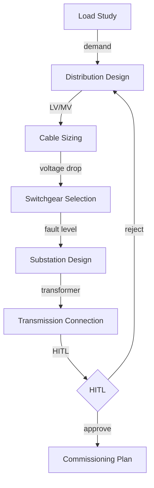

# ELEC-WORKFLOW — Electrical Engineering Workflow UI/UX Override Specification

## Purpose

This document defines the **00860 Electrical Engineering discipline overrides** for the workflow system. All core behaviour is defined in:

> **[00860 Electrical Engineering UI/UX Specification](../../UI-UX-SPECIFICATION.md)**

## 1. Override Summary

| Override | Value | § |
|----------|-------|---|
| `accentColour` | **Gold** (#FFD700) — OVERRIDE pattern | §2 |
| `workflowPrefix` | `ELEC-` | §3 |
| `workflowTypes` | power-distribution, traffic-signals, high-voltage-transmission, generator-plant, substation, cable-reticulation, maintenance, commissioning | §3 |
| `disciplineCode` | `"00860"` | §4 |
| `route` | `/elec-workflow` | §4 |
| `stateLabels` | Agents: "Electrical Agents", Upserts: "Electrical Records", Workspace: "HITL Queue" | §5 |

## 2. Color Scheme Override

**Gold Electrical Workflow Palette**:

```css
:root {
  --elec-workflow-primary: #FFD700;
  --elec-workflow-secondary: #DAA520;
  --elec-workflow-accent: #B8860B;
  --elec-workflow-header-gradient: linear-gradient(135deg, #B8860B 0%, #FFD700 100%);
  --elec-workflow-shadow-lg: 0 8px 24px rgba(255, 215, 0, 0.3);
}
```

## 3. Workflow Types

| Code | Workflow | Issue |
|------|----------|-------|
| ELEC-001 | Electrical Power Distribution | ELEC-001 |
| ELEC-002 | Traffic Signals & Intelligent Transport | ELEC-002 |
| ELEC-003 | High Voltage Transmission | ELEC-003 |
| ELEC-004 | Generator Power Plant | ELEC-004 |
| ELEC-005 | Substation Design | ELEC-005 |
| ELEC-006 | Cable Selection & Reticulation | ELEC-006 |
| ELEC-007 | Electrical Maintenance | ELEC-007 |
| ELEC-008 | Electrical Commissioning | ELEC-008 |

## 4. Routing

- **Route**: `/elec-workflow`
- **Accordion Section**: Electrical Engineering (display_order: 860)
- **CSS Class Prefix**: `A-ELECWF-*`

## 5. Three-State Configuration

| State | Heading | Primary Action |
|-------|---------|----------------|
| Agents | Electrical Agents | View Details |
| Upserts | Electrical Records | Create New / Import / Edit / Delete |
| Workspace | HITL Queue | Approve / Reject |

## 6. CSS Architecture

```css
/* 1. 00860 Electrical Engineering Base */
@import "../../templates/template-a-standard.css";

/* 2. Discipline Override */
@import "../00860-electrical-engineering-page-style.css";

/* 3. Workflow Override */
@import "00860-elec-workflow-override-style.css";
```

**File**: `client/src/common/css/pages/00860-elec-workflow/00860-elec-workflow-override-style.css`

## 7. Mermaid Flow: Electrical Workflow Lifecycle



## 8. Chatbot

```javascript
{ chatType: "agent", stateAware: true, zIndex: 1500, modelEndpoint: "/api/chat/elec-workflow" }
```

## 9. Agent Ownership

| Company | Role |
|---------|------|
| DomainForge AI | Domain Validation |
| QualityForge AI | Testing |
| DevForge AI | Implementation |

---

**Version**: 1.0 | **Date**: 2026-04-29 | **Status**: Active
