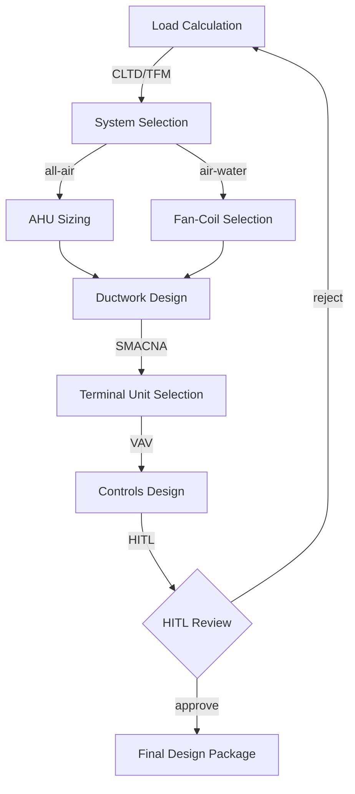
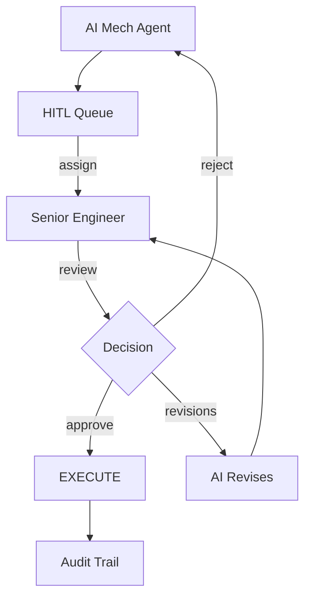
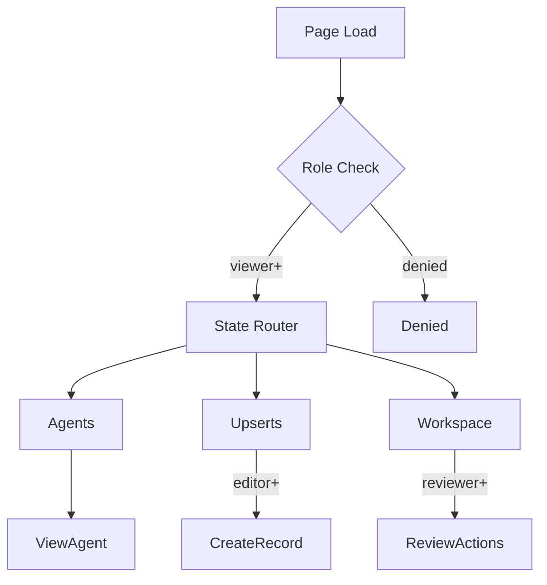

# MECH-WORKFLOW — Mechanical Engineering Workflow UI/UX Specification

## Table of Contents

1. [Part A: UX Patterns](#part-a-ux-patterns)
2. [Part B: Three-State Button & Modal Rules](#part-b-three-state-button--modal-rules)
3. [Part C: Mermaid UI Flow Diagrams](#part-c-mermaid-ui-flow-diagrams)
4. [Part D: Implementation Standards](#part-d-implementation-standards)
5. [Part E: Screen Specifications](#part-e-screen-specifications)
6. [Part F: AI Model Backend](#part-f-ai-model-backend)
7. [Part G: Agent Knowledge Ownership](#part-g-agent-knowledge-ownership)

---

## Part A: UX Patterns

### Page Classification

**Template Type**: **Template B** (Complex / Three-State)

**Why Template B**:
- **Multi-State Navigation**: Agents, Upserts, Workspace
- **Multi-Purpose Functionality**: HVAC design, load calculations, equipment selection, ductwork design
- **Complex Workflows**: Mechanical design lifecycle from load calculation through AHU selection
- **CSS Class Convention**: `A-MECH-*` prefix

### Information Architecture

**Accordion Section**: Mechanical Engineering (display_order: 870)
**Route**: `/mech-workflow`

### Color Scheme — Silver

```css
:root {
  --template-a-primary: #C0C0C0;
  --template-a-secondary: #708090;
  --template-a-accent: #A9A9A9;
  --template-a-bg-gradient: linear-gradient(135deg, #f0f0f0 0%, #dcdcdc 100%);
  --template-a-header-gradient: linear-gradient(135deg, #708090 0%, #C0C0C0 100%);
  --template-a-text-primary: #000000;
  --template-a-text-white: #ffffff;
  --template-a-shadow-lg: 0 8px 24px rgba(192, 192, 192, 0.3);
}
```

### HITL Integration

1. AI Agent performs HVAC calculations (load, duct sizing, equipment selection)
2. Work enters HITL Review Queue
3. Mechanical Engineer reviews: Approve / Reject with Feedback / Manual Override

---

## Part B: Three-State Button & Modal Rules

### Agents State

| Button | Visibility Gate | Action | Modal |
|--------|----------------|--------|-------|
| View Details | Always | AgentDetails | 98vw, agent metrics |

### Upserts State

| Button | Visibility Gate | Action | Modal |
|--------|----------------|--------|-------|
| Create New | editor | CreateRecord | 98vw, HVAC record form |
| Import | editor | Import | CSV/Excel |
| Edit | editor | EditRecord | Pre-populated |
| Delete | governance | Confirmation | Impact warning |

### Workspace State

| Button | Visibility Gate | Action | Modal |
|--------|----------------|--------|-------|
| Approve | reviewer | Approval | Confirm |
| Reject | reviewer | Rejection | Required feedback |
| Generate Report | Always | Export | Format selector |

---

## Part C: Mermaid UI Flow Diagrams

### HVAC Design Lifecycle



### HITL Review Workflow



### Page State Flow



---

## Part D: Implementation Standards

**CSS Import**: `@import "../../templates/template-a-standard.css";`
**Class Prefix**: `A-MECH-*`

### Components

| Component | CSS Class |
|-----------|-----------|
| StateButtons | `.A-MECH-state-btn` |
| NavContainer | `.A-MECH-nav-container` |
| LoadCalcForm | `.A-MECH-load-calc` |
| EquipmentSelector | `.A-MECH-equipment-selector` |

### Chatbot

```javascript
{ chatType: "agent", stateAware: true, zIndex: 1500, modelEndpoint: "/api/chat/mech" }
```

---

## Part E: Screen Specifications

### Wireframe: Agents State

```
┌─────────────────────────────────────────────┐
│ [Silver Header] MECH-WORKFLOW [Chatbot]      │
├─────────────────────────────────────────────┤
│ Agents | Upserts | Workspace                 │
│ ┌──────────┐ ┌──────────┐                    │
│ │ HVAC     │ │ Mech     │                    │
│ │ Engineer │ │ Analyst  │                    │
│ │ ● Active │ │ ● Active │                    │
│ └──────────┘ └──────────┘                    │
└─────────────────────────────────────────────┘
```

---

## Part F: AI Model Backend

**Base Model**: Qwen 2.5
**LoRA Adapter**: HVAC design, load calculations, ASHRAE standards
**Endpoint**: `/api/chat/mech`

---

## Part G: Agent Knowledge Ownership

| Company | Role |
|---------|------|
| DomainForge AI | Domain Validation |
| QualityForge AI | Testing |
| DevForge AI | Implementation |

---

**Version**: 1.0 | **Date**: 2026-04-29 | **Status**: Active
