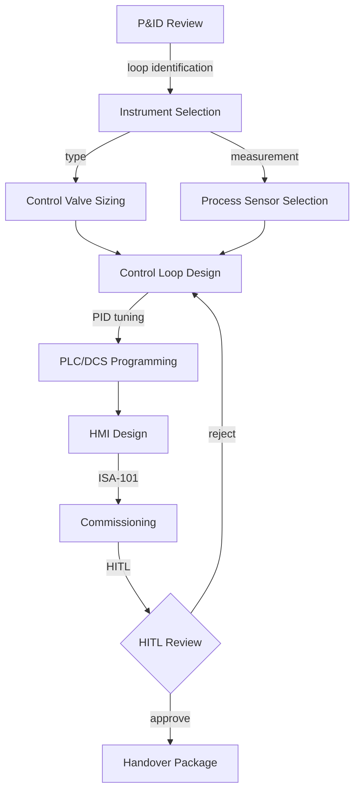
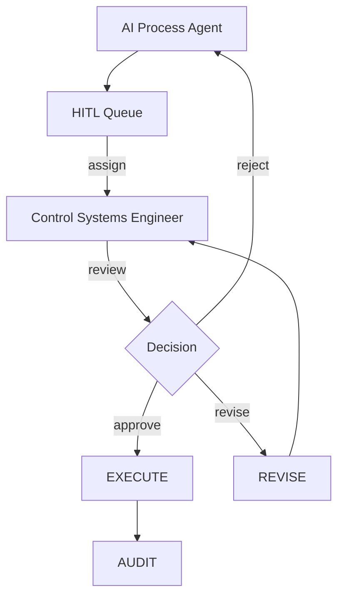

# PROCESS-WORKFLOW — Process Engineering Workflow UI/UX Specification

## Table of Contents

1. [Part A: UX Patterns](#part-a-ux-patterns)
2. [Part B: Three-State Button & Modal Rules](#part-b-three-state-button--modal-rules)
3. [Part C: Mermaid UI Flow Diagrams](#part-c-mermaid-ui-flow-diagrams)
4. [Part D: Implementation Standards](#part-d-implementation-standards)
5. [Part E: Screen Specifications](#part-e-screen-specifications)
6. [Part F: AI Model Backend](#part-f-ai-model-backend)
7. [Part G: Agent Knowledge Ownership](#part-g-agent-knowledge-ownership)

---

## Part A: UX Patterns

### Page Classification

**Template Type**: **Template B** (Complex / Three-State)

**Why Template B**:
- Multi-State Navigation: Agents, Upserts, Workspace
- Multi-Purpose Functionality: Control system design, instrumentation, PLC/DCS programming, HMI design
- Complex Workflows: Process control lifecycle from P&ID review through loop tuning
- CSS Class Convention: `A-PROC-*` prefix

### Information Architecture

**Accordion Section**: Process Engineering (display_order: 871)
**Route**: `/process-workflow`

### Color Scheme — Orange

```css
:root {
  --template-a-primary: #FF8C00;
  --template-a-secondary: #FFA500;
  --template-a-accent: #E67E22;
  --template-a-bg-gradient: linear-gradient(135deg, #fff3e0 0%, #ffe0b2 100%);
  --template-a-header-gradient: linear-gradient(135deg, #E67E22 0%, #FFA500 100%);
  --template-a-text-white: #ffffff;
  --template-a-shadow-lg: 0 8px 24px rgba(255, 140, 0, 0.3);
}
```

### HITL Integration

1. AI Agent performs control system design (loop tuning, instrument selection, PLC programming)
2. Work enters HITL Review Queue
3. Process Engineer reviews: Approve / Reject with Feedback / Manual Override

---

## Part B: Three-State Button & Modal Rules

| State | Button | Gate | Modal |
|-------|--------|------|-------|
| Agents | View Details | Always | AgentDetails (98vw) |
| Upserts | Create New | editor | CreateRecord |
| Upserts | Import | editor | Import |
| Upserts | Edit | editor | EditRecord |
| Upserts | Delete | governance | Confirmation |
| Workspace | Approve | reviewer | Approval |
| Workspace | Reject | reviewer | Rejection |
| Workspace | Generate Report | Always | Export |

---

## Part C: Mermaid UI Flow Diagrams

### Control System Design Lifecycle



### HITL Review Workflow



---

## Part D: Implementation Standards

**CSS Import**: `@import "../../templates/template-a-standard.css";`
**Class Prefix**: `A-PROC-*`

### Components

| Component | CSS Class |
|-----------|-----------|
| StateButtons | `.A-PROC-state-btn` |
| NavContainer | `.A-PROC-nav-container` |
| LoopTuningForm | `.A-PROC-loop-form` |
| InstrumentSelector | `.A-PROC-instrument-selector` |

### Chatbot

```javascript
{ chatType: "agent", stateAware: true, zIndex: 1500, modelEndpoint: "/api/chat/process" }
```

---

## Part E: Screen Specifications

```
┌──────────────────────────────────────────────┐
│ [Orange Header] PROCESS-WORKFLOW [Chatbot]    │
├──────────────────────────────────────────────┤
│ Agents | Upserts | Workspace                  │
│ ┌──────────┐ ┌──────────┐                     │
│ │ Control  │ │ Loop     │                     │
│ │ Engineer │ │ Tuner    │                     │
│ │ ● Active │ │ ● Active │                     │
│ └──────────┘ └──────────┘                     │
└──────────────────────────────────────────────┘
```

---

## Part F: AI Model Backend

**Base Model**: Qwen 2.5
**LoRA Adapter**: Process control, PID tuning, ISA standards
**Endpoint**: `/api/chat/process`

---

## Part G: Agent Knowledge Ownership

| Company | Role |
|---------|------|
| DomainForge AI | Domain Validation |
| QualityForge AI | Testing |
| DevForge AI | Implementation |

---

**Version**: 1.0 | **Date**: 2026-04-29 | **Status**: Active
