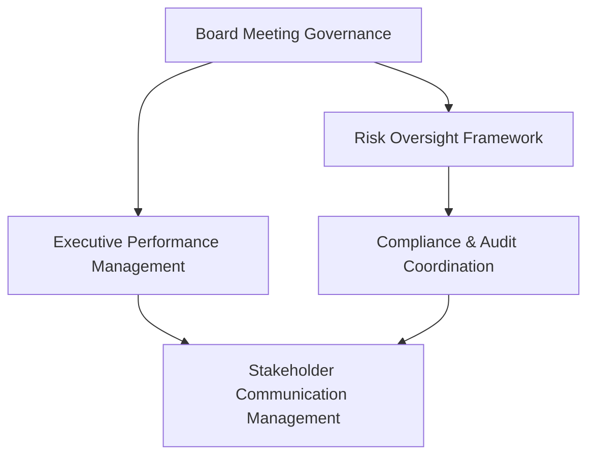

# Board of Directors Workflow Implementation Preparation Procedure

## Overview

This procedure outlines how to create project implementation workflow guides for board of directors governance workflows, ensuring alignment with fiduciary duties, strategic oversight requirements, and leveraging the full capabilities of the Paperclip agent ecosystem.

### Purpose
- Standardize board governance workflow implementation across the Paperclip ecosystem
- Ensure alignment with fiduciary duties and corporate governance requirements
- Provide consistent team assignments and phase definitions for governance operations
- Maintain audit trails and compliance requirements for board operations

### Scope
- 5 core board governance workflows requiring implementation guides
- Integration with governance-related Supabase tables and compliance frameworks
- Coordination with 9 Paperclip agent companies and their governance capabilities
- 5-phase implementation process per governance workflow

---

## Step 1: Governance Alignment Requirements

### Critical Governance Tables to Align With

| Table | Purpose | Key Fields | Workflow Integration |
|-------|---------|------------|---------------------|
| **board_meetings** | Board meeting management | id, organization_id, meeting_type, date, status, attendees | All governance workflows must reference board meeting context |
| **board_decisions** | Decision tracking | id, meeting_id, decision_type, status, approval_date, implementation_date | Decision approval and implementation tracking |
| **committee_meetings** | Committee operations | id, committee_type, meeting_date, status, chair, secretary | Committee governance and oversight |
| **risk_assessments** | Risk management | id, organization_id, risk_type, severity, mitigation_status, review_date | Risk oversight and mitigation tracking |
| **compliance_audits** | Compliance tracking | id, audit_type, status, auditor, completion_date, findings | Governance compliance and audit management |
| **executive_compensation** | Compensation governance | id, executive_id, compensation_type, approval_date, board_committee | Remuneration committee oversight |
| **shareholder_communications** | Stakeholder engagement | id, communication_type, date, recipients, response_required | Shareholder value and communication management |

### Governance-Aware Workflow Design Requirements

**Fiduciary Duty Integration:**
- All workflows must support duty of care, loyalty, and good faith requirements
- Decision-making processes must include independent director review mechanisms
- Risk assessments must consider shareholder and stakeholder impacts
- Financial commitments require appropriate board approval thresholds

**Regulatory Compliance Framework:**
- SOX compliance for financial reporting and internal controls
- Corporate governance codes and best practices integration
- Board diversity and independence requirements
- Disclosure and transparency obligations

**Committee Structure Integration:**
- Audit Committee: Financial oversight and internal controls
- Risk Committee: Enterprise risk management framework
- Remuneration Committee: Executive compensation and incentives
- Nominations Committee: Board composition and succession planning
- HSE Committee: Health, safety, and environmental oversight

---

## Step 2: Workflow Prioritization Matrix

### Core Board Governance Workflows

| Priority | Workflow | Domain Knowledge Source | Complexity | Timeline |
|----------|----------|-------------------------|------------|----------|
| **Critical** | Board Meeting Governance | Part 1: Strategic Governance | High | 2-3 weeks |
| **Critical** | Risk Oversight Framework | Part 2: Board Committees | High | 2-3 weeks |
| **High** | Executive Performance Management | Part 1: Management Accountability | Medium | 1-2 weeks |
| **High** | Compliance & Audit Coordination | Part 2: Key Board Metrics | Medium | 1-2 weeks |
| **Medium** | Stakeholder Communication Management | Part 3: AI Agent Persona | Low | 1 week |

### Workflow Dependencies



---

## Step 3: Directory Structure Setup

### Base Directory Structure
```
docs-paperclip/disciplines/00880-board-of-directors/
├── projects/
│   ├── board-meeting-governance-workflow/
│   │   ├── project/
│   │   │   ├── board-meeting-governance-workflow-plan.md
│   │   │   └── board-meeting-governance-workflow-implementation.md
│   │   └── issues/
│   │       ├── BOD-001-board-meeting-preparation.md
│   │       ├── BOD-002-board-materials-review.md
│   │       └── ...
│   ├── risk-oversight-framework-workflow/
│   ├── executive-performance-management-workflow/
│   ├── compliance-audit-coordination-workflow/
│   └── stakeholder-communication-workflow/
├── 00880-board-of-directors-workflow-conversion-procedure.md
├── 00880-board-of-directors-workflow-implementation.md
└── 00880-board-of-directors-workflows-list.md
```

### Project-Specific Issue Prefixes
- **BOD**: Board of Directors governance workflows
- **RISK**: Risk oversight and management workflows
- **EXEC**: Executive performance and accountability workflows
- **COMP**: Compliance and audit coordination workflows
- **STAKE**: Stakeholder communication and engagement workflows

---

## Step 4: Template Adaptation Variables

### Core Variables for Board Governance
```yaml
# Discipline identification
discipline_code: "00880"
discipline_name: "board-of-directors"
discipline_title: "Board of Directors"

# Domain knowledge extraction
primary_responsibilities: "Fiduciary oversight, strategic governance, management accountability"
key_committees: "Audit, Risk, Remuneration, Nominations, HSE"
ai_automation_level: "Human-led with AI support for analysis and reporting"

# Company assignments
primary_company: "DomainForge AI"
governance_agents: "board-directors-domainforge"
supporting_companies: "QualityForge AI, KnowledgeForge AI, InfraForge AI"

# Project structure
project_base_path: "docs-paperclip/disciplines/00880-board-of-directors/projects"
issue_prefix: "BOD"
ceo_agent: "nexus-devforge-ceo"
```

### Agent Company Assignments
```yaml
# Primary governance company
domainforge_ai:
  company: "DomainForge AI"
  agents:
    - board-directors-domainforge
    - governance-domainforge
  skills: "Governance, Strategic Planning, Risk Management"

# Quality assurance
qualityforge_ai:
  company: "QualityForge AI"
  agents:
    - guardian-qualityforge
    - compliance-qualityforge
  skills: "Compliance Monitoring, Audit Support, Quality Assurance"

# Knowledge management
knowledgeforge_ai:
  company: "KnowledgeForge AI"
  agents:
    - doc-analyzer-knowledgeforge
    - policy-knowledgeforge
  skills: "Documentation, Policy Analysis, Knowledge Management"

# Infrastructure support
infraforge_ai:
  company: "InfraForge AI"
  agents:
    - database-infraforge
    - security-infraforge
  skills: "Data Security, Infrastructure Governance"
```

---

## Step 5: Implementation Execution Process

### Phase 1: Foundation Setup (Week 1)
**Goal**: Establish governance framework and agent assignments

**Deliverables:**
- [ ] Governance framework documentation
- [ ] Agent role assignments and responsibilities
- [ ] Initial risk assessment and compliance baseline
- [ ] Board meeting preparation protocols

**Success Criteria:**
- All governance agents assigned and briefed
- Basic governance framework documented
- Initial compliance assessment completed
- Board meeting calendar established

### Phase 2: Core Workflow Development (Weeks 2-3)
**Goal**: Implement core governance workflows

**Deliverables:**
- [ ] Board meeting governance workflow
- [ ] Risk oversight framework implementation
- [ ] Executive performance management system
- [ ] Compliance and audit coordination processes

**Success Criteria:**
- All core workflows documented and tested
- Agent handoffs working correctly
- Governance metrics established
- Initial workflow execution completed

### Phase 3: Integration and Enhancement (Week 4)
**Goal**: Integrate workflows and add advanced features

**Deliverables:**
- [ ] Cross-workflow integration points
- [ ] Advanced AI capabilities implementation
- [ ] Stakeholder communication workflows
- [ ] Performance monitoring and reporting

**Success Criteria:**
- Seamless workflow integration achieved
- AI augmentation fully implemented
- Stakeholder feedback incorporated
- Performance baselines established

### Phase 4: Testing and Validation (Week 5)
**Goal**: Comprehensive testing and compliance validation

**Deliverables:**
- [ ] End-to-end workflow testing
- [ ] Compliance and audit validation
- [ ] Performance optimization
- [ ] Documentation finalization

**Success Criteria:**
- All workflows tested successfully
- Compliance requirements met
- Performance targets achieved
- Documentation complete and approved

### Phase 5: Deployment and Monitoring (Week 6)
**Goal**: Production deployment and ongoing governance

**Deliverables:**
- [ ] Production deployment
- [ ] Training and handover
- [ ] Monitoring and alerting setup
- [ ] Continuous improvement framework

**Success Criteria:**
- Successful production deployment
- All agents trained and operational
- Monitoring systems active
- Governance framework sustainable

---

## Step 6: Quality Assurance Framework

### Governance-Specific Validation Checks

**Fiduciary Duty Compliance:**
- [ ] All workflows support duty of care requirements
- [ ] Independent decision-making processes included
- [ ] Shareholder value considerations integrated
- [ ] Ethical governance principles applied

**Regulatory Compliance:**
- [ ] SOX compliance requirements addressed
- [ ] Corporate governance codes followed
- [ ] Disclosure obligations met
- [ ] Audit trail requirements satisfied

**Board Committee Integration:**
- [ ] Audit Committee requirements met
- [ ] Risk Committee oversight included
- [ ] Remuneration Committee processes defined
- [ ] Nominations Committee succession planning addressed

### Success Metrics

| Metric Category | Target | Measurement Method |
|----------------|--------|-------------------|
| **Workflow Adoption** | 95% | Agent usage tracking, workflow completion rates |
| **Compliance Achievement** | 100% | Audit findings, regulatory reviews |
| **Decision Quality** | 90% | Board satisfaction surveys, outcome analysis |
| **Efficiency Gains** | 30% | Time savings, cost reductions, error reduction |

---

## Step 7: Risk Mitigation Strategies

### Governance-Specific Risks

| Risk | Probability | Impact | Mitigation Strategy |
|------|-------------|--------|-------------------|
| **Regulatory Non-Compliance** | Medium | High | Automated compliance monitoring, regular audits |
| **Board Decision Errors** | Low | High | Independent review processes, AI analysis support |
| **Executive Accountability Gaps** | Medium | Medium | Performance monitoring frameworks, regular reviews |
| **Stakeholder Communication Failures** | Low | Medium | Communication protocols, feedback mechanisms |
| **Risk Oversight Blind Spots** | Medium | High | Comprehensive risk assessment frameworks, regular updates |

### Contingency Plans

**Regulatory Change Response:**
- Automated monitoring of regulatory updates
- Rapid workflow adaptation capabilities
- Board notification and training protocols

**Crisis Management Integration:**
- Emergency board meeting protocols
- Crisis communication workflows
- Stakeholder impact assessment processes

---

## Step 8: Continuous Improvement Framework

### Governance Maturity Model

| Level | Characteristics | Implementation Requirements |
|-------|-----------------|----------------------------|
| **Initial** | Basic governance processes | Foundation workflows implemented |
| **Developing** | Standardized governance framework | Core workflows operational |
| **Defined** | Comprehensive governance system | All workflows integrated |
| **Managed** | Metrics-driven governance | Performance monitoring active |
| **Optimizing** | Continuously improving governance | AI-driven optimization implemented |

### Feedback and Enhancement Cycles

**Monthly Governance Review:**
- Workflow performance analysis
- Compliance assessment updates
- Board satisfaction feedback
- Regulatory change adaptation

**Quarterly Enhancement Planning:**
- New workflow requirements identification
- Technology capability assessments
- Agent skill development planning
- Governance maturity advancement

---

**Board of Directors Workflow Procedure — Version 1.0 — 2026-04-10**
**Contact**: DomainForge AI Governance Team