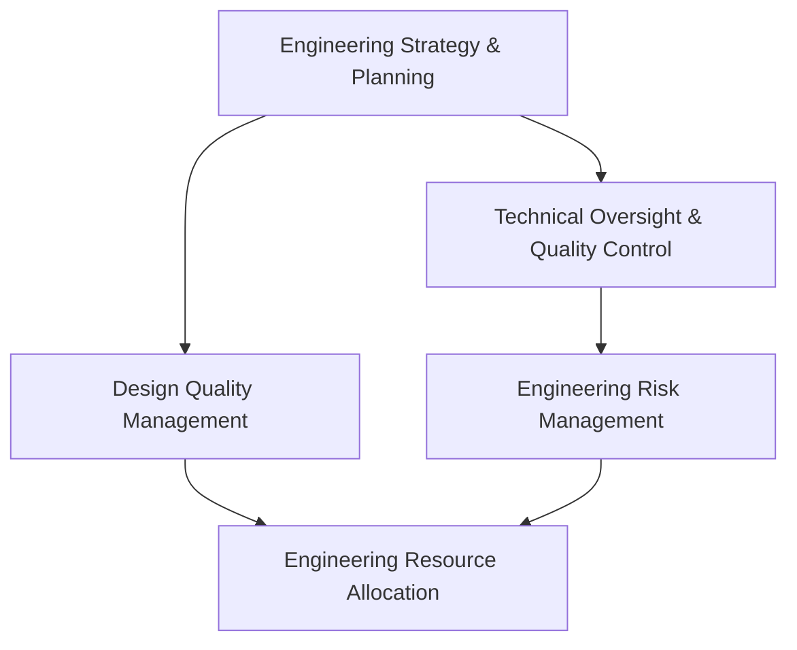

# Engineering Director Workflow Implementation Preparation Procedure

## Overview

This procedure outlines how to create project implementation workflow guides for engineering director governance workflows, ensuring alignment with engineering strategy, technical oversight requirements, and leveraging the full capabilities of the Paperclip agent ecosystem.

### Purpose
- Standardize engineering director workflow implementation across the Paperclip ecosystem
- Ensure alignment with engineering strategy and technical excellence requirements
- Provide consistent team assignments and phase definitions for engineering operations
- Maintain audit trails and compliance requirements for engineering director operations

### Scope
- 5 core engineering director workflows requiring implementation guides
- Integration with engineering-related Supabase tables and technical frameworks
- Coordination with 9 Paperclip agent companies and their engineering capabilities
- 5-phase implementation process per engineering workflow

---

## Step 1: Engineering Alignment Requirements

### Critical Engineering Tables to Align With

| Table | Purpose | Key Fields | Workflow Integration |
|-------|---------|------------|---------------------|
| **engineering_deliverables** | Engineering deliverable tracking | id, project_id, discipline, status, due_date, actual_date | All engineering workflows must reference deliverable context |
| **design_reviews** | Design quality control | id, deliverable_id, review_type, status, reviewer, completion_date | Design quality assurance and verification |
| **technical_standards** | Engineering standards management | id, standard_type, version, approval_date, applicability | Engineering compliance and standards alignment |
| **engineering_resources** | Resource allocation tracking | id, project_id, resource_type, allocation_date, utilization_rate | Engineering workforce and resource management |
| **engineering_risks** | Technical risk management | id, project_id, risk_type, severity, mitigation_status, review_date | Engineering risk oversight and mitigation |
| **engineering_changes** | Design change control | id, deliverable_id, change_type, approval_status, impact_assessment | Engineering change management and impact analysis |

### Engineering-Aware Workflow Design Requirements

**Engineering Strategy Integration:**
- All workflows must support engineering planning and methodology selection
- Decision-making processes must include technical quality assurance mechanisms
- Engineering progress must be tracked against milestones and KPIs
- Engineering recovery schedules require executive approval

**Technical Excellence Framework:**
- Engineering standards compliance and specification approval
- Design quality management and verification processes
- Technical risk assessment and mitigation strategies
- Engineering compliance with codes and standards

**Engineering Management Integration:**
- Engineering Strategy: Planning and methodology oversight
- Technical Oversight: Quality monitoring and progress tracking
- Design Quality: Review processes and change control
- Resource Management: Allocation and workforce planning

---

## Step 2: Workflow Prioritization Matrix

### Core Engineering Director Workflows

| Priority | Workflow | Domain Knowledge Source | Complexity | Timeline |
|----------|----------|-------------------------|------------|----------|
| **Critical** | Engineering Strategy & Planning | Part 1: Engineering Strategy | High | 2-3 weeks |
| **Critical** | Technical Oversight & Quality Control | Part 1: Technical Oversight | High | 2-3 weeks |
| **High** | Design Quality Management | Part 1: Design Quality | Medium | 1-2 weeks |
| **High** | Engineering Resource Allocation | Part 1: Resource Management | Medium | 1-2 weeks |
| **Medium** | Engineering Risk Management | Part 2: Engineering Risk | Low | 1 week |

### Workflow Dependencies



---

## Step 3: Directory Structure Setup

### Base Directory Structure
```
docs-paperclip/disciplines/00884-engineering-director/
├── projects/
│   ├── engineering-strategy-workflow/
│   │   ├── project/
│   │   │   ├── engineering-strategy-workflow-plan.md
│   │   │   └── engineering-strategy-workflow-implementation.md
│   │   └── issues/
│   │       ├── ENG-001-engineering-strategy-development.md
│   │       ├── ENG-002-technical-standards-approval.md
│   │       └── ...
│   ├── technical-oversight-workflow/
│   ├── design-quality-management-workflow/
│   ├── engineering-resource-workflow/
│   └── engineering-risk-workflow/
├── 00884-engineering-director-workflow-conversion-procedure.md
├── 00884-engineering-director-workflow-implementation.md
└── 00884-engineering-director-workflows-list.md
```

### Project-Specific Issue Prefixes
- **ENG**: Engineering strategy and planning workflows
- **TECH**: Technical oversight and quality control workflows
- **DESIGN**: Design quality management workflows
- **RESOURCE**: Engineering resource allocation workflows
- **RISK**: Engineering risk management workflows

---

## Step 4: Template Adaptation Variables

### Core Variables for Engineering Director
```yaml
# Discipline identification
discipline_code: "00884"
discipline_name: "engineering-director"
discipline_title: "Engineering Director"

# Domain knowledge extraction
primary_responsibilities: "Engineering strategy, technical oversight, design quality, resource management"
key_focus_areas: "Engineering planning, technical quality, design reviews, workforce allocation"
ai_automation_level: "Human-led with AI support for analysis and monitoring"

# Company assignments
primary_company: "DomainForge AI"
engineering_agents: "engineering-director-domainforge, engineering-managers-domainforge"
supporting_companies: "QualityForge AI, KnowledgeForge AI, DevForge AI"

# Project structure
project_base_path: "docs-paperclip/disciplines/00884-engineering-director/projects"
issue_prefix: "ENG"
ceo_agent: "nexus-devforge-ceo"
```

### Agent Company Assignments
```yaml
# Primary engineering company
domainforge_ai:
  company: "DomainForge AI"
  agents:
    - engineering-director-domainforge
    - engineering-managers-domainforge
  skills: "Engineering Strategy, Technical Oversight, Design Quality"

# Quality assurance
qualityforge_ai:
  company: "QualityForge AI"
  agents:
    - guardian-qualityforge
    - engineering-qualityforge
  skills: "Design Review, Quality Assurance, Technical Verification"

# Knowledge management
knowledgeforge_ai:
  company: "KnowledgeForge AI"
  agents:
    - doc-analyzer-knowledgeforge
    - standards-knowledgeforge
  skills: "Engineering Documentation, Standards Management"

# Development support
devforge_ai:
  company: "DevForge AI"
  agents:
    - interface-devforge
    - codesmith-devforge
  skills: "Engineering Systems, Workflow Development"

# Infrastructure support
infraforge_ai:
  company: "InfraForge AI"
  agents:
    - database-infraforge
  skills: "Engineering Data Management"
```

---

## Step 5: Implementation Execution Process

### Phase 1: Foundation Setup (Week 1)
**Goal**: Establish engineering framework and agent assignments

**Deliverables:**
- [ ] Engineering strategy framework documentation
- [ ] Agent role assignments and responsibilities
- [ ] Initial technical quality baseline
- [ ] Engineering planning protocols

**Success Criteria:**
- All engineering agents assigned and briefed
- Basic engineering framework documented
- Initial technical assessment completed
- Engineering calendar established

### Phase 2: Core Workflow Development (Weeks 2-3)
**Goal**: Implement core engineering workflows

**Deliverables:**
- [ ] Engineering strategy and planning workflow
- [ ] Technical oversight and quality control implementation
- [ ] Design quality management system
- [ ] Engineering resource allocation processes

**Success Criteria:**
- All core workflows documented and tested
- Agent handoffs working correctly
- Engineering metrics established
- Initial workflow execution completed

### Phase 3: Integration and Enhancement (Week 4)
**Goal**: Integrate workflows and add advanced features

**Deliverables:**
- [ ] Cross-workflow integration points
- [ ] Advanced technical monitoring capabilities
- [ ] Engineering risk management workflows
- [ ] Performance monitoring and reporting

**Success Criteria:**
- Seamless workflow integration achieved
- Technical monitoring fully implemented
- Risk management incorporated
- Performance baselines established

### Phase 4: Testing and Validation (Week 5)
**Goal**: Comprehensive testing and technical validation

**Deliverables:**
- [ ] End-to-end workflow testing
- [ ] Technical compliance validation
- [ ] Performance optimization
- [ ] Documentation finalization

**Success Criteria:**
- All workflows tested successfully
- Technical requirements met
- Performance targets achieved
- Documentation complete and approved

### Phase 5: Deployment and Monitoring (Week 6)
**Goal**: Production deployment and ongoing engineering oversight

**Deliverables:**
- [ ] Production deployment
- [ ] Training and handover
- [ ] Monitoring and alerting setup
- [ ] Continuous improvement framework

**Success Criteria:**
- Successful production deployment
- All agents trained and operational
- Monitoring systems active
- Engineering framework sustainable

---

## Step 6: Quality Assurance Framework

### Engineering-Specific Validation Checks

**Engineering Strategy Compliance:**
- [ ] All workflows support engineering planning requirements
- [ ] Technical quality assurance processes included
- [ ] Engineering progress tracking mechanisms integrated
- [ ] Resource allocation optimization applied

**Technical Excellence Framework:**
- [ ] Engineering standards compliance addressed
- [ ] Design review processes defined
- [ ] Technical verification methods implemented
- [ ] Engineering compliance with codes and standards met

**Engineering Management Integration:**
- [ ] Engineering Strategy requirements met
- [ ] Technical Oversight processes included
- [ ] Design Quality management defined
- [ ] Resource Management workflows established

### Success Metrics

| Metric Category | Target | Measurement Method |
|----------------|--------|-------------------|
| **Workflow Adoption** | 95% | Agent usage tracking, workflow completion rates |
| **Technical Excellence** | 90% | Design quality metrics, technical compliance audits |
| **Engineering Performance** | 85% | Schedule performance, cost performance metrics |
| **Efficiency Gains** | 25% | Time savings, error reduction, resource optimization |

---

## Step 7: Risk Mitigation Strategies

### Engineering-Specific Risks

| Risk | Probability | Impact | Mitigation Strategy |
|------|-------------|--------|-------------------|
| **Technical Quality Issues** | Medium | High | Automated quality monitoring, regular design reviews |
| **Schedule Overruns** | Medium | High | Engineering progress tracking, recovery planning |
| **Resource Constraints** | Low | Medium | Workforce planning, resource optimization |
| **Design Change Impacts** | Medium | Medium | Change control processes, impact assessment |
| **Engineering Risk Blind Spots** | Medium | High | Comprehensive risk assessment frameworks, regular updates |

### Contingency Plans

**Technical Quality Response:**
- Automated quality monitoring and alerting
- Rapid design review capabilities
- Engineering escalation protocols

**Schedule Recovery Integration:**
- Engineering progress tracking and reporting
- Recovery schedule development and approval
- Stakeholder communication protocols

---

## Step 8: Continuous Improvement Framework

### Engineering Maturity Model

| Level | Characteristics | Implementation Requirements |
|-------|-----------------|----------------------------|
| **Initial** | Basic engineering processes | Foundation workflows implemented |
| **Developing** | Standardized engineering framework | Core workflows operational |
| **Defined** | Comprehensive engineering system | All workflows integrated |
| **Managed** | Metrics-driven engineering | Performance monitoring active |
| **Optimizing** | Continuously improving engineering | AI-driven optimization implemented |

### Feedback and Enhancement Cycles

**Monthly Engineering Review:**
- Workflow performance analysis
- Technical quality assessment updates
- Engineering feedback incorporation
- Standards and compliance adaptation

**Quarterly Enhancement Planning:**
- New workflow requirements identification
- Technology capability assessments
- Engineering skill development planning
- Maturity advancement planning

---

**Engineering Director Workflow Procedure — Version 1.0 — 2026-04-10**
**Contact**: DomainForge AI Engineering Team