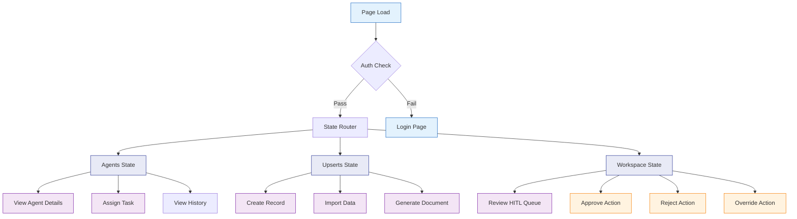
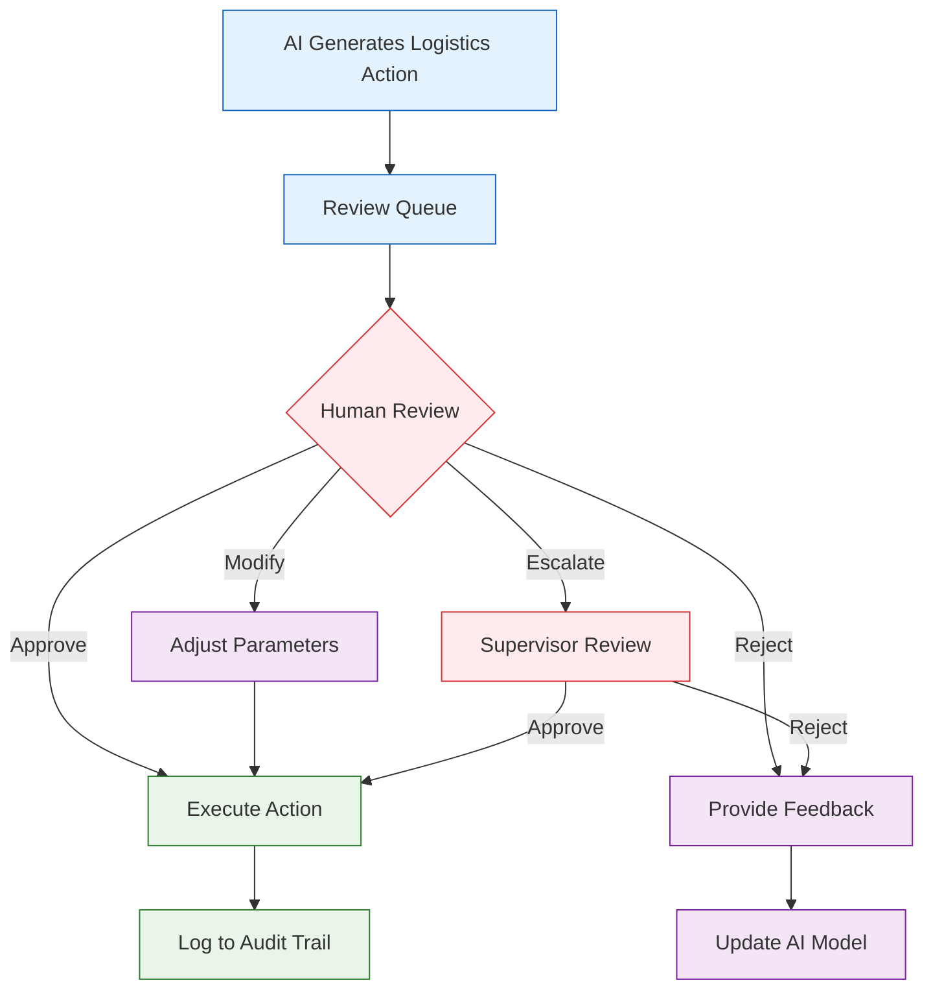
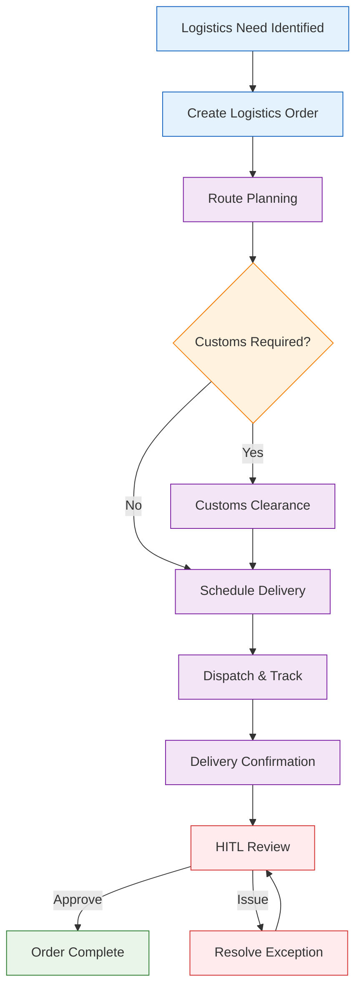
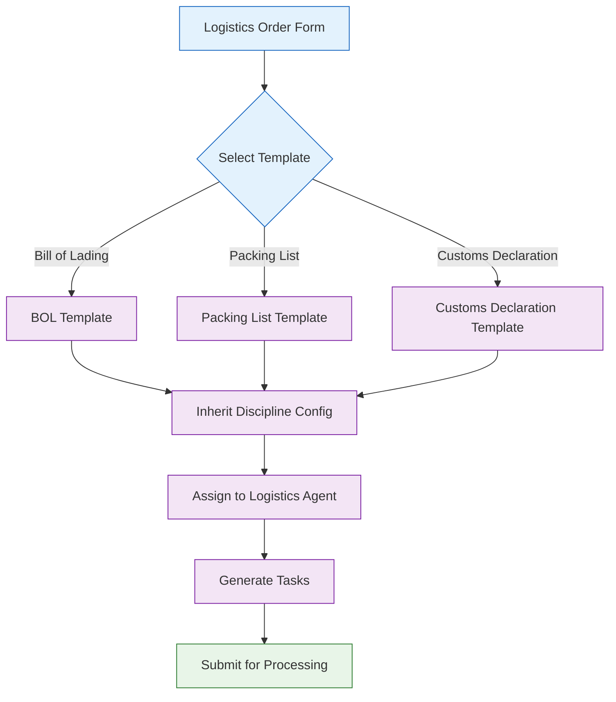
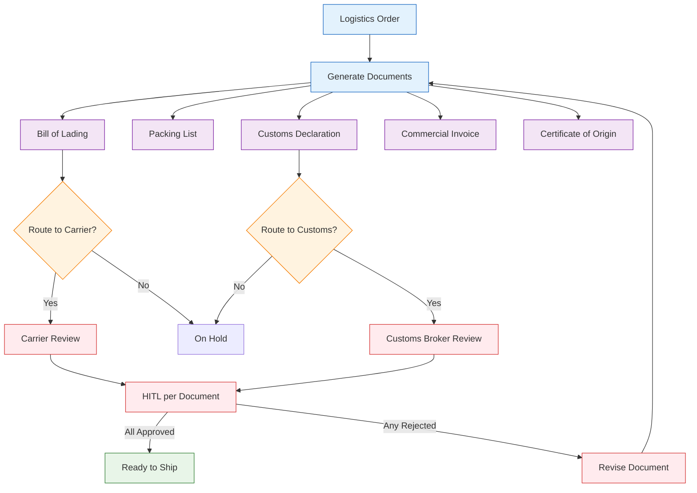
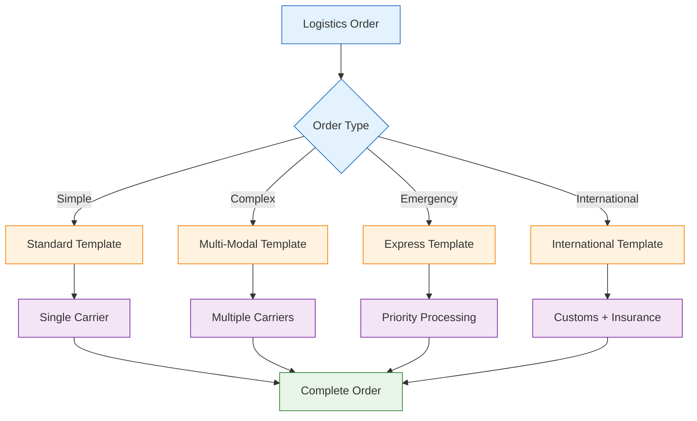
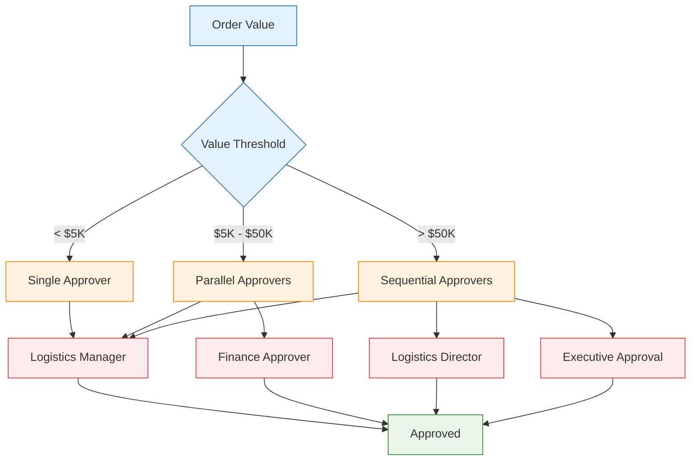
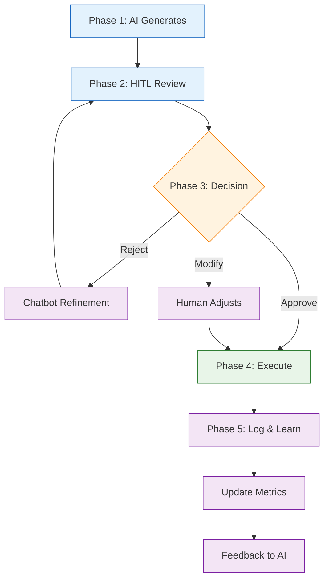
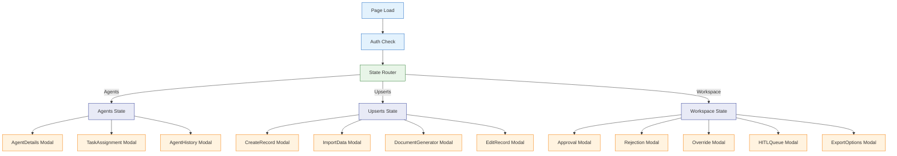

# 01700 Logistics — UI/UX Specification

## Part A: UX Patterns (High-Level)

### Template Classification

**Classification**: Template B (Complex/Three-State)

**Rationale**:
- Multi-state page with 3 distinct navigation states (Agents, Upserts, Workspace)
- Complex workflows: route optimization, customs clearance, delivery scheduling
- Multiple components: 8 logistics project areas (ContainerTracking, CustomsManagement, DailyDelivery, DocumentGeneration, InternationalShipping, SitePlanning, TrafficManagement, MaterialFlow)
- State-aware chatbot with different behaviors per state

### Color Scheme — Logistics Blue Palette

```css
:root {
  --template-a-primary: #1565C0;
  --template-a-secondary: #1976D2;
  --template-a-accent: #0D47A1;
  --template-a-bg-gradient: linear-gradient(135deg, #f0f4f8 0%, #e3edf7 100%);
  --template-a-header-gradient: linear-gradient(135deg, #0D47A1 0%, #1565C0 100%);
  --template-a-text-primary: #000000;
  --template-a-text-secondary: #546e7a;
  --template-a-text-white: #ffffff;
  --template-a-shadow-sm: 0 2px 4px rgba(21, 101, 192, 0.08);
  --template-a-shadow-md: 0 4px 6px rgba(21, 101, 192, 0.12);
  --template-a-shadow-lg: 0 8px 24px rgba(21, 101, 192, 0.25);
  --template-a-success: #2E7D32;
  --template-a-warning: #F57F17;
  --template-a-danger: #C62828;
}
```

### HITL Integration Pattern

AI generates logistics recommendations (route plans, customs docs, delivery schedules) → HITL review queue → Human approves/rejects/modifies → Execute.

---

## Part B: Three-State Button & Modal Rules

### State Definitions

| State | Purpose | Default Content | Chatbot Behavior |
|-------|---------|-----------------|------------------|
| **Agents** | Show AI agents for logistics | Agent cards with status indicators | Answers questions about logistics agent capabilities |
| **Upserts** | Create, edit, import logistics records | Forms, tables, import tools | Assists with record creation, data entry, document generation |
| **Workspace** | Operations dashboard, HITL review | HITL queue, route optimization, delivery tracking | Explains AI recommendations, suggests approvals |

### Agents State Buttons

| Button | Visibility Gate | Action | Modal |
|--------|----------------|--------|-------|
| **View Details** | Always visible | Opens AgentDetails modal | `AgentDetails` — 98vw, agent metrics |
| **Assign Task** | `user.role >= 'editor'` | Opens TaskAssignment modal | `TaskAssignment` — 98vw, task form |
| **View History** | Always visible | Opens AgentHistory modal | `AgentHistory` — 98vw, timeline |

### Upserts State Buttons

| Button | Visibility Gate | Action | Modal |
|--------|----------------|--------|-------|
| **Create Record** | `user.role >= 'editor'` | Opens CreateRecord modal | `CreateRecord` — 98vw, logistics form |
| **Import Data** | `user.role >= 'editor'` | Opens ImportData modal | `ImportData` — 98vw, file upload |
| **Generate Document** | `user.role >= 'editor'` | Opens DocumentGenerator modal | `DocumentGenerator` — 98vw, template selector |
| **Edit** | `user.role >= 'editor'` | Opens EditRecord modal | `EditRecord` — 98vw, edit form |

### Workspace State Buttons

| Button | Visibility Gate | Action | Modal |
|--------|----------------|--------|-------|
| **Approve** | `user.role >= 'reviewer'` | Opens Approval modal | `Approval` — 98vw, confirm with note |
| **Reject** | `user.role >= 'reviewer'` | Opens Rejection modal | `Rejection` — 98vw, feedback form |
| **Override** | `user.role >= 'coordinator'` | Opens Override modal | `Override` — 98vw, override reason |
| **View Queue** | Always visible | Opens HITLQueue modal | `HITLQueue` — 98vw, queue table |
| **Export Report** | Always visible | Opens ExportOptions modal | `ExportOptions` — 98vw, format selector |

---

## Part C: Mermaid UI Flow Diagrams

### Diagram 1: Three-State Navigation Flow



### Diagram 2: HITL Review Workflow



### Diagram 3: Logistics Lifecycle Flow



### Diagram 4: Order Creation with Inheritance



### Diagram 5: Document Generation & Routing



### Diagram 6: Template Complexity Decision Tree



### Diagram 7: Progressive Approval Matrix



### Diagram 8: Enhanced HITL Detail Flow



### Diagram 9: Page State with Modal Integration



---

## Part D: Implementation Standards

### CSS Architecture

```css
/* 1. Template B Standard */
@import "../../templates/template-b-standard.css";

/* 2. Logistics Page-Specific Styles */
@import "01700-logistics-page-style.css";
```

**File Convention**: `client/src/common/css/pages/01700-logistics/01700-logistics-page-style.css`

**CSS Class Convention**: `A-01700-*` for all page-level elements (e.g., `A-01700-state-btn`, `A-01700-container`)

### Modal Inventory

| Modal | State | Purpose | Size |
|-------|-------|---------|------|
| AgentDetails | Agents | View logistics agent details and metrics | 98vw |
| TaskAssignment | Agents | Assign task to logistics agent | 98vw |
| AgentHistory | Agents | View agent action history | 98vw |
| CreateRecord | Upserts | Create new logistics record | 98vw |
| ImportData | Upserts | Import logistics data from file | 98vw |
| DocumentGenerator | Upserts | Generate logistics documents | 98vw |
| EditRecord | Upserts | Edit existing logistics record | 98vw |
| Approval | Workspace | Approve AI-generated logistics action | 98vw |
| Rejection | Workspace | Reject with feedback | 98vw |
| Override | Workspace | Override AI recommendation | 98vw |
| HITLQueue | Workspace | View HITL review queue | 98vw |
| ExportOptions | Workspace | Export logistics report | 98vw |

### Chatbot Configuration

```json
{
  "chatType": "agent",
  "stateAware": true,
  "currentState": "agents|upserts|workspace",
  "zIndex": 1500,
  "modelEndpoint": "/api/chat/logistics"
}
```

| State | Chatbot Focus |
|-------|---------------|
| Agents | Answers questions about logistics agent capabilities and assignments |
| Upserts | Assists with logistics record creation, document generation, data import |
| Workspace | Explains AI route recommendations, suggests approvals, tracks deliveries |

---

## Part E: Screen Specifications

### Platform Adaptations

| Platform | Width | Layout Changes |
|----------|-------|----------------|
| Desktop | 1280px+ | Full three-state nav, agent grid: 3 columns, map view: full width |
| Tablet | 768px-1279px | Three-state nav collapses to dropdown, agent grid: 2 columns, map view: 50% |
| Mobile | <768px | Three-state nav as bottom tab bar, agent grid: 1 column, map view: hidden, touch targets: min 48dp |

### Screen States

| State | Description |
|-------|-------------|
| Loading | Skeleton loader with blue accent shimmer |
| Empty | "No logistics records yet" with Create Record CTA |
| Error | Error message with retry button, blue error banner |
| Populated | Full data view with all components |

---

## Part F: AI Model Backend

### Model Infrastructure

**Base Model**: Qwen 2.5
- Fine-tuned on logistics domain data (supply chain, customs, transportation)

**Domain Adapter**: LoRA fine-tuned per function
- **Logistics Route LoRA**: Route optimization and delivery scheduling
- **Customs Compliance LoRA**: Customs documentation and regulatory compliance
- **Document Generation LoRA**: Bill of Lading, Packing List, Customs Declaration generation

**Deployment**: HuggingFace model serving
- Endpoint: `/api/chat/logistics`
- Fallback: Base model

---

## Part G: Agent Knowledge Ownership

| Company | Role | Action |
|---------|------|--------|
| **DomainForge AI** | Domain Validation | Validate logistics workflows and domain rules |
| **QualityForge AI** | Testing | Execute test suite against logistics spec |
| **DevForge AI** | Implementation | Build HTML/CSS/React pages for logistics |
| **KnowledgeForge AI** | Indexing | Index logistics spec into institutional memory |
| **PromptForge AI** | Task Routing | Route logistics UI tasks to DevForge |
| **InfraForge AI** | Database | Create logistics database schema and migrations |
| **IntegrateForge AI** | Integration | Connect to TMS/WMS external systems |