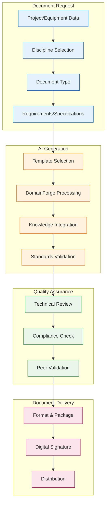

```mermaid
flowchart TD
  subgraph Input["Document Request"]
      A[Project/Equipment Data] --> B[Discipline Selection]
      B --> C[Document Type]
      C --> D[Requirements/Specifications]
  end

  subgraph Generation["AI Generation"]
      D --> E[Template Selection]
      E --> F[DomainForge Processing]
      F --> G[Knowledge Integration]
      G --> H[Standards Validation]
  end

  subgraph Validation["Quality Assurance"]
      H --> I[Technical Review]
      I --> J[Compliance Check]
      J --> K[Peer Validation]
  end

  subgraph Output["Document Delivery"]
      K --> L[Format & Package]
      L --> M[Digital Signature]
      M --> N[Distribution]
  end

  classDef input fill:#e3f2fd,stroke:#1976d2
  classDef gen fill:#fff3e0,stroke:#f57c00
  classDef validate fill:#e8f5e8,stroke:#388e3c
  classDef output fill:#fce4ec,stroke:#c2185b

  class A,B,C,D input
  class E,F,G,H gen
  class I,J,K validate
  class L,M,N output
```
