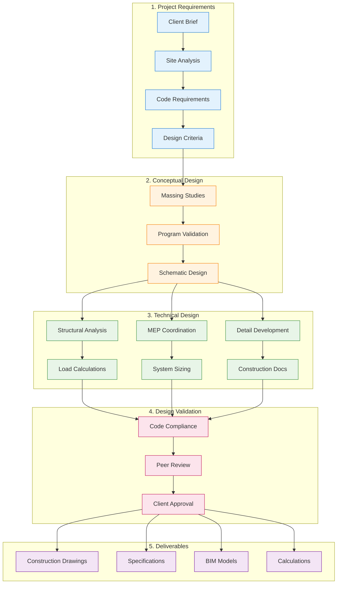

```mermaid
flowchart TD
  subgraph Input["1. Project Requirements"]
      A[Client Brief] --> B[Site Analysis]
      B --> C[Code Requirements]
      C --> D[Design Criteria]
  end

  subgraph Conceptual["2. Conceptual Design"]
      D --> E[Massing Studies]
      E --> F[Program Validation]
      F --> G[Schematic Design]
  end

  subgraph Technical["3. Technical Design"]
      G --> H[Structural Analysis]
      G --> I[MEP Coordination]
      G --> J[Detail Development]
      H --> K[Load Calculations]
      I --> L[System Sizing]
      J --> M[Construction Docs]
  end

  subgraph Validation["4. Design Validation"]
      K --> N[Code Compliance]
      L --> N
      M --> N
      N --> O[Peer Review]
      O --> P[Client Approval]
  end

  subgraph Output["5. Deliverables"]
      P --> Q[Construction Drawings]
      P --> R[Specifications]
      P --> S[BIM Models]
      P --> T[Calculations]
  end

  classDef input fill:#e3f2fd,stroke:#1976d2
  classDef concept fill:#fff3e0,stroke:#f57c00
  classDef technical fill:#e8f5e8,stroke:#388e3c
  classDef validation fill:#fce4ec,stroke:#c2185b
  classDef output fill:#f3e5f5,stroke:#7b1fa2

  class A,B,C,D input
  class E,F,G concept
  class H,I,J,K,L,M technical
  class N,O,P validation
  class Q,R,S,T output
```
