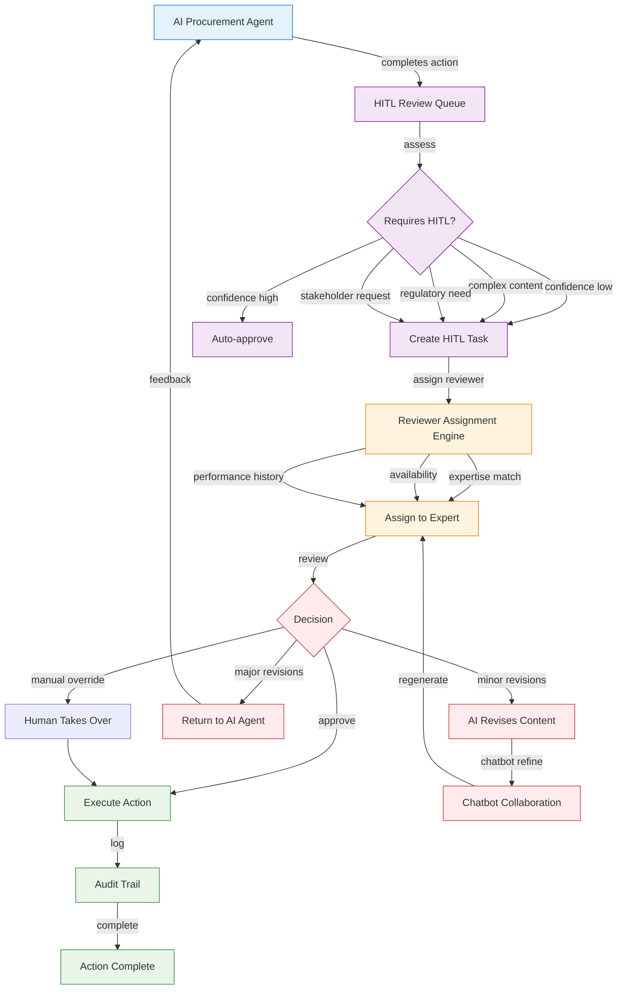

```mermaid
flowchart TD
  AGENT[AI Procurement Agent] -->|completes action| QUEUE[HITL Review Queue]
  QUEUE -->|assess| ASSESS{Requires HITL?}
  ASSESS -->|confidence low| CREATE[Create HITL Task]
  ASSESS -->|complex content| CREATE
  ASSESS -->|regulatory need| CREATE
  ASSESS -->|stakeholder request| CREATE
  ASSESS -->|confidence high| AUTO[Auto-approve]

  CREATE -->|assign reviewer| ASSIGN[Reviewer Assignment Engine]
  ASSIGN -->|expertise match| REVIEWER[Assign to Expert]
  ASSIGN -->|availability| REVIEWER
  ASSIGN -->|performance history| REVIEWER

  REVIEWER -->|review| DECISION{Decision}
  DECISION -->|approve| EXECUTE[Execute Action]
  DECISION -->|minor revisions| REVISE[AI Revises Content]
  DECISION -->|major revisions| REJECT[Return to AI Agent]
  DECISION -->|manual override| OVERRIDE[Human Takes Over]

  REVISE -->|chatbot refine| CHAT[Chatbot Collaboration]
  CHAT -->|regenerate| REVIEWER
  REJECT -->|feedback| AGENT
  OVERRIDE --> EXECUTE

  EXECUTE -->|log| AUDIT[Audit Trail]
  AUDIT -->|complete| DONE[Action Complete]

  classDef agent fill:#e3f2fd,stroke:#1976d2
  classDef queue fill:#f3e5f5,stroke:#7b1fa2
  classDef assign fill:#fff3e0,stroke:#f57c00
  classDef review fill:#ffebee,stroke:#d32f2f
  classDef final fill:#e8f5e8,stroke:#388e3c

  class AGENT agent
  class QUEUE,ASSESS,CREATE,AUTO queue
  class ASSIGN,REVIEWER assign
  class DECISION,REVISE,REJECT,OVERIDE,CHAT review
  class EXECUTE,AUDIT,DONE final
```
