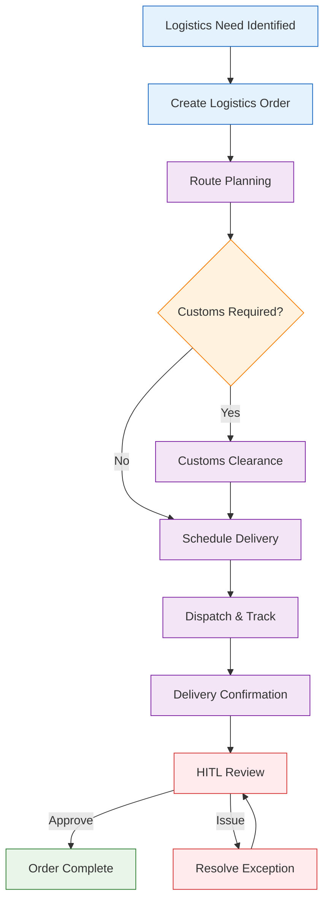

```mermaid
flowchart TD
  classDef start fill:#e3f2fd,stroke:#1565C0
  classDef process fill:#f3e5f5,stroke:#7b1fa2
  classDef decision fill:#fff3e0,stroke:#f57c00
  classDef review fill:#ffebee,stroke:#d32f2f
  classDef final fill:#e8f5e8,stroke:#2E7D32

  Need[Logistics Need Identified] --> Order[Create Logistics Order]
  Order --> Route[Route Planning]
  Route --> Customs{Customs Required?}
  
  Customs -->|Yes| Clearance[Customs Clearance]
  
  Customs -->|No| Schedule[Schedule Delivery]
  Clearance --> Schedule
  Schedule --> Dispatch[Dispatch & Track]
  Dispatch --> Delivery[Delivery Confirmation]
  Delivery --> HITL[HITL Review]
  HITL -->|Approve| Complete[Order Complete]
  HITL -->|Issue| Resolve[Resolve Exception]
  Resolve --> HITL

  class Need,Order start
  class Route,Clearance,Schedule,Dispatch,Delivery process
  class Customs decision
  class HITL,Resolve review
  class Complete final
```
