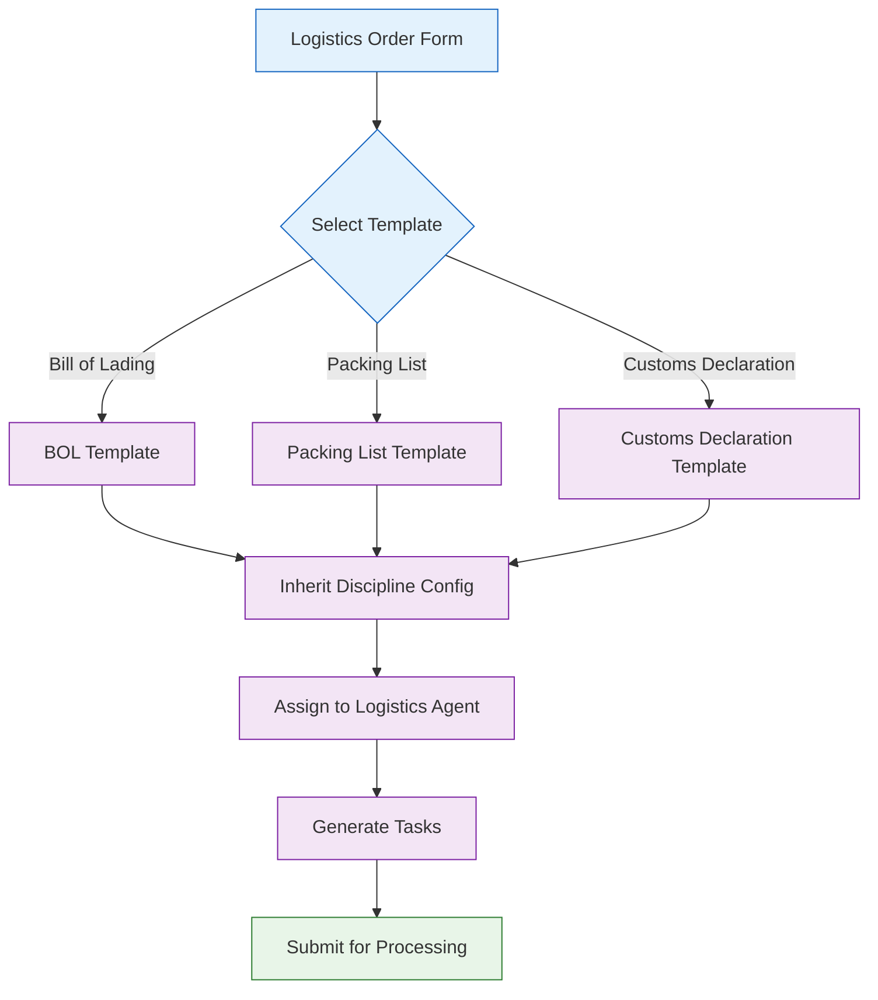

```mermaid
flowchart TD
  classDef start fill:#e3f2fd,stroke:#1565C0
  classDef process fill:#f3e5f5,stroke:#7b1fa2
  classDef decision fill:#fff3e0,stroke:#f57c00
  classDef final fill:#e8f5e8,stroke:#2E7D32

  Form[Logistics Order Form] --> Template{Select Template}
  Template -->|Bill of Lading| BOL[BOL Template]
  Template -->|Packing List| PL[Packing List Template]
  Template -->|Customs Declaration| CD[Customs Declaration Template]
  
  BOL --> Inherit[Inherit Discipline Config]
  PL --> Inherit
  CD --> Inherit
  
  Inherit --> Assign[Assign to Logistics Agent]
  Assign --> Tasks[Generate Tasks]
  Tasks --> Submit[Submit for Processing]
  
  class Form,Template start
  class BOL,PL,CD,Inherit,Assign,Tasks process
  class Submit final
```
