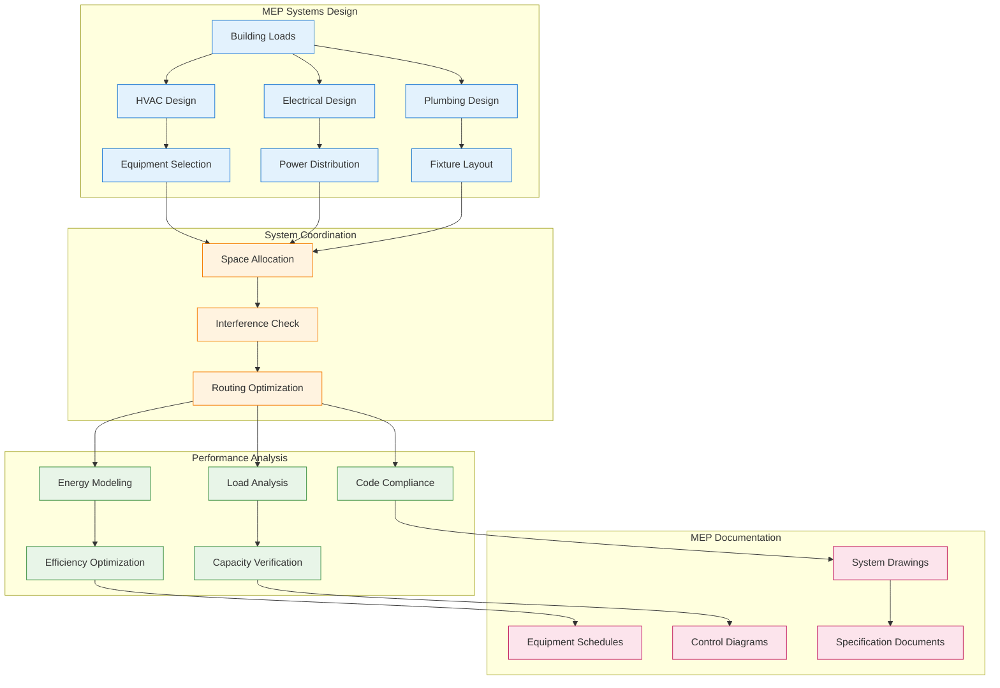

```mermaid
flowchart TD
  subgraph MEP["MEP Systems Design"]
      A[Building Loads] --> B[HVAC Design]
      A --> C[Electrical Design]
      A --> D[Plumbing Design]
      B --> E[Equipment Selection]
      C --> F[Power Distribution]
      D --> G[Fixture Layout]
  end

  subgraph Coordination["System Coordination"]
      E --> H[Space Allocation]
      F --> H
      G --> H
      H --> I[Interference Check]
      I --> J[Routing Optimization]
  end

  subgraph Analysis["Performance Analysis"]
      J --> K[Energy Modeling]
      J --> L[Load Analysis]
      J --> M[Code Compliance]
      K --> N[Efficiency Optimization]
      L --> O[Capacity Verification]
  end

  subgraph Documentation["MEP Documentation"]
      M --> P[System Drawings]
      N --> Q[Equipment Schedules]
      O --> R[Control Diagrams]
      P --> S[Specification Documents]
  end

  classDef design fill:#e3f2fd,stroke:#1976d2
  classDef coord fill:#fff3e0,stroke:#f57c00
  classDef analysis fill:#e8f5e8,stroke:#388e3c
  classDef docs fill:#fce4ec,stroke:#c2185b

  class A,B,C,D,E,F,G design
  class H,I,J coord
  class K,L,M,N,O analysis
  class P,Q,R,S docs
```
