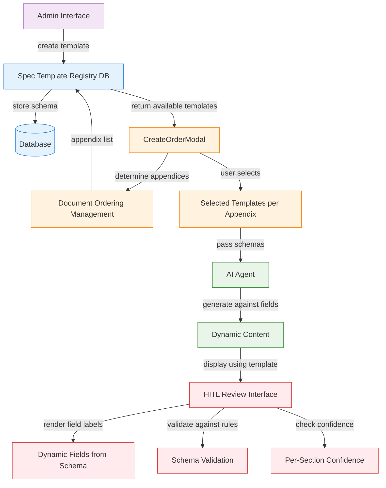

```mermaid
flowchart TD
  ADMIN[Admin Interface] -->|create template| REGISTRY[Spec Template Registry DB]
  REGISTRY -->|store schema| DB[(Database)]
  
  ORDER[CreateOrderModal] -->|determine appendices| DOM[Document Ordering Management]
  DOM -->|appendix list| REGISTRY
  REGISTRY -->|return available templates| ORDER
  
  ORDER -->|user selects| SEL[Selected Templates per Appendix]
  SEL -->|pass schemas| AGENT[AI Agent]
  AGENT -->|generate against fields| CONTENT[Dynamic Content]
  
  CONTENT -->|display using template| HITL[HITL Review Interface]
  HITL -->|render field labels| FIELDS[Dynamic Fields from Schema]
  HITL -->|validate against rules| VALIDATE[Schema Validation]
  HITL -->|check confidence| CONFIDENCE[Per-Section Confidence]

  classDef admin fill:#f3e5f5,stroke:#7b1fa2
  classDef storage fill:#e3f2fd,stroke:#1976d2
  classDef order fill:#fff3e0,stroke:#f57c00
  classDef agent fill:#e8f5e8,stroke:#388e3c
  classDef review fill:#ffebee,stroke:#d32f2f

  class ADMIN admin
  class REGISTRY,DB storage
  class ORDER,DOM,SEL order
  class AGENT,CONTENT agent
  class HITL,FIELDS,VALIDATE,CONFIDENCE review
```
