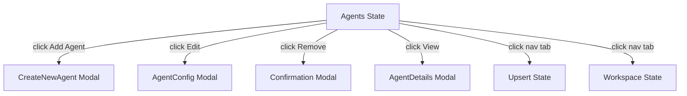
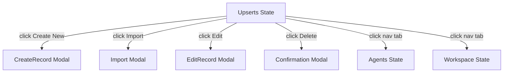
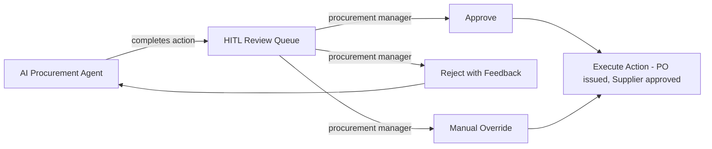
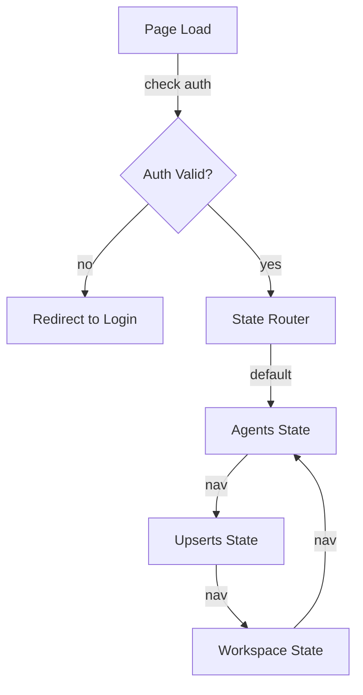

# 01900 Procurement — UI/UX Specification

## Table of Contents

1. [Part A: UX Patterns (High-Level)](#part-a-ux-patterns-high-level)
2. [Part B: Three-State Button & Modal Rules](#part-b-three-state-button--modal-rules)
3. [Part C: Mermaid UI Flow Diagrams](#part-c-mermaid-ui-flow-diagrams)
4. [Part D: Implementation Standards](#part-d-implementation-standards)
5. [Part E: Screen Specifications (Detailed)](#part-e-screen-specifications-detailed)
6. [Part F: AI Model Backend](#part-f-ai-model-backend)
7. [Part G: Agent Knowledge Ownership](#part-g-agent-knowledge-ownership)

---

## Part A: UX Patterns (High-Level)

### 1. Page Classification

**Template Type**: **Template B** (Complex / Three-State) — serves as the **Template A CSS Foundation Reference**

The 01900 Procurement page occupies a unique dual role:
1. **Template A CSS Foundation Reference**: Its CSS architecture (`@import template-a-standard.css`) is the blueprint all other Template A pages follow. The `0000_TEMPLATE_A_CSS_INVENTORY.md` lists 01900 as the reference implementation.
2. **Template B Behavior**: It has three-state navigation (Agents, Upserts, Workspace) and complex procurement workflows.

**Why Template B**:
- **Multi-State Navigation**: Three distinct operational states — Agents, Upserts, Workspace
- **Multi-Purpose Functionality**: Supplier management, tender evaluation, contract administration, purchase orders
- **Complex Workflows**: Procurement lifecycle, bid evaluation, supplier qualification
- **Higher z-index positioning** (1500) for the chatbot overlay
- **CSS Class Convention**: `A-01900-*` prefix for all page-level elements (per PROCURE-001 test)

### 2. Information Architecture

**Accordion Section**: Procurement (display_order: 1900)
**Accordion Subsection**: 01900 Procurement
**Icon**: Shopping cart / procurement icon
**Route**: `/procurement`

**AccordionProvider + AccordionComponent** is mandatory per the `0950_ACCORDION_MANAGEMENT_AUDIT.md` standard.

### 3. Color Scheme

**Template A Orange Palette** (this is the reference page — no custom palette):

```css
:root {
  --template-a-primary: #FF8C00;
  --template-a-secondary: #FFA500;
  --template-a-accent: #FF6B35;
  --template-a-bg-gradient: linear-gradient(135deg, #f8f9fa 0%, #e9ecef 100%);
  --template-a-header-gradient: linear-gradient(135deg, #FF6B35 0%, #FF8C42 100%);
  --template-a-text-primary: #000000;
  --template-a-text-secondary: #6c757d;
  --template-a-text-white: #ffffff;
  --template-a-shadow-sm: 0 2px 4px rgba(0, 0, 0, 0.05);
  --template-a-shadow-md: 0 4px 6px rgba(0, 0, 0, 0.1);
  --template-a-shadow-lg: 0 8px 24px rgba(255, 140, 0, 0.3);
}
```

**Background Image**: The 01900 page is one of the few Template A pages that uses a background image. Per `0000_VISUAL_DESIGN_STANDARDS.md`, this is an exception (only 00106 timesheet and 01900 procurement use background images). All other pages should use gradient backgrounds.

### 4. HITL Integration Pattern

1. **AI Agent** performs procurement actions (supplier evaluation, tender comparison, PO generation)
2. **Work enters HITL Review Queue** — visible in the Workspace state
3. **Procurement Manager** reviews:
   - **Approve**: Action proceeds (e.g., PO is issued, supplier is approved)
   - **Reject with Feedback**: Returns to AI agent with correction notes
   - **Manual Override**: Human takes over the action directly
4. **Audit Trail**: All procurement decisions logged with timestamps and approver identity

---

## Part B: Three-State Button & Modal Rules

### 5. State: Agents

The **Agents state** shows procurement AI agents for supplier management, tender evaluation, and contract administration.

**Buttons**:

| Button | Visibility Gate | Action | Modal |
|--------|----------------|--------|-------|
| **Add Agent** | `user.role === 'governance'` | Opens CreateNewAgent modal | `CreateNewAgent` — 98vw, template A orange gradient header |
| **Edit** (per agent) | `user.role >= 'editor'` | Opens AgentConfig modal | `AgentConfig` — 98vw, procurement skill toggles |
| **Remove/Archive** | `user.role === 'governance'` | Opens Confirmation modal | `Confirmation` — archive with procurement record preservation |
| **View Details** | Always visible | Opens AgentDetails modal | `AgentDetails` — 98vw, procurement agent metrics |

**Mermaid Flow**:


### 6. State: Upserts

The **Upserts state** is where procurement records are created, edited, and imported.

**Buttons**:

| Button | Visibility Gate | Action | Modal |
|--------|----------------|--------|-------|
| **Create New** | `user.role >= 'editor'` | Opens CreateRecord modal | `CreateRecord` — 98vw, procurement form with supplier selector |
| **Import** | `user.role >= 'editor'` | Opens Import modal | `Import` — 98vw, CSV/Excel upload, column mapping |
| **Edit** (per record) | `user.role >= 'editor'` | Opens EditRecord modal | `EditRecord` — 98vw, pre-populated form, change tracking |
| **Delete** | `user.role === 'governance'` | Opens Confirmation modal | `Confirmation` — "Delete record?" with impact warning |
| **Clone** | `user.role >= 'editor'` | Inline clone | No modal |

**Mermaid Flow**:


### 7. State: Workspace

The **Workspace state** is the procurement operations dashboard.

**Buttons**:

| Button | Visibility Gate | Action | Modal |
|--------|----------------|--------|-------|
| **Approve** | `user.role >= 'reviewer'` | Opens Approval modal | `Approval` — 98vw, confirm with optional note |
| **Reject** | `user.role >= 'reviewer'` | Opens Rejection modal | `Rejection` — 98vw, required feedback |
| **Assign** | `user.role >= 'coordinator'` | Opens Assign modal | `Assign` — 98vw, user/agent selector |
| **Generate PO** | `user.role >= 'editor'` | Opens GeneratePO modal | `GeneratePO` — 98vw, PO template, supplier, line items |
| **Generate Report** | Always visible | Opens Export modal | `Export` — 98vw, format selector |
| **Comment/Discussion** | Always visible | Toggles chat panel | Inline toggle |

**HITL Workflow**:


---

## Part C: Mermaid UI Flow Diagrams

### 8. Procurement Lifecycle Flow

```mermaid
flowchart LR
    NEED[Identify Need] -->|create| RFQ[RFQ Generation]
    RFQ -->|send to| SUPPLIERS[Supplier List]
    SUPPLIERS -->|receive| BIDS[Bid Submission]
    BIDS -->|evaluate| EVAL[Bid Evaluation]
    EVAL -->|select winner| AWARD[Award Contract]
    AWARD -->|issue| PO[Purchase Order]
    PO -->|track| DELIVERY[Delivery]
    DELIVERY -->|verify| INVOICE[Invoice Matching]
    INVOICE -->|process| PAYMENT[Payment]
```



### 9. Page State Flow



---

## Part D: Implementation Standards

### 10. CSS Architecture

**Import Chain**:
```css
/* 1. Template A Standard (this is the REFERENCE page) */
@import "../../templates/template-a-standard.css";

/* 2. Page-Specific Procurement Styles */
@import "01900-procurement-page-style.css";
```

**File**:
- `client/src/common/css/pages/01900-procurement/01900-procurement-page-style.css`

**CSS Class Convention**: `A-01900-*` for all page-level elements (per PROCURE-001 test requirement).

**State Button Pattern**:
```html
<nav class="bottom-fixed-nav">
  <button class="A-01900-state-btn active">Agents</button>
  <button class="A-01900-state-btn">Upserts</button>
  <button class="A-01900-state-btn">Workspace</button>
</nav>
```

**Key Principles**:
- Background image permitted (this is one of the exception pages)
- 98vw Modal Sizing
- Orange color scheme throughout
- `A-01900-*` class prefix

### 11. Component Inventory

| Component | File | Purpose | CSS Class Prefix |
|-----------|------|---------|-----------------|
| StateButtons | Page template | Three-state navigation | `.A-01900-state-btn` |
| NavContainer | Page template | Bottom-fixed nav | `.A-01900-nav-container` |
| LoginForm | Auth | Authentication | `.A-01900-login` |
| LogoutButton | Auth | Session termination | `.A-01900-logout` |
| SupplierTable | Data grid | Supplier management | `.A-01900-supplier-table` |
| TenderList | Data grid | Tender management | `.A-01900-tender-list` |
| POForm | Form | Purchase order creation | `.A-01900-po-form` |
| StandardsSelector | Form | Procurement standards | `.A-01900-standards-selector` |
| ConfirmationModal | Modal | Destructive actions | `.A-01900-confirmation-modal` |
| ApprovalModal | Modal | Approve workflow | `.A-01900-approval-modal` |

### 12. Dropdown Specifications

**Supplier Selector**:
```javascript
<select
  value={selectedSupplier}
  onChange={(e) => setSelectedSupplier(e.target.value)}
  style={{
    width: "100%",
    padding: "8px 12px",
    border: selectedSupplier
      ? "2px solid #28a745"  // Green when valid
      : "2px solid #dee2e6",  // Gray when empty
    borderRadius: "4px",
    fontSize: "0.875rem",
    backgroundColor: "#ffffff",
    cursor: "pointer",
  }}
>
  <option value="">Select supplier...</option>
  {suppliers.map((s) => (
    <option key={s.id} value={s.id}>{s.name}</option>
  ))}
</select>
```

### 13. Modal Specifications

All modals follow 98vw width with orange gradient headers.

**Modal Inventory**:
| Modal | State | Purpose |
|-------|-------|---------|
| CreateNewAgent | Agents | Create procurement agent |
| AgentConfig | Agents | Configure agent settings |
| CreateRecord | Upserts | New procurement record |
| Import | Upserts | Bulk import CSV/Excel |
| EditRecord | Upserts | Edit existing record |
| Approval | Workspace | Approve AI action |
| Rejection | Workspace | Reject with feedback |
| GeneratePO | Workspace | Create purchase order |
| Export | Workspace | Export report |

### 14. Chatbot Configuration

**Template Type**: Template B (State-Aware)

```javascript
{
  chatType: "agent",
  stateAware: true,
  currentState: "agents|upserts|workspace",
  zIndex: 1500,
  modelEndpoint: "/api/chat/procurement",
}
```

**State-Aware Behavior**:
- **Agents**: Chatbot answers questions about procurement agent capabilities
- **Upserts**: Chatbot assists with record creation, supplier selection, tender drafting
- **Workspace**: Chatbot explains AI procurement recommendations, suggests approvals

---

## Part E: Screen Specifications (Detailed)

### 15. Screen Inventory

| Screen | State | Loading | Empty | Error | Populated |
|--------|-------|---------|-------|-------|-----------|
| Agent List | Agents | Spinner + skeleton | "No agents" CTA | Red banner + retry | Agent cards |
| Record List | Upserts | Spinner + skeleton | "No records" CTA | Red banner + retry | Table with pagination |
| Record Form | Upserts | Spinner | Empty form | Field errors | Pre-populated form |
| HITL Queue | Workspace | Spinner + skeleton | "No items to review" | Red banner + retry | Queue with priority |

### 16. Wireframe: Agents State

```
┌──────────────────────────────────────────────────────────────┐
│  [Orange Header Gradient]                                     │
│  01900 Procurement │ [Chatbot]                                 │
├──────────────────────────────────────────────────────────────┤
│  [Tab Nav: Agents | Upserts | Workspace]                      │
│  ┌────────────────────────────────────────────────────────┐  │
│  │ Procurement Agents              [+ Add Agent]          │  │
│  ├────────────────────────────────────────────────────────┤  │
│  │ ┌──────────┐ ┌──────────┐ ┌──────────┐                │  │
│  │ │ Supplier │ │ Tender   │ │ Contract │                │  │
│  │ │ Analyst  │ │ Evaluator│ │ Admin    │                │  │
│  │ │ ● Active │ │ ● Active │ │ ● Active │                │  │
│  │ │ [Edit]   │ │ [Edit]   │ │ [Edit]   │                │  │
│  │ └──────────┘ └──────────┘ └──────────┘                │  │
│  └────────────────────────────────────────────────────────┘  │
├──────────────────────────────────────────────────────────────┤
│  [Bottom-Fixed Nav]                                           │
└──────────────────────────────────────────────────────────────┘
```

### 17. Platform Adaptations

**Desktop (1280px+)**:
- Full three-state navigation visible
- Bottom-fixed nav container centered with `transform: translateX(-50%)`
- Agent grid: 3 columns

**Tablet (768px - 1279px)**:
- Three-state nav collapses to dropdown
- Agent grid: 2 columns

**Mobile (< 768px)**:
- Three-state nav as bottom tab bar
- Agent grid: 1 column
- Touch targets: minimum 48dp

---

## Part F: AI Model Backend

### 18. Model Infrastructure

**Base Model**: Qwen 2.5 (or similar)
- See `0000_QWEN_FINETUNING_PROCEDURE.md`
- Fine-tuned on procurement domain data (RFQ templates, supplier evaluation criteria, contract terms)

**Domain Adapter**: LoRA fine-tuned per procurement function
- See `0000_LORA_ADAPTER_INTEGRATION_PROCEDURE.md`
- **Procurement LoRA**: Supplier evaluation, tender comparison

**Deployment**: HuggingFace model serving
- See `0000_HF_MODEL_INTEGRATION_PROCEDURE.md`
- Endpoint: `/api/chat/procurement`
- Fallback: Base Qwen model

---

## Part G: Agent Knowledge Ownership

### 19. Agent Ownership

| Company | Role | Action |
|---------|------|--------|
| **DomainForge AI** | Domain Validation | Validate procurement workflows are correct |
| **QualityForge AI** | Testing | Execute PROCURE-TEST suite against this spec |
| **DevForge AI** | Implementation | Build HTML/CSS/React pages per wireframes |
| **KnowledgeForge AI** | Indexing | Index spec into institutional memory |
| **PromptForge AI** | Task Routing | Route procurement UI tasks to DevForge |

### 20. QualityForge AI Testing

Per the PROCURE-TEST suite:
1. **Foundation (PROCURE-001)**: Auth, nav container, state buttons, logout, background image
2. **Modal Integration**: All 8+ modals open/close correctly
3. **State Transitions**: Agents ↔ Upserts ↔ Workspace flow correctly
4. **Form Validation**: Green/gray/red borders per 0750 standard

---

## Version History

| Version | Date | Changes |
|---------|------|---------|
| 1.0 | 2026-04-28 | Initial UI/UX specification for 01900 Procurement reference page |

---

**Document Information**
- **Author**: DomainForge AI — Procurement Domain
- **Date**: 2026-04-28
- **Status**: Active
- **Next Review**: 2026-05-28