# 01900 Procurement — UI/UX Specification

## Table of Contents

1. [Part A: UX Patterns (High-Level)](#part-a-ux-patterns-high-level)
2. [Part B: Three-State Button & Modal Rules](#part-b-three-state-button--modal-rules)
3. [Part C: Mermaid UI Flow Diagrams](#part-c-mermaid-ui-flow-diagrams)
4. [Part D: Implementation Standards](#part-d-implementation-standards)
5. [Part E: Screen Specifications (Detailed)](#part-e-screen-specifications-detailed)
6. [Part F: AI Model Backend](#part-f-ai-model-backend)
7. [Part G: Agent Knowledge Ownership](#part-g-agent-knowledge-ownership)

---

## Part A: UX Patterns (High-Level)

### 1. Page Classification

**Template Type**: **Template B** (Complex / Three-State) — serves as the **Template A CSS Foundation Reference**

The 01900 Procurement page occupies a unique dual role:
1. **Template A CSS Foundation Reference**: Its CSS architecture (`@import template-a-standard.css`) is the blueprint all other Template A pages follow. The `0000_TEMPLATE_A_CSS_INVENTORY.md` lists 01900 as the reference implementation.
2. **Template B Behavior**: It has three-state navigation (Agents, Upserts, Workspace) and complex procurement workflows.

**Why Template B**:
- **Multi-State Navigation**: Three distinct operational states — Agents, Upserts, Workspace
- **Multi-Purpose Functionality**: Supplier management, tender evaluation, contract administration, purchase orders
- **Complex Workflows**: Procurement lifecycle, bid evaluation, supplier qualification
- **Higher z-index positioning** (1500) for the chatbot overlay
- **CSS Class Convention**: `A-01900-*` prefix for all page-level elements (per PROCURE-001 test)

### 2. Information Architecture

**Accordion Section**: Procurement (display_order: 1900)
**Accordion Subsection**: 01900 Procurement
**Icon**: Shopping cart / procurement icon
**Route**: `/procurement`

**AccordionProvider + AccordionComponent** is mandatory per the `0950_ACCORDION_MANAGEMENT_AUDIT.md` standard.

### 3. Color Scheme

**Template A Orange Palette** (this is the reference page — no custom palette):

```css
:root {
  --template-a-primary: #FF8C00;
  --template-a-secondary: #FFA500;
  --template-a-accent: #FF6B35;
  --template-a-bg-gradient: linear-gradient(135deg, #f8f9fa 0%, #e9ecef 100%);
  --template-a-header-gradient: linear-gradient(135deg, #FF6B35 0%, #FF8C42 100%);
  --template-a-text-primary: #000000;
  --template-a-text-secondary: #6c757d;
  --template-a-text-white: #ffffff;
  --template-a-shadow-sm: 0 2px 4px rgba(0, 0, 0, 0.05);
  --template-a-shadow-md: 0 4px 6px rgba(0, 0, 0, 0.1);
  --template-a-shadow-lg: 0 8px 24px rgba(255, 140, 0, 0.3);
}
```

**Background Image**: The 01900 page is one of the few Template A pages that uses a background image. Per `0000_VISUAL_DESIGN_STANDARDS.md`, this is an exception (only 00106 timesheet and 01900 procurement use background images). All other pages should use gradient backgrounds.

### 4. HITL Integration Pattern

1. **AI Agent** performs procurement actions (supplier evaluation, tender comparison, PO generation)
2. **Work enters HITL Review Queue** — visible in the Workspace state
3. **Procurement Manager** reviews:
   - **Approve**: Action proceeds (e.g., PO is issued, supplier is approved)
   - **Reject with Feedback**: Returns to AI agent with correction notes
   - **Manual Override**: Human takes over the action directly
4. **Audit Trail**: All procurement decisions logged with timestamps and approver identity

---

## Part B: Three-State Button & Modal Rules

### 5. State: Agents

The **Agents state** shows procurement AI agents for supplier management, tender evaluation, and contract administration.

**Buttons** (all buttons are pre-configured by the dev team — users cannot add, edit, or delete buttons):

| Button | Visibility Gate | Action | Modal |
|--------|----------------|--------|-------|
| **View Details** | Always visible | Opens AgentDetails modal | `AgentDetails` — 98vw, procurement agent metrics |

**Mermaid Flow**:
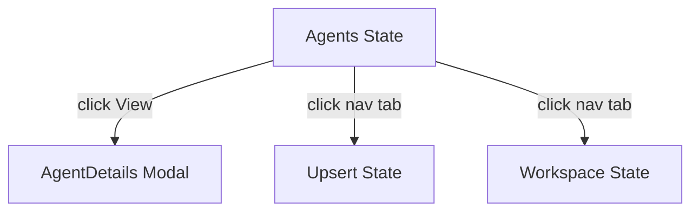

### 6. State: Upserts

The **Upserts state** is where procurement records are created, edited, and imported.

**Buttons** (all buttons are pre-configured by the dev team — users cannot add, edit, or delete buttons):

| Button | Visibility Gate | Action | Modal |
|--------|----------------|--------|-------|
| **Create New** | `user.role >= 'editor'` | Opens CreateRecord modal | `CreateRecord` — 98vw, procurement form with supplier selector |
| **Import** | `user.role >= 'editor'` | Opens Import modal | `Import` — 98vw, CSV/Excel upload, column mapping |
| **Edit** (per record) | `user.role >= 'editor'` | Opens EditRecord modal | `EditRecord` — 98vw, pre-populated form, change tracking |
| **Delete** | `user.role === 'governance'` | Opens Confirmation modal | `Confirmation` — "Delete record?" with impact warning |
| **Clone** | `user.role >= 'editor'` | Inline clone | No modal |

**Mermaid Flow**:
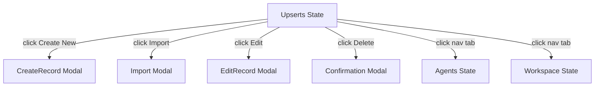

### 7. State: Workspace

The **Workspace state** is the procurement operations dashboard.

**Buttons** (all buttons are pre-configured by the dev team — users cannot add, edit, or delete buttons):

| Button | Visibility Gate | Action | Modal |
|--------|----------------|--------|-------|
| **Approve** | `user.role >= 'reviewer'` | Opens Approval modal | `Approval` — 98vw, confirm with optional note |
| **Reject** | `user.role >= 'reviewer'` | Opens Rejection modal | `Rejection` — 98vw, required feedback |
| **Assign** | `user.role >= 'coordinator'` | Opens Assign modal | `Assign` — 98vw, user/agent selector |
| **Generate PO** | `user.role >= 'editor'` | Opens GeneratePO modal | `GeneratePO` — 98vw, PO template, supplier, line items |
| **Generate Report** | Always visible | Opens Export modal | `Export` — 98vw, format selector |
| **Comment/Discussion** | Always visible | Toggles chat panel | Inline toggle |

**HITL Workflow**:
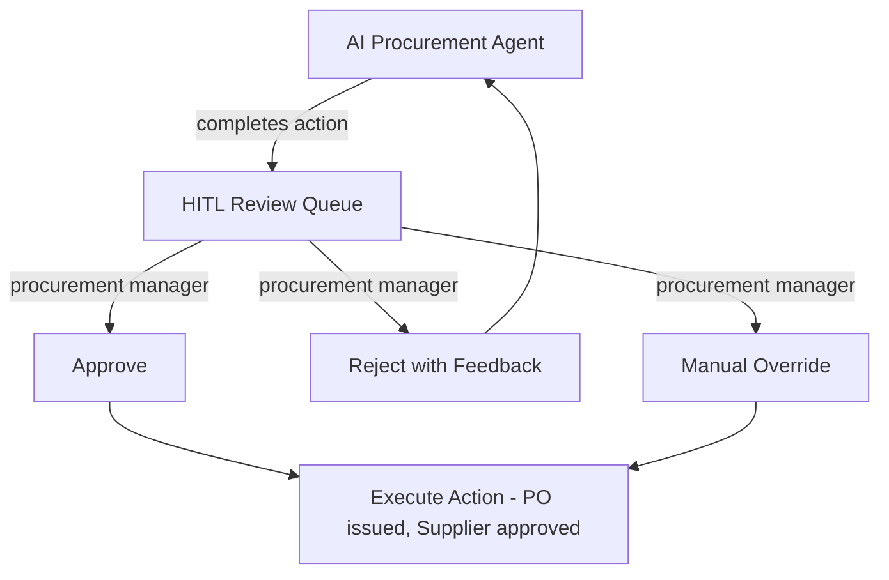

---

## Part C: Mermaid UI Flow Diagrams

### 8. Enhanced Procurement Lifecycle Flow

The full procurement lifecycle from need identification through payment, incorporating template complexity selection, AI agent orchestration, HITL review gates, and multi-discipline collaboration.

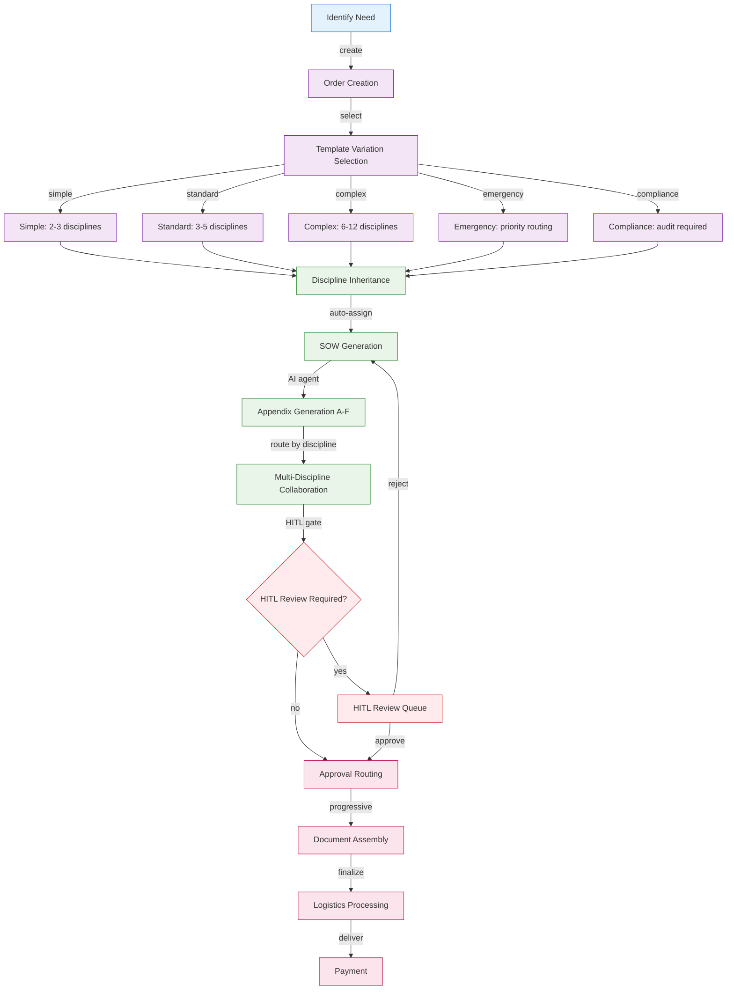

### 9. Order Creation with Spec Template Selection Flow

Detailed flow showing how template variation selection triggers automatic discipline inheritance from Document Ordering Management, followed by **Spec Template Registry** selection for each required appendix, user assignment, and task generation.

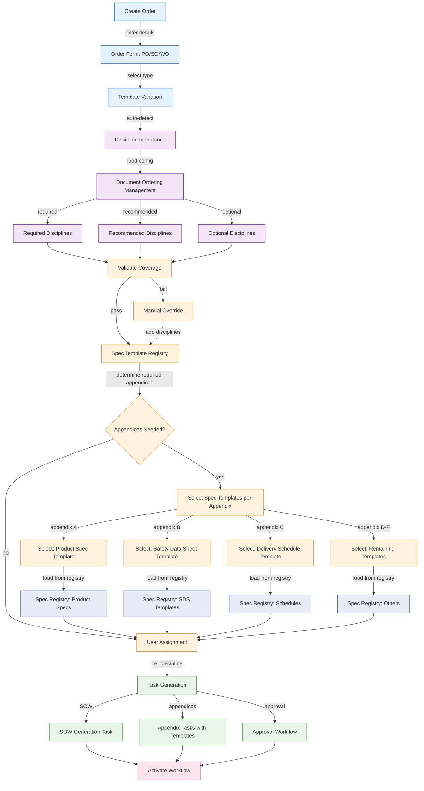

### 10. SOW Generation and Appendix Routing with Dynamic Spec Templates

AI-enhanced SOW creation with **configurable spec template selection** for each appendix, discipline-specific routing, and HITL review gates. No appendix content is hardcoded — all sections are defined in the Spec Template Registry.

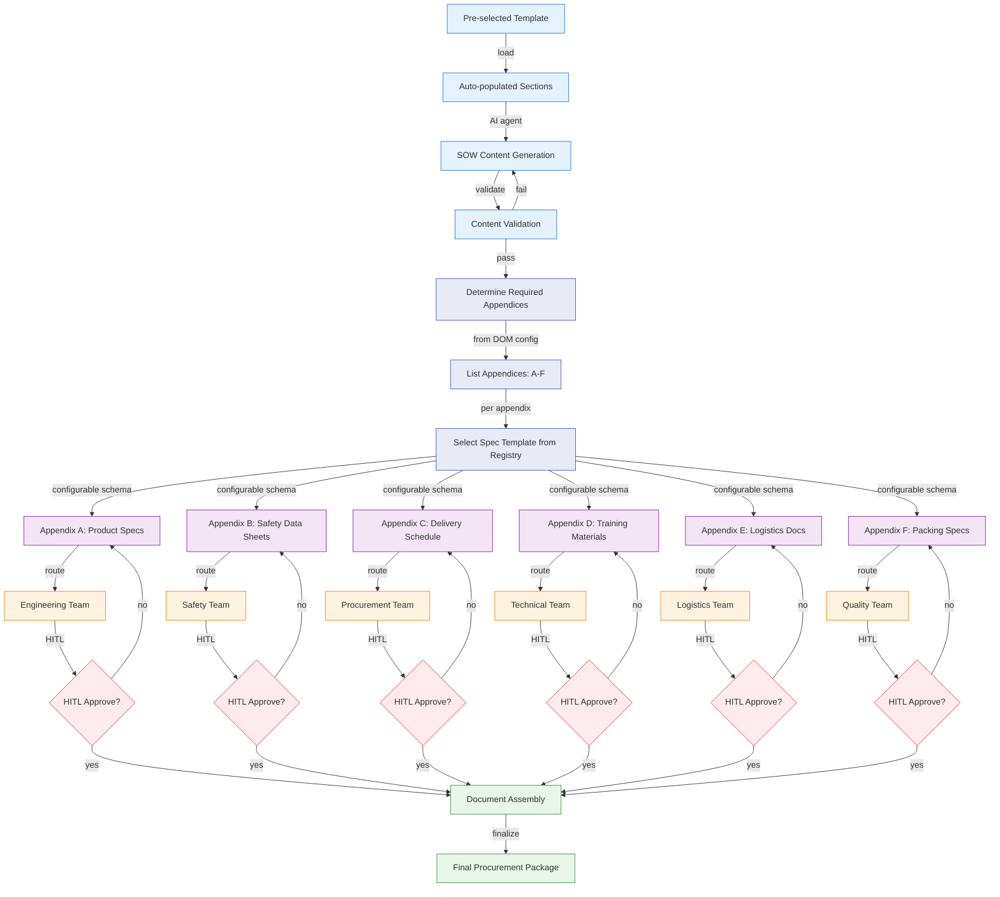

### 11. HITL Review Workflow

Human-in-the-Loop review process showing AI agent action completion, intelligent reviewer assignment, structured decision framework, and iterative refinement with chatbot collaboration.

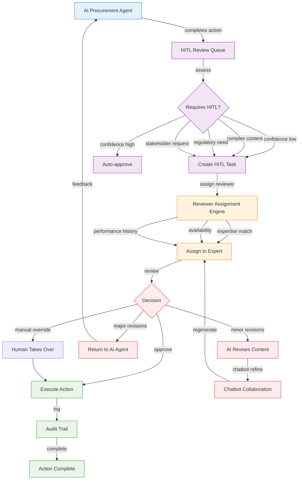

### 12. Progressive Approval Matrix Flow

Risk-based approval routing with value thresholds determining single, parallel, or sequential approval chains, integrated with the existing 01300 Approval Matrix system.

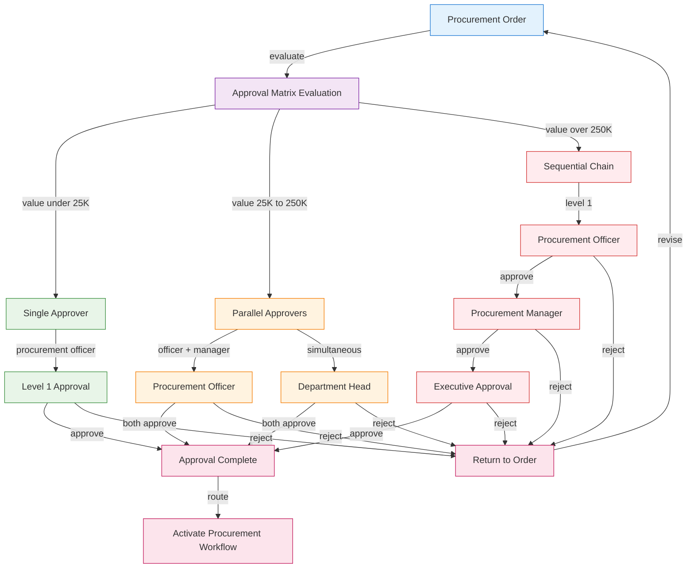

### 13. Spec Template Registry — Configurable Appendix Content Schemas

**Problem Addressed**: Hardcoded appendix structures (e.g., "16-section SDS") do not scale across industries, regulatory regimes, or procurement types. Different customers require different schemas for the same appendix letter.

**Solution**: The **Spec Template Registry** stores configurable content schemas per appendix type. Each schema is a first-class entity that defines:
- Section names and descriptions
- Field types (text, select, number, date, file upload)
- Validation rules (required, regex, range)
- AI confidence targets per section
- Regulatory variant (GHS, OSHA, REACH, etc.)
- Version history with rollback support

#### Admin Configuration Interface

```
┌─ Admin: Spec Template Registry ──────────────────────────────────┐
│                                                                    │
│  Appendix: B — Safety Data Sheets                                 │
│  ┌──────────────────────────────────────────────────────────────┐  │
│  │  Active Templates:                                            │  │
│  │  ┌────────────────────────────────────────────────────────┐  │  │
│  │  │ ● [Active Template Name] vX.X (Region)   [Active]     │  │  │
│  │  │ ○ [Inactive Template A] vX.X (Region)    [Inactive]   │  │  │
│  │  │ ○ [Inactive Template B] vX.X (Region)    [Inactive]   │  │  │
│  │  │ ○ [Inactive Template C] vX.X (Region)    [Inactive]   │  │  │
│  │  │ [+ Create New Template]  [+ Import from Library]        │  │  │
│  │  └────────────────────────────────────────────────────────┘  │  │
│  └──────────────────────────────────────────────────────────────┘  │
│                                                                    │
│  ┌─ Template Editor: [Active Template Name] ───────────────────┐  │
│  │  Section 1: [Section Title]                                  │  │
│  │  ├─ [Field Label A]              [String] [Required]         │  │
│  │  ├─ [Field Label B]              [String] [Required]         │  │
│  │  ├─ [Field Label C]              [Phone]  [Required]         │  │
│  │  └─ [Field Label D]              [String] [Optional]         │  │
│  │                                                               │  │
│  │  Section 2: [Section Title]                                  │  │
│  │  ├─ [Field Label E]              [Select] [Required]         │  │
│  │  ├─ [Field Label F]              [Select] [Required]         │  │
│  │  ├─ [Field Label G]              [Array]  [Required]         │  │
│  │  └─ [Field Label H]              [Array]  [Required]         │  │
│  │                                                               │  │
│  │  [+ Add Section]  [Save Template]  [Test Generation]         │  │
│  └──────────────────────────────────────────────────────────────┘  │
└────────────────────────────────────────────────────────────────────┘
```

#### Template Selection at Order Creation

When the CreateOrderModal determines (via Document Ordering Management) that appendices are needed, it presents a **spec template selector** step between discipline validation and user assignment:

```
┌─ Select Spec Templates ───────────────────────────────────────────┐
│                                                                    │
│  Order: PO-2026-0042  |  Supplier: Caterpillar Inc.               │
│                                                                    │
│  Required Appendices (from Discipline Configuration):              │
│                                                                    │
│  ┌─ Appendix A: Product Specifications ──────────────────────────┐│
│  │  Template: ● [Default Product Spec Template]  [change]       ││
│  │             ○ [Alternate Template A]                          ││
│  │             ○ Custom Template...                              ││
│  └───────────────────────────────────────────────────────────────┘│
│                                                                    │
│  ┌─ Appendix B: Safety Data Sheets ───────────────────────────────┐│
│  │  Template: ● [Default Safety Template]         [change]       ││
│  │  Region:   ● [Region A]   ○ [Region B]   ○ [Region C]        ││
│  └───────────────────────────────────────────────────────────────┘│
│                                                                    │
│  ┌─ Appendix C: Delivery Schedule ───────────────────────────────┐│
│  │  Template: ● [Default Schedule Template]      [change]       ││
│  └───────────────────────────────────────────────────────────────┘│
│                                                                    │
│  [Use Selected Templates]  [Skip — Use Defaults]                  │
└────────────────────────────────────────────────────────────────────┘
```

#### Dynamic AI Content Generation

The AI agent does NOT have hardcoded knowledge of appendix structures. Instead, it receives the selected spec template schema as context at generation time:

```javascript
// AI Agent receives the selected template schema as context at generation time
// The schema is loaded from the Spec Template Registry — no hardcoded knowledge
{
  templateId: "[selected-template-id]",
  appendix: "[appendix-letter]",
  discipline: "[discipline-code]",
  sections: [
    {
      id: 1,
      title: "[Section 1 Title from Template]",
      confidenceTarget: 0.95,
      fields: [
        { key: "[fieldKeyA]", type: "string", required: true },
        { key: "[fieldKeyB]", type: "string", required: true },
        { key: "[fieldKeyC]", type: "phone", required: true },
        { key: "[fieldKeyD]", type: "string", required: false }
      ]
    },
    {
      id: 2,
      title: "[Section 2 Title from Template]",
      confidenceTarget: 0.85,
      fields: [
        { key: "[fieldKeyE]", type: "select", required: true, options: [...] },
        { key: "[fieldKeyF]", type: "select", required: true, options: ["[Option A]", "[Option B]"] },
        { key: "[fieldKeyG]", type: "array", required: true },
        { key: "[fieldKeyH]", type: "array", required: true }
      ]
    }
    // ... remaining sections loaded from registry
  ]
}
```

The HITL review interface renders the template dynamically — field labels, validation rules, and confidence targets come from the template schema, not from hardcoded code.

#### Spec Template Registry — Entity Model

```yaml
SpecTemplate:
  id: uuid
  discipline: string        # Discipline code (e.g., "02400" for Safety)
  appendixLetter: string    # Appendix letter (A, B, C, D, E, F)
  name: string              # Human-readable template name (admin-defined)
  variant: string           # Regulatory/industry variant (admin-defined)
  version: string           # Semantic version (admin-defined)
  status: string            # "active" | "inactive" | "deprecated"
  schema: json              # Sections array with field definitions
  metadata: {
    region: string          # Geographic region (admin-defined)
    industry: string[]      # Applicable industries (admin-defined)
    aiConfidenceTargets: {  # Per-section confidence thresholds
      section1: 0.95,
      section2: 0.85
    }
  }
  createdAt: timestamp
  updatedAt: timestamp
  createdBy: uuid           # Admin who created this template
```

#### Spec Template Registry Flow

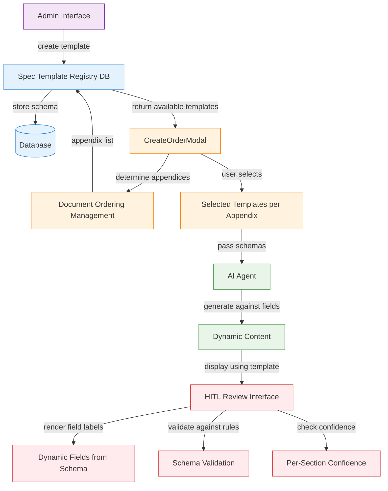

### 14. Appendix B Safety Data Sheets — Template-Driven HITL Detail Flow

HITL workflow for Appendix B using the **Spec Template Registry** — no hardcoded 16-section assumption. The template schema is loaded dynamically, and the review interface renders whatever sections the selected template defines.

```mermaid
flowchart TD
    PHASE1[Phase 1: Load Template from Registry] -->|fetch schema| TEMPLATE[[Selected Template Schema]]
    TEMPLATE -->|AI Agent processes| GEN[Generate Content per Template Fields]
    GEN -->|flag low confidence| FLAG[Flag Sections for Human Review]
    FLAG -->|create task| PHASE2[Phase 2: HITL Task Creation]
    PHASE2 -->|assign to safety officer| ASSIGN[Task in MyTasksDashboard]
    ASSIGN -->|open review| PHASE3[Phase 3: Human-AI Review]
    PHASE3 -->|dynamic sections from template| INTERFACE[Dynamic Review Interface]
    INTERFACE -->|section from template| S1[Section 1: [Title] - 95%]
    INTERFACE -->|section from template| S2[Section 2: [Title] - 78%]
    INTERFACE -->|section from template| S8[Section 8: [Title] - needs review]

    S2 -->|chatbot| CHAT[Chatbot Collaboration]
    S8 -->|chatbot| CHAT
    CHAT -->|request revision| PHASE4[Phase 4: Iterative Refinement]
    PHASE4 -->|AI regenerates| UPDATE[Updated Content per Schema]
    UPDATE -->|re-review| INTERFACE
    UPDATE -->|approve| PHASE5[Phase 5: Final Approval]
    PHASE5 -->|mark complete| INTEGRATE[Integrate into Procurement Package]

    classDef phase1 fill:#e3f2fd,stroke:#1976d2
    classDef phase1b fill:#e8eaf6,stroke:#3f51b5
    classDef phase2 fill:#f3e5f5,stroke:#7b1fa2
    classDef phase3 fill:#fff3e0,stroke:#f57c00
    classDef phase4 fill:#e8f5e8,stroke:#388e3c
    classDef phase5 fill:#fce4ec,stroke:#c2185b

    class PHASE1,TEMPLATE phase1
    class GEN,FLAG phase1b
    class PHASE2,ASSIGN phase2
    class PHASE3,INTERFACE,S1,S2,S8,CHAT phase3
    class PHASE4,UPDATE phase4
    class PHASE5,INTEGRATE phase5
```

### 15. Template Complexity Decision Tree

Decision tree for template complexity selection showing how each complexity level determines discipline count, appendix requirements, approval levels, and business rules.

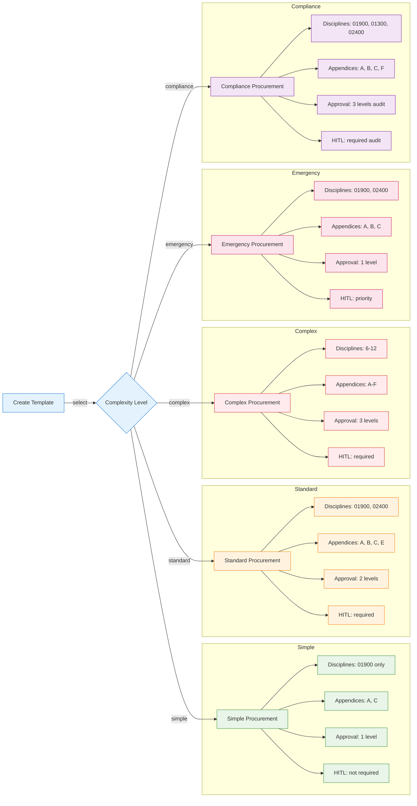

### 16. Page State Flow with Modal Integration (generated from `three-state-navigation` template v2.0, with disabled accordion)

> **Parameters**: `discipline: "01900"`, `states: "Agents, Upserts, Workspace"`, `roles: "viewer, editor, reviewer, manager, admin"`, `showAccordion: false`
>
> The page-level accordion (Bidding/Tendering toggle) is disabled for Procurement as this discipline uses its own accordion structure. Role gates are mapped to Procurement roles:
> - `viewer` → Router access (+ View Agent Details)
> - `editor` → Record actions (Create, Import, Edit)
> - `reviewer` → Review actions (Approve, Reject)
> - `manager` → Management actions (Assign, Generate PO)
> - `admin` → Full access

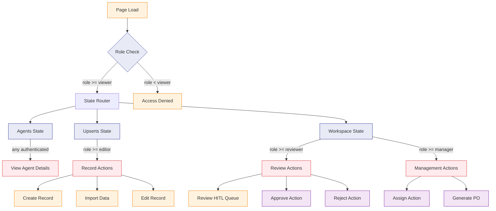

---

### 17. Streamlined Workflow Architecture

The rationalized 4-layer architecture showing Configuration Layer through Phase 4 Intelligent Assembly, with color-coded phases and sequential flow.

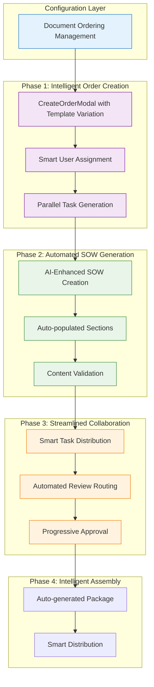

---

## Part D: Implementation Standards

### 10. CSS Architecture

**Import Chain**:
```css
/* 1. Template A Standard (this is the REFERENCE page) */
@import "../../templates/template-a-standard.css";

/* 2. Page-Specific Procurement Styles */
@import "01900-procurement-page-style.css";
```

**File**:
- `client/src/common/css/pages/01900-procurement/01900-procurement-page-style.css`

**CSS Class Convention**: `A-01900-*` for all page-level elements (per PROCURE-001 test requirement).

**State Button Pattern**:
```html
<nav class="bottom-fixed-nav">
  <button class="A-01900-state-btn active">Agents</button>
  <button class="A-01900-state-btn">Upserts</button>
  <button class="A-01900-state-btn">Workspace</button>
</nav>
```

**Key Principles**:
- Background image permitted (this is one of the exception pages)
- 98vw Modal Sizing
- Orange color scheme throughout
- `A-01900-*` class prefix

### 11. Component Inventory

| Component | File | Purpose | CSS Class Prefix |
|-----------|------|---------|-----------------|
| StateButtons | Page template | Three-state navigation | `.A-01900-state-btn` |
| NavContainer | Page template | Bottom-fixed nav | `.A-01900-nav-container` |
| LoginForm | Auth | Authentication | `.A-01900-login` |
| LogoutButton | Auth | Session termination | `.A-01900-logout` |
| SupplierTable | Data grid | Supplier management | `.A-01900-supplier-table` |
| TenderList | Data grid | Tender management | `.A-01900-tender-list` |
| POForm | Form | Purchase order creation | `.A-01900-po-form` |
| StandardsSelector | Form | Procurement standards | `.A-01900-standards-selector` |
| ConfirmationModal | Modal | Destructive actions | `.A-01900-confirmation-modal` |
| ApprovalModal | Modal | Approve workflow | `.A-01900-approval-modal` |

### 12. Dropdown Specifications

**Supplier Selector**:
```javascript
<select
  value={selectedSupplier}
  onChange={(e) => setSelectedSupplier(e.target.value)}
  style={{
    width: "100%",
    padding: "8px 12px",
    border: selectedSupplier
      ? "2px solid #28a745"  // Green when valid
      : "2px solid #dee2e6",  // Gray when empty
    borderRadius: "4px",
    fontSize: "0.875rem",
    backgroundColor: "#ffffff",
    cursor: "pointer",
  }}
>
  <option value="">Select supplier...</option>
  {suppliers.map((s) => (
    <option key={s.id} value={s.id}>{s.name}</option>
  ))}
</select>
```

### 13. Modal Specifications

All modals follow 98vw width with orange gradient headers.

**Modal Inventory**:
| Modal | State | Purpose |
|-------|-------|---------|
| CreateNewAgent | Agents | Create procurement agent |
| AgentConfig | Agents | Configure agent settings |
| CreateRecord | Upserts | New procurement record |
| Import | Upserts | Bulk import CSV/Excel |
| EditRecord | Upserts | Edit existing record |
| Approval | Workspace | Approve AI action |
| Rejection | Workspace | Reject with feedback |
| GeneratePO | Workspace | Create purchase order |
| Export | Workspace | Export report |

### 14. Chatbot Configuration

**Template Type**: Template B (State-Aware)

```javascript
{
  chatType: "agent",
  stateAware: true,
  currentState: "agents|upserts|workspace",
  zIndex: 1500,
  modelEndpoint: "/api/chat/procurement",
}
```

**State-Aware Behavior**:
- **Agents**: Chatbot answers questions about procurement agent capabilities
- **Upserts**: Chatbot assists with record creation, supplier selection, tender drafting
- **Workspace**: Chatbot explains AI procurement recommendations, suggests approvals

---

## Part E: Screen Specifications (Detailed)

### 15. Screen Inventory

| Screen | State | Loading | Empty | Error | Populated |
|--------|-------|---------|-------|-------|-----------|
| Agent List | Agents | Spinner + skeleton | "No agents" CTA | Red banner + retry | Agent cards |
| Record List | Upserts | Spinner + skeleton | "No records" CTA | Red banner + retry | Table with pagination |
| Record Form | Upserts | Spinner | Empty form | Field errors | Pre-populated form |
| HITL Queue | Workspace | Spinner + skeleton | "No items to review" | Red banner + retry | Queue with priority |

### 16. Wireframe: Agents State

```
┌──────────────────────────────────────────────────────────────┐
│  [Orange Header Gradient]                                     │
│  01900 Procurement │ [Chatbot]                                 │
├──────────────────────────────────────────────────────────────┤
│  [Tab Nav: Agents | Upserts | Workspace]                      │
│  ┌────────────────────────────────────────────────────────┐  │
│  │ Procurement Agents              [+ Add Agent]          │  │
│  ├────────────────────────────────────────────────────────┤  │
│  │ ┌──────────┐ ┌──────────┐ ┌──────────┐                │  │
│  │ │ Supplier │ │ Tender   │ │ Contract │                │  │
│  │ │ Analyst  │ │ Evaluator│ │ Admin    │                │  │
│  │ │ ● Active │ │ ● Active │ │ ● Active │                │  │
│  │ │ [Edit]   │ │ [Edit]   │ │ [Edit]   │                │  │
│  │ └──────────┘ └──────────┘ └──────────┘                │  │
│  └────────────────────────────────────────────────────────┘  │
├──────────────────────────────────────────────────────────────┤
│  [Bottom-Fixed Nav]                                           │
└──────────────────────────────────────────────────────────────┘
```

### 17. Platform Adaptations

**Desktop (1280px+)**:
- Full three-state navigation visible
- Bottom-fixed nav container centered with `transform: translateX(-50%)`
- Agent grid: 3 columns

**Tablet (768px - 1279px)**:
- Three-state nav collapses to dropdown
- Agent grid: 2 columns

**Mobile (< 768px)**:
- Three-state nav as bottom tab bar
- Agent grid: 1 column
- Touch targets: minimum 48dp

---

## Part F: AI Model Backend

### 18. Model Infrastructure

**Base Model**: Qwen 2.5 (or similar)
- See `0000_QWEN_FINETUNING_PROCEDURE.md`
- Fine-tuned on procurement domain data (RFQ templates, supplier evaluation criteria, contract terms)

**Domain Adapter**: LoRA fine-tuned per procurement function
- See `0000_LORA_ADAPTER_INTEGRATION_PROCEDURE.md`
- **Procurement LoRA**: Supplier evaluation, tender comparison

**Deployment**: HuggingFace model serving
- See `0000_HF_MODEL_INTEGRATION_PROCEDURE.md`
- Endpoint: `/api/chat/procurement`
- Fallback: Base Qwen model

---

## Part G: Agent Knowledge Ownership

### 19. Agent Ownership

| Company | Role | Action |
|---------|------|--------|
| **DomainForge AI** | Domain Validation | Validate procurement workflows are correct |
| **QualityForge AI** | Testing | Execute PROCURE-TEST suite against this spec |
| **DevForge AI** | Implementation | Build HTML/CSS/React pages per wireframes |
| **KnowledgeForge AI** | Indexing | Index spec into institutional memory |
| **PromptForge AI** | Task Routing | Route procurement UI tasks to DevForge |

### 20. QualityForge AI Testing

Per the PROCURE-TEST suite:
1. **Foundation (PROCURE-001)**: Auth, nav container, state buttons, logout, background image
2. **Modal Integration**: All 8+ modals open/close correctly
3. **State Transitions**: Agents ↔ Upserts ↔ Workspace flow correctly
4. **Form Validation**: Green/gray/red borders per 0750 standard

---

## Version History

| Version | Date | Changes |
|---------|------|---------|
| 1.3 | 2026-04-29 | Clarified button ownership: all buttons in all three states are pre-configured by dev team — users cannot add, edit, or delete buttons. Added note to each button table in Sections 5, 6, 7 |
| 1.2 | 2026-04-29 | Added Spec Template Registry (Section 13), template-driven Appendix B HITL flow (Section 14), replaced hardcoded appendix content with configurable spec templates. Updated diagrams 9, 10 to use Spec Template Registry |
| 1.1 | 2026-04-29 | Expanded Part C with 9 comprehensive Mermaid UI flow diagrams extracted from procurement workflow documentation |
| 1.0 | 2026-04-28 | Initial UI/UX specification for 01900 Procurement reference page |

---

**Document Information**
- **Author**: DomainForge AI — Procurement Domain
- **Date**: 2026-04-29
- **Status**: Active
