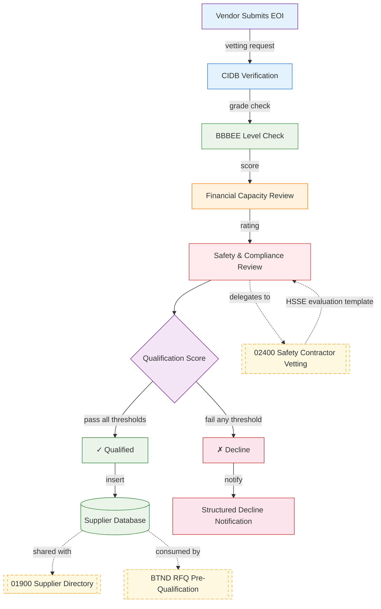
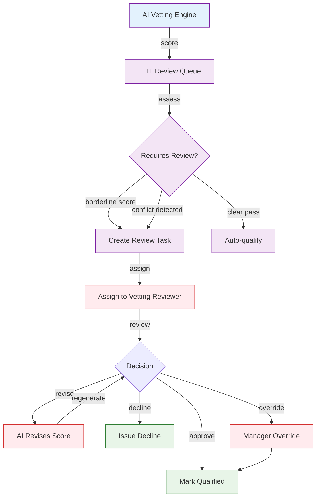

# PROC-VETTING — Vendor Vetting & Pre-Qualification UI/UX Specification

## Part A: UX Patterns (High-Level)

### Template Classification

**Classification**: Template B (Complex/Three-State)

**Rationale**:
- Full three-state navigation (Agents, Upserts, Workspace)
- Complex multi-stage vetting pipeline (CIDB → BBBEE → Financial → Safety)
- Cross-discipline integration with 02400 Safety and BTND-PLATFORM
- HITL review queue for borderline qualification cases

**CSS Class Convention**: `A-01900-vetting-*` for all page-level elements

### Responsive Breakpoints

| Platform | Width | Layout Changes |
|----------|-------|----------------|
| Desktop | 1280px+ | Full three-state nav, scoring matrix, side-by-side check results |
| Tablet | 768px-1279px | Three-state nav collapses to dropdown, scoring as card view |
| Mobile | <768px | Three-state nav as bottom tab bar, simple pass/fail indicators |

---

## Part B: Color Scheme

```css
:root {
  /* Primary — Purple (Vetting) */
  --vetting-primary: #7B1FA2;
  --vetting-secondary: #9C27B0;
  --vetting-accent: #6A1B9A;

  /* Check Colors */
  --vetting-cidb: #1976D2;
  --vetting-bbbee: #388E3C;
  --vetting-financial: #F57C00;
  --vetting-safety: #D32F2F;

  /* Outcome Colors */
  --vetting-qualified: #2E7D32;
  --vetting-declined: #C62828;
  --vetting-pending: #F9A825;

  /* Background Gradients */
  --vetting-header-gradient: linear-gradient(135deg, #4A148C 0%, #7B1FA2 100%);
  --vetting-bg-gradient: linear-gradient(135deg, #F3E5F5 0%, #E1BEE7 100%);
}
```

---

## Part C: Three-State Definition

| State | Purpose |
|-------|---------|
| **Agents** | Vetting agents, CIDB/BBBEE lookup agents, safety compliance agents |
| **Upserts** | Add vendor for vetting, upload compliance documents, override vetting records |
| **Workspace** | Vetting review queue, HITL for borderline cases, qualification reports |

### Agents State

| Button | Visibility Gate | Action | Modal |
|--------|----------------|--------|-------|
| View Details | Always visible | Opens VettingDetails modal | `VettingDetails` — 98vw |

### Upserts State

| Button | Visibility Gate | Action | Modal |
|--------|----------------|--------|-------|
| Add Vendor | `user.role >= 'editor'` | Opens AddVettingRecord modal | `AddVettingRecord` — 98vw |
| Upload Docs | `user.role >= 'editor'` | Opens DocumentUpload modal | `DocumentUpload` — 98vw |
| Override | `user.role >= 'manager'` | Opens VettingOverride modal | `VettingOverride` — 98vw |

### Workspace State

| Button | Visibility Gate | Action | Modal |
|--------|----------------|--------|-------|
| Review | `user.role >= 'evaluator'` | Opens PrequalReport modal | `PrequalReport` — 98vw |
| Approve | `user.role >= 'manager'` | Opens Qualification modal | `Qualification` — 98vw |
| Decline | `user.role >= 'evaluator'` | Opens DeclineVetting modal | `DeclineVetting` — 98vw |
| View Queue | Always visible | Opens HITLQueue modal | `HITLQueue` — 98vw |

### Modal Inventory

| Modal | State | Purpose | Size |
|-------|-------|---------|------|
| VettingDetails | Agents | View vendor vetting status and scores | 98vw |
| AddVettingRecord | Upserts | Add new vendor for vetting | 98vw |
| DocumentUpload | Upserts | Upload compliance documents | 98vw |
| VettingOverride | Upserts | Override AI-recommended vetting result | 98vw |
| PrequalReport | Workspace | View detailed pre-qualification report | 98vw |
| Qualification | Workspace | Approve qualified vendor | 98vw |
| DeclineVetting | Workspace | Decline with structured feedback | 98vw |
| HITLQueue | Workspace | View HITL review queue | 98vw |

---

## Part D: Mermaid UI Flow Diagrams

### Diagram 1: Vetting Pipeline Flow



### Diagram 2: HITL Vetting Review Flow



---

## Part E: Integration Points

| Integration | Reference | Purpose |
|-------------|-----------|---------|
| 02400 Safety Contractor Vetting | `docs-construct-ai/disciplines/02400_safety/workflow_docs/02400_CONTRACTOR_VETTING_WORKFLOW_CONSOLIDATED.md` | Safety record evaluation delegated to 02400's HSSE pipeline |
| 02400 HSSE Evaluation Template | `docs-construct-ai/disciplines/02400_safety/technical/02400-HSSE-SUPPLIER-CONTRACTOR-EVALUATION-SAFETY-TEMPLATE.MD` | Structured safety evaluation form |
| 01900 Supplier Directory | `docs-construct-ai/disciplines/01900_procurement/suppliers/1900_CONSOLIDATED-SUPPLIER-DIRECTORY-DOCUMENTATION.MD` | Shared supplier database after qualification |
| BTND-PLATFORM RFQ Flow | `docs-paperclip/disciplines-shared/bidding-and-tendering/UI-UX-SPECIFICATION.md` | Downstream consumer of pre-qualified vendor list |
| 01900 Supplier Outreach Workflow | `docs-construct-ai/disciplines/01900_procurement/workflow_docs/orders/1900_PROCUREMENT_SUPPLIER_OUTREACH_WORKFLOW.MD` | Invite qualified vendors to participate |

---

## Part F: Screen Specifications

### Screen States

| State | Description |
|-------|-------------|
| Loading | Skeleton loader with purple shimmer |
| Empty | "No vendors in vetting pipeline" with Add Vendor CTA |
| Error | Error message with retry button |
| Populated | Full vetting pipeline with check status indicators |

### Chatbot Configuration

```json
{
  "chatType": "agent",
  "stateAware": true,
  "currentState": "agents|upserts|workspace",
  "zIndex": 1500,
  "modelEndpoint": "/api/chat/vetting"
}
```

| State | Chatbot Focus |
|-------|---------------|
| Agents | Explains vetting criteria, CIDB/BBBEE requirements |
| Upserts | Assists with document upload, vendor data entry |
| Workspace | Reviews qualification scores, suggests outcomes |

---

## Version History

| Version | Date | Changes |
|---------|------|---------|
| 1.0 | 2026-04-29 | Initial UI/UX specification for Vendor Vetting & Pre-Qualification |

---

**Document Information**
- **Author**: DomainForge AI — Procurement Domain
- **Date**: 2026-04-29
- **Status**: Active