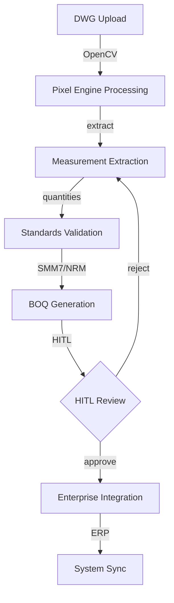
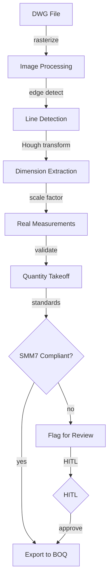
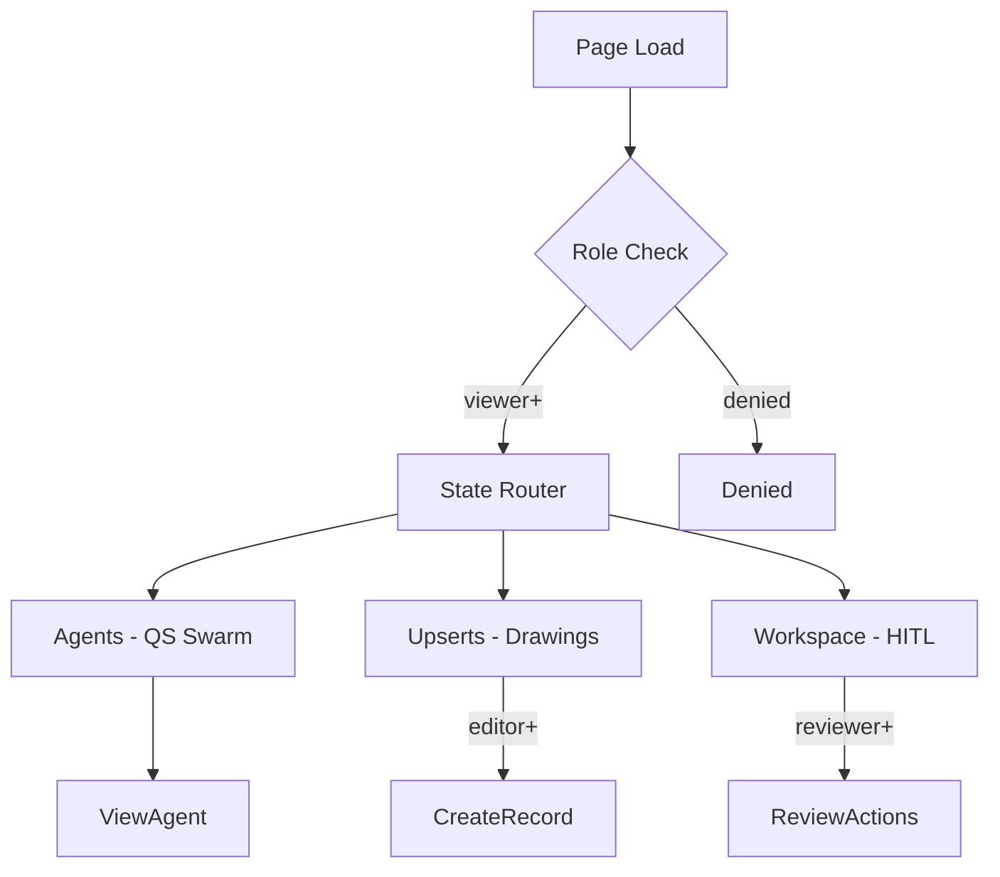

# QS-DWG-SWARM-ENTERPRISE — Quantity Surveying Drawing Swarm Enterprise UI/UX Specification

## Table of Contents

1. [Part A: UX Patterns](#part-a-ux-patterns)
2. [Part B: Three-State Button & Modal Rules](#part-b-three-state-button--modal-rules)
3. [Part C: Mermaid UI Flow Diagrams](#part-c-mermaid-ui-flow-diagrams)
4. [Part D: Implementation Standards](#part-d-implementation-standards)
5. [Part E: Screen Specifications](#part-e-screen-specifications)
6. [Part F: AI Model Backend](#part-f-ai-model-backend)
7. [Part G: Agent Knowledge Ownership](#part-g-agent-knowledge-ownership)

---

## Part A: UX Patterns

### 1. Page Classification

**Template Type**: **Template B** (Complex / Three-State)

The QS-DWG-SWARM-ENTERPRISE page implements three-state navigation (Agents, Upserts, Workspace) for managing quantity surveying drawing swarm enterprise workflows. This is the Proc-001 project under Quantity Surveying (02025).

**Why Template B**:
- **Multi-State Navigation**: Three distinct operational states — Agents, Upserts, Workspace
- **Multi-Purpose Functionality**: UI measurement workflow, OpenCV pixel engine, QS standards validation, enterprise integration, testing/validation
- **Complex Workflows**: Drawing swarm enterprise lifecycle from measurement through validation
- **Higher z-index positioning** (1500) for the chatbot overlay
- **CSS Class Convention**: `A-QS-*` prefix for all page-level elements

### 2. Information Architecture

**Accordion Section**: Quantity Surveying (display_order: 2025)
**Accordion Subsection**: PROC-001 — Drawing Swarm Enterprise
**Icon**: Ruler / measurement icon
**Route**: `/qs-dwg-swarm-enterprise`

### 3. Color Scheme — Olive

```css
:root {
  --template-a-primary: #808000;
  --template-a-secondary: #6B8E23;
  --template-a-accent: #556B2F;
  --template-a-bg-gradient: linear-gradient(135deg, #f0f4c3 0%, #dce775 100%);
  --template-a-header-gradient: linear-gradient(135deg, #556B2F 0%, #6B8E23 100%);
  --template-a-text-primary: #000000;
  --template-a-text-secondary: #6c757d;
  --template-a-text-white: #ffffff;
  --template-a-shadow-sm: 0 2px 4px rgba(0, 0, 0, 0.05);
  --template-a-shadow-md: 0 4px 6px rgba(0, 0, 0, 0.1);
  --template-a-shadow-lg: 0 8px 24px rgba(128, 128, 0, 0.3);
}
```

### 4. HITL Integration Pattern

1. **AI Agent** performs measurement extraction (OpenCV pixel analysis, quantity takeoff, standards validation)
2. **Work enters HITL Review Queue** — visible in the Workspace state
3. **Quantity Surveyor** reviews:
   - **Approve**: Action proceeds (e.g., measurement validated, BOQ item accepted)
   - **Reject with Feedback**: Returns to AI agent with correction notes
   - **Manual Override**: Human takes over the measurement directly
4. **Audit Trail**: All QS decisions logged with timestamps and approver identity

---

## Part B: Three-State Button & Modal Rules

### 5. State: Agents

The **Agents state** shows QS drawing swarm AI agents for measurement extraction, pixel engine analysis, and standards validation.

**Buttons** (all buttons pre-configured by dev team):

| Button | Visibility Gate | Action | Modal |
|--------|----------------|--------|-------|
| **View Details** | Always | AgentDetails | `AgentDetails` — 98vw, QS agent metrics |

### 6. State: Upserts

The **Upserts state** is where drawing records — DWG files, measurement sets, BOQ items — are created, edited, and imported.

| Button | Visibility Gate | Action | Modal |
|--------|----------------|--------|-------|
| **Create New** | `editor` | CreateRecord | `CreateRecord` — 98vw, QS measurement form |
| **Import DWG** | `editor` | Import | `Import` — 98vw, DWG/DXF upload with pixel processing |
| **Edit** | `editor` | EditRecord | `EditRecord` — 98vw, pre-populated |
| **Delete** | `governance` | Confirmation | `Confirmation` — impact warning |
| **Process Drawing** | `editor` | Inline process | No modal |

### 7. State: Workspace

| Button | Visibility Gate | Action | Modal |
|--------|----------------|--------|-------|
| **Approve** | `reviewer` | Approval | `Approval` — 98vw |
| **Reject** | `reviewer` | Rejection | `Rejection` — 98vw |
| **Validate** | `reviewer` | Validation | `Validation` — 98vw, standards check |
| **Generate Report** | Always | Export | `Export` — 98vw, BOQ format |

---

## Part C: Mermaid UI Flow Diagrams

### 8. Drawing Swarm Enterprise Lifecycle



### 9. OpenCV Pixel Engine Flow



### 10. Page State Flow



---

## Part D: Implementation Standards

### 11. CSS Architecture

```css
@import "../../templates/template-a-standard.css";
@import "02025-qs-dwg-swarm-style.css";
```

**File**: `client/src/common/css/pages/02025-qs-dwg-swarm/02025-qs-dwg-swarm-style.css`
**Class Prefix**: `A-QS-*`

### 12. Components

| Component | CSS Class |
|-----------|-----------|
| StateButtons | `.A-QS-state-btn` |
| NavContainer | `.A-QS-nav-container` |
| DWGUploader | `.A-QS-dwg-uploader` |
| MeasurementTable | `.A-QS-measurement-table` |
| PixelPreview | `.A-QS-pixel-preview` |
| BOQExportForm | `.A-QS-boq-export` |

### 13. Modal Specifications

All modals follow 98vw width with olive gradient headers.

| Modal | State | Purpose |
|-------|-------|---------|
| CreateNewAgent | Agents | Create QS agent |
| AgentConfig | Agents | Configure agent |
| CreateRecord | Upserts | New measurement record |
| Import | Upserts | DWG/DXF upload |
| EditRecord | Upserts | Edit measurement |
| Approval | Workspace | Approve QS action |
| Rejection | Workspace | Reject with feedback |
| Validation | Workspace | Standards validation report |
| Export | Workspace | Export BOQ |

### 14. Chatbot

```javascript
{ chatType: "agent", stateAware: true, zIndex: 1500, modelEndpoint: "/api/chat/qs-dwg-swarm" }
```

---

## Part E: Screen Specifications

### 15. Screen Inventory

| Screen | State | Loading | Empty | Error | Populated |
|--------|-------|---------|-------|-------|-----------|
| Agent List | Agents | Spinner | "No agents" | Red banner | Agent cards |
| Drawing List | Upserts | Spinner | "No drawings" | Red banner | Table + preview |
| Pixel Preview | Upserts | Processing | "No image" | Processing error | Image + measures |
| HITL Queue | Workspace | Spinner | "No items" | Red banner | Queue |

### 16. Wireframe: Agents State

```
┌──────────────────────────────────────────────────────────────┐
│  [Olive Header Gradient]                                       │
│  QS-DWG-SWARM-ENTERPRISE │ [Chatbot]                           │
├──────────────────────────────────────────────────────────────┤
│  [Tab Nav: Agents | Upserts | Workspace]                      │
│  ┌────────────────────────────────────────────────────────┐  │
│  │ Drawing Swarm Agents                [+ Add Agent]      │  │
│  ├────────────────────────────────────────────────────────┤  │
│  │ ┌──────────┐ ┌──────────┐ ┌──────────┐                │  │
│  │ │ Pixel    │ │ Meas.    │ │ Standards│                │  │
│  │ │ Engineer │ │ Extractor│ │ Validator│                │  │
│  │ │ ● Active │ │ ● Active │ │ ● Active │                │  │
│  │ │ [Edit]   │ │ [Edit]   │ │ [Edit]   │                │  │
│  │ └──────────┘ └──────────┘ └──────────┘                │  │
│  └────────────────────────────────────────────────────────┘  │
├──────────────────────────────────────────────────────────────┤
│  [Bottom-Fixed Nav]                                           │
└──────────────────────────────────────────────────────────────┘
```

### 17. Platform Adaptations

**Desktop (1280px+)**: Three-state nav visible, 3 col agent grid
**Tablet (768-1279px)**: Nav dropdown, 2 col grid
**Mobile (<768px)**: Bottom tab bar, 1 col, 48dp targets

---

## Part F: AI Model Backend

### 18. Model Infrastructure

**Base Model**: Qwen 2.5
**LoRA**: Drawing measurement, OpenCV pixel analysis, SMM7/NRM standards
**Endpoint**: `/api/chat/qs-dwg-swarm`

### 19. API Endpoints

| Endpoint | Method | Purpose | State |
|----------|--------|---------|-------|
| `/api/agents/qs-swarm` | GET | List agents | Agents |
| `/api/drawings` | GET | List drawings | Upserts |
| `/api/drawings` | POST | Upload DWG | Upserts |
| `/api/drawings/:id/process` | POST | Process with OpenCV | Upserts |
| `/api/drawings/:id/measurements` | GET | Get measurements | Upserts |
| `/api/hitl/qs-swarm` | GET | HITL queue | Workspace |
| `/api/hitl/qs-swarm/:id/approve` | POST | Approve | Workspace |
| `/api/hitl/qs-swarm/:id/reject` | POST | Reject | Workspace |
| `/api/export/boq` | POST | Export BOQ | Workspace |

---

## Part G: Agent Knowledge Ownership

| Company | Role | Action |
|---------|------|--------|
| **DomainForge AI** | Domain Validation | Validate QS measurement workflows |
| **QualityForge AI** | Testing | Execute test suite |
| **DevForge AI** | Implementation | Build pages per wireframes |
| **KnowledgeForge AI** | Indexing | Index spec into memory |

---

## Version History

| Version | Date | Changes |
|---------|------|---------|
| 1.0 | 2026-04-29 | Initial UI/UX specification for QS-DWG-SWARM-ENTERPRISE — Template B |

---

**Document Information**
- **Author**: DomainForge AI — Quantity Surveying Domain
- **Date**: 2026-04-29
- **Status**: Active
