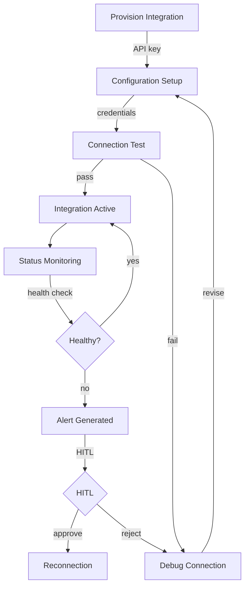
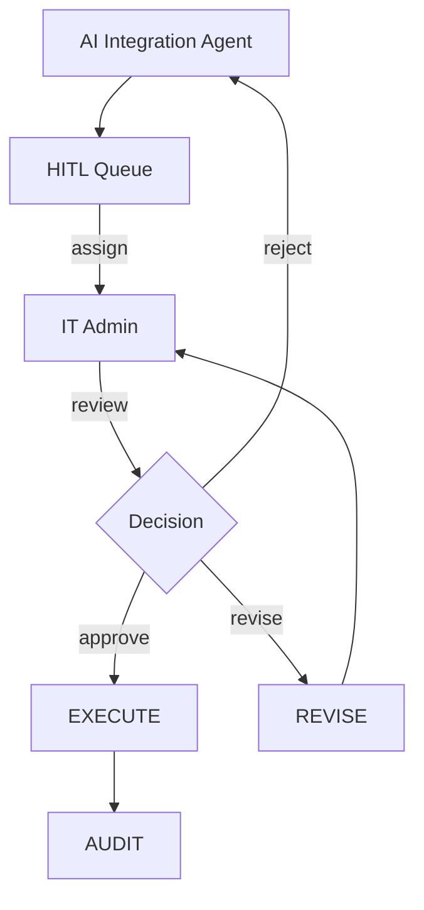
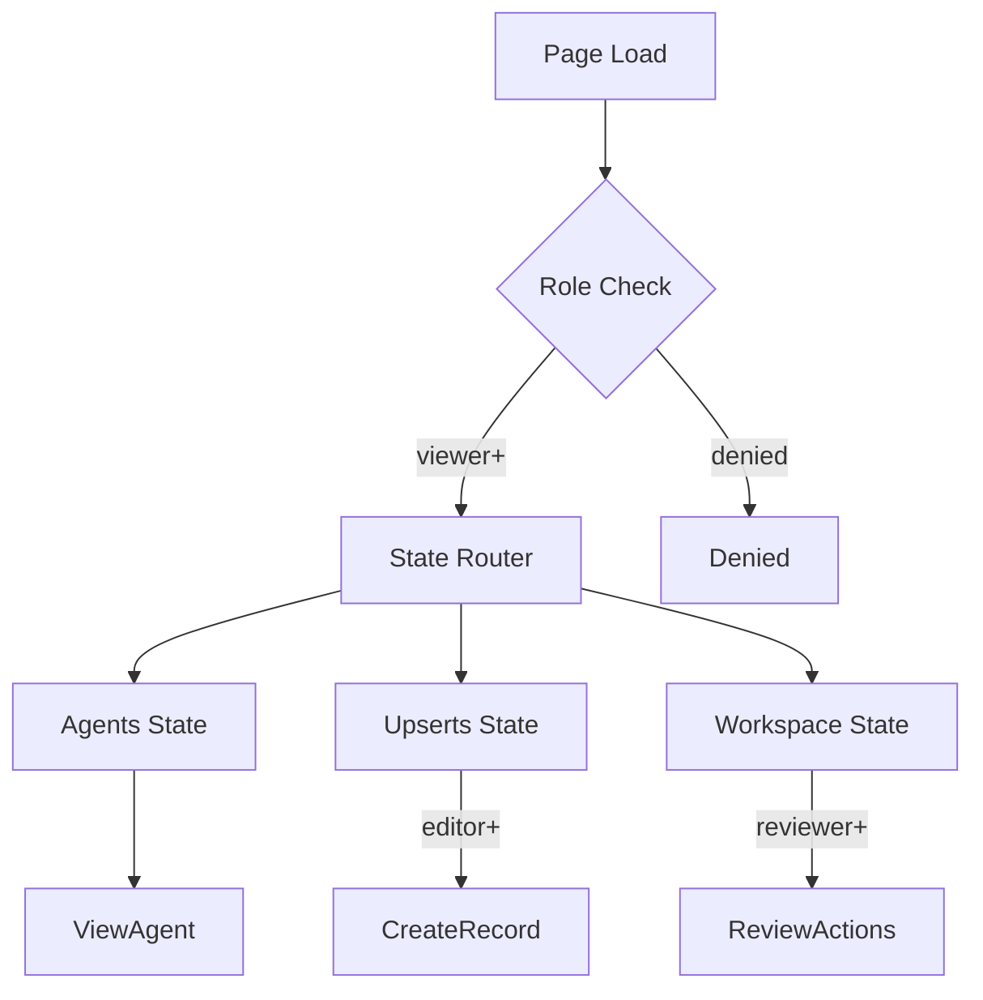

# INTEGRATION-SETTINGS-UI — Integration Settings UI/UX Specification

## Table of Contents

1. [Part A: UX Patterns](#part-a-ux-patterns)
2. [Part B: Three-State Button & Modal Rules](#part-b-three-state-button--modal-rules)
3. [Part C: Mermaid UI Flow Diagrams](#part-c-mermaid-ui-flow-diagrams)
4. [Part D: Implementation Standards](#part-d-implementation-standards)
5. [Part E: Screen Specifications](#part-e-screen-specifications)
6. [Part F: AI Model Backend](#part-f-ai-model-backend)
7. [Part G: Agent Knowledge Ownership](#part-g-agent-knowledge-ownership)

---

## Part A: UX Patterns

### 1. Page Classification

**Template Type**: **Template B** (Complex / Three-State)

The INTEGRATION-SETTINGS-UI page implements three-state navigation (Agents, Upserts, Workspace) for managing integration settings, API keys, credentials, and system integrations.

**Why Template B**:
- **Multi-State Navigation**: Three distinct operational states — Agents, Upserts, Workspace
- **Multi-Purpose Functionality**: API key management, secure credential storage, integration status dashboard, user onboarding flow, testing validation
- **Complex Workflows**: Integration lifecycle from provisioning through monitoring
- **Higher z-index positioning** (1500) for the chatbot overlay
- **CSS Class Convention**: `A-INTEG-*` prefix for all page-level elements

### 2. Information Architecture

**Accordion Section**: Information Technology (display_order: 2050)
**Accordion Subsection**: 02050 Integration Settings
**Icon**: Plug / integration icon
**Route**: `/integration-settings`

### 3. Color Scheme — Blue

```css
:root {
  --template-a-primary: #0000FF;
  --template-a-secondary: #4169E1;
  --template-a-accent: #1E90FF;
  --template-a-bg-gradient: linear-gradient(135deg, #e3f2fd 0%, #bbdefb 100%);
  --template-a-header-gradient: linear-gradient(135deg, #0000FF 0%, #4169E1 100%);
  --template-a-text-primary: #000000;
  --template-a-text-secondary: #6c757d;
  --template-a-text-white: #ffffff;
  --template-a-shadow-sm: 0 2px 4px rgba(0, 0, 0, 0.05);
  --template-a-shadow-md: 0 4px 6px rgba(0, 0, 0, 0.1);
  --template-a-shadow-lg: 0 8px 24px rgba(0, 0, 255, 0.3);
}
```

### 4. HITL Integration Pattern

1. **AI Agent** performs integration actions (API key validation, credential testing, status monitoring)
2. **Work enters HITL Review Queue** — visible in the Workspace state
3. **IT Administrator** reviews:
   - **Approve**: Action proceeds (e.g., API key activated, integration approved)
   - **Reject with Feedback**: Returns to AI agent with correction notes
   - **Manual Override**: Human takes over the action directly
4. **Audit Trail**: All integration decisions logged with timestamps and approver identity

---

## Part B: Three-State Button & Modal Rules

### 5. State: Agents

The **Agents state** shows IT integration AI agents for API management, credential security, and integration monitoring.

**Buttons** (all buttons pre-configured by dev team):

| Button | Visibility Gate | Action | Modal |
|--------|----------------|--------|-------|
| **View Details** | Always | AgentDetails | `AgentDetails` — 98vw, integration agent metrics |

### 6. State: Upserts

The **Upserts state** is where integration records — API keys, credentials, integration configurations — are created, edited, and imported.

| Button | Visibility Gate | Action | Modal |
|--------|----------------|--------|-------|
| **Create New** | `editor` | CreateRecord | `CreateRecord` — 98vw, integration form |
| **Import** | `editor` | Import | `Import` — 98vw, config file upload |
| **Edit** | `editor` | EditRecord | `EditRecord` — 98vw, pre-populated |
| **Delete** | `governance` | Confirmation | `Confirmation` — impact warning |
| **Test Connection** | `editor` | Inline test | No modal |

### 7. State: Workspace

| Button | Visibility Gate | Action | Modal |
|--------|----------------|--------|-------|
| **Approve** | `reviewer` | Approval | `Approval` — 98vw |
| **Reject** | `reviewer` | Rejection | `Rejection` — 98vw |
| **Generate Report** | Always | Export | `Export` — 98vw |

---

## Part C: Mermaid UI Flow Diagrams

### 8. Integration Lifecycle



### 9. HITL Review Workflow



### 10. Page State Flow



---

## Part D: Implementation Standards

### 11. CSS Architecture

```css
@import "../../templates/template-a-standard.css";
@import "02050-integration-settings-style.css";
```

**File**: `client/src/common/css/pages/02050-integration-settings/02050-integration-settings-style.css`
**Class Prefix**: `A-INTEG-*`

### 12. Components

| Component | CSS Class |
|-----------|-----------|
| StateButtons | `.A-INTEG-state-btn` |
| NavContainer | `.A-INTEG-nav-container` |
| APIKeyTable | `.A-INTEG-api-key-table` |
| CredentialForm | `.A-INTEG-credential-form` |
| StatusDashboard | `.A-INTEG-status-dashboard` |
| OnboardingWizard | `.A-INTEG-onboarding-wizard` |

### 13. Modal Specifications

All modals follow 98vw width with blue gradient headers.

| Modal | State | Purpose |
|-------|-------|---------|
| CreateNewAgent | Agents | Create integration agent |
| CreateRecord | Upserts | New integration record |
| Import | Upserts | Bulk import config |
| EditRecord | Upserts | Edit existing |
| Approval | Workspace | Approve integration |
| Rejection | Workspace | Reject with feedback |

### 14. Chatbot

```javascript
{ chatType: "agent", stateAware: true, zIndex: 1500, modelEndpoint: "/api/chat/integration" }
```

---

## Part E: Screen Specifications

### 15. Screen Inventory

| Screen | State | Loading | Empty | Error | Populated |
|--------|-------|---------|-------|-------|-----------|
| Agent List | Agents | Spinner | "No agents" | Red banner | Agent cards |
| API Keys | Upserts | Spinner | "No keys" | Red banner | Table |
| Status Dashboard | Workspace | Spinner | "No integrations" | Red banner | Dashboard |

### 16. Wireframe: Agents State

```
┌──────────────────────────────────────────────────────────────┐
│  [Blue Header Gradient]                                        │
│  INTEGRATION SETTINGS │ [Chatbot]                               │
├──────────────────────────────────────────────────────────────┤
│  [Tab Nav: Agents | Upserts | Workspace]                      │
│  ┌────────────────────────────────────────────────────────┐  │
│  │ Integration Agents                  [+ Add Agent]      │  │
│  ├────────────────────────────────────────────────────────┤  │
│  │ ┌──────────┐ ┌──────────┐                              │  │
│  │ │ API Key  │ │ Cred.    │                              │  │
│  │ │ Manager  │ │ Guard    │                              │  │
│  │ │ ● Active │ │ ● Active │                              │  │
│  │ │ [Edit]   │ │ [Edit]   │                              │  │
│  │ └──────────┘ └──────────┘                              │  │
│  └────────────────────────────────────────────────────────┘  │
├──────────────────────────────────────────────────────────────┤
│  [Bottom-Fixed Nav]                                           │
└──────────────────────────────────────────────────────────────┘
```

### 17. Platform Adaptations

**Desktop (1280px+)**: Three-state nav visible, 3 col grid
**Tablet (768-1279px)**: Nav dropdown, 2 col grid
**Mobile (<768px)**: Bottom tab bar, 1 col, 48dp targets

---

## Part F: AI Model Backend

### 18. Model Infrastructure

**Base Model**: Qwen 2.5
**LoRA**: Integration management, API security, credential validation
**Endpoint**: `/api/chat/integration`

### 19. API Endpoints

| Endpoint | Method | Purpose | State |
|----------|--------|---------|-------|
| `/api/agents/integration` | GET | List agents | Agents |
| `/api/integrations` | GET | List integrations | Upserts |
| `/api/integrations` | POST | Create | Upserts |
| `/api/integrations/:id/test` | POST | Test connection | Upserts |
| `/api/hitl/integration` | GET | HITL queue | Workspace |

---

## Part G: Agent Knowledge Ownership

| Company | Role |
|---------|------|
| DomainForge AI | Domain Validation |
| QualityForge AI | Testing |
| DevForge AI | Implementation |

---

**Version**: 1.0 | **Date**: 2026-04-29 | **Status**: Active
