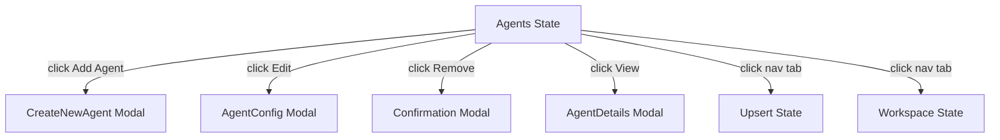
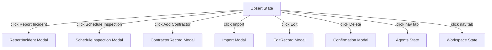
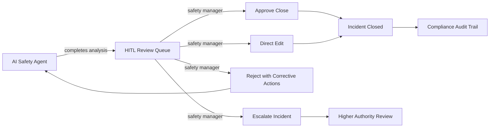
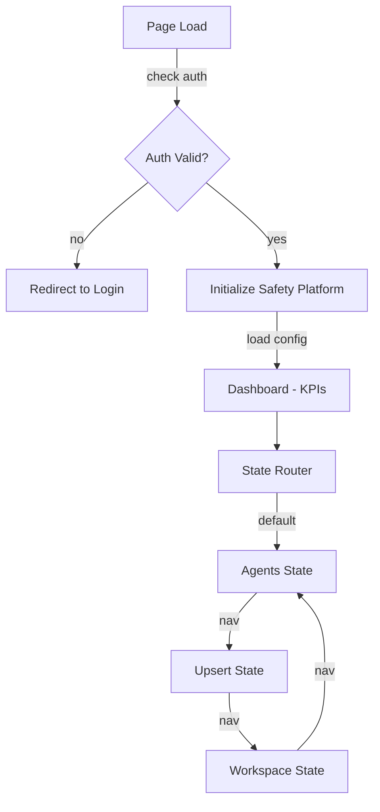
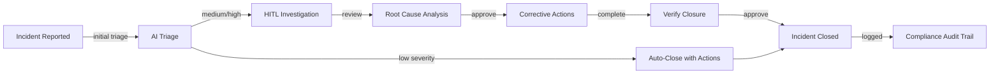
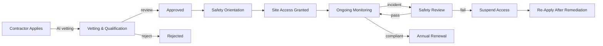

# 02400 Safety — UI/UX Specification

## Table of Contents

1. [Part A: UX Patterns (High-Level)](#part-a-ux-patterns-high-level)
2. [Part B: Three-State Button & Modal Rules](#part-b-three-state-button--modal-rules)
3. [Part C: Mermaid UI Flow Diagrams](#part-c-mermaid-ui-flow-diagrams)
4. [Part D: Implementation Standards](#part-d-implementation-standards)
5. [Part E: Screen Specifications (Detailed)](#part-e-screen-specifications-detailed)
6. [Part F: AI Model Backend](#part-f-ai-model-backend)
7. [Part G: Agent Knowledge Ownership](#part-g-agent-knowledge-ownership)

---

## Part A: UX Patterns (High-Level)

### 1. Page Classification

**Template Type**: **Template B** (Complex / Three-State)

The 02400 Safety page is classified as **Template B** because:

- **Multi-State Navigation**: Three distinct operational states — Agents, Upsert, Workspace
- **Multi-Purpose Functionality**: Contractor safety management, incident reporting, compliance monitoring, safety inspections, training records
- **Complex Workflows**: Safety incident lifecycle (report → investigate → close), contractor qualification, compliance audits
- **Higher z-index positioning** (1500) for the chatbot overlay
- **State-aware AI assistance** for safety guidance and compliance checking

**Primary User Roles**:
- **Safety Managers**: Oversee all safety operations, review incidents, manage compliance
- **Site Supervisors**: Report incidents, conduct inspections, review contractor safety
- **Safety Officers**: Manage training records, conduct audits, issue permits
- **Contractors**: Submit safety documentation, view compliance status

### 2. Information Architecture

**Accordion Section**: Safety (display_order: 2400)
**Accordion Subsection**: Contractor Safety Management
**Icons**: Shield / hard-hat icon
**Routes**: `/safety/safetycontractor`

**AccordionProvider + AccordionComponent** is mandatory per the `0950_ACCORDION_MANAGEMENT_AUDIT.md` standard.

### 3. Color Scheme

The platform uses the **Template A orange palette** as its foundation, with a **safety-specific red/amber/green (RAG) accent**:

```css
:root {
  /* Primary Color Palette */
  --template-a-primary: #FF8C00;
  --template-a-secondary: #FFA500;
  --template-a-accent: #FF6B35;

  /* Safety-Specific Palette */
  --safety-primary: #D32F2F;         /* Red — safety alerts & hazards */
  --safety-secondary: #FF5252;       /* Light red — safety warnings */
  --safety-amber: #FFC107;           /* Amber — safety notices */
  --safety-green: #4CAF50;           /* Green — safety pass/compliant */
  --safety-blue: #1976D2;            /* Blue — safety information */
  --safety-compliant: #43A047;       /* Dark green — fully compliant */
  --safety-partial: #FFB300;         /* Amber — partially compliant */
  --safety-noncompliant: #E53935;    /* Red — non-compliant / high risk */

  /* Background Gradients */
  --template-a-bg-gradient: linear-gradient(135deg, #f8f9fa 0%, #e9ecef 100%);
  --template-a-header-gradient: linear-gradient(135deg, #D32F2F 0%, #FF5252 100%);

  /* Text Colors */
  --template-a-text-primary: #000000;
  --template-a-text-secondary: #6c757d;
  --template-a-text-white: #ffffff;

  /* Shadows and Borders */
  --template-a-shadow-sm: 0 2px 4px rgba(0, 0, 0, 0.05);
  --template-a-shadow-md: 0 4px 6px rgba(0, 0, 0, 0.1);
  --template-a-shadow-lg: 0 8px 24px rgba(211, 47, 47, 0.3);
}
```

**Why Red?**: Safety is inherently about hazard identification and risk management. Red is the universal safety color for danger/stop/alerts — it immediately communicates the domain's urgency and importance. The header gradient uses red tones to differentiate from procurement/orange and measurement/teal.

**RAG Status Colors for Safety Indicators**:
| Status | Color | Meaning |
|--------|-------|---------|
| 🔴 Red | `#E53935` | High risk / Non-compliant / Overdue |
| 🟡 Amber | `#FFB300` | Medium risk / Partially compliant / Due soon |
| 🟢 Green | `#43A047` | Low risk / Fully compliant / On track |
| 🔵 Blue | `#1976D2` | Information / Training required |

### 4. HITL Integration Pattern

1. **AI Agent** performs initial safety analysis (incident classification, compliance checking, inspection review)
2. **Work enters HITL Review Queue** — visible in the Workspace state
3. **Safety Manager** reviews the AI output:
   - **Approve**: Safety action proceeds (e.g., incident closed, training certified)
   - **Reject with Feedback**: Returns to AI agent with correction notes
   - **Escalate**: Incident forwarded to higher authority (e.g., fatality investigation)
   - **Direct Edit**: Human modifies the safety record directly
4. **Compliance Check**: All safety actions validated against regulatory requirements (SANS, OHS Act)
5. **Audit Trail**: Every safety decision recorded for regulatory audit purposes

---

## Part B: Three-State Button & Modal Rules

### 5. State: Agents

The **Agents state** shows safety AI agents for incident management, compliance monitoring, and contractor oversight.

**Buttons**:

| Button | Visibility Gate | Action | Modal |
|--------|----------------|--------|-------|
| **Add Agent** | `user.role === 'governance'` | Opens CreateNewAgent modal | `CreateNewAgent` — 98vw, red gradient header, safety agent config |
| **Edit** (per agent) | `user.role >= 'editor'` | Opens AgentConfig modal | `AgentConfig` — 98vw, safety skill toggles, compliance domain |
| **Remove/Archive** | `user.role === 'governance'` | Opens Confirmation modal | `Confirmation` — archive with safety record preservation |
| **View Details** | Always visible | Opens AgentDetails modal | `AgentDetails` — 98vw, incident resolution rate, compliance accuracy |

**Safety Agent Types**:
| Agent | Role | Skills |
|-------|------|--------|
| guardian-qualityforge | Safety Guardian | Incident classification, root cause analysis |
| devforge-ai-workflow-developer | Safety Workflow Dev | Compliance workflows, inspection automation |
| infraforge-ai-integration-specialist | Safety Integration | Safety system integration, SES/SCM connectivity |

**Mermaid Flow**:


### 6. State: Upsert

The **Upsert state** is where safety records are created, edited, and imported.

**Buttons**:

| Button | Visibility Gate | Action | Modal |
|--------|----------------|--------|-------|
| **Report Incident** | `user.role >= 'editor'` | Opens ReportIncident modal | `ReportIncident` — 98vw, incident type, severity, location, description, photos |
| **Schedule Inspection** | `user.role >= 'editor'` | Opens ScheduleInspection modal | `ScheduleInspection` — 98vw, location, date, inspector, checklist |
| **Add Contractor Record** | `user.role >= 'editor'` | Opens ContractorRecord modal | `ContractorRecord` — 98vw, contractor info, qualification, insurance, training |
| **Import Safety Docs** | `user.role >= 'editor'` | Opens Import modal | `Import` — 98vw, file upload (PDF safety plans, training certs) |
| **Edit** (per record) | `user.role >= 'editor'` | Opens EditRecord modal | `EditRecord` — 98vw, pre-populated form, change tracking |
| **Delete** | `user.role === 'governance'` | Opens Confirmation modal | `Confirmation` — with regulatory record retention warning |

**Form Validation** (per 0750 standard):
- **Green border** (`2px solid #43A047`): Field is valid
- **Gray border** (`2px solid #dee2e6`): Field is empty/required
- **Red border** (`2px solid #E53935`): Field has validation error — uses safety red
- **Error text**: Red bold text below the field

**Mermaid Flow**:


### 7. State: Workspace

The **Workspace state** is the safety operations dashboard — reviewing incident reports, monitoring compliance, managing inspections.

**Buttons**:

| Button | Visibility Gate | Action | Modal |
|--------|----------------|--------|-------|
| **Approve Incident Close** | `user.role >= 'reviewer'` | Opens Approval modal | `Approval` — 98vw, confirm close with corrective actions documented |
| **Escalate Incident** | `user.role >= 'reviewer'` | Opens Escalate modal | `Escalate` — 98vw, escalation reason, higher authority selection |
| **Reject** | `user.role >= 'reviewer'` | Opens Rejection modal | `Rejection` — 98vw, required corrective action notes |
| **Assign Investigator** | `user.role >= 'coordinator'` | Opens Assign modal | `Assign` — 98vw, investigator selector, investigation scope |
| **Run Compliance Audit** | `user.role >= 'coordinator'` | Opens ComplianceAudit modal | `ComplianceAudit` — 98vw, audit scope, checklist, date range |
| **Generate Safety Report** | Always visible | Opens Export modal | `Export` — 98vw, report type (incident summary, compliance status, training records) |
| **Issue Safety Alert** | `user.role >= 'coordinator'` | Opens SafetyAlert modal | `SafetyAlert` — 98vw, alert type, severity, message, distribution list |

**HITL Workflow**:


---

## Part C: Mermaid UI Flow Diagrams

### 8. Page State Flow



### 9. Incident Lifecycle Flow



### 10. Contractor Safety Lifecycle



---

## Part D: Implementation Standards

### 11. CSS Architecture

**Import Chain**:
```css
/* 1. Template A Standard (master template) */
@import "../../templates/template-a-standard.css";

/* 2. Page-Specific Safety Styles */
@import "02400-safety-contractor-style.css";
```

**File**:
- `client/src/common/css/pages/safety/02400-safety-contractor-style.css`

**Key Principles**:
- No background images (gradient only — per `0000_VISUAL_DESIGN_STANDARDS.md`)
- 98vw Modal Sizing
- Red safety palette (`#D32F2F`, `#FF5252`, `#FFC107`, `#4CAF50`)

### 12. Component Inventory

| Component | File | Purpose | CSS Class Prefix |
|-----------|------|---------|-----------------|
| KPIWidget | Dashboard | Safety KPIs (incidents, compliance %) | `.safety-kpi-*` |
| RAGIndicator | Dashboard | RAG status badge | `.safety-rag-*` |
| IncidentTable | Data grid | Incident management | `.safety-incident-*` |
| ContractorTable | Data grid | Contractor management | `.safety-contractor-*` |
| ComplianceChart | Dashboard | Compliance monitoring | `.safety-compliance-*` |
| InspectionForm | Form | Safety inspection | `.safety-inspection-*` |
| IncidentReportForm | Form | Incident reporting | `.safety-incident-form-*` |
| AlertBanner | Notification | Safety alerts | `.safety-alert-*` |

**RAG Status Badge Pattern**:
```html
<span class="safety-rag" style="background-color: #43A047; color: white; padding: 2px 8px; border-radius: 4px;">
  ● Low Risk
</span>
```

### 13. Modal Specifications

All modals follow 98vw width with red gradient headers.

**Modal Inventory**:
| Modal | State | Header Color | Purpose |
|-------|-------|-------------|---------|
| CreateNewAgent | Agents | Red gradient | Create safety agent |
| AgentConfig | Agents | Red gradient | Configure agent |
| ReportIncident | Upsert | Red gradient | New incident report |
| ScheduleInspection | Upsert | Red gradient | Schedule inspection |
| ContractorRecord | Upsert | Red gradient | Add contractor |
| Import | Upsert | Red gradient | Import safety docs |
| EditRecord | Upsert | Red gradient | Edit safety record |
| Approval | Workspace | Red gradient | Approve incident close |
| Escalate | Workspace | Red gradient | Escalate incident |
| Rejection | Workspace | Red gradient | Reject with actions |
| Assign | Workspace | Red gradient | Assign investigator |
| ComplianceAudit | Workspace | Red gradient | Run compliance audit |
| Export | Workspace | Red gradient | Generate safety report |
| SafetyAlert | Workspace | Red gradient | Issue safety alert |

### 14. Chatbot Configuration

**Template Type**: Template B (State-Aware)

```javascript
{
  chatType: "agent",
  stateAware: true,
  currentState: "agents|upserts|workspace",
  zIndex: 1500,
  modelEndpoint: "/api/chat/safety",
}
```

**State-Aware Behavior**:
- **Agents**: Chatbot answers questions about safety agent capabilities, incident classification criteria
- **Upsert**: Chatbot assists with incident report creation, inspection checklist selection, safety document review
- **Workspace**: Chatbot explains AI incident analysis, regulatory requirements, suggests corrective actions

---

## Part E: Screen Specifications (Detailed)

### 15. Screen Inventory

| Screen | State | Loading | Empty | Error | Populated |
|--------|-------|---------|-------|-------|-----------|
| Agent List | Agents | Spinner + skeleton cards | "No safety agents" CTA | Red banner + retry | Agent cards with resolution rate |
| Incident List | Upsert | Spinner + skeleton | "No incidents recorded" | Red banner + retry | Table with severity badges |
| Incident Form | Upsert | Spinner | Empty form | Field-level errors | Pre-populated form |
| Inspection List | Upsert | Spinner + skeleton | "No inspections scheduled" | Red banner + retry | Calendar view + list |
| HITL Queue | Workspace | Spinner + skeleton | "No items to review" | Red banner + retry | Queue with RAG status |
| Compliance Dashboard | Workspace | Spinner + charts loading | "No compliance data" | "Data fetch failed" | KPIs + charts + tables |
| Contractor List | Workspace | Spinner + skeleton | "No contractors" CTA | Red banner + retry | Table with qualification badges |

### 16. Wireframe: Workspace — Compliance Dashboard

```
┌──────────────────────────────────────────────────────────────┐
│  [Red Header Gradient]                                        │
│  Safety Management │ Contractor Safety │ [Chatbot]            │
├──────────────────────────────────────────────────────────────┤
│  [Tab Nav: Agents | Upsert | Workspace]                      │
│  ┌────────────────────────────────────────────────────────┐  │
│  │ Safety Dashboard       [Run Audit] [Issue Alert]       │  │
│  ├────────────────────────────────────────────────────────┤  │
│  │ ┌──────────┐ ┌──────────┐ ┌──────────┐ ┌──────────┐  │  │
│  │ │ Open     │ │ Days     │ │ Comp-    │ │ Training │  │  │
│  │ │ Incidents│ │ Since LTI│ │ liance   │ │ Up to    │  │  │
│  │ │    2     │ │    47    │ │  94%     │ │ Date     │  │  │
│  │ │ 🔴 High  │ │ 🟢 Good  │ │ 🟡 Warn  │ │  89%     │  │  │
│  │ └──────────┘ └──────────┘ └──────────┘ └──────────┘  │  │
│  ├────────────────────────────────────────────────────────┤  │
│  │ ┌──────────┬────────────┬──────────┬──────────────┐   │  │
│  │ │ Incident │ Contractor │ Severity │ Status       │   │  │
│  │ ├──────────┼────────────┼──────────┼──────────────┤   │  │
│  │ │ #1023    │ ABC Const  │ 🔴 High  │ ⏳ Reviewing│   │  │
│  │ │ #1022    │ XYZ Demol  │ 🟡 Med   │ ✅ Closed   │   │  │
│  │ │ #1021    │ DEF Elect  │ 🟢 Low   │ ✅ Closed   │   │  │
│  │ └──────────┴────────────┴──────────┴──────────────┘   │  │
│  └────────────────────────────────────────────────────────┘  │
├──────────────────────────────────────────────────────────────┤
│  [Bottom-Fixed Nav: Dashboard | Incidents | Contractors |    │
│   Inspections | Audit | Reports]                              │
└──────────────────────────────────────────────────────────────┘
```

### 17. Platform Adaptations

**Desktop (1280px+)**:
- Full three-state navigation
- KPI widgets: 4-column grid
- Incident table: full width with severity column
- Compliance dashboard: full charts + tables

**Tablet (768px - 1279px)**:
- Three-state nav collapses to dropdown
- KPI widgets: 2x2 grid
- Incident table: responsive, key columns
- Compliance dashboard: stacked layout

**Mobile (< 768px)**:
- Three-state nav as bottom tab bar
- KPI widgets: single column
- Incident table: card-based
- Touch targets: minimum 48dp

---

## Part F: AI Model Backend

### 18. Model Infrastructure

**Base Model**: Qwen 2.5 (or similar)
- See `0000_QWEN_FINETUNING_PROCEDURE.md`
- Fine-tuned on safety domain data (incident reports, OHS regulations, compliance checklists, root cause analysis patterns)

**Domain Adapter**: LoRA fine-tuned per safety function
- See `0000_LORA_ADAPTER_INTEGRATION_PROCEDURE.md`
- **Incident Classification LoRA**: Severity scoring, root cause identification
- **Compliance LoRA**: OHS Act, SANS, regulatory checking
- **Contractor Vetting LoRA**: Qualification assessment, risk profiling

**Deployment**: HuggingFace model serving
- See `0000_HF_MODEL_INTEGRATION_PROCEDURE.md`
- Endpoint: `/api/chat/safety/{function}`
- Fallback: Base Qwen model

**Model Configuration**:
```javascript
const safetyModelConfig = {
  baseModel: "Qwen/Qwen2.5-7B-Instruct",
  adapters: {
    incidentClassifier: {
      type: "LoRA",
      rank: 16,
      alpha: 32,
      targetModules: ["q_proj", "v_proj"],
    },
    complianceChecker: {
      type: "LoRA",
      rank: 8,
      alpha: 16,
      targetModules: ["q_proj", "v_proj"],
    },
  },
  deployment: {
    platform: "HuggingFace Inference Endpoints",
    instanceType: "g5.2xlarge",
    maxTokens: 4096,
    temperature: 0.2,  // Low temperature for safety precision
  },
  fallback: {
    model: "Qwen/Qwen2.5-7B-Instruct",
    temperature: 0.4,
  },
};
```

---

## Part G: Agent Knowledge Ownership

### 19. KnowledgeForge AI Ingestion

This specification is indexed into institutional memory via:
- **`KNOWLEDGE-INDEX.json`**: Indexed under `gigabrain_tags: safety, ui-ux, specification`
- **KnowledgeForge AI agents**: Can retrieve this spec when asked about safety UI

### 20. PromptForge AI Coordination

The **Discipline Automation Agent** (`promptforge-ai-discipline-automation-agent`) routes:
1. Safety UI implementation → DevForge AI
2. Safety domain validation → QualityForge AI (safety domain expertise)
3. Safety system integration → InfraForge AI (SES/SCM integration)
4. Safety QA → QualityForge AI (validation testing)

### 21. Agent Ownership

| Agent | Company | Role | Actions |
|-------|---------|------|--------|
| guardian-qualityforge | QualityForge AI | Primary — Safety Domain | Implements safety workflows, validates spec |
| devforge-ai-workflow-developer | DevForge AI | Implementation — UI | Builds pages per wireframes |
| infraforge-ai-integration-specialist | InfraForge AI | Integration — Backend | Database schema, API routes |

### 22. QualityForge AI Testing

1. **Dashboard**: KPI widgets display correct data, RAG status correct
2. **Incident Lifecycle**: Report → Investigate → Close flow functional
3. **Contractor Lifecycle**: Application → Vetting → Monitor flow functional
4. **Compliance**: OHS Act / SANS validation engine correct
5. **Performance**: Dashboard chart loading < 3s

---

## Version History

| Version | Date | Changes |
|---------|------|---------|
| 1.0 | 2026-04-28 | Initial UI/UX specification for 02400 Safety — Contractor Safety Management |

---

**Document Information**
- **Author**: QualityForge AI — Safety Domain
- **Date**: 2026-04-28
- **Status**: Active
- **Next Review**: 2026-05-28