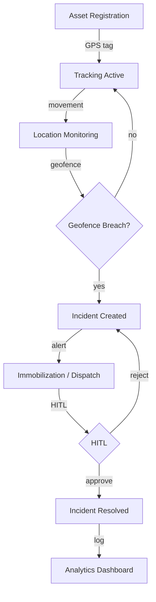
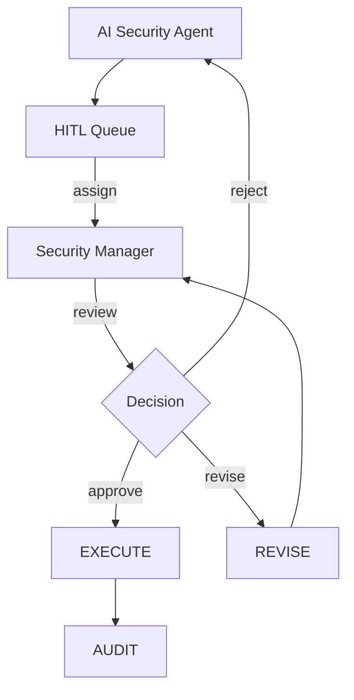
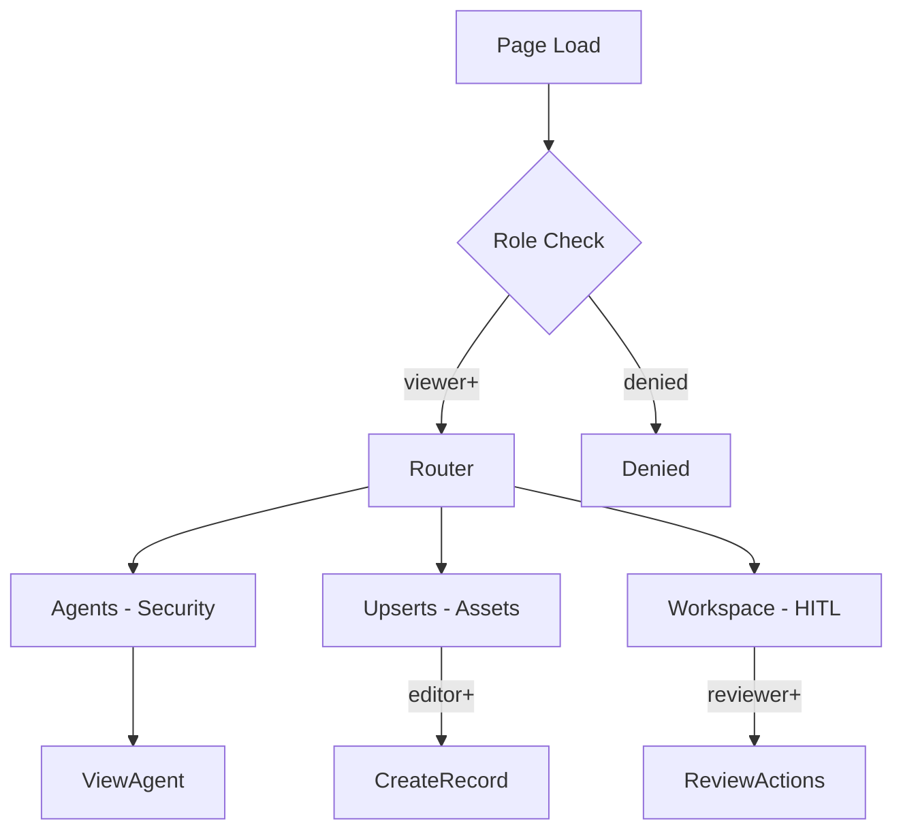

# SECURITY-ASSET — Security Asset Management UI/UX Specification

## Table of Contents

1. [Part A: UX Patterns](#part-a-ux-patterns)
2. [Part B: Three-State Button & Modal Rules](#part-b-three-state-button--modal-rules)
3. [Part C: Mermaid UI Flow Diagrams](#part-c-mermaid-ui-flow-diagrams)
4. [Part D: Implementation Standards](#part-d-implementation-standards)
5. [Part E: Screen Specifications](#part-e-screen-specifications)
6. [Part F: AI Model Backend](#part-f-ai-model-backend)
7. [Part G: Agent Knowledge Ownership](#part-g-agent-knowledge-ownership)

---

## Part A: UX Patterns

### 1. Page Classification

**Template Type**: **Template B** (Complex / Three-State)

The SECURITY-ASSET page implements three-state navigation (Agents, Upserts, Workspace) for managing security asset tracking and monitoring.

**Why Template B**:
- **Multi-State Navigation**: Three distinct operational states — Agents, Upserts, Workspace
- **Multi-Purpose Functionality**: GPS tracking dashboard, geofence management, asset location history, equipment immobilization, alert configuration, inventory management, incident reporting, security analytics
- **Complex Workflows**: Asset security lifecycle from tracking through incident resolution
- **Higher z-index positioning** (1500) for the chatbot overlay
- **CSS Class Convention**: `A-SEC-*` prefix for all page-level elements

### 2. Information Architecture

**Accordion Section**: Security (display_order: 2500)
**Accordion Subsection**: 02500 Security — Asset Management
**Icon**: Shield / security icon
**Route**: `/security-asset`

### 3. Color Scheme — Dark Red

```css
:root {
  --template-a-primary: #8B0000;
  --template-a-secondary: #DC143C;
  --template-a-accent: #B22222;
  --template-a-bg-gradient: linear-gradient(135deg, #fce4e4 0%, #f5c6c6 100%);
  --template-a-header-gradient: linear-gradient(135deg, #8B0000 0%, #DC143C 100%);
  --template-a-text-primary: #000000;
  --template-a-text-secondary: #6c757d;
  --template-a-text-white: #ffffff;
  --template-a-shadow-sm: 0 2px 4px rgba(0, 0, 0, 0.05);
  --template-a-shadow-md: 0 4px 6px rgba(0, 0, 0, 0.1);
  --template-a-shadow-lg: 0 8px 24px rgba(139, 0, 0, 0.3);
}
```

### 4. HITL Integration Pattern

1. **AI Agent** performs security asset actions (location monitoring, geofence violation detection, inventory reconciliation)
2. **Work enters HITL Review Queue** — visible in the Workspace state
3. **Security Manager** reviews:
   - **Approve**: Action proceeds (e.g., asset recovery initiated)
   - **Reject with Feedback**: Returns to AI agent with correction notes
   - **Manual Override**: Human takes over the action directly
4. **Audit Trail**: All security decisions logged with timestamps and approver identity

---

## Part B: Three-State Button & Modal Rules

### 5. State: Agents

The **Agents state** shows security AI agents for asset tracking, geofence monitoring, and incident analysis.

**Buttons** (all buttons are pre-configured by the dev team):

| Button | Visibility Gate | Action | Modal |
|--------|----------------|--------|-------|
| **View Details** | Always visible | Opens AgentDetails modal | `AgentDetails` — 98vw, security agent metrics |

### 6. State: Upserts

The **Upserts state** is where security asset records — asset registrations, geofence zones, inventory items — are created, edited, and imported.

| Button | Visibility Gate | Action | Modal |
|--------|----------------|--------|-------|
| **Create New** | `editor` | Opens CreateRecord modal | `CreateRecord` — 98vw, security asset form |
| **Import** | `editor` | Opens Import modal | `Import` — 98vw, CSV/asset data upload |
| **Edit** (per record) | `editor` | Opens EditRecord modal | `EditRecord` — 98vw, pre-populated, change tracking |
| **Delete** | `governance` | Opens Confirmation modal | `Confirmation` — impact warning |
| **Clone** | `editor` | Inline clone | No modal |

### 7. State: Workspace

The **Workspace state** is the security operations dashboard.

| Button | Visibility Gate | Action | Modal |
|--------|----------------|--------|-------|
| **Approve** | `reviewer` | Opens Approval modal | `Approval` — 98vw, confirm |
| **Reject** | `reviewer` | Opens Rejection modal | `Rejection` — 98vw, required feedback |
| **Generate Report** | Always | Opens Export modal | `Export` — 98vw, format selector |
| **Comment/Discussion** | Always | Toggles chat panel | Inline toggle |

---

## Part C: Mermaid UI Flow Diagrams

### 8. Asset Security Lifecycle



### 9. HITL Review Workflow



### 10. Page State Flow



---

## Part D: Implementation Standards

### 11. CSS Architecture

```css
@import "../../templates/template-a-standard.css";
@import "02500-security-asset-page-style.css";
```

**File**: `client/src/common/css/pages/02500-security-asset/02500-security-asset-page-style.css`
**Class Prefix**: `A-SEC-*`

### 12. Components

| Component | CSS Class |
|-----------|-----------|
| StateButtons | `.A-SEC-state-btn` |
| NavContainer | `.A-SEC-nav-container` |
| GPSTrackingMap | `.A-SEC-gps-map` |
| GeofenceConfig | `.A-SEC-geofence-config` |
| AssetTable | `.A-SEC-asset-table` |
| IncidentReport | `.A-SEC-incident-form` |

### 13. Modal Specifications

All modals follow 98vw width with dark red gradient headers.

| Modal | State | Purpose |
|-------|-------|---------|
| CreateNewAgent | Agents | Create security agent |
| AgentConfig | Agents | Configure agent settings |
| CreateRecord | Upserts | New security asset record |
| Import | Upserts | Bulk import CSV |
| EditRecord | Upserts | Edit existing record |
| Approval | Workspace | Approve AI action |
| Rejection | Workspace | Reject with feedback |
| Export | Workspace | Export report |

### 14. Chatbot

```javascript
{ chatType: "agent", stateAware: true, zIndex: 1500, modelEndpoint: "/api/chat/security-asset" }
```

---

## Part E: Screen Specifications

### 15. Screen Inventory

| Screen | State | Loading | Empty | Error | Populated |
|--------|-------|---------|-------|-------|-----------|
| Agent List | Agents | Spinner + skeleton | "No agents" | Red banner | Agent cards |
| Asset List | Upserts | Spinner + skeleton | "No assets" | Red banner | Table + map |
| Geofence Config | Upserts | Spinner | "No zones" | Red banner | Zone list |
| HITL Queue | Workspace | Spinner + skeleton | "No items" | Red banner | Queue + map |
| Live Map | All | Map loading | Empty map | Map error | Asset pins |

### 16. Wireframe: Agents State

```
┌──────────────────────────────────────────────────────────────┐
│  [Dark Red Header Gradient]                                    │
│  SECURITY-ASSET │ [Chatbot]                                    │
├──────────────────────────────────────────────────────────────┤
│  [Tab Nav: Agents | Upserts | Workspace]                      │
│  ┌────────────────────────────────────────────────────────┐  │
│  │ Security Agents                    [+ Add Agent]       │  │
│  ├────────────────────────────────────────────────────────┤  │
│  │ ┌──────────┐ ┌──────────┐ ┌──────────┐                │  │
│  │ │ Asset    │ │ Geofence │ │ Incident │                │  │
│  │ │ Tracker  │ │ Monitor  │ │ Analyst  │                │  │
│  │ │ ● Active │ │ ● Active │ │ ● Active │                │  │
│  │ │ [Edit]   │ │ [Edit]   │ │ [Edit]   │                │  │
│  │ └──────────┘ └──────────┘ └──────────┘                │  │
│  └────────────────────────────────────────────────────────┘  │
├──────────────────────────────────────────────────────────────┤
│  [Bottom-Fixed Nav]                                           │
└──────────────────────────────────────────────────────────────┘
```

### 17. Platform Adaptations

**Desktop (1280px+)**: Three-state nav visible, 3 col agent grid
**Tablet (768-1279px)**: Nav collapses to dropdown, 2 col grid
**Mobile (<768px)**: Bottom tab bar, 1 col grid, 48dp touch targets

---

## Part F: AI Model Backend

### 18. Model Infrastructure

**Base Model**: Qwen 2.5
**LoRA**: Asset tracking, geofence logic, incident analysis
**Endpoint**: `/api/chat/security-asset`

### 19. API Endpoints

| Endpoint | Method | Purpose | State |
|----------|--------|---------|-------|
| `/api/agents/security` | GET | List security agents | Agents |
| `/api/assets` | GET | List assets | Upserts |
| `/api/assets` | POST | Create asset | Upserts |
| `/api/geofences` | GET | List geofences | Upserts |
| `/api/hitl/security` | GET | List HITL queue | Workspace |
| `/api/hitl/security/:id/approve` | POST | Approve | Workspace |
| `/api/hitl/security/:id/reject` | POST | Reject | Workspace |

---

## Part G: Agent Knowledge Ownership

### 20. Agent Ownership

| Company | Role | Action |
|---------|------|--------|
| **DomainForge AI** | Domain Validation | Validate security workflows |
| **QualityForge AI** | Testing | Execute test suite |
| **DevForge AI** | Implementation | Build pages per wireframes |
| **KnowledgeForge AI** | Indexing | Index spec into memory |

### 21. Testing

1. **Foundation**: Auth, nav container, state buttons, logout
2. **Map Integration**: GPS tracking map renders correctly
3. **Modal Integration**: All 8+ modals open/close correctly
4. **State Transitions**: Agents ↔ Upserts ↔ Workspace flow correctly

---

## Version History

| Version | Date | Changes |
|---------|------|---------|
| 1.0 | 2026-04-29 | Initial UI/UX specification for SECURITY-ASSET — Template B |

---

**Document Information**
- **Author**: DomainForge AI — Security Domain
- **Date**: 2026-04-29
- **Status**: Active
