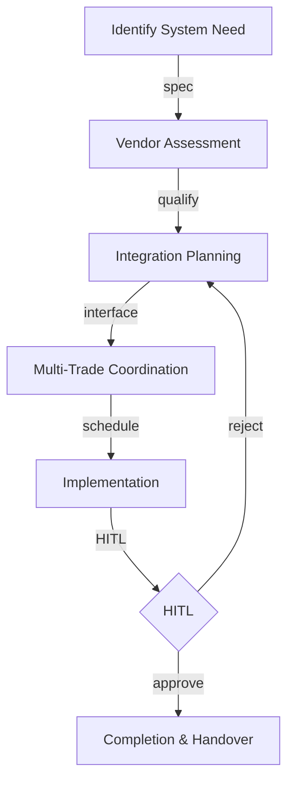

# SUNDRY-WORKFLOW — Sundry Services Workflow UI/UX Specification

## Table of Contents

1. [Part A: UX Patterns](#part-a-ux-patterns)
2. [Part B: Three-State Button & Modal Rules](#part-b-three-state-button--modal-rules)
3. [Part C: Mermaid UI Flow Diagrams](#part-c-mermaid-ui-flow-diagrams)
4. [Part D: Implementation Standards](#part-d-implementation-standards)
5. [Part E: Screen Specifications](#part-e-screen-specifications)
6. [Part F: AI Model Backend](#part-f-ai-model-backend)
7. [Part G: Agent Knowledge Ownership](#part-g-agent-knowledge-ownership)

---

## Part A: UX Patterns

### Page Classification

**Template Type**: **Template B** (Complex / Three-State)

**Why Template B**:
- Multi-State Navigation: Agents, Upserts, Workspace
- Multi-Purpose Functionality: Specialized systems integration, miscellaneous services coordination
- Complex Workflows: Sundry services lifecycle from identification through integration
- CSS Class Convention: `A-SUND-*` prefix

### Color Scheme — Gray

```css
:root {
  --template-a-primary: #808080;
  --template-a-secondary: #A9A9A9;
  --template-a-accent: #696969;
  --template-a-bg-gradient: linear-gradient(135deg, #f5f5f5 0%, #e0e0e0 100%);
  --template-a-header-gradient: linear-gradient(135deg, #696969 0%, #A9A9A9 100%);
  --template-a-text-white: #ffffff;
  --template-a-shadow-lg: 0 8px 24px rgba(128, 128, 128, 0.3);
}
```

### HITL Integration

1. AI Agent performs sundry services coordination (vendor assessment, integration planning)
2. Work enters HITL Review Queue
3. Project Manager reviews: Approve / Reject with Feedback / Manual Override

---

## Part B: Three-State Button & Modal Rules

| State | Button | Gate | Modal |
|-------|--------|------|-------|
| Agents | View Details | Always | AgentDetails (98vw) |
| Upserts | Create New | editor | CreateRecord |
| Upserts | Import | editor | Import |
| Upserts | Edit | editor | EditRecord |
| Upserts | Delete | governance | Confirmation |
| Workspace | Approve | reviewer | Approval |
| Workspace | Reject | reviewer | Rejection |
| Workspace | Generate Report | Always | Export |

---

## Part C: Mermaid UI Flow Diagrams

### Specialized Systems Integration



---

## Part D: Implementation Standards

**CSS Import**: `@import "../../templates/template-a-standard.css";`
**Class Prefix**: `A-SUND-*`
**Chatbot**: `{ chatType: "agent", stateAware: true, zIndex: 1500, modelEndpoint: "/api/chat/sundry-workflow" }`

---

## Part E: Screen Specifications

```
┌──────────────────────────────────────────────┐
│ [Gray Header] SUNDRY-WORKFLOW [Chatbot]       │
├──────────────────────────────────────────────┤
│ Agents | Upserts | Workspace                  │
│ ┌──────────┐                                   │
│ │ Sundry   │                                   │
│ │ Coord.   │                                   │
│ │ ● Active │                                   │
│ └──────────┘                                   │
└──────────────────────────────────────────────┘
```

---

## Part F: AI Model Backend

**Base Model**: Qwen 2.5 | **LoRA**: Specialized systems, trade coordination
**Endpoint**: `/api/chat/sundry-workflow`

---

## Part G: Agent Knowledge Ownership

| Company | Role |
|---------|------|
| DomainForge AI | Domain Validation |
| QualityForge AI | Testing |
| DevForge AI | Implementation |

---

**Version**: 1.0 | **Date**: 2026-04-29 | **Status**: Active
